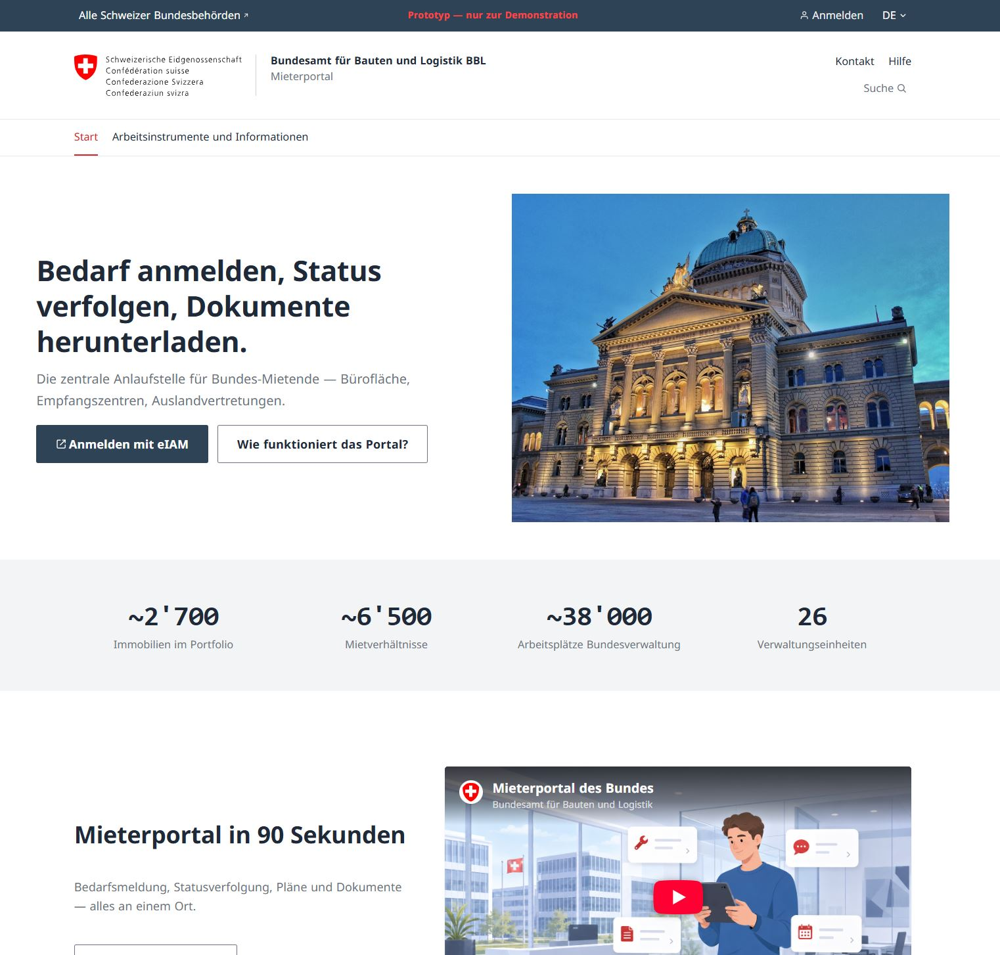
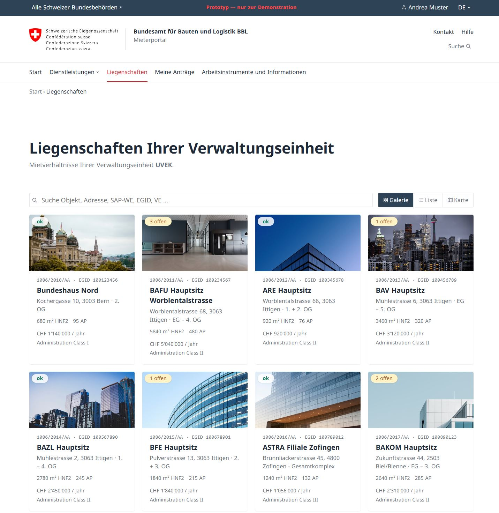
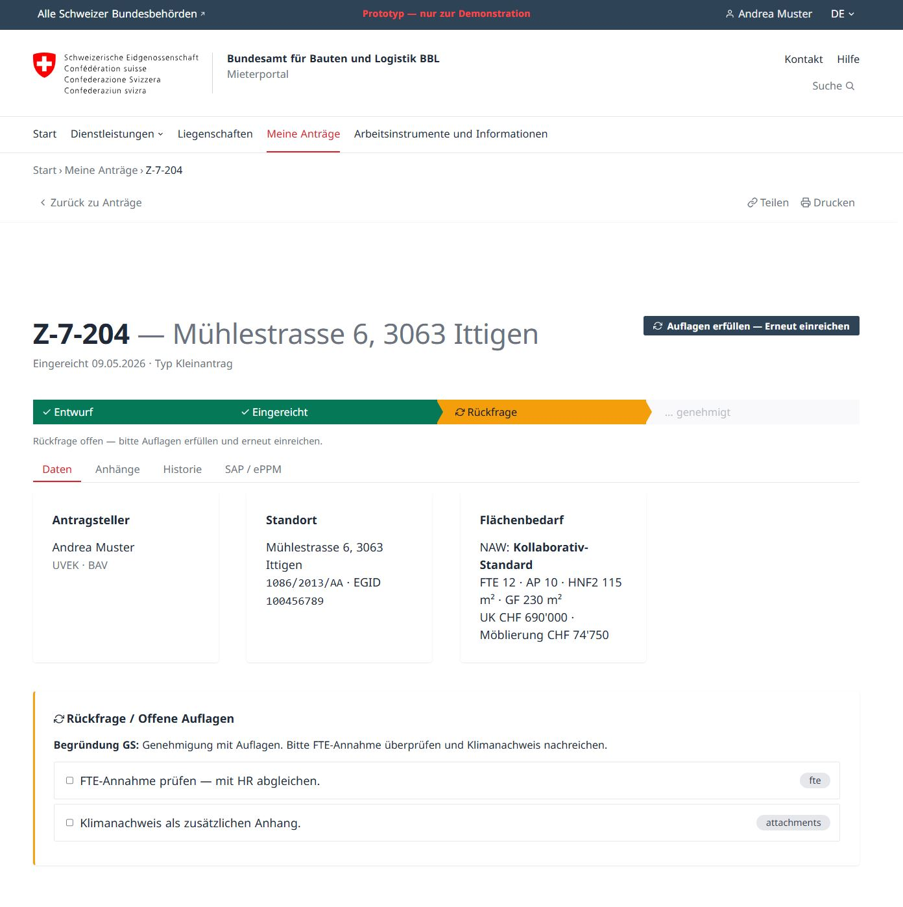

# Federal Tenant Portal (Mieterportal des Bundes)

<p align="center">
  
</p>

<p align="center">
  <a href="https://opensource.org/licenses/MIT"></a>
  
  
  
  
  
  <a href="https://github.com/swiss/designsystem"></a>
  
  <a href="https://bbl-dres.github.io/tenant-portal/"></a>
</p>

> [!CAUTION]
> **This is an unofficial mockup for demonstration purposes only.**
> All data is fictional. Not all features are fully functional. This project serves as a visual and conceptual prototype — it is not intended for production use.

Prototype of the federal tenant portal for the [Federal Office for Buildings and Logistics (Bundesamt für Bauten und Logistik, BBL)](https://www.bbl.admin.ch). The portal (Mieterportal) is the digital entry point for the administrative units (Verwaltungseinheiten, VE) of the civilian federal administration to register space needs, track application status, manage their tenancies (Mietverhältnisse), report damage, and access plans + documents for the ~ 2 800 BBL-managed properties.

## Preview

**Live Demo:** https://bbl-dres.github.io/tenant-portal/

<p align="center">
  
</p>

<p align="center">
  
  
</p>

## Features

### Core flows
- **5-step space-needs application wizard (Bedarfsmeldung)** — guided application for office space, accommodation, or foreign-mission premises. Live workplace-standards classification (NAW), m²/FTE area calculation with desk-sharing factor, attachment scan, validation checklist, draft auto-save.
- **Application inbox** — submitter's view of their own applications with status pipeline, filter chips by status, paginated table, full detail view with attachments + history tabs.
- **Reviewer queue** (General Secretariat reviewer, GS-Prüfer/in) — keyboard-driven (`j`/`k`/`Enter`/`x`), bulk-approve modal, queue statistics strip, dense table with 25 rows per page.
- **Property portfolio** — gallery / list / map views with MapLibre GL JS, filtered by administrative unit (VE), exportable, with detail page per property (banner, tenancy (Mietverhältnis), related applications, contacts).
- **Plans & Documents (Pläne & Dokumente)** — paginated documents page with type / building / text filters, simulated downloads.
- **News + Info** — long-form info page with sticky TOC scroll-spy, news overview + detail, search across all entities.
- **Role switching** — tenant (LBO), GS reviewer, BBL Portfolio Management (BBL-PFM), BBL Campus, Auditor. Each role gets a tailored nav + landing.

### Federal Corporate Design (CD Bund) alignment
- ≈ 99 % aligned with [`swiss/designsystem`](https://github.com/swiss/designsystem) v1.0.9 — typography, color, layout, spacing, components.
- Bundled Noto Sans (Regular / Bold / Italic / Bold-Italic).
- WCAG 2.1 AA: skip-link, focus rings, `prefers-reduced-motion`, ARIA disclosure for dropdowns, semantic markup, contrast verified.
- See [`docs/CD-AUDIT.md`](docs/CD-AUDIT.md) for the full gap analysis and resolved-vs-open items.

### Technical
- **Hash-routed SPA** — no framework, no build step. ES modules.
- **URL state persistence** — view mode, filters, pagination all in the URL hash.
- **`localStorage`** for wizard drafts + active-role choice (per-user-id namespaced).
- **Keyboard shortcuts** — press <kbd>?</kbd> in-app for the cheat sheet.

## Tech Stack

| Technology | Version | Usage |
|------------|---------|-------|
| Vanilla JavaScript | ES6+ ESM | Router, state, views |
| HTML5 / CSS3 | Modern | Structure + styling (Flexbox, Grid, CSS Variables) |
| MapLibre GL JS | v5.x (CDN) | Property portfolio map view |
| `swiss/designsystem` | v1.0.9 | Federal Corporate Design (CD Bund) tokens + components (hand-translated) |
| Noto Sans | bundled | Federal canonical typeface |
| JSON | static | Mock data (applications, buildings, tenancies (Mietverhältnisse), …) |

No build tools, no package manager, no framework — pure static files.

## Getting Started

`fetch()` against the JSON mocks needs HTTP, so serve the directory rather than opening `index.html` via `file://`:

```bash
# Python
python -m http.server 8000

# Node.js
npx http-server

# PHP
php -S localhost:8000
```

Then open http://localhost:8000

## Project Structure

```
tenant-portal/
├── index.html   # SPA entry — mounts #root, loads js/app.js as module
├── assets/      # Images, logos, bundled Noto Sans fonts
├── css/         # Design tokens (CD Bund) + app stylesheet
├── js/          # Router, shell, wizard, state, helpers (ES modules)
├── data/        # Static JSON / GeoJSON mocks (applications, buildings, tenancies, …)
├── docs/        # Requirements, data model, design guide, CD audit, research
└── scripts/     # Local utility scripts
```

## Deployment

**GitHub Pages:** Push to `main` deploys automatically.

**Alternatives:** Netlify, Vercel, CloudFlare Pages, or any static file server.

## License

Licensed under [MIT](https://opensource.org/licenses/MIT)

---

> [!CAUTION]
> **This is an unofficial mockup for demonstration purposes only.**
> All data is fictional. Not all features are fully functional. This project serves as a visual and conceptual prototype — it is not intended for production use.
