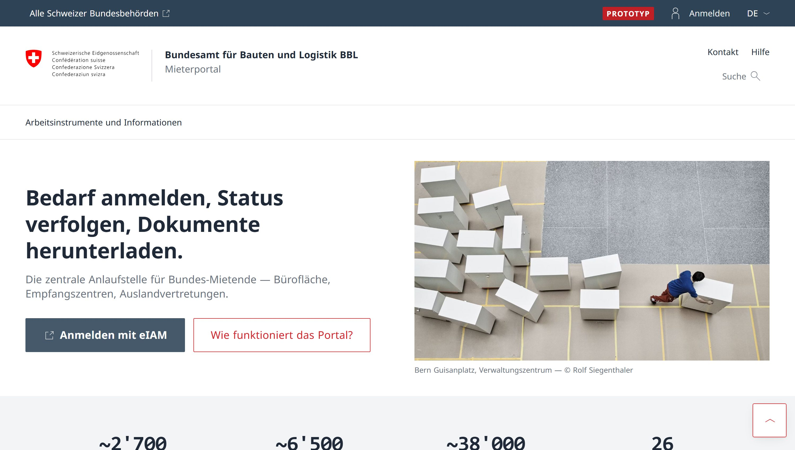

# Federal Tenant Portal (Mieterportal des Bundes)

<p align="center">
  
</p>

[](https://bbl-dres.github.io/tenant-portal/)
[](LICENSE)

Prototype of the BBL tenant portal for administrative units to register space needs, track applications, manage tenancies, report damage, and access property plans and documents.

> [!CAUTION]
> This is an unofficial demonstration prototype. Demo records are fictional or public reference material, not every function is implemented, and it is not intended for production use.

## Demo

**Live demo:** https://bbl-dres.github.io/tenant-portal/

<table border="0" cellpadding="0" cellspacing="0" role="presentation" width="100%">
  <tr>
    <td width="50%" valign="top"></td>
    <td width="50%" valign="top"></td>
  </tr>
</table>

## Features

- Submit space needs through a guided five-step application wizard.
- Track applications, attachments, conditions, and status history.
- Review submissions in a keyboard-friendly queue with bulk actions.
- Explore the property portfolio in gallery, list, and interactive map views.
- Find plans, documents, services, news, and information through a ranked portal search.
- Switch between tenant, reviewer, portfolio-management, campus, and auditor roles.
- Preserve drafts, filters, pagination, and shareable views in browser-local state and URLs.

## Run locally

The portal fetches static JSON fixtures, so serve the repository over HTTP:

```bash
python -m http.server 8000
```

Then open <http://localhost:8000/>.

## Documentation

- [Requirements](docs/REQUIREMENTS.md) and [MVP requirements](docs/REQUIREMENTS-MVP.md)
- [Data model](docs/DATAMODEL.md)
- [Design guide](docs/DESIGNGUIDE.md)
- [Engineering review](docs/code-review.md) and [cross-portal code-quality review](docs/code-quality-review.md)

## License

Original tenant-portal code is licensed under the [MIT License](LICENSE). Bundled and remotely loaded material remains under its own terms, and the MIT license grants no rights in Swiss Government branding or other organisations' trademarks.

Review [Third-party notices](THIRD_PARTY_NOTICES.md), including its open items, before copying, deploying, or distributing the repository.
