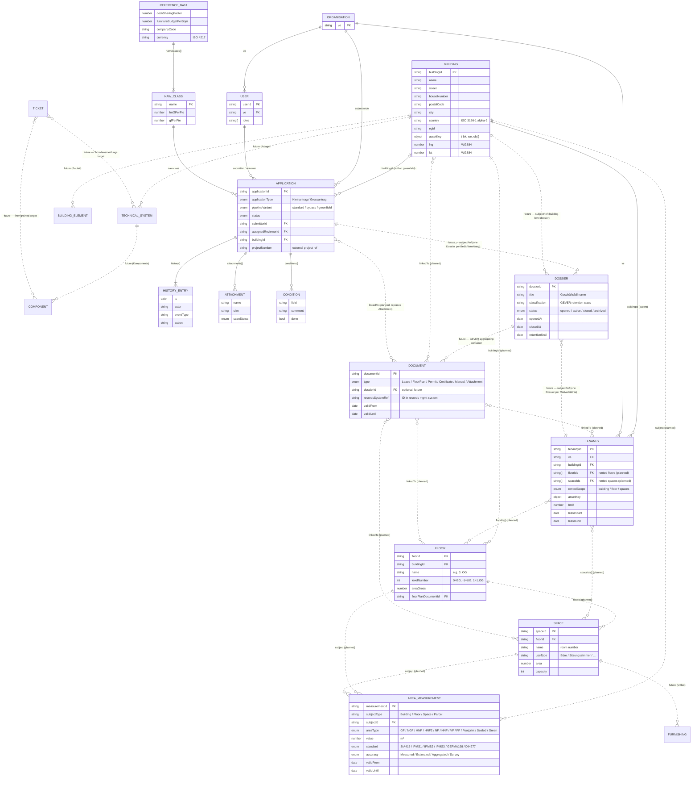
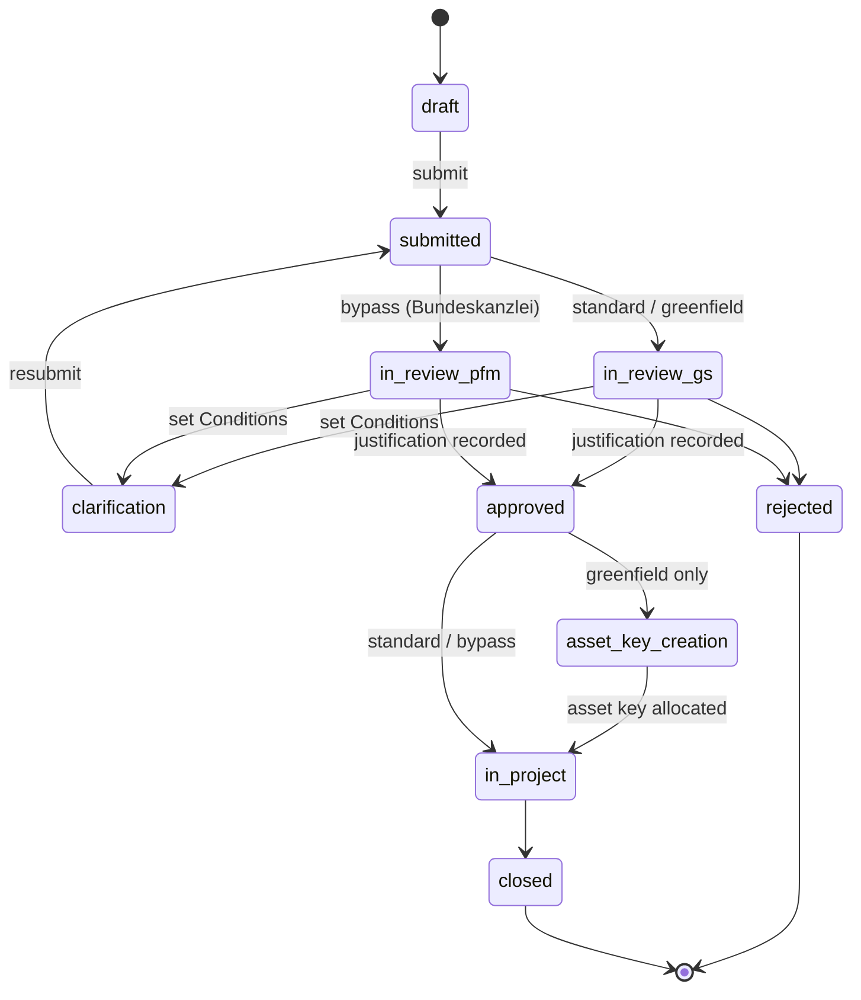

# Tenant Portal (Mieterportal) — Data Model

This document defines the data model for the BBL Tenant Portal
(Mieterportal) prototype.

---

## 1. Introduction

### 1.1 Purpose & Scope

The Mieterportal is the federal tenants' self-service surface for filing
demand applications (`Bedarfsmeldung`), tracking them through review by the
Generalsekretariat (GS) and BBL Portfolio-Management (PFM), and viewing
existing tenancies. The model supports:

- Demand-application lifecycle and audit trail (the workflow)
- Tenancy management for a Verwaltungseinheit
- Reference lookups against external lead systems for buildings, identity, and projects
- Internal news / announcements

The portal is **not a master (lead) system** for property, lease, or identity
data. Canonical records live in external systems; the portal holds only what
it needs to render its views and route its workflow.

### 1.2 Design Principles

| Principle                  | Description                                                                                                                  |
| -------------------------- | ---------------------------------------------------------------------------------------------------------------------------- |
| **Solution-neutral**       | No vendor-specific identifiers or field names appear in entity definitions. Lead-system mappings are described in § 12.      |
| **EN-only schema**         | All field names, enum values, and entity names are English. German terms appear in `Alias (DE)` columns as documentation only. |
| **Tidy data**              | No concatenated values. Composite values (addresses, names, identifiers) live as separate atomic fields. Cross-entity composites are promoted to their own entity (e.g. **Address** § 7.3) once shared across two or more parents. |
| **Workflow-first**         | Every lifecycle entity carries a `status` and an append-only `history[]`.                                                    |
| **Standards-anchored**     | Field semantics map to ISO 16739 / IBPDI / RICS IPMS / SIA 416 / eCH-* vocabulary so integrations are unambiguous.            |
| **Date vs datetime**       | Two date-type tags only: `string (date)` for calendar dates (`YYYY-MM-DD`); `string (datetime)` for full RFC 3339 timestamps (`YYYY-MM-DDTHH:MM:SSZ`). Never mix on the same field. |
| **Enum value casing**      | `snake_case` for lifecycle states (`in_review_gs`, `archived`); `PascalCase` for type discriminators (`FloorPlan`, `OpenSpace`, `ApplicationSubmitted`); standards-canonical form for measurement-standard identifiers (`SIA416`, `IPMS1`). |
| **Field-name conventions** | FK fields end in `Id` (`buildingId`, `userId`). **`ve` is a documented exception**: it is the federal organisational *code* (e.g. `UVEK`, `BAFU`), not an opaque Id, and is used directly as both the Organisation PK and the FK on User / Tenancy / Application. Where one entity carries multiple references to the same parent type, the field is prefixed by *role* (e.g. `submitterVe`, `assignedReviewerId`). |
| **Extensibility**          | `extensionData` objects are reserved for **portal-owned** entities (Application, Tenancy, AreaMeasurement). Reader-domain entities (Building, User, NewsArticle) take their extensions from the lead system, not the portal. |
| **Traceability**           | Portal-owned and embedded entities carry explicit `validFrom` / `validUntil` and event-typed history records. Reader-domain entities (Building, User, NewsArticle, ReferenceData) inherit validity from their lead system and do not duplicate the fields. |
| **Bilingual support**      | German terminology is preserved as supplementary aliases in tables; the JSON schema is English-only.                         |
| **Mock data only**         | All `data/*.json` files are illustrative — no production data is shipped.                                                    |

### 1.3 Swiss Context

| Standard / Identifier | Description                                                              | Usage                                          |
| --------------------- | ------------------------------------------------------------------------ | ---------------------------------------------- |
| **EGID**              | Eidgenössischer Gebäudeidentifikator                                     | Federal building identifier (CH only)          |
| **EGRID**             | Eidgenössischer Grundstücksidentifikator                                 | Federal parcel identifier (CH only)            |
| **SIA 416**           | Swiss standard for areas and volumes in building construction            | Area types: GF, NGF, NF, HNF / HNF2, NNF, VF, FF |
| **SIA 380/1**         | Swiss standard for energy performance of buildings                       | Energy reference area (EBF)                    |
| **LV95**              | Swiss coordinate reference system                                        | Optional high-precision local positioning      |
| **VwVG**              | Verwaltungsverfahrensgesetz (SR 172.021)                                 | Drives audit log + Begründungspflicht          |
| **VILB**              | Verordnung über das Immobilienmanagement und die Logistik des Bundes     | Top-level legal context                        |

### 1.4 Standards alignment

Standards alignment in this model is **conceptual**, not field-level —
the entity names, types, and relationships are *inspired by* the standards
below, but the schema does not (yet) adopt their canonical field names.
A future migration could rename fields to fully comply (e.g. `leaseStart`
→ IBPDI `startDate`); today's prototype prioritises readability.

| Standard                                  | Where it applies in this model                                                                                                  |
| ----------------------------------------- | ------------------------------------------------------------------------------------------------------------------------------- |
| **ISO 16739** (IFC, *buildingSMART*)      | Building reference inspired by `IfcBuilding`; planned Floor / Space mirror `IfcBuildingStorey` / `IfcSpace`. The HistoryEntry shape is a domain-event log (not the IFC `IfcOwnerHistory` lifecycle pattern). |
| **IBPDI**                                 | Tenancy borrows from IBPDI *Lease* + *Unit* + *Occupier*; planned Document / Contact / Contract / AreaMeasurement borrow IBPDI vocabulary. **Field names are not yet IBPDI-canonical** — see § 5.1 note. |
| **RICS IPMS**                             | Area fields cross-reference IPMS 1 / 2 / 3 — see Appendix B. HNF / HNF2 mappings are approximate.                                |
| **GEFMA 198 / 100 / 920**                 | Area definitions (198), service catalogue (100), service-request taxonomy (920) — relevant to future Service / Ticket entities. |
| **ISO 15489 / eCH-0002**                  | Records management — applies to the planned Document entity and the records-system referenced by Attachment.                     |
| **eCH-0107 / eCH-0058**                   | Federated identity / IAM — User entity is a *consumer* of these (subject ID, group memberships); field names are generic, not eCH-canonical. |
| **eCH-0046**                              | Federal data standard for addresses and organisations.                                                                          |
| **BPMN 2.0** (OMG, ISO 19510)             | Optional notation for externalising the demand-application workflow (§ 4.2). The pipeline shape is BPMN-compatible.             |
| **SAP MDG**                               | Master Data Governance — vendor framework occasionally deployed alongside the eCH IAM standards in Swiss federal contexts.       |
| **ISO 4217**                              | Currency codes — monetary fields carry an explicit currency (see § 9.1).                                                         |
| **ISO 8601 / ISO 3166 / RFC 5322**        | Timestamps, country codes, e-mail addresses.                                                                                    |

---

## 2. Architecture Overview

### 2.1 Domain overview

The Mieterportal model covers eight domains. Each entity in § 2.3 belongs
to exactly one. The "Portal's role" column distinguishes the domains the
portal **owns** (writes records into) from domains where the portal is a
**reader** of canonical records held by an external system.

| Domain                          | What it covers                                                                                                                                                                                                                | Portal's role                                                                |
| ------------------------------- | ----------------------------------------------------------------------------------------------------------------------------------------------------------------------------------------------------------------------------- | ---------------------------------------------------------------------------- |
| **Spatial inventory**           | Buildings, floors, rooms, parcels — plus the assets installed in them (BuildingElements, TechnicalSystems, Components, Furnishings) and their measurements.                                                                    | Reader — canonical record in the lead asset registry.                        |
| **Demand workflow**             | Bedarfsmeldung lifecycle — from draft, via review by GS / BBL-PFM, to hand-off into the project-management system.                                                                                                              | **Owner** — the only domain the portal owns end-to-end.                       |
| **Tenancy management**          | Existing lease relationships between Verwaltungseinheiten and a rented object (Building / Floor / Space set).                                                                                                                  | Reader; **originator of demand** for new tenancies.                           |
| **Records & Documents**         | GEVER Dossiers, lease contracts (Mietvertrag), floor plans, permits, certificates, training material, application attachments.                                                                                                  | Reader — canonical record in the records-management system.                  |
| **Organisational data**         | Verwaltungseinheiten (Organisation), federal users, contact roles, postal addresses.                                                                                                                                            | Reader — canonical record in the IdP + organisational MDM.                   |
| **Communications**              | Operational news, training announcements, federal-level updates today (`NewsArticle`); in-portal notifications and inbox in the future (`Notification`).                                                                        | Partially implemented; reader for federal-level announcements.               |
| **Reference data & catalogues** | Closed value lists, federal coefficients, validation thresholds (NAW classes, desk-sharing factor, PFM categories, …).                                                                                                          | **Owner** — curated by the BBL portfolio team out-of-band.                    |
| **Facility management**         | Tickets (Schadensmeldungen, repairs, moves), service catalogue, FM contracts, certifications. Schadensmeldungen tie directly into Spatial inventory: a ticket points at a TechnicalSystem or Component inside a Building / Floor / Space — that chain is what makes a damage report actionable for the facility manager. | Future-only.                                                                  |

### 2.2 Entity relationship diagram

**Stroke style**: solid = implemented today; dashed = not implemented yet
(covers both **Planned** entities — Floor, Space, AreaMeasurement, Document
— and **Future** entities — Dossier, BuildingElement, TechnicalSystem,
Component, Furnishing, Ticket). Diagram includes future entities only
where they participate in non-trivial relationships; pure-leaf future
entities (Site, Parcel, Address, Contact, Notification, LeaseDetail,
DocumentVersion, Service, Contract, Certificate, Decision, Comment,
Assignment, AccessLog) are omitted for clarity — see § 2.3.



### 2.3 Entity overview

All entities — current and future — with the implementation status of
each. Click an entity name to jump to its detailed schema. Most entries
are plain JSON; spatial entities (Building, Floor, Space) follow the
**GeoJSON** convention (`FeatureCollection` of `Point` or `Polygon`
features) so they can be consumed directly by mapping or floor-plan
libraries.

**Status legend**

- **Implemented** — exists today as a separate file under `data/` and is used by the portal's views or workflow.
- **Embedded** — exists today, but only as an embedded sub-record on a parent entity (no separate file or table yet).
- **Planned** — not modelled today, but a concrete near-term feature in the portal's roadmap depends on it.
- **Future** — documented for completeness — neither code nor near-term roadmap depends on it yet.

#### Spatial inventory (§ 3)

| Entity EN              | Entity DE                  | Description                                                                                                                          | Status         | File                                                  |
| ---------------------- | -------------------------- | ------------------------------------------------------------------------------------------------------------------------------------ | -------------- | ----------------------------------------------------- |
| [**Site**](#35-future-entities-in-this-domain) | Standort | Logical grouping of buildings (campus / area). Resolved from the lead system on demand if a campus view ever appears. | Future | — |
| [**Parcel**](#35-future-entities-in-this-domain) | Grundstück | Cadastral land plot recorded in the Grundbuch (ZGB Art. 655), keyed by **EGRID** (Eidgenössischer **Grundstücks**identifikator). A Grundstück with one or more Buildings on it is a *Liegenschaft* (a sub-category — not a separate entity). Polygon geometry. | Future | — |
| [**Building**](#31-building-gebäude) | Gebäude | Read-only reference to a physical property — name, atomic address fields (street, houseNumber, postalCode, city, country), asset key, cadastral identifier, coordinates. Canonical record lives in the lead asset registry; this is the portal's local cache. | Implemented | [`data/buildings.geojson`](../data/buildings.geojson) |
| [**Floor**](#32-floor-geschoss-planned) | Geschoss | A level within a building. Carries `levelNumber` (UG/EG/OG), gross area, and a `floorPlanDocumentId` FK to a Document of `type=FloorPlan`. **Required by the planned floor-plan viewer.** | Planned | `data/floors.geojson` (planned) |
| [**Space**](#33-space-raum-planned) | Raum | A room — the smallest rentable unit. **The Tenancy's actual rented object is one or more Spaces (or a Floor, or a Building).** Carries `useType` (Büro / Sitzungszimmer / Open Space / …), area, geometry, capacity. | Planned | `data/spaces.geojson` (planned) |
| [**AreaMeasurement**](#34-areameasurement-bemessung-planned) | Bemessung | Quantitative measurement record attached to any spatial entity (Building, Floor, Space, Parcel). Carries the *measurement standard* (SIA 416 / IPMS 1 / 2 / 3 / GEFMA 198 / DIN 277), the *area type* (GF / NGF / NF / HNF / NNF / VF / FF / footprint / sealed / green), *accuracy* (Measured / Estimated / Aggregated / Survey), surveyor, and validity. The scalar `Floor.areaGross` / `Space.area` / `Tenancy.hnf2` fields are read-cached projections of canonical AreaMeasurements. | Planned | `data/area-measurements.json` (planned) |
| [**BuildingElement**](#35-future-entities-in-this-domain) | Bauteil | Constructive element of the building fabric — Wand, Decke, Stütze, Treppe, Tür, Fenster, Dach. Attaches to Building / Floor / Space. IFC `IfcBuildingElement`. | Future | — |
| [**TechnicalSystem**](#35-future-entities-in-this-domain) | Technische Anlage / System | Technical installation — Lüftung, Heizung, Elektro, Sanitär, Transport (Aufzüge), Brandschutz, Sicherheit, BACS. Attaches to Building / Floor / Space. Groups one or more Components. IFC `IfcSystem`. **Schadensmeldungs target.** | Future | — |
| [**Component**](#35-future-entities-in-this-domain) | Komponente | Sub-part of a TechnicalSystem — Filter, Zähler, Klappe, Lüfter, Pumpe, Sensor. Parent FK → TechnicalSystem. IFC `IfcDistributionElement`. **Also a Schadensmeldungs target (component-level).** | Future | — |
| [**Furnishing**](#35-future-entities-in-this-domain) | Möbel / Ausstattung | Movable fit-out — Möbel, Leuchten, Garderobe, Geräte. Attaches to Space (per-room) or Floor. IFC `IfcFurnishingElement`. Distinct from BuildingElement because Furnishing is tenant-mutable, not constructive. | Future | — |

#### Demand workflow (§ 4)

| Entity EN              | Entity DE                  | Description                                                                                                                          | Status         | File                                                  |
| ---------------------- | -------------------------- | ------------------------------------------------------------------------------------------------------------------------------------ | -------------- | ----------------------------------------------------- |
| [**Application**](#41-application-bedarfsmeldung) | Bedarfsmeldung | Demand request raised by a Verwaltungseinheit. Carries the full review pipeline + audit trail. | Implemented | [`data/applications.json`](../data/applications.json) |
| [**Attachment**](#44-embedded-attachment) | Anhang | File attached to an Application during submission (WiBe.pdf, Rechtsgrundlage.pdf, …). Will resolve to a `Document` once Document is live. | Embedded | in Application |
| [**Condition**](#45-embedded-condition-auflage) | Auflage | Reviewer-set compliance instruction during the `clarification` state. Submitter ticks each off before resubmitting. | Embedded | in Application |
| [**HistoryEntry**](#46-embedded-historyentry) | Historieneintrag | Immutable record of a state transition on an Application (VwVG Art. 35 audit trail). | Embedded | in Application |
| [**Decision**](#47-future-entities-in-this-domain) | Entscheid | Multi-stage approval record when more than one signature is required (e.g. GS *and* BBL-PFM both sign off). | Future | — |
| [**Comment**](#47-future-entities-in-this-domain) | Kommentar / Notiz | Threaded discussion between submitter and reviewer during `clarification`. Today squeezed into `Condition.comment` + history `action`. | Future | — |
| [**Assignment**](#47-future-entities-in-this-domain) | Zuweisungs-Historie | Who was the active reviewer when, assigned by whom. Today only the *current* `assignedReviewerId` is stored. | Future | — |
| [**AccessLog**](#47-future-entities-in-this-domain) | Zugriffsprotokoll | Compliance audit beyond workflow events — who *viewed* an Application/Tenancy when. Distinct from `HistoryEntry`. | Future | — |

#### Tenancy management (§ 5)

| Entity EN              | Entity DE                  | Description                                                                                                                          | Status         | File                                                  |
| ---------------------- | -------------------------- | ------------------------------------------------------------------------------------------------------------------------------------ | -------------- | ----------------------------------------------------- |
| [**Tenancy**](#51-tenancy-mietverhältnis) | Mietverhältnis | Existing lease relationship between a Verwaltungseinheit and a rented object (Building / Floor / Space[]). Aggregates lease terms + occupier into a read-optimised record. | Implemented | [`data/tenancies.json`](../data/tenancies.json) |
| [**LeaseDetail**](#52-future-entities-in-this-domain) | Mietvertrag-Detail | Lease-amendment record (indexation, options, exit dates) when contract editing leaves the lead lease ledger. | Future | — |

#### Records & Documents (§ 6)

| Entity EN              | Entity DE                  | Description                                                                                                                          | Status         | File                                                  |
| ---------------------- | -------------------------- | ------------------------------------------------------------------------------------------------------------------------------------ | -------------- | ----------------------------------------------------- |
| [**Dossier**](#61-dossier-geschäftsfall-future) | Geschäftsfall | **GEVER** aggregating container — collects all Documents that belong to one business case (e.g. all artefacts of one Bedarfsmeldung: WiBe, Rechtsgrundlage, Begründung, Decision, correspondence). Carries its own classification, retention period, and lifecycle (`opened` → `active` → `closed` → `archived`). Anchored in **GEVER** (Swiss federal records-management standard) and ISO 15489. | Future | — |
| [**Document**](#62-document-dokument-planned) | Dokument | Canonical records entity. Subsumes **lease contracts (Mietvertrag)**, floor plans, permits, certificates, training manuals, and Application attachments. Anchored in ISO 15489 / eCH-0002. A Document optionally belongs to one Dossier (`dossierId` FK) and links polymorphically to Building / Floor / Space / Tenancy / Application via `linkedTo`. | Planned | `data/documents.json` (planned) |
| [**DocumentVersion**](#63-future-entities-in-this-domain) | Dokumentversion | Versioned + signed instance of a Document. Triggered by signature-service integration (ZertES / SwissID). | Future | — |

#### Organisational data (§ 7)

Cross-cutting reference data about *who* the portal interacts with and
*where* they sit. Address is included here because it attaches to
**multiple parents** (Building, Organisation, Contact) — it is not a
spatial entity in its own right.

| Entity EN              | Entity DE                  | Description                                                                                                                          | Status         | File                                                  |
| ---------------------- | -------------------------- | ------------------------------------------------------------------------------------------------------------------------------------ | -------------- | ----------------------------------------------------- |
| [**User**](#71-user-benutzer) | Benutzer | Authenticated person who can submit applications, review them, or access portfolio data. Carries 1..n roles from the federated identity provider. | Implemented | [`data/users.json`](../data/users.json) |
| [**Organisation**](#72-organisation-verwaltungseinheit-embedded--planned) | Verwaltungseinheit | Federal admin unit (Departement, Bundesamt, Stabsstelle). Today a denormalised code field `ve` on User / Application / Tenancy. Promotion to a proper entity (hierarchy, validity, eCH-0046 alignment) is planned. | Embedded → Planned | embedded in user / application / tenancy |
| [**Contact**](#73-future-entities-in-this-domain) | Kontakt | Person × parent × role record (Portfolio-Manager, Immobilien-Manager, Flächen-Manager, Hauswart, …). Parents include Building, Organisation, and Tenancy. Today denormalised on `tenancy.contacts` as three name strings. | Future | — |
| [**Address**](#73-future-entities-in-this-domain) | Adresse | Postal address record. **Attaches to multiple parents (Building, Organisation, Contact) — each parent can hold many addresses** (postal / billing / HQ / property / shipping). Broken out per eCH-0010 + eCH-0046 into street / number / postal code / city / canton / country. Today flattened to a free-text `address` string on Building / Tenancy / Application. | Future | — |

#### Communications (§ 8)

| Entity EN              | Entity DE                  | Description                                                                                                                          | Status         | File                                                  |
| ---------------------- | -------------------------- | ------------------------------------------------------------------------------------------------------------------------------------ | -------------- | ----------------------------------------------------- |
| [**NewsArticle**](#81-newsarticle-aktualität) | Aktualität | Operational communication shown on the home page and `#/news` route (maintenance notices, training sessions, federal-level announcements). Hand-curated; no CMS in the prototype. | Implemented | [`data/news.json`](../data/news.json) |
| [**Notification**](#82-future-entities-in-this-domain) | Benachrichtigung | Delivery + read state of e-mails / in-portal messages to submitters and reviewers. Today faked via `HistoryEntry` rows. | Future | — |

#### Reference data & catalogues (§ 9)

| Entity EN              | Entity DE                  | Description                                                                                                                          | Status         | File                                                  |
| ---------------------- | -------------------------- | ------------------------------------------------------------------------------------------------------------------------------------ | -------------- | ----------------------------------------------------- |
| [**ReferenceData**](#91-referencedata-singleton) | Referenzdaten | Singleton of slowly-changing reference data: NAW classification table, federal coefficients, PFM portfolio categories, BBL company code. Read-only at runtime; managed out-of-band by the BBL portfolio team. | Implemented | [`data/master-data.json`](../data/master-data.json) |
| [**NawClass**](#92-nawclass) | NAW-Klasse | NAW classification entry: name, m²/FTE for HNF2 and GF, description. Drives the wizard's area calculation. | Implemented | inside ReferenceData |

#### Facility management (§ 10, future)

| Entity EN              | Entity DE                       | Description                                                                                                                          | Status         | File                                                  |
| ---------------------- | ------------------------------- | ------------------------------------------------------------------------------------------------------------------------------------ | -------------- | ----------------------------------------------------- |
| [**Ticket**](#101-ticket-anliegen--schadensmeldung) | Anliegen / Schadensmeldung | Service request raised against a spatial entity (Building / Floor / Space) **and optionally a specific TechnicalSystem or Component** — e.g. *"Heizung defekt, Bundeshaus West, Raum 3.04"*. The asset link is what makes the ticket actionable for the facility manager: it pinpoints the broken system / component, not just the room. Triggered by ticketing-system integration; aligned with GEFMA 920-3. | Future | — |
| [**Service**](#102-service-dienstleistung) | Dienstleistung | FM service catalogue entry (id, scope, eligibility, SLA). Triggered when the catalogue grows past ~6 services; aligned with GEFMA 100. | Future | — |
| [**Contract**](#103-contract-vertrag-fm) | Vertrag (FM) | Service agreements / maintenance contracts. Distinct from `Document.type = 'Lease'` — these are *FM* contracts (cleaning, security, HVAC service). | Future | — |
| [**Certificate**](#104-certificate-zertifikat) | Zertifikat | Energy (GEAK / Minergie) / accessibility / fire-safety certifications attached to a Building. | Future | — |

### 2.4 Demo vs. production implementation

**Demo (this prototype):** All entities live in flat JSON files under
`data/`. Embedded arrays (`history[]`, `attachments[]`, `conditions[]`) live
inside their parent Application document.

**Production:** Each entity would be a separate record with foreign-key
relationships; the portal would write to its own workflow store and read
from external lead systems via API. Building / User / Tenancy data would
arrive through ETL or a real-time integration; Attachments would live in a
records-management system aligned with ISO 15489 / eCH-0002.

---

## 3. Spatial Inventory

The portal is a **reader** of spatial data — buildings, floors, rooms,
parcels, and the assets installed in them. Canonical records live in the
lead asset registry; the portal holds local caches (typically GeoJSON)
sized for map and floor-plan rendering. Standards anchor: ISO 16739 (IFC)
for the hierarchy; IBPDI / RICS IPMS / SIA 416 / GEFMA 198 / DIN 277 for
the area vocabulary.

### 3.1 Building (Gebäude)

**File:** [`data/buildings.geojson`](../data/buildings.geojson) — GeoJSON `FeatureCollection` of `Point` features. Atomic property fields live on `feature.properties`; `lng` / `lat` are emitted into `geometry.coordinates: [lng, lat]` at the wire level only (loader flattens them back to scalar fields at read time — see Appendix B).

A **read-only reference** to a physical property. The portal does **not**
own the canonical record — see § 1.1. Borrows from ISO 16739 `IfcBuilding`
and IBPDI *Building*. Spatial hierarchy: Building → Floor (§ 3.2) → Space
(§ 3.3); Site / Parcel above Building remain Future (§ 3.5).

#### Schema definition

| Field                 | PK/FK | Type             | Description                                                          | Constraints   | Alias (EN)        | Alias (DE)        |
| --------------------- | ----- | ---------------- | -------------------------------------------------------------------- | ------------- | ----------------- | ----------------- |
| **buildingId**        | PK    | string           | Unique identifier (lead-system PK).                                   | **mandatory** | Building ID       | Objekt-ID         |
| **name**              |       | string           | Display name.                                                         | **mandatory** | Building Name     | Bezeichnung       |
| **street**            |       | string           | Street name.                                                          | **mandatory** | Street            | Strasse           |
| **houseNumber**       |       | string           | House number (string — may carry letters / fractions: `12a`, `5/7`).  | **mandatory** | House Number      | Hausnummer        |
| **postalCode**        |       | string           | Postal code (string to preserve leading zeros — CH PLZ is 4 digits).  | **mandatory** | Postal Code       | PLZ               |
| **city**              |       | string           | Locality / city name.                                                 | **mandatory** | City              | Ort               |
| **country**           |       | string           | ISO 3166-1 alpha-2 country code (default `CH`).                       | default `CH`  | Country           | Land              |
| **assetKey**          |       | object           | Lead-system composite asset key `{ bk, we, obj }`.                    |               | Asset Key         | WE-Schlüssel      |
| **egid**              |       | string           | Cadastral building identifier (CH: EGID; analogue elsewhere).         |               | EGID              | EGID              |
| **lng**               |       | number           | WGS84 longitude. See Appendix B for the coordinate convention.        | **mandatory** | Longitude         | Längengrad        |
| **lat**               |       | number           | WGS84 latitude.                                                       | **mandatory** | Latitude          | Breitengrad       |
| **portfolioCategory** |       | string, enum     | Portfolio category — Appendix A.6.                                    |               | Portfolio Category | PFM-Kategorie    |
| **image**             |       | string (URL)     | Hero photo URL.                                                       |               | Image             | Bild              |

> Note: a `Building.ve` field ("primary VE") was previously documented but
> dropped — multiple VEs can occupy one building, so the primary-VE
> attribution is derived from Tenancy rather than stored on Building.

### 3.2 Floor (Geschoss) [Planned]

**File:** `data/floors.geojson` (planned, GeoJSON `FeatureCollection` of `Polygon` features carrying the floor outline).

A level within a Building. Required by the planned floor-plan viewer; also
the granularity at which whole-storey leases (a frequent federal pattern —
"one VE occupies the 3rd floor") link to Tenancy. Borrows from ISO 16739
`IfcBuildingStorey` and IBPDI *Floor*.

#### Schema definition

| Field                  | PK/FK | Type             | Description                                                          | Constraints   | Alias (EN)        | Alias (DE)        |
| ---------------------- | ----- | ---------------- | -------------------------------------------------------------------- | ------------- | ----------------- | ----------------- |
| **floorId**            | PK    | string           | Unique identifier (e.g. `BLD-2011-EG`).                               | **mandatory** | Floor ID          | Geschoss-ID       |
| **buildingId**         | FK    | string           | Parent Building.                                                      | **mandatory** | Building ID       | Objekt-ID         |
| **name**               |       | string           | Display name (e.g. `3. OG`, `EG`, `UG`).                              | **mandatory** | Floor Name        | Geschossname      |
| **levelNumber**        |       | integer          | Building-specific level number (EG = 0, UG = -1, 1.OG = 1, …).         | **mandatory** | Level Number      | Geschossnummer    |
| **verticalOrder**      |       | integer          | Sortable storey order. Often equal to `levelNumber` but kept separate so non-standard storey labels (e.g. `1A`) can still sort. |     | Vertical Order    | Vertikale Ordnung |
| **areaGross**          |       | number           | Gross floor area in m² (SIA 416 GF).                                  | minimum: 0    | Gross Area        | Bruttogeschossfläche |
| **floorPlanDocumentId**| FK    | string           | Reference to a Document (`type = FloorPlan`) carrying the SVG / PDF / GeoJSON floor plan. (See § 6.2.) |   | Floor Plan        | Grundriss          |
| **geometry**           |       | GeoJSON Polygon  | Floor outline (typically the building footprint inset by wall thickness). | **mandatory** | Geometry          | Geometrie          |
| **validFrom**          |       | string (date) | Valid from.                                                          |               | Valid From        | Gültig von         |
| **validUntil**         |       | string (date) | Valid until.                                                         |               | Valid Until       | Gültig bis         |

### 3.3 Space (Raum) [Planned]

**File:** `data/spaces.geojson` (planned, GeoJSON `FeatureCollection` of `Polygon` features).

A room — the smallest rentable unit. Borrows from ISO 16739 `IfcSpace`,
IBPDI *Unit*, and ArcGIS Indoors *Unit*. **The Tenancy's actual rented
object is most precisely a set of Spaces** (or a Floor, or a Building).

#### Schema definition

| Field            | PK/FK | Type             | Description                                                          | Constraints   | Alias (EN)        | Alias (DE)        |
| ---------------- | ----- | ---------------- | -------------------------------------------------------------------- | ------------- | ----------------- | ----------------- |
| **spaceId**      | PK    | string           | Unique identifier (e.g. `BLD-2011-EG-101`).                           | **mandatory** | Space ID          | Raum-ID           |
| **floorId**      | FK    | string           | Parent Floor.                                                         | **mandatory** | Floor ID          | Geschoss-ID       |
| **name**         |       | string           | Room number (e.g. `EG.101`).                                          | **mandatory** | Name              | Raumnummer        |
| **nameLong**     |       | string           | Long display name (e.g. `Empfang Erdgeschoss`).                        |               | Long Name         | Langname          |
| **useType**      |       | string, enum     | Use category — see Appendix A.9.                                       | **mandatory** | Use Type          | Nutzungstyp       |
| **area**         |       | number           | Room area in m² (SIA 416 HNF-relevant subset).                         | minimum: 0    | Area              | Fläche            |
| **capacity**     |       | integer          | Maximum occupancy / workstations supported.                            | minimum: 0    | Capacity          | Kapazität         |
| **isBookable**   |       | boolean          | Room is bookable (meeting rooms, focus rooms).                         |               | Bookable          | Buchbar           |
| **geometry**     |       | GeoJSON Polygon  | Polygon of the room's footprint within the floor.                      | **mandatory** | Geometry          | Geometrie         |
| **validFrom**    |       | string (date) | Valid from.                                                           |               | Valid From        | Gültig von        |
| **validUntil**   |       | string (date) | Valid until.                                                          |               | Valid Until       | Gültig bis        |

### 3.4 AreaMeasurement (Bemessung) [Planned]

**File:** `data/area-measurements.json` (planned).

Canonical record for any quantitative area on a spatial entity. Borrows
from ISO 16739 `IfcQuantitySet` / `IfcQuantityArea` and IBPDI *Quantity*.
**Each Building / Floor / Space / Parcel can have many AreaMeasurements**
(different bases, accuracies, validity periods, surveyors). The scalar
`Floor.areaGross`, `Space.area`, `Tenancy.hnf2` / `gf`, and `Application.hnf2`
/ `gf` are **denormalised projections** of canonical AreaMeasurements —
fast to read for the wizard and the property views, but the source of
truth lives here.

#### Schema definition

| Field             | PK/FK | Type             | Description                                                                  | Constraints   | Alias (EN)       | Alias (DE)            |
| ----------------- | ----- | ---------------- | ---------------------------------------------------------------------------- | ------------- | ---------------- | --------------------- |
| **measurementId** | PK    | string           | Unique identifier.                                                            | **mandatory** | Measurement ID   | Bemessungs-ID         |
| **subjectType**   |       | string, enum     | One of `Building` / `Floor` / `Space` / `Parcel`.                              | **mandatory** | Subject Type     | Gegenstandstyp        |
| **subjectId**     | FK    | string           | PK of the linked spatial entity.                                              | **mandatory** | Subject ID       | Gegenstands-ID        |
| **areaType**      |       | string, enum     | Area category — see Appendix A.11.                                             | **mandatory** | Area Type        | Flächenart            |
| **value**         |       | number           | Numeric value in m² (or m³ for volume; document `unit` if non-m²).            | **mandatory**, minimum: 0 | Value         | Wert                  |
| **unit**          |       | string           | Unit of measurement; default `m²`. Use `m³` for volumes (`gv`, `gvo`, `gvu`). | default `m²`  | Unit             | Einheit               |
| **standard**      |       | string, enum     | Measurement standard the value follows — see Appendix B + Appendix A.11.       | **mandatory** | Standard         | Norm                  |
| **accuracy**      |       | string, enum     | How the value was obtained — see Appendix A.12.                                | **mandatory** | Accuracy         | Genauigkeit           |
| **source**        |       | string           | Where the value came from. Free-text but typed in practice: file reference (e.g. `floorplan-EG.dwg`, `model.ifc`), survey instrument or organisation (e.g. `Vermessungsamt Bern`, `BBL-internal`), or `manual` for hand-measured values. | | Source           | Quelle                |
| **validFrom**     |       | string (date) | Valid from.                                                                  | **mandatory** | Valid From       | Gültig von            |
| **validUntil**    |       | string (date) | Valid until (null when current).                                              |               | Valid Until      | Gültig bis            |
| **comment**       |       | string           | Free-text comment (e.g. *"includes balcony per IPMS 1 footnote"*).            |               | Comment          | Kommentar             |
| extensionData     |       | object           | Jurisdiction-specific extensions.                                              |               | Extension Data   | Erweiterungsdaten     |

> **Multiple measurements per subject.** A single Building can carry an
> `areaType: GF, standard: SIA416` measurement *and* an `areaType: GF,
> standard: IPMS1` measurement, valid simultaneously. The portal picks
> the one matching the user's context (SIA 416 for Swiss federal views,
> IPMS for international reporting).

### 3.5 Future entities in this domain

These spatial entities sit above and below the implemented hierarchy.
The portal would never own them; it would resolve them on demand when a
view needs them. Source: canonical real-estate / asset registries.

| Entity                   | DE term                  | Standard anchor                              | Portal use case (when integrated)                                            |
| ------------------------ | ------------------------ | -------------------------------------------- | ---------------------------------------------------------------------------- |
| **Site**                 | Standort                 | ISO 16739 `IfcSite`, IBPDI Site               | Campus / area view; group buildings on the map by site.                     |
| **Parcel**               | Grundstück               | National cadastre (CH: EGRID)                 | Cadastral context on Tenancy detail. A Grundstück with Buildings on it is a *Liegenschaft*. AreaMeasurement (§ 3.4) will support a Parcel subject once Parcel is implemented. |
| **BuildingElement**      | Bauteil                  | ISO 16739 `IfcBuildingElement`                | Constructive fabric — Wand / Decke / Stütze / Treppe / Tür / Fenster / Dach. Replaced during Umbau projects, never by tenants. |
| **TechnicalSystem**      | Technische Anlage / System | ISO 16739 `IfcSystem`                       | Lüftung, Heizung, Elektro, Sanitär, Transport (Aufzüge), Brandschutz, Sicherheit, BACS. Serviced on intervals; **the primary target of Schadensmeldungen**. |
| **Component**            | Komponente               | ISO 16739 `IfcDistributionElement`            | Sub-part of a TechnicalSystem — Filter, Zähler, Klappe, Lüfter, Pumpe, Sensor. Replaced individually during service. **Finer-grained Schadensmeldungs target.** |
| **Furnishing**           | Möbel / Ausstattung      | ISO 16739 `IfcFurnishingElement`              | Movable fit-out — Schreibtisch, Stuhl, Leuchten, Garderobe. Tenant-mutable; overlaps with the sibling **workspace-management** mobiliar catalogue. |

> **Why four asset entities instead of one "Asset" bucket.** The four
> categories have different lifecycle owners (Umbau / FM service intervals
> / per-service replacement / tenant moves), different parents
> (BuildingElement hangs off Building/Floor/Space; Component hangs off
> TechnicalSystem; Furnishing is per-Space), and different IFC
> supertypes. Collapsing them to a single "Asset" with a `type` enum
> flattens the IFC taxonomy and breaks the System → Component containment
> that a Schadensmeldung workflow specifically needs to navigate. The
> decision is documented in §14 Version History (v0.6.0).

---

## 4. Demand Workflow

The **owned** domain. The portal writes Applications end-to-end through
their review pipeline, retains an immutable VwVG-compliant audit trail,
and hands approved cases off to the external project-management system.

### 4.1 Application (Bedarfsmeldung)

**File:** [`data/applications.json`](../data/applications.json)

A demand request raised by a Verwaltungseinheit. The flagship entity:
carries the review pipeline, audit trail, attachments, and reviewer-set
conditions. Has no direct IFC / IBPDI counterpart because the demand
workflow is portal-specific.

#### Schema definition

| Field                  | PK/FK | Type            | Description                                                            | Constraints                | Alias (EN)             | Alias (DE)               |
| ---------------------- | ----- | --------------- | ---------------------------------------------------------------------- | -------------------------- | ---------------------- | ------------------------ |
| **applicationId**      | PK    | string          | Unique identifier. Format `{VE}-{year}-{seq}` (e.g. `BE-2026-014`)      | **mandatory**              | Application ID         | Bedarfsmeldungs-ID       |
| **applicationType**    |       | string, enum    | Application size category. See Appendix A.1.                            | **mandatory**              | Application Type       | Antragstyp               |
| **pipelineVariant**    |       | string, enum    | Pipeline branch. See Appendix A.2.                                      | **mandatory**              | Pipeline Variant       | Pipeline-Variante        |
| **status**             |       | string, enum    | Current state in the pipeline. See Appendix A.3.                        | **mandatory**              | Status                 | Status                   |
| **submitterId**        | FK    | string          | Reference to User who filed the application.                            | **mandatory**              | Submitter              | Antragsteller            |
| **submitterVe**        |       | string          | VE abbreviation, denormalised from submitter for fast filter.           | **mandatory**              | Submitter VE           | Antrags-VE               |
| **submitterDep**       |       | string          | Department within the VE (e.g. `BAFU` inside UVEK).                     |                            | Submitter Department   | Antragstellende Abteilung |
| **buildingId**         | FK    | string          | Reference to Building. Absent on greenfield until asset-key allocation. |                            | Building ID            | Objekt-ID                |
| **street**             |       | string          | Street name (echo from Building; entered by submitter on greenfield).    | **mandatory**              | Street                 | Strasse                  |
| **houseNumber**        |       | string          | House number.                                                            | **mandatory**              | House Number           | Hausnummer               |
| **postalCode**         |       | string          | Postal code.                                                             | **mandatory**              | Postal Code            | PLZ                      |
| **city**               |       | string          | City.                                                                    | **mandatory**              | City                   | Ort                      |
| **country**            |       | string          | ISO 3166-1 alpha-2 country code (default `CH`).                          | default `CH`               | Country                | Land                     |
| **assetKey**           |       | object          | Lead-system composite asset key (e.g. `{ bk, we, obj }`).                |                            | Asset Key              | Wirtschaftseinheit-Schlüssel |
| **egid**               |       | string          | Cadastral building identifier echo (CH only).                            |                            | EGID                   | EGID                     |
| **submittedAt**        |       | string (datetime) | Timestamp of `submitted` transition.                                   | **mandatory**              | Submitted At           | Eingereicht am           |
| **assignedReviewerId** | FK    | string          | Reference to User. Set when a reviewer takes the case.                  |                            | Assigned Reviewer      | Zugewiesener Prüfer      |
| **projectNumber**      |       | string          | External project-management number returned after approval (`in_eppm`). |                            | Project Number         | Bedarfsmeldungsnummer    |
| **naw**                |       | object          | NAW classification result. Absent for Grossantrag. See § 4.3.            |                            | NAW Classification     | NAW-Klassifizierung      |
| **fte**                |       | number          | FTE count claimed by submitter.                                          | minimum: 0                 | FTE                    | VZÄ                      |
| **workstations**       |       | number          | Derived workstations (`fte × deskSharingFactor`, rounded up).            |                            | Workstations           | Arbeitsplätze            |
| **hnf2**               |       | number          | Hauptnutzfläche-2 in m² (SIA 416).                                       |                            | HNF2                   | HNF2                     |
| **gf**                 |       | number          | Geschossfläche in m² (SIA 416).                                          |                            | GF                     | GF                       |
| **operatingCosts**     |       | number          | Estimated annual operating costs in CHF.                                 |                            | Operating Costs        | Unterhaltskosten         |
| **furnitureBudget**    |       | number          | Estimated furniture budget in CHF.                                       |                            | Furniture Budget       | Möblierung               |
| **attachments**        |       | Attachment[]    | See § 4.4.                                                               |                            | Attachments            | Anhänge                  |
| **conditions**         |       | Condition[]     | Reviewer-set conditions. Present after a `clarification` cycle.         |                            | Conditions             | Auflagen                 |
| **reviewerJustification** |    | string          | Reviewer's free-text justification. Required for `approved`/`rejected`. |                            | Reviewer Justification | Reviewer-Begründung      |
| **history**            |       | HistoryEntry[]  | Append-only audit log. See § 4.6.                                        | **mandatory**              | History                | Historie                 |
| **validFrom**          |       | string (date)   | Record valid from.                                                       |                            | Valid From             | Gültig von               |
| **validUntil**         |       | string (date)   | Record valid until.                                                      |                            | Valid Until            | Gültig bis               |
| extensionData          |       | object          | Container for domain-specific extensions (e.g. SEM-only fields below).   |                            | Extension Data         | Erweiterungsdaten        |

> **Denormalised echoes (display only).** When `buildingId` is set, `street`,
> `houseNumber`, `postalCode`, `city`, `country`, `assetKey`, and `egid` are
> echoes of the parent Building's canonical values. On greenfield applications
> (no `buildingId` yet) they are the submitter's input, awaiting validation
> against the cadastre during `asset_key_creation`.

#### Swiss extension fields (`extensionData`)

Applicable when `applicationType = Grossantrag` and the requesting VE is SEM:

| Field                              | Type   | Description                                            | Alias (EN)               | Alias (DE)               |
| ---------------------------------- | ------ | ------------------------------------------------------ | ------------------------ | ------------------------ |
| extensionData.berths               | number | Total bed places.                                       | Berths                   | Bettenplätze             |
| extensionData.berthsFamily         | number | Subtotal: family berths.                                | Family Berths            | Bettenplätze Familien    |
| extensionData.berthsSingle         | number | Subtotal: single berths.                                | Single Berths            | Bettenplätze Einzel      |
| extensionData.berthsShared         | number | Subtotal: shared berths.                                | Shared Berths            | Bettenplätze gemeinsam   |
| extensionData.supervisionFte       | number | Supervision-staff FTE.                                   | Supervision FTE          | Betreuungs-VZÄ           |
| extensionData.securityFte          | number | Security-staff FTE.                                      | Security FTE             | Sicherheits-VZÄ          |
| extensionData.procedureRooms       | number | Number of asylum-procedure interview rooms.              | Procedure Rooms          | Verfahrensräume          |
| extensionData.investmentLumpSum    | number | Lump-sum investment per berth × berths.                   | Investment Lump-Sum      | Investitionspauschale    |

#### Example

```jsonc
{
  "applicationId": "BE-2026-014",
  "applicationType": "Kleinantrag",
  "pipelineVariant": "standard",
  "status": "in_review_gs",
  "submitterId": "U.123.456",
  "submitterVe": "UVEK",
  "submitterDep": "BAFU",
  "buildingId": "BLD-2011",
  "street": "Eichweg",
  "houseNumber": "22",
  "postalCode": "3003",
  "city": "Bern",
  "country": "CH",
  "assetKey": { "bk": "1086", "we": "2011", "obj": "AA" },
  "egid": "100234567",
  "submittedAt": "2026-05-12T14:07:00Z",
  "assignedReviewerId": "U.654.321",
  "naw": { "class": "Kollaborativ-Standard", "confidence": 0.84 },
  "fte": 8,
  "workstations": 7,
  "hnf2": 77,
  "gf": 154,
  "operatingCosts": 462000,
  "furnitureBudget": 50050,
  "attachments": [
    { "name": "WiBe.pdf", "size": "1.2 MB", "scanStatus": "ok" }
  ],
  "history": [
    { "ts": "2026-05-12T14:02:11Z", "actor": "Andrea Muster", "eventType": "ApplicationAdded",     "action": "Antrag erstellt" },
    { "ts": "2026-05-12T14:07:34Z", "actor": "Andrea Muster", "eventType": "ApplicationSubmitted", "action": "Eingereicht" }
  ]
}
```

> The demo JSON uses some German values (`status: in_gs_pruefung`,
> `pipelineVariant: standard`). The target schema is shown above (EN-only);
> a rename pass is pending.

### 4.2 Status pipeline

Three pipeline variants:

| Variant       | Trigger                                                 | Path                                                                                                       |
| ------------- | ------------------------------------------------------- | ---------------------------------------------------------------------------------------------------------- |
| `standard`    | Default                                                  | `draft → submitted → in_review_gs → approved → in_project → closed`                                       |
| `bypass`      | Submitter VE = Bundeskanzlei (no GS layer)               | `draft → submitted → in_review_pfm → approved → in_project → closed`                                      |
| `greenfield`  | No asset key exists for the target address yet           | `draft → submitted → in_review_gs → approved → asset_key_creation → in_project → closed`                  |

Plus two off-pipeline terminals reachable from any `in_review_*` state:

- `clarification` — Reviewer has set Conditions; case bounces back to submitter.
- `rejected`      — Reviewer rejected with `reviewerJustification` (VwVG Art. 35).

Resubmission after `clarification` returns the same Application (same
`applicationId`) to `submitted`; history is preserved.



> No single international standard governs federal tenant demand workflows.
> The pipeline shape is BPMN-compatible — it could be exported as a BPMN
> 2.0 file if the workflow ever needs to be editable outside code.

### 4.3 Embedded: NAW classification

Input + derived output, kept in one object for the prototype. In a
production model the two halves would separate (e.g. `naw.input.*` vs.
`naw.output.*`); today they share a flat shape.

```jsonc
{
  // Input — answers to the wizard's NAW questionnaire
  "answers": {
    "focus": "Kollaborativ" | "Konzentriert",
    "remoteShare": 0..100,            // %
    "confidentiality": "low" | "medium" | "high",
    "publicContact": "none" | "occasional" | "regular",
    "specials": ["Lab" | "Security area" | …]
  },

  // Derived output — the classification + its confidence
  "class": "Kollaborativ-Standard",   // FK → NawClass.name (Appendix A.6 / § 9.2)
  "confidence": 0.84                  // 0..1, see note below
}
```

> **`confidence` semantics.** In the prototype, `confidence` is a
> heuristic score set by a simple rule-based mapper (`deriveNawClass()`
> in `js/app.js`) — it is *not* the output of an ML classifier. In a
> production deployment the field is reserved for whatever generates the
> classification (rules engine, ML model, manual reviewer assessment); the
> shape stays `0..1`. Today the prototype hand-fakes plausible values to
> demonstrate the UI.

### 4.4 Embedded: Attachment

| Field        | Type         | Description                                       | Alias (EN)   | Alias (DE)         |
| ------------ | ------------ | ------------------------------------------------- | ------------ | ------------------ |
| **name**     | string       | File name (e.g. `WiBe.pdf`).                       | Name         | Dateiname          |
| **size**     | string       | Human-readable size (e.g. `1.2 MB`).               | Size         | Grösse             |
| **scanStatus** | string, enum | Antivirus scan result. See Appendix A.4.         | Scan Status  | Scanstatus         |

> **Records-management note.** This embedded shape is intentionally minimal.
> A federal records-management deployment would link each file to a
> records system aligned with **ISO 15489** / **eCH-0002**, holding the
> file plus retention, classification, and disposition metadata. The
> portal would then hold a record-reference rather than the file blob —
> see § 6.2 (Document).

### 4.5 Embedded: Condition (Auflage)

| Field         | Type    | Description                                                   | Alias (EN)   | Alias (DE)         |
| ------------- | ------- | ------------------------------------------------------------- | ------------ | ------------------ |
| **field**     | string  | Application field the condition refers to (e.g. `fte`).         | Field        | Feld               |
| **comment**   | string  | Reviewer's instruction in prose.                                | Comment      | Kommentar          |
| **done**      | boolean | Submitter has marked the condition as fulfilled.                | Done         | Erfüllt            |

### 4.6 Embedded: HistoryEntry

| Field        | Type             | Description                                                          | Alias (EN)   | Alias (DE)         |
| ------------ | ---------------- | -------------------------------------------------------------------- | ------------ | ------------------ |
| **ts**       | string (datetime) | Transition timestamp.                                                | Timestamp    | Zeitstempel        |
| **actor**    | string           | Display name of the user, or `System` for automated transitions.     | Actor        | Akteur             |
| **eventType** | string, enum    | Domain event type. See Appendix A.5.                                 | Event Type   | Ereignistyp        |
| **action**   | string           | Free-text description.                                                | Action       | Aktion             |

> **Pattern note.** HistoryEntry is a **domain-event log** (CQRS / event-
> sourcing-style), not the IFC `IfcOwnerHistory` lifecycle pattern.
> `IfcOwnerHistory` records *the latest* change owner+action on every
> entity; ours records *every* state transition on the Application as a
> separate row. The event-type vocabulary (`*Added` / `*Updated` /
> `*Deleted` plus workflow-specific verbs like `ApplicationSubmitted`)
> borrows from IBPDI's domain-event convention.

### 4.7 Future entities in this domain

Workflow extensions that would be added on top of the implemented review
pipeline once the corresponding feature ships.

| Entity            | DE term                 | Trigger to add                                                                | Standard anchor   |
| ----------------- | ----------------------- | ----------------------------------------------------------------------------- | ----------------- |
| **Decision**      | Entscheid               | Multi-stage approval requirement (e.g. GS *and* PFM both sign off).            | VwVG Art. 35      |
| **Comment**       | Kommentar / Notiz       | Threaded discussion between submitter and reviewer during `clarification`. Today squeezed into `Condition.comment` + history `action`. | — |
| **Assignment**    | Zuweisungs-Historie     | Who was the active reviewer when, assigned by whom. Today only the *current* `assignedReviewerId` is stored. | — |
| **AccessLog**     | Zugriffsprotokoll       | Compliance audit beyond workflow events — who *viewed* an Application/Tenancy when. Distinct from `HistoryEntry`. | — |

---

## 5. Tenancy Management

### 5.1 Tenancy (Mietverhältnis)

**File:** [`data/tenancies.json`](../data/tenancies.json)

An *existing* lease relationship between a Verwaltungseinheit and a
**rented object**. Borrows from IBPDI *Lease + Unit + Occupier* and
aggregates them into one read-optimised record. Areas follow **SIA 416**
(Appendix B cross-walk).

**Rented object — what does a Tenancy actually rent?**

A Tenancy never rents a whole portfolio; it rents one of three scopes:

- A **whole Building** — typical for single-tenant federal objects (e.g. an
  SEM reception centre).
- One or more **Floors** — common for departmental tenancies (one VE occupies a level).
- A set of **Spaces** (rooms) — fine-grained, common in shared buildings.

The scope is expressed by *which* of `buildingId`, `floorIds`, `spaceIds`
are populated:

| Scope     | `buildingId` | `floorIds[]`   | `spaceIds[]`   |
| --------- | ------------ | -------------- | -------------- |
| Building  | required     | empty          | empty          |
| Floor     | required (breadcrumb) | non-empty | empty          |
| Space     | required (breadcrumb) | optional  | non-empty      |

`buildingId` is always populated as the parent breadcrumb so building-level
views work without joining the rented-object lists.

#### Schema definition

| Field             | PK/FK | Type             | Description                                                | Constraints                 | Alias (EN)         | Alias (DE)              |
| ----------------- | ----- | ---------------- | ---------------------------------------------------------- | --------------------------- | ------------------ | ----------------------- |
| **tenancyId**     | PK    | string           | Unique identifier (e.g. `T-2010-AA-01`).                    | **mandatory**               | Tenancy ID         | Mietverhältnis-ID       |
| **ve**            | FK    | string           | Primary occupying VE.                                       | **mandatory**               | VE                 | Verwaltungseinheit      |
| **dep**           |       | string           | Department within the VE.                                   |                             | Department         | Abteilung               |
| **buildingId**    | FK    | string           | Parent Building (breadcrumb — always populated).             | **mandatory**               | Building ID        | Objekt-ID               |
| **floorIds**      | FK    | string[]         | Rented Floor refs. Non-empty when scope = Floor; can be present alongside `spaceIds` for multi-floor space sets. (FK → Floor — see § 3.2.) | optional                    | Floor IDs          | Geschoss-IDs            |
| **spaceIds**      | FK    | string[]         | Rented Space refs. Non-empty when scope = Spaces. (FK → Space — see § 3.3.) | optional                    | Space IDs          | Raum-IDs                |
| **rentedScope**   |       | string, enum     | Derived from populated lists: `building` / `floor` / `spaces`. May be stored for fast filter. | derived                  | Rented Scope       | Mietumfang              |
| **assetKey**      |       | object           | Lead-system composite asset key `{ bk, we, obj }`. (See § 3.1 for the canonical shape.) |                             | Asset Key          | Wirtschaftseinheit-Schlüssel |
| **egid**          |       | string           | Cadastral building identifier echo.                          |                             | EGID               | EGID                    |
| **street**        |       | string           | Street name (echo from Building).                             | **mandatory**               | Street             | Strasse                 |
| **houseNumber**   |       | string           | House number (echo from Building).                            | **mandatory**               | House Number       | Hausnummer              |
| **postalCode**    |       | string           | Postal code (echo from Building).                             | **mandatory**               | Postal Code        | PLZ                     |
| **city**          |       | string           | City (echo from Building).                                    | **mandatory**               | City               | Ort                     |
| **country**       |       | string           | ISO 3166-1 alpha-2 country code (echo from Building).         | default `CH`                | Country            | Land                    |
| **buildingName**  |       | string           | Building display name (echo).                                | **mandatory**               | Building Name      | Objektname              |
| **portfolioCategory** |   | string, enum     | PFM portfolio category. See Appendix A.6.                    | **mandatory**               | Portfolio Category | PFM-Kategorie           |
| **floorLabel**    |       | string           | Display label for the rented level(s) — e.g. "3. OG" or "EG + 1. OG". Derived from `floorIds[]` / `spaceIds[]` when those resolve; cached for views that don't join. |             | Floor Label        | Geschossbezeichnung     |
| **hnf2**          |       | number           | Rented Hauptnutzfläche-2 in m² (SIA 416 / ≈ IPMS 3).         | **mandatory**, minimum: 0   | HNF2               | HNF2                    |
| **gf**            |       | number           | Rented Geschossfläche in m² (SIA 416 / ≈ IPMS 1).            |                             | GF                 | GF                      |
| **workstations**  |       | number           | Workstations supported.                                       |                             | Workstations       | Arbeitsplätze           |
| **lat**           |       | number           | WGS84 latitude (echo from Building, for map display).         |                             | Latitude           | Breitengrad             |
| **lng**           |       | number           | WGS84 longitude (echo from Building).                         |                             | Longitude          | Längengrad              |
| **leaseStart**    |       | string (date)    | Lease start date.                                             | **mandatory**               | Lease Start        | Mietbeginn              |
| **leaseEnd**      |       | string (date)    | Lease end date.                                               | **mandatory**               | Lease End          | Mietende                |
| **leaseAuto**     |       | boolean          | Auto-renewing (true) or fixed-term (false).                  |                             | Auto-renewing      | Selbstverlängernd       |
| **yearlyCost**    |       | number           | Annual rent in CHF.                                           | minimum: 0                  | Yearly Cost        | Jahresmiete             |
| **contacts**      |       | object           | Denormalised contact roles `{ pfm, im, flm }` (display only). See note below. | | Contacts           | Kontakte                |
| **openIssues**    |       | number           | Count of open requests / open conditions / open tickets.      | minimum: 0                  | Open Issues        | Offene Anliegen         |
| **image**         |       | string (URL)     | Hero image for gallery / map list.                            |                             | Image              | Bild                    |
| **validFrom**     |       | string (date)    | Valid from.                                                   |                             | Valid From         | Gültig von              |
| **validUntil**    |       | string (date)    | Valid until.                                                  |                             | Valid Until        | Gültig bis              |
| extensionData     |       | object           | Container for client-specific fields.                         |                             | Extension Data     | Erweiterungsdaten       |

> **Denormalised echoes (display only).** The following fields are
> read-optimised echoes from the parent Building — updates must propagate
> from Building, not be written directly on Tenancy: `street`, `houseNumber`,
> `postalCode`, `city`, `country`, `buildingName`, `assetKey`, `egid`,
> `lat`, `lng`, `image`. Treat them as a cache; a join on `buildingId`
> resolves the canonical values.

> **Other denormalisation notes.**
>
> - **`contacts`** is a read-optimised echo of three Building-level
>   Contact records (Portfolio-Manager, Immobilien-Manager, Flächen-Manager).
>   Canonical Contact lives in the lead system (IBPDI *Contact* / IFC
>   `IfcActor`); the portal stores only the names for display. A real
>   integration would resolve current contacts on demand. See § 7.3
>   (Contact).
> - **`hnf2` / `gf`** are scalar projections. In production each is a
>   result of an `AreaMeasurement` record carrying *measurement standard*
>   (SIA 416 / IPMS 3 / GEFMA 198), *accuracy* (`Measured` / `Estimated`
>   / `Aggregated`), and *valid-from/until*. The portal does not own
>   `AreaMeasurement` — see § 3.4.
> - **`floorLabel`** is derived from `floorIds[]` / `spaceIds[]` at write
>   time so list views don't have to join Floor.

### 5.2 Future entities in this domain

| Entity         | DE term            | Trigger to add                                                                  | Standard anchor             |
| -------------- | ------------------ | ------------------------------------------------------------------------------- | --------------------------- |
| **LeaseDetail** | Mietvertrag-Detail | Contract editing leaves the lead lease ledger (amendments, indexation, options). | IBPDI Lease / Lease Event   |

---

## 6. Records & Documents

The portal is a **reader** of records-management data. Canonical records
(file blob, retention, classification, disposition) live in an external
records system aligned with **ISO 15489** / **eCH-0002**; the portal
stores only metadata and the polymorphic `linkedTo` mapping to its own
entities. Aggregating containers (Dossiers) follow **GEVER** — the Swiss
federal records-management standard.

### 6.1 Dossier (Geschäftsfall) [Future]

The GEVER-aggregating container. A Dossier collects every Document
belonging to one **Geschäftsfall** (business case) — for example, the
WiBe, Rechtsgrundlage, Decision, and correspondence of one
Bedarfsmeldung; or every plan, certificate, and contract for one
Mietverhältnis. Carries its own classification, retention period, and
lifecycle.

Anchored in **GEVER** (Geschäftsverwaltung Bund — the Swiss federal
records-management standard) and **ISO 15489**. Records-system messaging
between agencies is governed by **eCH-0039**; long-term archival by
**eCH-0147** (Bundesarchiv ingest format).

#### Schema definition

| Field             | PK/FK | Type              | Description                                                                                | Constraints   | Alias (EN)         | Alias (DE)           |
| ----------------- | ----- | ----------------- | ------------------------------------------------------------------------------------------ | ------------- | ------------------ | -------------------- |
| **dossierId**     | PK    | string            | Unique identifier in the records-management system.                                          | **mandatory** | Dossier ID         | Dossier-ID           |
| **title**         |       | string            | Display title (Geschäftsfall name).                                                          | **mandatory** | Title              | Titel                |
| **classification**|       | string            | GEVER retention / classification key (e.g. *Aktenplan-Position*).                            | **mandatory** | Classification     | Aktenplan-Position   |
| **status**        |       | string, enum      | Lifecycle — see Appendix A.13.                                                                | **mandatory** | Status             | Status               |
| **openedAt**      |       | string (date) | Date the Dossier was opened.                                                                  | **mandatory** | Opened At          | Eröffnet am          |
| **closedAt**      |       | string (date) | Date the Dossier was closed (null while active).                                              |               | Closed At          | Abgeschlossen am     |
| **retentionUntil**|       | string (date) | End of retention period (after which the Dossier moves to Bundesarchiv or is destroyed).      |               | Retention Until    | Aufbewahrungsende    |
| **subjectRef**    | FK    | LinkRef           | Polymorphic ref to the business case the Dossier is *about*. Reuses the **LinkRef** shape defined in § 6.2.1, with `entityType` restricted to one of `Application` / `Tenancy` / `Building`. |               | Subject Reference  | Geschäftsobjekt-Ref  |
| **recordsSystemRef** |   | string            | Opaque ID in the external records system.                                                     | **mandatory** | Records-system Ref | Datensatz-Ref        |

A `Document` (§ 6.2) optionally carries a `dossierId` FK referencing one
Dossier; one Dossier holds many Documents.

### 6.2 Document (Dokument) [Planned]

**File:** `data/documents.json` (planned).

Canonical records entity. Subsumes **lease contracts (Mietvertrag)**, floor
plans, permits, certificates, training manuals, and per-Application
attachments. The portal owns the *metadata + linkedTo* mapping; the file
blob and ISO 15489 / eCH-0002 classification metadata (retention,
disposition) live in an external records-management system referenced by
`recordsSystemRef`.

#### Schema definition

| Field                | PK/FK | Type              | Description                                                                  | Constraints   | Alias (EN)        | Alias (DE)        |
| -------------------- | ----- | ----------------- | ---------------------------------------------------------------------------- | ------------- | ----------------- | ----------------- |
| **documentId**       | PK    | string            | Portal-side unique identifier.                                                | **mandatory** | Document ID       | Dokument-ID       |
| **type**             |       | string, enum      | Document type — see Appendix A.10.                                            | **mandatory** | Type              | Typ               |
| **title**            |       | string            | Display title (e.g. `Mietvertrag UVEK / Eichweg 22`).                         | **mandatory** | Title             | Titel             |
| **dossierId**        | FK    | string            | Reference to a parent Dossier (§ 6.1). Optional — single-use documents (a one-off attachment) can stand alone. |               | Dossier ID        | Dossier-ID        |
| **recordsSystemRef** |       | string            | Opaque ID in the external records-management system (resolves to the blob + ISO 15489 metadata). | **mandatory** | Records-system Ref | Datensatz-Ref |
| **linkedTo**         | FK    | LinkRef[]         | Polymorphic links to parent entities (Building, Floor, Space, Tenancy, Application). See § 6.2.1. | **mandatory**, minItems: 1 | Linked To | Verknüpft mit |
| **format**           |       | string            | File format (e.g. `PDF`, `DOCX`, `DWG`, `IFC`).                                |               | Format            | Format            |
| **size**             |       | string            | Human-readable size (`1.2 MB`).                                                |               | Size              | Grösse            |
| **languages**        |       | string[]          | ISO 639-1 language codes (e.g. `["de", "fr"]`).                                |               | Languages         | Sprachen          |
| **issuedAt**         |       | string (date) | Publication / issue date.                                                     |               | Issued At         | Ausgestellt am    |
| **validFrom**        |       | string (date) | Valid from.                                                                   |               | Valid From        | Gültig von        |
| **validUntil**       |       | string (date) | Valid until (e.g. lease end, certificate expiry).                              |               | Valid Until       | Gültig bis        |
| **scanStatus**       |       | string, enum      | Virus-scan result. See Appendix A.4. Inherited from the Attachment shape it replaces. |        | Scan Status       | Scanstatus        |

#### 6.2.1 Embedded `LinkRef`

`LinkRef` is the shared polymorphic-reference shape used in this domain.
Each consumer restricts `entityType` to the subset that makes sense for it:

- **Document.linkedTo[]** (§ 6.2): `Building`, `Floor`, `Space`, `Tenancy`, `Application`.
- **Dossier.subjectRef** (§ 6.1): `Application`, `Tenancy`, `Building`.

| Field        | Type         | Description                                                            |
| ------------ | ------------ | ---------------------------------------------------------------------- |
| `entityType` | string, enum | One of `Building`, `Floor`, `Space`, `Tenancy`, `Application` (consumer-restricted — see above). |
| `entityId`   | string       | The PK of the linked entity.                                            |
| `role`       | string       | Free-text role (e.g. `lease-document`, `floor-plan`, `wibe-attachment`, `bedarfsmeldung-dossier`). |

> **Today's Attachment is reframed as a Document of `type = Attachment`**
> with a `LinkRef` pointing at the Application. The embedded `attachments[]`
> on Application becomes (in the target schema) a list of `documentId`
> references rather than blobs. The current prototype keeps the embedded
> shape; the migration is part of the records-management integration.

### 6.3 Future entities in this domain

| Entity              | DE term         | Trigger to add                                                              | Standard anchor              |
| ------------------- | --------------- | --------------------------------------------------------------------------- | ---------------------------- |
| **DocumentVersion** | Dokumentversion | Signature-service integration (Skribble / SwissID / ZertES).                | ISO 15489, ISO 14641, ZertES |

---

## 7. Organisational Data

Cross-cutting data about *who* the portal interacts with. Identity flows
via **eCH-0107** and **eCH-0058**; organisational records may be governed
by **SAP MDG** in some deployments. Address attaches to multiple parents
(Building / Organisation / Contact) and lives here rather than in spatial
inventory.

### 7.1 User (Benutzer)

**File:** [`data/users.json`](../data/users.json)

Standards mapping: identity flows via **eCH-0107** and **eCH-0058**; user
master data may be governed by **SAP MDG** in some deployments.

#### Schema definition

| Field      | PK/FK | Type    | Description                                                       | Constraints                  | Alias (EN)  | Alias (DE)         |
| ---------- | ----- | ------- | ----------------------------------------------------------------- | ---------------------------- | ----------- | ------------------ |
| **userId** | PK    | string  | Subject identifier from the IdP token (e.g. `U.123.456`).         | **mandatory**                | User ID     | Benutzer-ID        |
| **name**   |       | string  | Full display name (eCH-0011 / eCH-0044).                          | **mandatory**                | Name        | Name               |
| **email**  |       | string  | RFC 5322 e-mail address.                                          | **mandatory**                | E-mail      | E-Mail             |
| **ve**     | FK    | string  | Home VE.                                                          | **mandatory**                | VE          | Verwaltungseinheit |
| **dep**    |       | string  | Department within the VE.                                         |                              | Department  | Abteilung          |
| **roles**  |       | string[], enum | Permitted roles. See Appendix A.7.                          | **mandatory**, minItems: 1   | Roles       | Rollen             |

The active role is persisted client-side under
`mp-active-role-{userId}` in `localStorage`.

### 7.2 Organisation (Verwaltungseinheit) [Embedded → Planned]

Not stored as a top-level record today. Carried as a denormalised string
field (`ve`) on User, Application, and Tenancy. The closed set used in
mock data:

- **Departements / Stabsstellen:** `BK`, `UVEK`, `WBF`, `EDI`, `EJPD`, `VBS`, `EFD`, `EDA`
- **Bundesämter / Sekretariate:** `BAFU` (in UVEK), `SEM` (in EJPD)
- **Bundesverwaltung-level:** `BBL`, `EFV`

A production model would promote this to a proper Organisation entity
aligned with **IBPDI Occupier** and **eCH-0046** *organisation* — with a
hierarchy (Departement → Bundesamt → Sektion), validity period, and the
official UID register identifier.

### 7.3 Future entities in this domain

| Entity      | DE term  | Standard anchor                  | Portal use case (when integrated)                                                                                                                                            |
| ----------- | -------- | -------------------------------- | ---------------------------------------------------------------------------------------------------------------------------------------------------------------------------- |
| **Contact** | Kontakt  | IBPDI Contact, IFC `IfcActor`     | Person × parent × role record (Portfolio-Manager, Immobilien-Manager, Flächen-Manager, Hauswart, …). Parents include Building, Organisation, and Tenancy. Today denormalised on `tenancy.contacts` as three name strings. |
| **Address** | Adresse  | eCH-0010, eCH-0046                | Postal address record. **Attaches to multiple parents (Building, Organisation, Contact) — each parent can hold many addresses** (postal / billing / HQ / property / shipping). Today the atomic address fields (street / houseNumber / postalCode / city / country, per the **Tidy data** principle § 1.2) live inline on Building / Tenancy / Application. Promotion to a shared Address entity is triggered when a single parent needs more than one address (e.g. postal vs. billing) or when canton / additional-line / PO-box fields become required per eCH-0010. |

---

## 8. Communications

Operational news, training announcements, federal-level updates today;
in-portal notifications and inbox in the future.

### 8.1 NewsArticle (Aktualität)

**File:** [`data/news.json`](../data/news.json)

Internal communications shown on the home page and `#/news` route.

#### Schema definition

| Field          | PK/FK | Type             | Description                              | Constraints   | Alias (EN)  | Alias (DE)         |
| -------------- | ----- | ---------------- | ---------------------------------------- | ------------- | ----------- | ------------------ |
| **newsId**     | PK    | string           | Slug.                                     | **mandatory** | News ID     | Artikel-ID         |
| **type**       |       | string, enum     | Article type. See Appendix A.8.           | **mandatory** | Type        | Typ                |
| **date**       |       | string (date) | Publication date.                        | **mandatory** | Date        | Datum              |
| **title**      |       | string           | Headline.                                 | **mandatory** | Title       | Titel              |
| **lead**       |       | string           | One-paragraph lead.                       | **mandatory** | Lead        | Lead-Text          |
| **source**     |       | string           | Issuing unit (e.g. `BBL PFM`).            |               | Source      | Herausgeber        |
| **responsible**|       | string           | Responsible person.                       |               | Responsible | Verantwortlich     |
| **image**      |       | string (URL)     | Hero photo URL.                           |               | Image       | Bild               |

### 8.2 Future entities in this domain

| Entity           | DE term           | Trigger to add                                                                | Standard anchor |
| ---------------- | ----------------- | ----------------------------------------------------------------------------- | --------------- |
| **Notification** | Benachrichtigung  | When the in-portal inbox replaces e-mail; track delivery + read state.         | —               |

---

## 9. Reference Data

Slowly-changing reference data: closed value lists, federal coefficients,
validation thresholds, the BBL company code. The portal **owns** this
domain (managed out-of-band by the BBL portfolio team), but the data
itself is read-only at runtime.

### 9.1 ReferenceData (singleton)

**File:** [`data/master-data.json`](../data/master-data.json) (legacy filename; target: `data/reference-data.json`).

Single document of **reference data**: closed value lists, federal
coefficients, validation thresholds, the BBL company code. Read-only at
runtime; managed out-of-band by the BBL portfolio team.

> **Naming note.** *Reference data* is the DAMA-DMBOK term for value
> lists / coefficients / classifications that change slowly. We do **not**
> call this "master data" because in SAP / MDG terminology *master data*
> means organisational records (customer / vendor / material / employee
> master). Organisational data in our model lives separately under
> § 7 (User, Organisation, Contact, Address). The file is still called
> `master-data.json` from the early prototype; renaming to
> `reference-data.json` is queued with the other rename items.

#### Schema definition

| Field                              | Type        | Description                                                              | Alias (EN)              | Alias (DE)              |
| ---------------------------------- | ----------- | ------------------------------------------------------------------------ | ----------------------- | ----------------------- |
| **nawClasses**                     | NawClass[]  | NAW classification table. See § 9.2.                                       | NAW Classes             | NAW-Klassen             |
| **deskSharingFactor**              | number      | Federal-mandated coefficient (currently `0.8`).                            | Desk-sharing Factor     | Belegungsfaktor         |
| **furnitureBudgetPerSqm**          | number      | Furniture budget per m² HNF2 in CHF (`650`).                               | Furniture Budget per m² | Möblierung pro m²       |
| **operatingCostCeilingPerSqmGf**   | number      | Soft-block threshold for operating costs (CHF/m² GF).                      | Operating-cost Ceiling  | UK-Obergrenze pro m² GF |
| **operatingCostHardBlockMultiplier** | number    | Multiplier above which submission is hard-blocked.                          | Hard-block Multiplier   | Hardblock-Faktor        |
| **semBerthLumpSum**                | number      | SEM-specific lump-sum per bed place in CHF.                                | SEM Berth Lump-sum      | SEM Pauschale pro Bett  |
| **companyCode**                    | string      | BBL company code (`1086` in Swiss federal context). Used for bypass detection. | Company Code         | Buchungskreis           |
| **currency**                       | string      | ISO 4217 currency code applied to all monetary fields (default `"CHF"`).    | Currency               | Währung                 |
| **portfolioCategories**            | string[]    | Closed list of portfolio categories. See Appendix A.6.                     | Portfolio Categories    | PFM-Kategorien          |

### 9.2 NawClass

| Field           | PK/FK | Type    | Description                                                   | Alias (EN)        | Alias (DE)         |
| --------------- | ----- | ------- | ------------------------------------------------------------- | ----------------- | ------------------ |
| **name**        | PK    | string  | NAW class name (e.g. `Kollaborativ-Standard`).                  | Class Name        | Klassenname        |
| **hnf2PerFte**  |       | number  | m² HNF2 per FTE (SIA 416 / ≈ IPMS 3).                            | HNF2 per FTE      | HNF2 pro VZÄ       |
| **gfPerFte**    |       | number  | m² GF per FTE (SIA 416 / ≈ IPMS 1).                              | GF per FTE        | GF pro VZÄ         |
| **description** |       | string  | Short label for UI surfaces.                                    | Description       | Beschreibung       |

Calculation: `hnf2 = round(hnf2PerFte × fte × deskSharingFactor)`;
analogously for `gf`.

---

## 10. Facility Management

Future-only domain. The portal does not handle FM tickets, service
catalogues, FM contracts, or building certifications today; documented
here so the integration surface is clear when those features ship.
Schadensmeldungen tie directly into Spatial inventory (§ 3): a ticket
points at a TechnicalSystem or Component (§ 3.5), which is inside a
Building / Floor / Space — that chain is what makes a damage report
actionable for the facility manager.

### 10.1 Ticket (Anliegen / Schadensmeldung)

Service request raised against a spatial entity (Building / Floor / Space)
**and optionally a specific TechnicalSystem or Component** — e.g.
*"Heizung defekt, Bundeshaus West, Raum 3.04"*. The asset link is what
makes the ticket actionable for the facility manager: it pinpoints the
broken system / component, not just the room. Triggered by ticketing-
system integration; aligned with **GEFMA 920-3**.

### 10.2 Service (Dienstleistung)

FM service catalogue entry (id, scope, eligibility, SLA). Triggered when
the catalogue grows past ~6 services; aligned with **GEFMA 100**.

### 10.3 Contract (Vertrag, FM)

Service agreements / maintenance contracts. Distinct from
`Document.type = 'Lease'` — these are *FM* contracts (cleaning, security,
HVAC service). Standard anchor: **IBPDI Contract**.

### 10.4 Certificate (Zertifikat)

Energy (GEAK / Minergie) / accessibility / fire-safety certifications
attached to a Building. Standard anchor: IBPDI Certificate (future).

---

## 11. File summary

### 11.1 Implemented today

| File                                                  | Records (mock) | Entities held                                                  |
| ----------------------------------------------------- | -------------- | -------------------------------------------------------------- |
| [`data/applications.json`](../data/applications.json)   | 5              | Application (with embedded Attachment / Condition / HistoryEntry) |
| [`data/tenancies.json`](../data/tenancies.json)         | 3              | Tenancy                                                          |
| [`data/users.json`](../data/users.json)                 | 5              | User                                                             |
| [`data/reference-data.json`](../data/reference-data.json) | 1              | ReferenceData (single object)                                     |
| [`data/news.json`](../data/news.json)                   | 10             | NewsArticle                                                      |
| [`data/buildings.geojson`](../data/buildings.geojson)   | 5              | Building (GeoJSON `FeatureCollection` of `Point` features; canonical record in lead system) |
| [`data/downloads.json`](../data/downloads.json)         | 1              | UI download-link catalogues (`documents`, `regulations`, `strategies`, `training`, `propertyDetail`). Not a canonical schema entity — extracted from the JS to keep the codebase free of hardcoded reference content. |

### 11.2 Planned files

| File                       | Entity                                                                |
| -------------------------- | --------------------------------------------------------------------- |
| `data/floors.geojson`      | Floor (GeoJSON `FeatureCollection` of `Polygon` features, floor outlines) |
| `data/spaces.geojson`      | Space (GeoJSON `FeatureCollection` of `Polygon` features, room footprints) |
| `data/documents.json`      | Document (metadata + `linkedTo[]`; file blobs live in the records-management system) |
| `data/area-measurements.json` | AreaMeasurement (one record per Building/Floor/Space × `areaType` × `standard`) |

---

## 12. External System Integrations

The portal communicates with external systems at well-defined seams,
described by **role** rather than vendor so the model stays portable.

| Seam                          | What flows                                                                   | Direction         | Standards anchor                   |
| ----------------------------- | ---------------------------------------------------------------------------- | ----------------- | ---------------------------------- |
| Identity provider              | User identity + group memberships → portal Roles                              | read (federation) | eCH-0107 / eCH-0058               |
| Lead asset registry            | Building / Floor / Space spatial hierarchy + asset-key / cadastral identifier resolution | read (cached)     | ISO 16739, IBPDI                  |
| Lead lease ledger              | Current Tenancies                                                              | read              | IBPDI Lease                       |
| Project-management system      | Approved Application → external project record (returns `projectNumber`)      | write             | —                                  |
| Cadastral registry             | EGID / EGRID lookups                                                          | read              | eCH-0046, national cadastre        |
| Records-management system      | Attachment storage + classification + retention                                | write             | ISO 15489, eCH-0002                |
| Document scanner               | Attachment scan result → `scanStatus`                                          | read (push)       | —                                  |
| Ticketing system               | Schaden / Reparatur / Umzug requests                                           | write             | GEFMA 920-3                       |
| Communications channel         | Notifications to submitters and reviewers                                      | write             | —                                  |

A Swiss federal deployment of this portal could map these seams (purely
illustrative) to eIAM/AGOV (identity), SAP RE-FX (asset + lease), SAP
ePPM (project management), GWR + cadastre.ch (cadastre), and BIT-operated
records, mail, and ticketing infrastructure. None of these are hard
dependencies of the model.

---

## Appendix A — Enumerations

### A.1 Application Type

| Value (EN)     | Value (DE)     | Description                                                  |
| -------------- | -------------- | ------------------------------------------------------------ |
| `Kleinantrag`  | Kleinantrag    | Small request (punctual adjustment, mobiliar order, …).      |
| `Grossantrag`  | Grossantrag    | Large request — new lease, new building, SEM reception centre. |

### A.2 Pipeline Variant

| Value (EN)    | Value (DE)         | Description                                                                  |
| ------------- | ------------------ | ---------------------------------------------------------------------------- |
| `standard`    | Standard           | Default — GS review path.                                                     |
| `bypass`      | BK-Bypass          | Submitter VE is the Bundeskanzlei; skips GS, goes direct to BBL-PFM.          |
| `greenfield`  | Greenfield         | No asset key exists for the address yet; adds an `asset_key_creation` step.   |

### A.3 Application Status

| Value (EN)              | Value (DE)              | Description                                          |
| ----------------------- | ----------------------- | ---------------------------------------------------- |
| `draft`                 | Entwurf                 | Submitter is still filling in the wizard.            |
| `submitted`             | Eingereicht             | Awaiting reviewer pickup.                            |
| `in_review_gs`          | in GS-Prüfung           | GS-Prüfer/in has the case.                           |
| `in_review_pfm`         | in PFM-Prüfung          | BBL-PFM has the case (bypass path).                  |
| `clarification`         | Rückfrage               | Conditions set; back to submitter.                   |
| `approved`              | genehmigt               | Approved; awaiting hand-off to the project system.   |
| `asset_key_creation`    | WE-Anlage               | Greenfield only — BBL is creating the asset key.     |
| `in_project`            | in ePPM                 | Hand-off complete; external project running.         |
| `closed`                | abgeschlossen           | Case closed.                                          |
| `rejected`              | abgelehnt               | Reviewer rejected with justification.                |

### A.4 Attachment Scan Status

| Value (EN)  | Value (DE)        | Description                                |
| ----------- | ----------------- | ------------------------------------------ |
| `scanning`  | Scan läuft        | Antivirus scan pending.                    |
| `ok`        | OK                | Clean.                                     |
| `infected`  | Infiziert         | Quarantined.                               |

### A.5 HistoryEntry Event Type

| Value (EN)                | Value (DE)             | Description                                  |
| ------------------------- | ---------------------- | -------------------------------------------- |
| `ApplicationAdded`        | Antrag erstellt        | Application record created.                  |
| `ApplicationUpdated`      | Antrag bearbeitet      | Field-level update.                          |
| `ApplicationSubmitted`    | Eingereicht            | Status → submitted.                          |
| `ReviewerAssigned`        | Prüfer zugewiesen      | Reviewer picked up the case.                 |
| `ConditionAdded`          | Auflage gesetzt        | Reviewer added a Condition.                  |
| `ApplicationApproved`     | Genehmigt              | Status → approved.                            |
| `ApplicationRejected`     | Abgelehnt              | Status → rejected.                            |
| `ProjectHandover`         | ePPM-Übergabe          | Project number returned.                     |
| `NotificationSent`        | Benachrichtigung       | System sent an e-mail / in-portal note.      |

### A.6 Portfolio Category (PFM)

| Value (EN)                         | Value (DE)                              |
| ---------------------------------- | --------------------------------------- |
| `Administration Class I`           | Verwaltung Klasse I (Repräsentativ)     |
| `Administration Class II`          | Verwaltung Klasse II (Standard)         |
| `Administration Class III`         | Verwaltung Klasse III (Funktional)     |
| `SEM Reception Centre`             | Empfangszentrum SEM                     |
| `EDA Representation`               | Vertretung EDA                          |

### A.7 User Role

| Value (EN)         | Value (DE)              | Description                                                            |
| ------------------ | ----------------------- | ---------------------------------------------------------------------- |
| `LBO`              | Logistikbeauftragte/r   | Files Applications for the VE.                                          |
| `GS-Reviewer`      | GS-Prüfer/in            | Generalsekretariat reviewer — approves/rejects/sends back.              |
| `BBL-PFM`          | BBL Portfolio-Management | Reviews bypass cases; oversees handover.                                |
| `BBL-Campus`       | BBL Campus              | Read-only insight (future scope).                                       |
| `Auditor`          | Auditor (EFV)           | Read-only audit access.                                                 |

### A.8 NewsArticle Type

| Value (EN)      | Value (DE)        |
| --------------- | ----------------- |
| `Maintenance`   | Pflege            |
| `Outage`        | Ausfall           |
| `Appointment`   | Termin            |
| `Information`   | Information       |
| `Training`      | Schulung          |

### A.9 Space Use Type [Planned, § 3.3]

Aligned with SIA 416 / DIN 277 / ArcGIS Indoors `USE_TYPE`.

| Value (EN)        | Value (DE)         |
| ----------------- | ------------------ |
| `Office`          | Büro               |
| `MeetingRoom`     | Sitzungszimmer     |
| `OpenSpace`       | Open Space         |
| `FocusRoom`       | Fokusraum          |
| `Reception`       | Empfang            |
| `Kitchenette`     | Teeküche           |
| `WC`              | WC                 |
| `Corridor`        | Korridor           |
| `Storage`         | Lager              |
| `Archive`         | Archiv             |
| `TechnicalRoom`   | Technikraum        |
| `Cloakroom`       | Garderobe          |
| `PrintRoom`       | Druckerraum        |
| `Lounge`          | Lounge             |
| `Cafeteria`       | Cafeteria          |
| `TrainingRoom`    | Schulungsraum      |
| `Lab`             | Labor              |
| `SecurityArea`    | Sicherheitsbereich |
| `Other`           | Andere             |

### A.10 Document Type [Planned, § 6.2]

| Value (EN)         | Value (DE)              | Typical `linkedTo`              |
| ------------------ | ----------------------- | ------------------------------- |
| `Lease`            | Mietvertrag             | Tenancy                          |
| `FloorPlan`        | Grundriss               | Floor (one per storey)           |
| `Permit`           | Baugenehmigung          | Building                          |
| `Certificate`      | Zertifikat (GEAK, Brandschutz, …) | Building                |
| `Manual`           | Handbuch / Anleitung    | Building / portfolio-wide         |
| `Regulation`       | Verordnung / Weisung    | portfolio-wide                    |
| `WiBe`             | Wirtschaftlichkeitsbetrachtung | Application                |
| `LegalBasis`       | Rechtsgrundlage         | Application                       |
| `Attachment`       | Beilage                 | Application                       |
| `Other`            | Andere                  | any                               |

### A.11 Area Type [Planned, § 3.4]

Used by `AreaMeasurement.areaType`. SIA 416 / IPMS / GEFMA 198 mappings are
in Appendix B.

| Value (EN)     | Value (DE)                        | Typical subject                            |
| -------------- | --------------------------------- | ------------------------------------------ |
| `GF`           | Geschossfläche                    | Building, Floor                            |
| `NGF`          | Netto-Geschossfläche              | Building, Floor                            |
| `NF`           | Nutzfläche                        | Building, Floor                            |
| `HNF`          | Hauptnutzfläche                   | Building, Floor, Space                     |
| `HNF1`–`HNF7`  | HNF-Unterklasse (SIA 416)         | Space                                      |
| `NNF`          | Nebennutzfläche                   | Building, Floor                            |
| `VF`           | Verkehrsfläche                    | Building, Floor                            |
| `FF`           | Funktionsfläche                   | Building, Floor                            |
| `EBF`          | Energiebezugsfläche (SIA 380/1)   | Building                                   |
| `Footprint`    | Gebäudegrundfläche                | Building, Parcel                           |
| `PlotArea`     | Grundstücksfläche                 | Parcel                                     |
| `SealedArea`   | Versiegelte Fläche                | Parcel                                     |
| `GreenArea`    | Grünfläche                        | Parcel                                     |
| `Volume`       | Gebäudevolumen (GV)               | Building (unit `m³`, not `m²`)             |

### A.12 Measurement Accuracy [Planned, § 3.4]

Used by `AreaMeasurement.accuracy`. Mirrors the property-inventory + IBPDI
quantity-quality vocabulary.

| Value (EN)    | Value (DE)        | Description                                                            |
| ------------- | ----------------- | ---------------------------------------------------------------------- |
| `Measured`    | Vermessen         | Result of a recent on-site survey / Vermessung.                         |
| `Survey`      | AV (Amtliche Vermessung) | Sourced from the official cadastral survey.                       |
| `Estimated`   | Geschätzt         | Calculated from plans or estimated by surveyor.                         |
| `Aggregated`  | Aggregiert        | Sum of measurements on child entities (e.g. Building.GF = Σ Floor.GF). |

### A.13 Dossier Status [Future, § 6.1]

Used by `Dossier.status`. Aligned with GEVER lifecycle vocabulary.

| Value (EN)    | Value (DE)        | Description                                                                  |
| ------------- | ----------------- | ---------------------------------------------------------------------------- |
| `opened`      | Eröffnet          | Dossier exists but no records have been filed yet.                            |
| `active`      | Aktiv             | Business case in progress; documents being added.                             |
| `closed`      | Abgeschlossen     | Business case finished; documents frozen.                                     |
| `archived`    | Archiviert        | Moved to Bundesarchiv (eCH-0147 ingest) — read-only.                          |
| `destroyed`   | Vernichtet        | Retention period expired and disposition performed (record stub only kept).   |

---

## Appendix B — Area Definitions Cross-walk

The portal uses **SIA 416** vocabulary in its UI. The mapping below makes
the same values consumable in IPMS / GEFMA / IFC contexts.

| SIA 416 (CH) | GEFMA 198 (DE) | RICS IPMS                | IFC (ISO 16739)                            | Description                                       |
| ------------ | -------------- | ------------------------ | ------------------------------------------ | ------------------------------------------------- |
| **GF**       | BGF            | ≈ IPMS 1                 | `GrossFloorArea`                            | Gross floor area (includes external walls).       |
| **NGF**      | NGF            | ≈ IPMS 2                 | `NetFloorArea`                              | Net floor area (internal dominant face).          |
| **NF**       | NF             | subset of IPMS 3         | `UsableArea`                                | Usable area (NF = HNF + NNF).                     |
| **HNF / HNF2** | HNF          | ≈ IPMS 3                 | `InternalDominantFace` (+ occupier-specific) | Primary usable area for the intended function.   |
| **NNF**      | NNF            | —                        | —                                           | Secondary usable area (storage, archive, …).       |
| **VF**       | VF             | —                        | `CirculationArea`                           | Circulation area (corridors, stairs).             |
| **FF**       | FF             | —                        | `TechnicalArea`                             | Functional area (server rooms, plant rooms).      |

(The `≈` denotes approximate alignment; the standards differ in how
external walls and balconies are counted.)

> **HNF2 vs. HNF.** SIA 416 sub-divides Hauptnutzfläche by use category:
> HNF1 (Wohnen), **HNF2 (Büroarbeit / administration)**, HNF3 (Produktion),
> HNF4 (Lagerung), HNF5 (Bildung), HNF6 (Heilen / Pflegen), HNF7 (sonstige
> Nutzung). The portal's wizard and Tenancy fields use **HNF2** because
> the BBL portfolio is overwhelmingly administrative; SEM reception centres
> are a documented edge case handled via `extensionData` (§ 4.1).

> **Coordinate convention.** All spatial data uses **WGS84**. Point-bearing
> entities (Building, Tenancy) carry **scalar `lng` and `lat`** fields —
> not an array — so they can be validated, indexed, and read by JS
> consumers without unpacking. Polygon-bearing entities (Floor, Space)
> carry a GeoJSON `Polygon` `geometry` field directly. On the wire, when
> Building / Floor / Space are serialised as a GeoJSON `FeatureCollection`,
> the scalar `lng` / `lat` are emitted into `geometry.coordinates: [lng,
> lat]` per the GeoJSON spec; this is a serialisation concern, not a
> schema concern. Tenancy carries its own `lng` / `lat` for map display
> (a single point) — typically an echo of the parent Building. For
> Swiss-only deployments needing higher local precision, LV95 can be
> derived from WGS84 in the lead system; it is not stored in the portal.

---

## 13. References

### Standards — real estate

- [ISO 16739](https://www.iso.org/standard/70303.html) — Industry Foundation Classes (IFC)
- [IBPDI](https://www.ibpdi.org/) — International Building Performance & Data Initiative
- [RICS IPMS](https://ipmsc.org/) — International Property Measurement Standards
- [SIA 416](https://www.sia.ch) — Areas and volumes in building construction
- [SIA 380/1](https://www.sia.ch) — Energy performance of buildings
- [GEFMA 198](https://www.gefma.de) — Flächendefinitionen im Facility Management
- [GEFMA 100](https://www.gefma.de) — FM service catalogue
- [GEFMA 920](https://www.gefma.de) — Service-request process
- [DIN 277](https://www.din.de/) — Grundflächen und Rauminhalte im Hochbau (German area definitions)
- ArcGIS Indoors — Esri reference data model for indoor spaces; informed the Space `useType` enum and the spatial hierarchy patterns.

### Standards — records, identity, workflow

- [ISO 15489](https://www.iso.org/standard/62542.html) — Records Management
- **GEVER** — Geschäftsverwaltung Bund. Swiss federal records-management standard; defines the **Dossier** aggregating container and its lifecycle.
- [eCH-0039](https://www.ech.ch) — GEVER message interchange between agencies (CH)
- [eCH-0147](https://www.ech.ch) — Bundesarchiv ingest format for long-term archival (CH)
- [eCH-0002](https://www.ech.ch/de/ech/ech-0002/1.0) — Schriftgut / Records Management (CH)
- [eCH-0107](https://www.ech.ch) — IAM best practices (CH)
- [eCH-0058](https://www.ech.ch) — Federation service requirements (CH)
- [eCH-0046](https://www.ech.ch) — Addresses + organisations (CH)
- [eCH-0010](https://www.ech.ch) — Postal address standard (CH)
- [eCH-0011 / eCH-0044](https://www.ech.ch) — Personal data interchange (CH)
- [eCH-0014](https://www.ech.ch) — SuisseID / federal e-ID (CH; relevant for signing services)
- [DAMA-DMBOK](https://www.dama.org/) — Data Management Body of Knowledge (terminology for *reference data* vs. *master data* — see § 9.1)
- SAP Master Data Governance (MDG) — vendor master-data framework
- [BPMN 2.0](https://www.omg.org/spec/BPMN/) — Process modelling notation
- [ISO 14641](https://www.iso.org/standard/61504.html) — Electronic records preservation

### Swiss federal legal context

- VwVG (SR 172.021) — Verwaltungsverfahrensgesetz
- VILB (SR 172.010.21) — Verordnung über das Immobilienmanagement und die Logistik des Bundes

### General

- [ISO 8601](https://www.iso.org/iso-8601-date-and-time-format.html) — Date and time format
- [ISO 3166](https://www.iso.org/iso-3166-country-codes.html) — Country codes
- [RFC 5322](https://www.rfc-editor.org/rfc/rfc5322) — Internet message format
- [WCAG 2.2 AA / eCH-0059](https://www.ech.ch) — Accessibility

### Portal docs

- [REQUIREMENTS.md](REQUIREMENTS.md) — functional + non-functional requirements
- [DESIGNGUIDE.md](DESIGNGUIDE.md) — UI / CD-Bund alignment

---

## 14. Version History

| Version | Date       | Changes                                                                                            |
| ------- | ---------- | -------------------------------------------------------------------------------------------------- |
| 0.1.0   | 2026-05-19 | Initial DATAMODEL.md drafted from prototype data files.                                            |
| 0.2.0   | 2026-05-19 | Reframed solution-neutral; dropped sibling-project references; added standards alignment.           |
| 0.3.0   | 2026-05-19 | Added eCH / ISO 15489 / SAP MDG / BPMN 2.0 references; documented EN-only schema principle.        |
| 0.4.0   | 2026-05-19 | Restructured to layered template (Workflow / Tenancy / Reference / Master / Future). Schema tables now use `Field` / `PK/FK` / `Type` / `Description` / `Constraints` / `Alias (EN)` / `Alias (DE)` columns. |
| 0.5.0   | 2026-05-19 | Promoted **Floor**, **Space**, **Document** to Planned reference entities. Tenancy `rentedObject` now expressed as `buildingId` + optional `floorIds[]` / `spaceIds[]` with `rentedScope`. Hedged standards-alignment language (IBPDI / eCH / IfcOwnerHistory). Added `currency` to ReferenceData, Space-useType + Document-type enums (Appendix A.9, A.10), and HNF2 + coordinate-convention notes to Appendix B. |
| 0.6.0   | 2026-05-19 | Renamed `MasterData` → **`ReferenceData`** (the previous name conflicted with SAP-MDG meaning of "master data"). Replaced § 2.1 *Entity layers* with a **Domain overview** (six business domains + two future-only). Promoted **AreaMeasurement** to Planned and placed it in the Spatial hierarchy alongside the spatial entities it measures. Split the previous `Asset` row into four standards-aligned Future entities: **BuildingElement** (IFC `IfcBuildingElement`), **TechnicalSystem** (IFC `IfcSystem`, Schadensmeldungs target), **Component** (IFC `IfcDistributionElement`), **Furnishing** (IFC `IfcFurnishingElement`). Moved **Address** out of Spatial and into Organisational data (Address can attach to Building / Organisation / Contact — n:m). New Appendix A.11 (Area Type) and A.12 (Measurement Accuracy). |
| 0.7.0   | 2026-05-19 | Internal consistency pass. Split § 2.3 Entity overview column `Entity` into **Entity EN** + **Entity DE** (DE no longer in parentheses inline). Removed stale `Asset` row from Operations & FM (entity was already split into four — duplicate eliminated). Promoted **NewsArticle** into a new **Communications** cluster (it was wrongly under Reference data; § 2.1 Communications is no longer future-only). Renamed § 3 → *Demand Workflow Entities*, § 4 → *Tenancy Management Entities*, § 5 → *Detailed Entity Schemas* (cluster annotations on each subsection). Moved Organisation into Organisational data; NewsArticle becomes its own subsection. Fixed LinkRef numbering. ER diagram: added BuildingElement / TechnicalSystem / Component / Furnishing edges, added Ticket → TechnicalSystem / Component (Schadensmeldung target), fixed Building → Application cardinality to `0..1` for greenfield. Hedged `naw.confidence` semantics — explicit it's a heuristic in the prototype, not an ML output. Added DAMA-DMBOK, eCH-0010, eCH-0014, DIN 277, ArcGIS Indoors to References. Moved Building file-format footnote `†` next to its referencing table. Softened the AreaMeasurement → Parcel statement in the Future-entities table. |
| 0.8.0   | 2026-05-19 | Added **Dossier** (GEVER aggregating container, Future) as a sibling of Document; Document now carries an optional `dossierId` FK. Title changed to **Tenant Portal (Mieterportal) — Data Model**. Building DE corrected from "Gebäude / Liegenschaft" to just "Gebäude" (Liegenschaft is a sub-category of Parcel, not a synonym for Building). Parcel DE corrected from "Parzelle" to "Grundstück" (matches EGRID and ZGB Art. 655). Fixed pipe-escape rendering bug in §2.3 Document row (literal pipe characters inside a table cell were being parsed as column separators). Added GEVER, eCH-0039, eCH-0147 to references. New Appendix A.13 (Dossier Status). |
| 0.9.0   | 2026-05-19 | **Document structure restructure.** Replaced the junk-drawer "§ 5 Detailed Entity Schemas" with one top-level section per domain — each domain now contains its own entity schemas and its own future-entities subsection. New top-level sections: § 3 Spatial Inventory, § 4 Demand Workflow, § 5 Tenancy Management, § 6 Records & Documents, § 7 Organisational Data, § 8 Communications, § 9 Reference Data, § 10 Facility Management (future-only). § 7 Future Entities removed; its entries distributed into the relevant domain sections (Site / Parcel / asset entities → § 3.5; Decision / Comment / Assignment / AccessLog → § 4.7; LeaseDetail → § 5.2; DocumentVersion → § 6.3; Contact / Address → § 7.3; Notification → § 8.2; Ticket / Service / Contract / Certificate → § 10). Renumbered File summary (§ 11), External System Integrations (§ 12), References (§ 13), Version History (§ 14). Added anchor links to entity names in § 2.3 Entity overview tables so each name jumps to its detailed schema. All internal cross-references updated to the new section numbering. |
| 0.10.0  | 2026-05-19 | **Final consistency pass.** § 2.1: domain count corrected from "six" to **eight** (Communications + Facility management folded into the main domain table — they are no longer "additional"). Renamed domain "Records management" → "Records & Documents" and "Reference data" → "Reference data & catalogues" to match the § 2.3 cluster headers and § 6 / § 9 section titles. § 2.2 ER diagram: flipped AreaMeasurement subject edges to one-to-many (each measurement has exactly one subject); flipped Dossier subject edges to one-to-many and added `BUILDING ‖..o{ DOSSIER`; added `floorIds`/`spaceIds`/`rentedScope` to the TENANCY block; added `dossierId FK` and `retentionUntil` to DOCUMENT / DOSSIER blocks; changed BUILDING `assetKey` from `string` to `object`; rewrote the preamble to be precise about Planned-vs-Future dashed semantics. **Schema refinements (AreaMeasurement and Building):** Building reverted from `coords: [number, number]` array to scalar `lng` / `lat` fields (easier to validate, index, and read from JS; the array form survives only in GeoJSON serialisation via `geometry.coordinates`). AreaMeasurement: renamed `basis` → **`standard`** (matches the description text "measurement standard"); renamed `measuredBy` → **`source`** with expanded definition (file references like `floorplan-EG.dwg` or `model.ifc`, survey organisations, or `manual`); renamed `note` → **`comment`**; **dropped `measuredAt`** (`validFrom` / `validUntil` already carry the temporal information). § 7.2 Organisation heading now carries an explicit `[Embedded → Planned]` status tag, consistent with `[Planned]` / `[Future]` tags elsewhere. Appendix B coordinate-convention note rewritten for the scalar lng/lat shape. |
| 0.12.0  | 2026-05-19 | **Data-file alignment to schema (stages 1-3 of the prototype migration).** All six existing `data/*.json` files rewritten to conform to the canonical schema in this document: English status enum values (`in_review_gs`, `submitted`, `clarification`, `approved`, `closed`, `rejected`, …), English field names (`applicationId`/`applicationType`/`assetKey`/`workstations`/`operatingCosts`/`furnitureBudget`/`conditions`/`reviewerJustification`/`projectNumber`/`portfolioCategory`/`floorLabel`), atomic address fields (`street`/`houseNumber`/`postalCode`/`city`/`country`) replacing free-text `address`, `BLD-*` building-ID format, English NAW-answer enums (`medium`/`occasional`/`none`/`regular`/`low`), SEM Grossantrag fields nested under `extensionData`, `eventType` on every history record, ISO 8601 datetimes with explicit `Z` timezone, English roles (`LBO`/`GS-Reviewer`). `data/master-data.json` renamed to `data/reference-data.json` with English field names (`furnitureBudgetPerSqm`, `operatingCostCeilingPerSqmGf`, `companyCode`, …) plus a new `currency: "CHF"` row. `data/buildings.json` migrated to **`data/buildings.geojson`** (FeatureCollection of Point features, `geometry.coordinates: [lng, lat]` per GeoJSON spec; scalar `lng`/`lat` reconstituted at load time). Hardcoded UI content extracted from `js/app.js` to a new **`data/downloads.json`** (download-link catalogues for the downloads page, info-page regulations / strategies / training, and per-property document placeholders). Inline NAW HTML table on the info page now renders from `reference-data.json` `nawClasses` (single source of truth). § 11 File summary updated to reflect the new file list. |
| 0.11.0  | 2026-05-19 | **Tidy-data principle + maintainability pass.** § 1.2 Design Principles expanded with four new rows: **Tidy data** (no concatenated values), **Date vs datetime** (two crisp tags only — `string (date)` for `YYYY-MM-DD`, `string (datetime)` for full RFC 3339 timestamps), **Enum value casing** (snake_case for lifecycle states, PascalCase for type discriminators, standards-canonical for measurement standards), **Field-name conventions** (FKs end in `Id`; `ve` is the documented exception — a federal organisational code, not an opaque Id; role-prefixed FKs like `submitterVe`). The existing **Extensibility** and **Traceability** rows tightened to clarify that `extensionData` and `validFrom`/`validUntil` are portal-owned-only — reader-domain entities inherit validity / extensions from their lead system. **Address split applied** per the new Tidy-data principle: `Building.address`, `Application.address`, `Tenancy.address` (single free-text string) replaced with five atomic fields — `street`, `houseNumber`, `postalCode`, `city`, `country` (ISO 3166-1 alpha-2, default `CH`). The future **Address** entity (§ 7.3) remains the eventual FK target for cross-parent sharing. **Denormalisation made explicit:** boxed notes added to Application and Tenancy listing every echo field from Building (`street` / `houseNumber` / `postalCode` / `city` / `country` / `buildingName` / `assetKey` / `egid` / `lat` / `lng` / `image`) — developers can now see at a glance which fields are read-cached vs. authoritative. **Date-type tags normalised across the document:** all `string (ISO 8601)` and `string (ISO date)` occurrences replaced with `string (date)` or `string (datetime)` per the Date-vs-datetime principle; `Application.submittedAt` and `HistoryEntry.ts` are the only `datetime` fields. Dropped the redundant `minLength: 20` constraint on `submittedAt` (the type now disambiguates). **LinkRef promoted to shared helper:** § 6.2.1 reworked to explicitly list the consumer-restricted entityType ranges for `Document.linkedTo[]` (5 types) and `Dossier.subjectRef` (3 types); the Dossier `subjectRef` row now cross-references § 6.2.1. § 2.3 DE column: dropped redundant parentheses from "Verwaltungseinheit (VE)" and "Dossier (Geschäftsfall)" to match the established "no German in parens" rule. |
