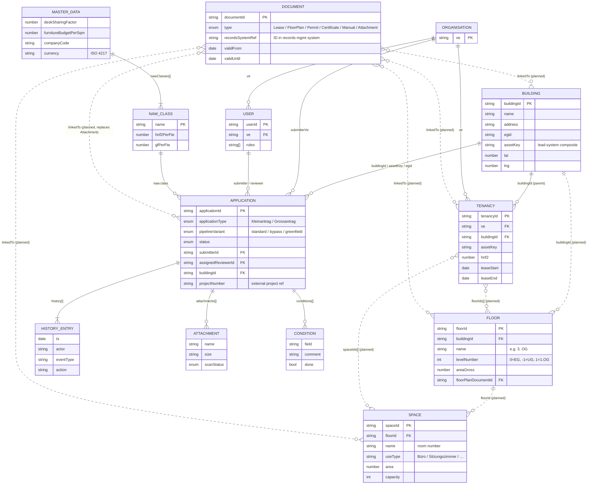
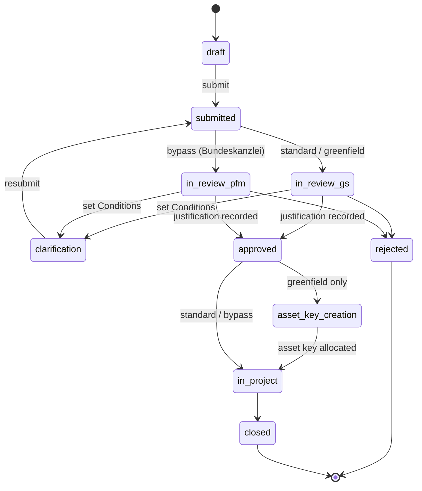

# BBL Mieterportal — Data Model

This document defines the data model for the BBL Mieterportal prototype.

---

## 1. Introduction

### 1.1 Purpose & Scope

The Mieterportal is the federal tenants' self-service surface for filing
demand applications (`Bedarfsmeldung`), tracking them through review by the
Generalsekretariat (GS) and BBL Portfolio-Management (PFM), and viewing
existing tenancies. The model supports:

- Demand-application lifecycle and audit trail (the workflow)
- Tenancy management for a Verwaltungseinheit
- Reference lookups against external lead systems for buildings, identity, and projects
- Internal news / announcements

The portal is **not a master (lead) system** for property, lease, or identity
data. Canonical records live in external systems; the portal holds only what
it needs to render its views and route its workflow.

### 1.2 Design Principles

| Principle             | Description                                                                                                                  |
| --------------------- | ---------------------------------------------------------------------------------------------------------------------------- |
| **Solution-neutral**  | No vendor-specific identifiers or field names appear in entity definitions. Lead-system mappings are described in § 9.       |
| **EN-only schema**    | All field names, enum values, and entity names are English. German terms appear in `Alias (DE)` columns as documentation only. |
| **Workflow-first**    | Every lifecycle entity carries a `status` and an append-only `history[]`.                                                    |
| **Standards-anchored**| Field semantics map to ISO 16739 / IBPDI / RICS IPMS / SIA 416 / eCH-* vocabulary so integrations are unambiguous.            |
| **Extensibility**     | Domain-local fields are kept in `extensionData` objects where they would otherwise bleed into the canonical schema.          |
| **Traceability**      | All entities with a lifecycle expose `validFrom` / `validUntil` and event-typed history records.                             |
| **Bilingual support** | German terminology is preserved as supplementary aliases in tables; the JSON schema is English-only.                         |
| **Mock data only**    | All `data/*.json` files are illustrative — no production data is shipped.                                                    |

### 1.3 Swiss Context

| Standard / Identifier | Description                                                              | Usage                                          |
| --------------------- | ------------------------------------------------------------------------ | ---------------------------------------------- |
| **EGID**              | Eidgenössischer Gebäudeidentifikator                                     | Federal building identifier (CH only)          |
| **EGRID**             | Eidgenössischer Grundstücksidentifikator                                 | Federal parcel identifier (CH only)            |
| **SIA 416**           | Swiss standard for areas and volumes in building construction            | Area types: GF, NGF, NF, HNF / HNF2, NNF, VF, FF |
| **SIA 380/1**         | Swiss standard for energy performance of buildings                       | Energy reference area (EBF)                    |
| **LV95**              | Swiss coordinate reference system                                        | Optional high-precision local positioning      |
| **VwVG**              | Verwaltungsverfahrensgesetz (SR 172.021)                                 | Drives audit log + Begründungspflicht          |
| **VILB**              | Verordnung über das Immobilienmanagement und die Logistik des Bundes     | Top-level legal context                        |

### 1.4 Standards alignment

Standards alignment in this model is **conceptual**, not field-level —
the entity names, types, and relationships are *inspired by* the standards
below, but the schema does not (yet) adopt their canonical field names.
A future migration could rename fields to fully comply (e.g. `leaseStart`
→ IBPDI `startDate`); today's prototype prioritises readability.

| Standard                                  | Where it applies in this model                                                                                                  |
| ----------------------------------------- | ------------------------------------------------------------------------------------------------------------------------------- |
| **ISO 16739** (IFC, *buildingSMART*)      | Building reference inspired by `IfcBuilding`; planned Floor / Space mirror `IfcBuildingStorey` / `IfcSpace`. The HistoryEntry shape is a domain-event log (not the IFC `IfcOwnerHistory` lifecycle pattern). |
| **IBPDI**                                 | Tenancy borrows from IBPDI *Lease* + *Unit* + *Occupier*; planned Document / Contact / Contract / AreaMeasurement borrow IBPDI vocabulary. **Field names are not yet IBPDI-canonical** — see § 4.1 note. |
| **RICS IPMS**                             | Area fields cross-reference IPMS 1 / 2 / 3 — see Appendix B. HNF / HNF2 mappings are approximate.                                |
| **GEFMA 198 / 100 / 920**                 | Area definitions (198), service catalogue (100), service-request taxonomy (920) — relevant to future Service / Ticket entities. |
| **ISO 15489 / eCH-0002**                  | Records management — applies to the planned Document entity and the records-system referenced by Attachment.                     |
| **eCH-0107 / eCH-0058**                   | Federated identity / IAM — User entity is a *consumer* of these (subject ID, group memberships); field names are generic, not eCH-canonical. |
| **eCH-0046**                              | Federal data standard for addresses and organisations.                                                                          |
| **BPMN 2.0** (OMG, ISO 19510)             | Optional notation for externalising the demand-application workflow (§ 3.2). The pipeline shape is BPMN-compatible.             |
| **SAP MDG**                               | Master Data Governance — vendor framework occasionally deployed alongside the eCH IAM standards in Swiss federal contexts.       |
| **ISO 4217**                              | Currency codes — monetary fields carry an explicit currency (see § 6.1).                                                         |
| **ISO 8601 / ISO 3166 / RFC 5322**        | Timestamps, country codes, e-mail addresses.                                                                                    |

---

## 2. Architecture Overview

### 2.1 Entity layers

| Layer            | Entities                                                | Description                                                                       |
| ---------------- | ------------------------------------------------------- | --------------------------------------------------------------------------------- |
| **Workflow**     | Application, Attachment, Condition, HistoryEntry         | Demand-application lifecycle — the portal's only owned domain.                    |
| **Tenancy**      | Tenancy, Organisation                                    | Existing lease relationships and the occupying admin units.                       |
| **Reference**    | Building, User, NewsArticle                              | Read-only / display data; canonical records live in external lead systems.        |
| **Master data**  | MasterData (singleton), NawClass                         | Slowly-changing reference tables used by calculations and validation.             |
| **Future**       | Site, Parcel, Floor, Space, AreaMeasurement, Document, Contact, Contract, Ticket, Service, Decision, DocumentVersion, Notification | Not in scope today; documented as lead-system or portal extension candidates. |

### 2.2 Entity relationship diagram

Solid lines = relationships implemented today. Dashed lines = relationships
present once the **Planned** entities (Floor, Space, Document) ship.



### 2.3 Entity overview

All entities — current and future — with the implementation status of
each. Most entries are plain JSON; spatial entities (Building, Floor,
Space) follow the **GeoJSON** convention (`FeatureCollection` of `Point`
or `Polygon` features) so they can be consumed directly by mapping or
floor-plan libraries.

**Status legend**

| Status         | Meaning                                                                                                    |
| -------------- | ---------------------------------------------------------------------------------------------------------- |
| **Implemented**| Exists today as a separate file under `data/` and is used by the portal's views or workflow.                |
| **Embedded**   | Exists today, but only as an embedded sub-record on a parent entity (no separate file or table yet).        |
| **Planned**    | Not modelled today, but a concrete near-term feature in the portal's roadmap depends on it.                 |
| **Future**     | Documented for completeness — neither code nor near-term roadmap depends on it yet.                         |

#### Workflow

| Entity                  | Description                                                                                                                          | Status         | File                                                  |
| ----------------------- | ------------------------------------------------------------------------------------------------------------------------------------ | -------------- | ----------------------------------------------------- |
| **Application**         | Demand request raised by a Verwaltungseinheit. Carries the full review pipeline + audit trail.                                       | Implemented    | [`data/applications.json`](../data/applications.json) |
| **Attachment**          | File attached to an Application during submission (WiBe.pdf, Rechtsgrundlage.pdf, …). Will resolve to a `Document` once Document is live. | Embedded       | in Application                                        |
| **Condition** (Auflage) | Reviewer-set compliance instruction during the `clarification` state. Submitter ticks each off before resubmitting.                  | Embedded       | in Application                                        |
| **HistoryEntry**        | Immutable record of a state transition on an Application (VwVG Art. 35 audit trail).                                                  | Embedded       | in Application                                        |

#### Tenancy & Occupier

| Entity                  | Description                                                                                                                          | Status         | File                                                  |
| ----------------------- | ------------------------------------------------------------------------------------------------------------------------------------ | -------------- | ----------------------------------------------------- |
| **Tenancy**             | Existing lease relationship between a Verwaltungseinheit and a rented object (Building / Floor / Space[]). Aggregates lease terms + occupier into a read-optimised record. | Implemented    | [`data/tenancies.json`](../data/tenancies.json)       |
| **Organisation**        | Federal admin unit (Departement, Bundesamt, Stabsstelle). Today a denormalised string `ve` on User / Application / Tenancy. Promotion to a proper entity (with hierarchy, validity, eCH-0046 alignment) is planned. | Embedded → Planned | embedded in user / application / tenancy           |

#### Spatial hierarchy (lead-system reference)

| Entity                  | Description                                                                                                                          | Status         | File                                                  |
| ----------------------- | ------------------------------------------------------------------------------------------------------------------------------------ | -------------- | ----------------------------------------------------- |
| **Site**                | Logical grouping of buildings (campus / area). Resolved from the lead system on demand if a campus view ever appears.                  | Future         | —                                                     |
| **Parcel**              | Land plot a building sits on (cadastral polygon, EGRID-keyed).                                                                        | Future         | —                                                     |
| **Building**            | Read-only reference to a physical property — name, address, asset key, cadastral identifier, coordinates. Canonical record lives in the lead asset registry; this is the portal's local cache. | Implemented    | [`data/buildings.geojson`](../data/buildings.geojson) † |
| **Floor**               | A level within a building. Carries `levelNumber` (UG/EG/OG), gross area, optional `floorPlanUrl` / `floorPlanGeoJson`. **Required by the planned floor-plan viewer.** | Planned        | `data/floors.geojson` (planned)                       |
| **Space** (Raum)        | A room — the smallest rentable unit. **The Tenancy's actual rented object is one or more Spaces (or a Floor, or a Building).** Carries `useType` (Büro / Sitzungszimmer / Open Space / …), area, geometry, capacity. | Planned        | `data/spaces.geojson` (planned)                       |
| **Address** (structured)| Street / number / postal code / city / canton / country broken out per eCH-0010 + eCH-0046. Today flattened to a single free-text `address` string on Building / Tenancy / Application. | Future         | —                                                     |

#### Records & Documents

| Entity                  | Description                                                                                                                          | Status         | File                                                  |
| ----------------------- | ------------------------------------------------------------------------------------------------------------------------------------ | -------------- | ----------------------------------------------------- |
| **Document**            | Canonical records entity. Subsumes **lease contracts (Mietvertrag)**, floor plans, permits, certificates, training manuals, and Application attachments. Anchored in ISO 15489 / eCH-0002. Per-entity link patterns: `linkedTo: building | floor | space | tenancy | application`. | Planned        | `data/documents.json` (planned)                       |
| **DocumentVersion**     | Versioned + signed instance of a Document. Triggered by signature-service integration (ZertES / SwissID).                              | Future         | —                                                     |

#### People & Contacts

| Entity                  | Description                                                                                                                          | Status         | File                                                  |
| ----------------------- | ------------------------------------------------------------------------------------------------------------------------------------ | -------------- | ----------------------------------------------------- |
| **User**                | Authenticated person who can submit applications, review them, or access portfolio data. Carries 1..n roles from the federated identity provider. | Implemented    | [`data/users.json`](../data/users.json)               |
| **Contact**             | Person × Building × role (Portfolio-Manager, Immobilien-Manager, Flächen-Manager, Hauswart, …). Today denormalised on `tenancy.contacts` as three name strings. | Future         | —                                                     |

#### Master & catalogue

| Entity                  | Description                                                                                                                          | Status         | File                                                  |
| ----------------------- | ------------------------------------------------------------------------------------------------------------------------------------ | -------------- | ----------------------------------------------------- |
| **MasterData**          | Singleton of slowly-changing reference data: NAW classification table, federal coefficients, PFM portfolio categories, BBL company code. Read-only at runtime; managed out-of-band by the BBL portfolio team. | Implemented    | [`data/master-data.json`](../data/master-data.json)   |
| **NawClass**            | NAW classification entry: name, m²/FTE for HNF2 and GF, description. Drives the wizard's area calculation.                            | Implemented    | inside MasterData                                     |
| **NewsArticle**         | Operational communication shown on the home page and `#/news` route (maintenance notices, training sessions, federal-level announcements). Hand-curated; no CMS in the prototype. | Implemented    | [`data/news.json`](../data/news.json)                 |

#### Operations & FM (future)

| Entity                  | Description                                                                                                                          | Status         | File                                                  |
| ----------------------- | ------------------------------------------------------------------------------------------------------------------------------------ | -------------- | ----------------------------------------------------- |
| **Ticket** (Anliegen)   | Service request raised against a Building / Tenancy (Schaden, Reparatur, Umzug, Sonderreinigung). Triggered by ticketing-system integration; aligned with GEFMA 920-3. | Future         | —                                                     |
| **Service**             | FM service catalogue entry (id, scope, eligibility, SLA). Triggered when the catalogue grows past ~6 services; aligned with GEFMA 100. | Future         | —                                                     |
| **AreaMeasurement**     | Measurement record carrying *basis* (SIA 416 / IPMS / GEFMA 198), *accuracy* (Measured / Estimated / Aggregated), and *validity*. Today the portal stores scalar `hnf2` / `gf` only. | Future         | —                                                     |
| **Contract** (service)  | Service agreements / maintenance contracts. Distinct from `Document.type = 'Lease'` — these are *FM* contracts (cleaning, security, HVAC service).                                                        | Future         | —                                                     |
| **Certificate**         | Energy (GEAK / Minergie) / accessibility / fire-safety certifications attached to a Building.                                          | Future         | —                                                     |
| **Asset**               | Building systems (HVAC, elevators, fire protection, BACS). Typically owned by a CAFM system.                                          | Future         | —                                                     |

#### Workflow extensions (future)

| Entity                  | Description                                                                                                                          | Status         | File                                                  |
| ----------------------- | ------------------------------------------------------------------------------------------------------------------------------------ | -------------- | ----------------------------------------------------- |
| **Notification**        | Delivery + read state of e-mails / in-portal messages to submitters and reviewers. Today faked via `HistoryEntry` rows.               | Future         | —                                                     |
| **Decision**            | Multi-stage approval record when more than one signature is required (e.g. GS *and* BBL-PFM both sign off).                            | Future         | —                                                     |
| **LeaseDetail**         | Lease-amendment record (indexation, options, exit dates) when contract editing leaves the lead lease ledger.                          | Future         | —                                                     |
| **Comment** / **Note**  | Threaded discussion between submitter and reviewer during `clarification`. Today squeezed into `Condition.comment` + history `action`. | Future         | —                                                     |
| **Assignment** history  | Who was the active reviewer when, assigned by whom. Today only the *current* `assignedReviewerId` is stored.                          | Future         | —                                                     |
| **AccessLog**           | Compliance audit beyond workflow events — who *viewed* an Application/Tenancy when. Distinct from `HistoryEntry`.                     | Future         | —                                                     |

> † Target format. The prototype currently ships `data/buildings.json`
> (a plain JSON array). A migration to `buildings.geojson` (Point
> FeatureCollection) is pending — it allows direct consumption by
> MapLibre / Leaflet without an in-app transformation step. The schema in
> § 5.1 already assumes the GeoJSON shape (geometry on the feature,
> properties on the feature's `properties` object).

### 2.4 Demo vs. production implementation

**Demo (this prototype):** All entities live in flat JSON files under
`data/`. Embedded arrays (`history[]`, `attachments[]`, `conditions[]`) live
inside their parent Application document.

**Production:** Each entity would be a separate record with foreign-key
relationships; the portal would write to its own workflow store and read
from external lead systems via API. Building / User / Tenancy data would
arrive through ETL or a real-time integration; Attachments would live in a
records-management system aligned with ISO 15489 / eCH-0002.

---

## 3. Workflow Entities

### 3.1 Application (Bedarfsmeldung)

**File:** [`data/applications.json`](../data/applications.json)

A demand request raised by a Verwaltungseinheit. The flagship entity:
carries the review pipeline, audit trail, attachments, and reviewer-set
conditions. Has no direct IFC / IBPDI counterpart because the demand
workflow is portal-specific.

#### Schema definition

| Field                  | PK/FK | Type            | Description                                                            | Constraints                | Alias (EN)             | Alias (DE)               |
| ---------------------- | ----- | --------------- | ---------------------------------------------------------------------- | -------------------------- | ---------------------- | ------------------------ |
| **applicationId**      | PK    | string          | Unique identifier. Format `{VE}-{year}-{seq}` (e.g. `BE-2026-014`)      | **mandatory**              | Application ID         | Bedarfsmeldungs-ID       |
| **applicationType**    |       | string, enum    | Application size category. See Appendix A.1.                            | **mandatory**              | Application Type       | Antragstyp               |
| **pipelineVariant**    |       | string, enum    | Pipeline branch. See Appendix A.2.                                      | **mandatory**              | Pipeline Variant       | Pipeline-Variante        |
| **status**             |       | string, enum    | Current state in the pipeline. See Appendix A.3.                        | **mandatory**              | Status                 | Status                   |
| **submitterId**        | FK    | string          | Reference to User who filed the application.                            | **mandatory**              | Submitter              | Antragsteller            |
| **submitterVe**        |       | string          | VE abbreviation, denormalised from submitter for fast filter.           | **mandatory**              | Submitter VE           | Antrags-VE               |
| **submitterDep**       |       | string          | Department within the VE (e.g. `BAFU` inside UVEK).                     |                            | Submitter Department   | Antragstellende Abteilung |
| **buildingId**         | FK    | string          | Reference to Building. Absent on greenfield until asset-key allocation. |                            | Building ID            | Objekt-ID                |
| **address**            |       | string          | Free-text address shown in the UI.                                      | **mandatory**              | Address                | Adresse                  |
| **assetKey**           |       | object          | Lead-system composite asset key (e.g. `{ bk, we, obj }`).               |                            | Asset Key              | Wirtschaftseinheit-Schlüssel |
| **egid**               |       | string          | Cadastral building identifier echo (CH only).                            |                            | EGID                   | EGID                     |
| **submittedAt**        |       | string (ISO 8601) | Timestamp of `submitted` transition.                                  | **mandatory**, minLength: 20 | Submitted At         | Eingereicht am           |
| **assignedReviewerId** | FK    | string          | Reference to User. Set when a reviewer takes the case.                  |                            | Assigned Reviewer      | Zugewiesener Prüfer      |
| **projectNumber**      |       | string          | External project-management number returned after approval (`in_eppm`). |                            | Project Number         | Bedarfsmeldungsnummer    |
| **naw**                |       | object          | NAW classification result. Absent for Grossantrag. See § 3.3.            |                            | NAW Classification     | NAW-Klassifizierung      |
| **fte**                |       | number          | FTE count claimed by submitter.                                          | minimum: 0                 | FTE                    | VZÄ                      |
| **workstations**       |       | number          | Derived workstations (`fte × deskSharingFactor`, rounded up).            |                            | Workstations           | Arbeitsplätze            |
| **hnf2**               |       | number          | Hauptnutzfläche-2 in m² (SIA 416).                                       |                            | HNF2                   | HNF2                     |
| **gf**                 |       | number          | Geschossfläche in m² (SIA 416).                                          |                            | GF                     | GF                       |
| **operatingCosts**     |       | number          | Estimated annual operating costs in CHF.                                 |                            | Operating Costs        | Unterhaltskosten         |
| **furnitureBudget**    |       | number          | Estimated furniture budget in CHF.                                       |                            | Furniture Budget       | Möblierung               |
| **attachments**        |       | Attachment[]    | See § 3.4.                                                               |                            | Attachments            | Anhänge                  |
| **conditions**         |       | Condition[]     | Reviewer-set conditions. Present after a `clarification` cycle.         |                            | Conditions             | Auflagen                 |
| **reviewerJustification** |    | string          | Reviewer's free-text justification. Required for `approved`/`rejected`. |                            | Reviewer Justification | Reviewer-Begründung      |
| **history**            |       | HistoryEntry[]  | Append-only audit log. See § 3.6.                                        | **mandatory**              | History                | Historie                 |
| **validFrom**          |       | string (ISO 8601) | Record valid from.                                                     |                            | Valid From             | Gültig von               |
| **validUntil**         |       | string (ISO 8601) | Record valid until.                                                    |                            | Valid Until            | Gültig bis               |
| extensionData          |       | object          | Container for domain-specific extensions (e.g. SEM-only fields below).   |                            | Extension Data         | Erweiterungsdaten        |

#### Swiss extension fields (`extensionData`)

Applicable when `applicationType = Grossantrag` and the requesting VE is SEM:

| Field                              | Type   | Description                                            | Alias (EN)               | Alias (DE)               |
| ---------------------------------- | ------ | ------------------------------------------------------ | ------------------------ | ------------------------ |
| extensionData.berths               | number | Total bed places.                                       | Berths                   | Bettenplätze             |
| extensionData.berthsFamily         | number | Subtotal: family berths.                                | Family Berths            | Bettenplätze Familien    |
| extensionData.berthsSingle         | number | Subtotal: single berths.                                | Single Berths            | Bettenplätze Einzel      |
| extensionData.berthsShared         | number | Subtotal: shared berths.                                | Shared Berths            | Bettenplätze gemeinsam   |
| extensionData.supervisionFte       | number | Supervision-staff FTE.                                   | Supervision FTE          | Betreuungs-VZÄ           |
| extensionData.securityFte          | number | Security-staff FTE.                                      | Security FTE             | Sicherheits-VZÄ          |
| extensionData.procedureRooms       | number | Number of asylum-procedure interview rooms.              | Procedure Rooms          | Verfahrensräume          |
| extensionData.investmentLumpSum    | number | Lump-sum investment per berth × berths.                   | Investment Lump-Sum      | Investitionspauschale    |

#### Example

```jsonc
{
  "applicationId": "BE-2026-014",
  "applicationType": "Kleinantrag",
  "pipelineVariant": "standard",
  "status": "in_review_gs",
  "submitterId": "U.123.456",
  "submitterVe": "UVEK",
  "submitterDep": "BAFU",
  "buildingId": "BLD-2011",
  "address": "Eichweg 22, 3003 Bern",
  "assetKey": { "bk": "1086", "we": "2011", "obj": "AA" },
  "egid": "100234567",
  "submittedAt": "2026-05-12T14:07:00Z",
  "assignedReviewerId": "U.654.321",
  "naw": { "class": "Kollaborativ-Standard", "confidence": 0.84 },
  "fte": 8,
  "workstations": 7,
  "hnf2": 77,
  "gf": 154,
  "operatingCosts": 462000,
  "furnitureBudget": 50050,
  "attachments": [
    { "name": "WiBe.pdf", "size": "1.2 MB", "scanStatus": "ok" }
  ],
  "history": [
    { "ts": "2026-05-12T14:02:11Z", "actor": "Andrea Muster", "eventType": "ApplicationAdded",     "action": "Antrag erstellt" },
    { "ts": "2026-05-12T14:07:34Z", "actor": "Andrea Muster", "eventType": "ApplicationSubmitted", "action": "Eingereicht" }
  ]
}
```

> The demo JSON uses some German values (`status: in_gs_pruefung`,
> `pipelineVariant: standard`). The target schema is shown above (EN-only);
> a rename pass is pending.

### 3.2 Status pipeline

Three pipeline variants:

| Variant       | Trigger                                                 | Path                                                                                                       |
| ------------- | ------------------------------------------------------- | ---------------------------------------------------------------------------------------------------------- |
| `standard`    | Default                                                  | `draft → submitted → in_review_gs → approved → in_project → closed`                                       |
| `bypass`      | Submitter VE = Bundeskanzlei (no GS layer)               | `draft → submitted → in_review_pfm → approved → in_project → closed`                                      |
| `greenfield`  | No asset key exists for the target address yet           | `draft → submitted → in_review_gs → approved → asset_key_creation → in_project → closed`                  |

Plus two off-pipeline terminals reachable from any `in_review_*` state:

- `clarification` — Reviewer has set Conditions; case bounces back to submitter.
- `rejected`      — Reviewer rejected with `reviewerJustification` (VwVG Art. 35).

Resubmission after `clarification` returns the same Application (same
`applicationId`) to `submitted`; history is preserved.



> No single international standard governs federal tenant demand workflows.
> The pipeline shape is BPMN-compatible — it could be exported as a BPMN
> 2.0 file if the workflow ever needs to be editable outside code.

### 3.3 Embedded: NAW classification

```jsonc
{
  "class": "Kollaborativ-Standard",  // FK → NawClass.name
  "confidence": 0.84,                 // 0..1
  "answers": {
    "focus": "Kollaborativ" | "Konzentriert",
    "remoteShare": 0..100,            // %
    "confidentiality": "low" | "medium" | "high",
    "publicContact": "none" | "occasional" | "regular",
    "specials": ["Lab" | "Security area" | …]
  }
}
```

### 3.4 Embedded: Attachment

| Field        | Type         | Description                                       | Alias (EN)   | Alias (DE)         |
| ------------ | ------------ | ------------------------------------------------- | ------------ | ------------------ |
| **name**     | string       | File name (e.g. `WiBe.pdf`).                       | Name         | Dateiname          |
| **size**     | string       | Human-readable size (e.g. `1.2 MB`).               | Size         | Grösse             |
| **scanStatus** | string, enum | Antivirus scan result. See Appendix A.4.         | Scan Status  | Scanstatus         |

> **Records-management note.** This embedded shape is intentionally minimal.
> A federal records-management deployment would link each file to a
> records system aligned with **ISO 15489** / **eCH-0002**, holding the
> file plus retention, classification, and disposition metadata. The
> portal would then hold a record-reference rather than the file blob —
> see Future Entities § 7.

### 3.5 Embedded: Condition (Auflage)

| Field         | Type    | Description                                                   | Alias (EN)   | Alias (DE)         |
| ------------- | ------- | ------------------------------------------------------------- | ------------ | ------------------ |
| **field**     | string  | Application field the condition refers to (e.g. `fte`).         | Field        | Feld               |
| **comment**   | string  | Reviewer's instruction in prose.                                | Comment      | Kommentar          |
| **done**      | boolean | Submitter has marked the condition as fulfilled.                | Done         | Erfüllt            |

### 3.6 Embedded: HistoryEntry

| Field        | Type             | Description                                                          | Alias (EN)   | Alias (DE)         |
| ------------ | ---------------- | -------------------------------------------------------------------- | ------------ | ------------------ |
| **ts**       | string (ISO 8601) | Transition timestamp.                                                | Timestamp    | Zeitstempel        |
| **actor**    | string           | Display name of the user, or `System` for automated transitions.     | Actor        | Akteur             |
| **eventType** | string, enum    | Domain event type. See Appendix A.5.                                 | Event Type   | Ereignistyp        |
| **action**   | string           | Free-text description.                                                | Action       | Aktion             |

> **Pattern note.** HistoryEntry is a **domain-event log** (CQRS / event-
> sourcing-style), not the IFC `IfcOwnerHistory` lifecycle pattern.
> `IfcOwnerHistory` records *the latest* change owner+action on every
> entity; ours records *every* state transition on the Application as a
> separate row. The event-type vocabulary (`*Added` / `*Updated` /
> `*Deleted` plus workflow-specific verbs like `ApplicationSubmitted`)
> borrows from IBPDI's domain-event convention.

---

## 4. Tenancy & Organisation Entities

### 4.1 Tenancy (Mietverhältnis)

**File:** [`data/tenancies.json`](../data/tenancies.json)

An *existing* lease relationship between a Verwaltungseinheit and a
**rented object**. Borrows from IBPDI *Lease + Unit + Occupier* and
aggregates them into one read-optimised record. Areas follow **SIA 416**
(Appendix B cross-walk).

**Rented object — what does a Tenancy actually rent?**

A Tenancy never rents a whole portfolio; it rents one of three scopes:

- A **whole Building** — typical for single-tenant federal objects (e.g. an
  SEM reception centre).
- One or more **Floors** — common for departmental tenancies (one VE occupies a level).
- A set of **Spaces** (rooms) — fine-grained, common in shared buildings.

The scope is expressed by *which* of `buildingId`, `floorIds`, `spaceIds`
are populated:

| Scope     | `buildingId` | `floorIds[]`   | `spaceIds[]`   |
| --------- | ------------ | -------------- | -------------- |
| Building  | required     | empty          | empty          |
| Floor     | required (breadcrumb) | non-empty | empty          |
| Space     | required (breadcrumb) | optional  | non-empty      |

`buildingId` is always populated as the parent breadcrumb so building-level
views work without joining the rented-object lists.

#### Schema definition

| Field             | PK/FK | Type             | Description                                                | Constraints                 | Alias (EN)         | Alias (DE)              |
| ----------------- | ----- | ---------------- | ---------------------------------------------------------- | --------------------------- | ------------------ | ----------------------- |
| **tenancyId**     | PK    | string           | Unique identifier (e.g. `T-2010-AA-01`).                    | **mandatory**               | Tenancy ID         | Mietverhältnis-ID       |
| **ve**            | FK    | string           | Primary occupying VE.                                       | **mandatory**               | VE                 | Verwaltungseinheit      |
| **dep**           |       | string           | Department within the VE.                                   |                             | Department         | Abteilung               |
| **buildingId**    | FK    | string           | Parent Building (breadcrumb — always populated).             | **mandatory**               | Building ID        | Objekt-ID               |
| **floorIds**      | FK    | string[]         | Rented Floor refs. Non-empty when scope = Floor; can be present alongside `spaceIds` for multi-floor space sets. (FK → Floor — see § 5.2.) | optional                    | Floor IDs          | Geschoss-IDs            |
| **spaceIds**      | FK    | string[]         | Rented Space refs. Non-empty when scope = Spaces. (FK → Space — see § 5.3.) | optional                    | Space IDs          | Raum-IDs                |
| **rentedScope**   |       | string, enum     | Derived from populated lists: `building` / `floor` / `spaces`. May be stored for fast filter. | derived                  | Rented Scope       | Mietumfang              |
| **assetKey**      |       | object           | Lead-system composite asset key `{ bk, we, obj }`. (See § 5.1 for the canonical shape.) |                             | Asset Key          | Wirtschaftseinheit-Schlüssel |
| **egid**          |       | string           | Cadastral building identifier echo.                          |                             | EGID               | EGID                    |
| **address**       |       | string           | Free-text address (display only — canonical address lives on Building). | **mandatory**         | Address            | Adresse                 |
| **buildingName**  |       | string           | Building display name (echo).                                | **mandatory**               | Building Name      | Objektname              |
| **portfolioCategory** |   | string, enum     | PFM portfolio category. See Appendix A.6.                    | **mandatory**               | Portfolio Category | PFM-Kategorie           |
| **floorLabel**    |       | string           | Display label for the rented level(s) — e.g. "3. OG" or "EG + 1. OG". Derived from `floorIds[]` / `spaceIds[]` when those resolve; cached for views that don't join. |             | Floor Label        | Geschossbezeichnung     |
| **hnf2**          |       | number           | Rented Hauptnutzfläche-2 in m² (SIA 416 / ≈ IPMS 3).         | **mandatory**, minimum: 0   | HNF2               | HNF2                    |
| **gf**            |       | number           | Rented Geschossfläche in m² (SIA 416 / ≈ IPMS 1).            |                             | GF                 | GF                      |
| **workstations**  |       | number           | Workstations supported.                                       |                             | Workstations       | Arbeitsplätze           |
| **lat**           |       | number           | WGS84 latitude (map view).                                    |                             | Latitude           | Breitengrad             |
| **lng**           |       | number           | WGS84 longitude.                                              |                             | Longitude          | Längengrad              |
| **leaseStart**    |       | string (ISO date) | Lease start date.                                            | **mandatory**               | Lease Start        | Mietbeginn              |
| **leaseEnd**      |       | string (ISO date) | Lease end date.                                              | **mandatory**               | Lease End          | Mietende                |
| **leaseAuto**     |       | boolean          | Auto-renewing (true) or fixed-term (false).                  |                             | Auto-renewing      | Selbstverlängernd       |
| **yearlyCost**    |       | number           | Annual rent in CHF.                                           | minimum: 0                  | Yearly Cost        | Jahresmiete             |
| **contacts**      |       | object           | Denormalised contact roles `{ pfm, im, flm }` (display only). See note below. | | Contacts           | Kontakte                |
| **openIssues**    |       | number           | Count of open requests / open conditions / open tickets.      | minimum: 0                  | Open Issues        | Offene Anliegen         |
| **image**         |       | string (URL)     | Hero image for gallery / map list.                            |                             | Image              | Bild                    |
| **validFrom**     |       | string (ISO 8601) | Valid from.                                                  |                             | Valid From         | Gültig von              |
| **validUntil**    |       | string (ISO 8601) | Valid until.                                                 |                             | Valid Until        | Gültig bis              |
| extensionData     |       | object           | Container for client-specific fields.                         |                             | Extension Data     | Erweiterungsdaten       |

> **Denormalisation notes.**
>
> - **`contacts`** is a read-optimised echo of three Building-level
>   Contact records (Portfolio-Manager, Immobilien-Manager, Flächen-Manager).
>   Canonical Contact lives in the lead system (IBPDI *Contact* / IFC
>   `IfcActor`); the portal stores only the names for display. A real
>   integration would resolve current contacts on demand. See Future
>   Entities § 7 (Contact).
> - **`hnf2` / `gf`** are scalar projections. In production each is a
>   result of an `AreaMeasurement` record carrying *measurement basis*
>   (SIA 416 / IPMS 3 / GEFMA 198), *accuracy* (`Measured` / `Estimated`
>   / `Aggregated`), and *valid-from/until*. The portal does not own
>   `AreaMeasurement` — see Future Entities § 7.

### 4.2 Organisation (Verwaltungseinheit)

Not stored as a top-level record today. Carried as a denormalised string
field (`ve`) on User, Application, and Tenancy. The closed set used in
mock data:

- **Departements / Stabsstellen:** `BK`, `UVEK`, `WBF`, `EDI`, `EJPD`, `VBS`, `EFD`, `EDA`
- **Bundesämter / Sekretariate:** `BAFU` (in UVEK), `SEM` (in EJPD)
- **Bundesverwaltung-level:** `BBL`, `EFV`

A production model would promote this to a proper Organisation entity
aligned with **IBPDI Occupier** and **eCH-0046** *organisation*.

---

## 5. Reference Entities

### 5.1 Building (Gebäude)

**File:** [`data/buildings.geojson`](../data/buildings.geojson) (target; currently `buildings.json`).

A **read-only reference** to a physical property. The portal does **not**
own the canonical record — see § 1.1. Borrows from ISO 16739 `IfcBuilding`
and IBPDI *Building*. Spatial hierarchy: Building → Floor (§ 5.2) → Space
(§ 5.3); Site / Parcel above Building remain Future (§ 7.1).

#### Schema definition

| Field                 | PK/FK | Type             | Description                                                          | Constraints   | Alias (EN)        | Alias (DE)        |
| --------------------- | ----- | ---------------- | -------------------------------------------------------------------- | ------------- | ----------------- | ----------------- |
| **buildingId**        | PK    | string           | Unique identifier (lead-system PK).                                   | **mandatory** | Building ID       | Objekt-ID         |
| **name**              |       | string           | Display name.                                                         | **mandatory** | Building Name     | Bezeichnung       |
| **address**           |       | string           | Free-text address.                                                    | **mandatory** | Address           | Adresse           |
| **assetKey**          |       | object           | Lead-system composite asset key `{ bk, we, obj }`.                    |               | Asset Key         | WE-Schlüssel      |
| **egid**              |       | string           | Cadastral building identifier (CH: EGID; analogue elsewhere).         |               | EGID              | EGID              |
| **coords**            |       | [number, number] | `[lng, lat]` in WGS84 (GeoJSON order). See § 1.5 coordinate-convention note. | **mandatory** | Coordinates       | Koordinaten       |
| **portfolioCategory** |       | string, enum     | Portfolio category — Appendix A.6.                                    |               | Portfolio Category | PFM-Kategorie    |
| **image**             |       | string (URL)     | Hero photo URL.                                                       |               | Image             | Bild              |

> Note: a `Building.ve` field ("primary VE") was previously documented but
> dropped — multiple VEs can occupy one building, so the primary-VE
> attribution is derived from Tenancy rather than stored on Building.

### 5.2 Floor (Geschoss) [Planned]

**File:** `data/floors.geojson` (planned, GeoJSON `FeatureCollection` of `Polygon` features carrying the floor outline).

A level within a Building. Required by the planned floor-plan viewer; also
the granularity at which whole-storey leases (a frequent federal pattern —
"one VE occupies the 3rd floor") link to Tenancy. Borrows from ISO 16739
`IfcBuildingStorey` and IBPDI *Floor*.

#### Schema definition

| Field                  | PK/FK | Type             | Description                                                          | Constraints   | Alias (EN)        | Alias (DE)        |
| ---------------------- | ----- | ---------------- | -------------------------------------------------------------------- | ------------- | ----------------- | ----------------- |
| **floorId**            | PK    | string           | Unique identifier (e.g. `BLD-2011-EG`).                               | **mandatory** | Floor ID          | Geschoss-ID       |
| **buildingId**         | FK    | string           | Parent Building.                                                      | **mandatory** | Building ID       | Objekt-ID         |
| **name**               |       | string           | Display name (e.g. `3. OG`, `EG`, `UG`).                              | **mandatory** | Floor Name        | Geschossname      |
| **levelNumber**        |       | integer          | Building-specific level number (EG = 0, UG = -1, 1.OG = 1, …).         | **mandatory** | Level Number      | Geschossnummer    |
| **verticalOrder**      |       | integer          | Sortable storey order. Often equal to `levelNumber` but kept separate so non-standard storey labels (e.g. `1A`) can still sort. |     | Vertical Order    | Vertikale Ordnung |
| **areaGross**          |       | number           | Gross floor area in m² (SIA 416 GF).                                  | minimum: 0    | Gross Area        | Bruttogeschossfläche |
| **floorPlanDocumentId**| FK    | string           | Reference to a Document (`type = FloorPlan`) carrying the SVG / PDF / GeoJSON floor plan. (See § 5.4.) |   | Floor Plan        | Grundriss          |
| **geometry**           |       | GeoJSON Polygon  | Floor outline (typically the building footprint inset by wall thickness). | **mandatory** | Geometry          | Geometrie          |
| **validFrom**          |       | string (ISO 8601) | Valid from.                                                          |               | Valid From        | Gültig von         |
| **validUntil**         |       | string (ISO 8601) | Valid until.                                                         |               | Valid Until       | Gültig bis         |

### 5.3 Space (Raum) [Planned]

**File:** `data/spaces.geojson` (planned, GeoJSON `FeatureCollection` of `Polygon` features).

A room — the smallest rentable unit. Borrows from ISO 16739 `IfcSpace`,
IBPDI *Unit*, and ArcGIS Indoors *Unit*. **The Tenancy's actual rented
object is most precisely a set of Spaces** (or a Floor, or a Building).

#### Schema definition

| Field            | PK/FK | Type             | Description                                                          | Constraints   | Alias (EN)        | Alias (DE)        |
| ---------------- | ----- | ---------------- | -------------------------------------------------------------------- | ------------- | ----------------- | ----------------- |
| **spaceId**      | PK    | string           | Unique identifier (e.g. `BLD-2011-EG-101`).                           | **mandatory** | Space ID          | Raum-ID           |
| **floorId**      | FK    | string           | Parent Floor.                                                         | **mandatory** | Floor ID          | Geschoss-ID       |
| **name**         |       | string           | Room number (e.g. `EG.101`).                                          | **mandatory** | Name              | Raumnummer        |
| **nameLong**     |       | string           | Long display name (e.g. `Empfang Erdgeschoss`).                        |               | Long Name         | Langname          |
| **useType**      |       | string, enum     | Use category — see Appendix A.9.                                       | **mandatory** | Use Type          | Nutzungstyp       |
| **area**         |       | number           | Room area in m² (SIA 416 HNF-relevant subset).                         | minimum: 0    | Area              | Fläche            |
| **capacity**     |       | integer          | Maximum occupancy / workstations supported.                            | minimum: 0    | Capacity          | Kapazität         |
| **isBookable**   |       | boolean          | Room is bookable (meeting rooms, focus rooms).                         |               | Bookable          | Buchbar           |
| **geometry**     |       | GeoJSON Polygon  | Polygon of the room's footprint within the floor.                      | **mandatory** | Geometry          | Geometrie         |
| **validFrom**    |       | string (ISO 8601) | Valid from.                                                           |               | Valid From        | Gültig von        |
| **validUntil**   |       | string (ISO 8601) | Valid until.                                                          |               | Valid Until       | Gültig bis        |

### 5.4 Document [Planned]

**File:** `data/documents.json` (planned).

Canonical records entity. Subsumes **lease contracts (Mietvertrag)**, floor
plans, permits, certificates, training manuals, and per-Application
attachments. The portal owns the *metadata + linkedTo* mapping; the file
blob and ISO 15489 / eCH-0002 classification metadata (retention,
disposition) live in an external records-management system referenced by
`recordsSystemRef`.

#### Schema definition

| Field                | PK/FK | Type              | Description                                                                  | Constraints   | Alias (EN)        | Alias (DE)        |
| -------------------- | ----- | ----------------- | ---------------------------------------------------------------------------- | ------------- | ----------------- | ----------------- |
| **documentId**       | PK    | string            | Portal-side unique identifier.                                                | **mandatory** | Document ID       | Dokument-ID       |
| **type**             |       | string, enum      | Document type — see Appendix A.10.                                            | **mandatory** | Type              | Typ               |
| **title**            |       | string            | Display title (e.g. `Mietvertrag UVEK / Eichweg 22`).                         | **mandatory** | Title             | Titel             |
| **recordsSystemRef** |       | string            | Opaque ID in the external records-management system (resolves to the blob + ISO 15489 metadata). | **mandatory** | Records-system Ref | Datensatz-Ref |
| **linkedTo**         | FK    | LinkRef[]         | Polymorphic links to parent entities (Building, Floor, Space, Tenancy, Application). See § 5.4.1. | **mandatory**, minItems: 1 | Linked To | Verknüpft mit |
| **format**           |       | string            | File format (e.g. `PDF`, `DOCX`, `DWG`, `IFC`).                                |               | Format            | Format            |
| **size**             |       | string            | Human-readable size (`1.2 MB`).                                                |               | Size              | Grösse            |
| **languages**        |       | string[]          | ISO 639-1 language codes (e.g. `["de", "fr"]`).                                |               | Languages         | Sprachen          |
| **issuedAt**         |       | string (ISO date) | Publication / issue date.                                                     |               | Issued At         | Ausgestellt am    |
| **validFrom**        |       | string (ISO 8601) | Valid from.                                                                   |               | Valid From        | Gültig von        |
| **validUntil**       |       | string (ISO 8601) | Valid until (e.g. lease end, certificate expiry).                              |               | Valid Until       | Gültig bis        |
| **scanStatus**       |       | string, enum      | Virus-scan result. See Appendix A.4. Inherited from the Attachment shape it replaces. |        | Scan Status       | Scanstatus        |

#### 5.4.1 Embedded `LinkRef`

| Field        | Type         | Description                                                            |
| ------------ | ------------ | ---------------------------------------------------------------------- |
| `entityType` | string, enum | One of `Building`, `Floor`, `Space`, `Tenancy`, `Application`.          |
| `entityId`   | string       | The PK of the linked entity.                                            |
| `role`       | string       | Free-text role (e.g. `lease-document`, `floor-plan`, `wibe-attachment`). |

> **Today's Attachment is reframed as a Document of `type = Attachment`**
> with a `LinkRef` pointing at the Application. The embedded `attachments[]`
> on Application becomes (in the target schema) a list of `documentId`
> references rather than blobs. The current prototype keeps the embedded
> shape; the migration is part of the records-management integration.

### 5.5 User (Benutzer)

**File:** [`data/users.json`](../data/users.json)

Standards mapping: identity flows via **eCH-0107** and **eCH-0058**; user
master data may be governed by **SAP MDG** in some deployments.

#### Schema definition

| Field      | PK/FK | Type    | Description                                                       | Constraints                  | Alias (EN)  | Alias (DE)         |
| ---------- | ----- | ------- | ----------------------------------------------------------------- | ---------------------------- | ----------- | ------------------ |
| **userId** | PK    | string  | Subject identifier from the IdP token (e.g. `U.123.456`).         | **mandatory**                | User ID     | Benutzer-ID        |
| **name**   |       | string  | Full display name (eCH-0011 / eCH-0044).                          | **mandatory**                | Name        | Name               |
| **email**  |       | string  | RFC 5322 e-mail address.                                          | **mandatory**                | E-mail      | E-Mail             |
| **ve**     | FK    | string  | Home VE.                                                          | **mandatory**                | VE          | Verwaltungseinheit |
| **dep**    |       | string  | Department within the VE.                                         |                              | Department  | Abteilung          |
| **roles**  |       | string[], enum | Permitted roles. See Appendix A.7.                          | **mandatory**, minItems: 1   | Roles       | Rollen             |

The active role is persisted client-side under
`mp-active-role-{userId}` in `localStorage`.

### 5.6 NewsArticle

**File:** [`data/news.json`](../data/news.json)

Internal communications shown on the home page and `#/news` route.

#### Schema definition

| Field          | PK/FK | Type             | Description                              | Constraints   | Alias (EN)  | Alias (DE)         |
| -------------- | ----- | ---------------- | ---------------------------------------- | ------------- | ----------- | ------------------ |
| **newsId**     | PK    | string           | Slug.                                     | **mandatory** | News ID     | Artikel-ID         |
| **type**       |       | string, enum     | Article type. See Appendix A.8.           | **mandatory** | Type        | Typ                |
| **date**       |       | string (ISO date) | Publication date.                        | **mandatory** | Date        | Datum              |
| **title**      |       | string           | Headline.                                 | **mandatory** | Title       | Titel              |
| **lead**       |       | string           | One-paragraph lead.                       | **mandatory** | Lead        | Lead-Text          |
| **source**     |       | string           | Issuing unit (e.g. `BBL PFM`).            |               | Source      | Herausgeber        |
| **responsible**|       | string           | Responsible person.                       |               | Responsible | Verantwortlich     |
| **image**      |       | string (URL)     | Hero photo URL.                           |               | Image       | Bild               |

---

## 6. Master Data

### 6.1 MasterData (singleton)

**File:** [`data/master-data.json`](../data/master-data.json)

Single document of slowly-changing reference data. Holds NAW classes,
federal coefficients, the closed list of portfolio categories, and the
BBL company code. Read-only at runtime; managed out-of-band by the BBL
portfolio team.

#### Schema definition

| Field                              | Type        | Description                                                              | Alias (EN)              | Alias (DE)              |
| ---------------------------------- | ----------- | ------------------------------------------------------------------------ | ----------------------- | ----------------------- |
| **nawClasses**                     | NawClass[]  | NAW classification table. See § 6.2.                                       | NAW Classes             | NAW-Klassen             |
| **deskSharingFactor**              | number      | Federal-mandated coefficient (currently `0.8`).                            | Desk-sharing Factor     | Belegungsfaktor         |
| **furnitureBudgetPerSqm**          | number      | Furniture budget per m² HNF2 in CHF (`650`).                               | Furniture Budget per m² | Möblierung pro m²       |
| **operatingCostCeilingPerSqmGf**   | number      | Soft-block threshold for operating costs (CHF/m² GF).                      | Operating-cost Ceiling  | UK-Obergrenze pro m² GF |
| **operatingCostHardBlockMultiplier** | number    | Multiplier above which submission is hard-blocked.                          | Hard-block Multiplier   | Hardblock-Faktor        |
| **semBerthLumpSum**                | number      | SEM-specific lump-sum per bed place in CHF.                                | SEM Berth Lump-sum      | SEM Pauschale pro Bett  |
| **companyCode**                    | string      | BBL company code (`1086` in Swiss federal context). Used for bypass detection. | Company Code         | Buchungskreis           |
| **currency**                       | string      | ISO 4217 currency code applied to all monetary fields (default `"CHF"`).    | Currency               | Währung                 |
| **portfolioCategories**            | string[]    | Closed list of portfolio categories. See Appendix A.6.                     | Portfolio Categories    | PFM-Kategorien          |

### 6.2 NawClass

| Field           | PK/FK | Type    | Description                                                   | Alias (EN)        | Alias (DE)         |
| --------------- | ----- | ------- | ------------------------------------------------------------- | ----------------- | ------------------ |
| **name**        | PK    | string  | NAW class name (e.g. `Kollaborativ-Standard`).                  | Class Name        | Klassenname        |
| **hnf2PerFte**  |       | number  | m² HNF2 per FTE (SIA 416 / ≈ IPMS 3).                            | HNF2 per FTE      | HNF2 pro VZÄ       |
| **gfPerFte**    |       | number  | m² GF per FTE (SIA 416 / ≈ IPMS 1).                              | GF per FTE        | GF pro VZÄ         |
| **description** |       | string  | Short label for UI surfaces.                                    | Description       | Beschreibung       |

Calculation: `hnf2 = round(hnf2PerFte × fte × deskSharingFactor)`;
analogously for `gf`.

---

## 7. Future Entities

Not implemented today. Documented here so integrations and roadmap
discussions share a vocabulary. Two groups: lead-system entities the
portal would *read* from, and portal-side extensions it might *own*.

### 7.1 Lead-system / external entities (read on demand)

These belong to canonical real-estate / records / FM systems. The portal
would never own them; it would resolve them on demand when a view needs
them. (Floor / Space / Document have been promoted from this list to
**Planned** — see §§ 5.2 – 5.4.)

| Entity                   | DE term                  | Standard anchor                              | Portal use case (when integrated)                                            |
| ------------------------ | ------------------------ | -------------------------------------------- | ---------------------------------------------------------------------------- |
| **Site**                 | Standort                 | ISO 16739 `IfcSite`, IBPDI Site               | Campus / area view; group buildings on the map by site.                     |
| **Parcel**               | Parzelle                 | National cadastre (CH: EGRID)                 | Cadastral context on Tenancy detail.                                         |
| **Address** (structured) | Adresse                  | IBPDI Address, eCH-0010 / eCH-0046            | Canonical postal address (today flattened into the `address` string).        |
| **AreaMeasurement**      | Bemessung                | ISO 16739 `IfcQuantitySet`, IBPDI Quantity   | Provides basis (SIA 416 / IPMS / GEFMA 198), accuracy, validity for `hnf2` / `gf` values. |
| **Contact**              | Kontakt                  | ISO 16739 `IfcActor`, IBPDI Contact           | Person × Building × role relationship; canonicalises today's denormalised `tenancy.contacts`. |
| **Contract** (FM)        | Vertrag                  | IBPDI Contract                                | Service agreements, maintenance contracts. Distinct from `Document.type = 'Lease'`. |
| **Certificate**          | Zertifikat               | (IBPDI Certificate, future)                   | Energy / accessibility / fire-safety certifications.                         |
| **Asset**                | Anlage / Ausstattung     | ISO 16739 `IfcSystem`, IBPDI Asset            | HVAC, elevators, fire protection — typically FM concern.                     |

### 7.2 Portal-side extensions (potentially owned)

| Entity                  | DE term            | Trigger to add                                                                | Standard anchor              |
| ----------------------- | ------------------ | ----------------------------------------------------------------------------- | ---------------------------- |
| **Ticket**              | Anliegen / Auftrag | First real ticketing integration (Schaden, Reparatur, Umzug).                  | GEFMA 920-3                  |
| **Service**             | Dienstleistung     | Service catalogue grows past 6 services.                                       | GEFMA 100                    |
| **Notification**        | Benachrichtigung   | When the in-portal inbox replaces e-mail; track delivery + read state.         | —                            |
| **Decision**            | Entscheid          | Multi-stage approval requirement (e.g. GS *and* PFM both sign off).             | VwVG Art. 35                 |
| **DocumentVersion**     | Dokumentversion    | Signature-service integration (Skribble / SwissID / ZertES).                    | ISO 15489, ISO 14641, ZertES |
| **LeaseDetail**         | Mietvertrag-Detail | Contract editing leaves the lead lease ledger (amendments, indexation, options). | IBPDI Lease / Lease Event    |

---

## 8. File summary

### 8.1 Implemented today

| File                                                  | Records (mock) | Entities held                                                  |
| ----------------------------------------------------- | -------------- | -------------------------------------------------------------- |
| [`data/applications.json`](../data/applications.json) | 5              | Application (with embedded Attachment / Condition / HistoryEntry) |
| [`data/tenancies.json`](../data/tenancies.json)       | 3              | Tenancy                                                          |
| [`data/users.json`](../data/users.json)               | 5              | User                                                             |
| [`data/master-data.json`](../data/master-data.json)   | 1              | MasterData (single object)                                       |
| [`data/news.json`](../data/news.json)                 | 10             | NewsArticle                                                      |
| [`data/buildings.json`](../data/buildings.json)       | 4              | Building (read-only local reference; canonical record in lead system) |

### 8.2 Planned files

| File                       | Entity                                                                |
| -------------------------- | --------------------------------------------------------------------- |
| `data/buildings.geojson`   | Building (GeoJSON `FeatureCollection` of `Point` features — migrates from `buildings.json`) |
| `data/floors.geojson`      | Floor (GeoJSON `FeatureCollection` of `Polygon` features, floor outlines) |
| `data/spaces.geojson`      | Space (GeoJSON `FeatureCollection` of `Polygon` features, room footprints) |
| `data/documents.json`      | Document (metadata + `linkedTo[]`; file blobs live in the records-management system) |

---

## 9. External System Integrations

The portal communicates with external systems at well-defined seams,
described by **role** rather than vendor so the model stays portable.

| Seam                          | What flows                                                                   | Direction         | Standards anchor                   |
| ----------------------------- | ---------------------------------------------------------------------------- | ----------------- | ---------------------------------- |
| Identity provider              | User identity + group memberships → portal Roles                              | read (federation) | eCH-0107 / eCH-0058               |
| Lead asset registry            | Building / Floor / Space spatial hierarchy + asset-key / cadastral identifier resolution | read (cached)     | ISO 16739, IBPDI                  |
| Lead lease ledger              | Current Tenancies                                                              | read              | IBPDI Lease                       |
| Project-management system      | Approved Application → external project record (returns `projectNumber`)      | write             | —                                  |
| Cadastral registry             | EGID / EGRID lookups                                                          | read              | eCH-0046, national cadastre        |
| Records-management system      | Attachment storage + classification + retention                                | write             | ISO 15489, eCH-0002                |
| Document scanner               | Attachment scan result → `scanStatus`                                          | read (push)       | —                                  |
| Ticketing system               | Schaden / Reparatur / Umzug requests                                           | write             | GEFMA 920-3                       |
| Communications channel         | Notifications to submitters and reviewers                                      | write             | —                                  |

A Swiss federal deployment of this portal could map these seams (purely
illustrative) to eIAM/AGOV (identity), SAP RE-FX (asset + lease), SAP
ePPM (project management), GWR + cadastre.ch (cadastre), and BIT-operated
records, mail, and ticketing infrastructure. None of these are hard
dependencies of the model.

---

## Appendix A — Enumerations

### A.1 Application Type

| Value (EN)     | Value (DE)     | Description                                                  |
| -------------- | -------------- | ------------------------------------------------------------ |
| `Kleinantrag`  | Kleinantrag    | Small request (punctual adjustment, mobiliar order, …).      |
| `Grossantrag`  | Grossantrag    | Large request — new lease, new building, SEM reception centre. |

### A.2 Pipeline Variant

| Value (EN)    | Value (DE)         | Description                                                                  |
| ------------- | ------------------ | ---------------------------------------------------------------------------- |
| `standard`    | Standard           | Default — GS review path.                                                     |
| `bypass`      | BK-Bypass          | Submitter VE is the Bundeskanzlei; skips GS, goes direct to BBL-PFM.          |
| `greenfield`  | Greenfield         | No asset key exists for the address yet; adds an `asset_key_creation` step.   |

### A.3 Application Status

| Value (EN)              | Value (DE)              | Description                                          |
| ----------------------- | ----------------------- | ---------------------------------------------------- |
| `draft`                 | Entwurf                 | Submitter is still filling in the wizard.            |
| `submitted`             | Eingereicht             | Awaiting reviewer pickup.                            |
| `in_review_gs`          | in GS-Prüfung           | GS-Prüfer/in has the case.                           |
| `in_review_pfm`         | in PFM-Prüfung          | BBL-PFM has the case (bypass path).                  |
| `clarification`         | Rückfrage               | Conditions set; back to submitter.                   |
| `approved`              | genehmigt               | Approved; awaiting hand-off to the project system.   |
| `asset_key_creation`    | WE-Anlage               | Greenfield only — BBL is creating the asset key.     |
| `in_project`            | in ePPM                 | Hand-off complete; external project running.         |
| `closed`                | abgeschlossen           | Case closed.                                          |
| `rejected`              | abgelehnt               | Reviewer rejected with justification.                |

### A.4 Attachment Scan Status

| Value (EN)  | Value (DE)        | Description                                |
| ----------- | ----------------- | ------------------------------------------ |
| `scanning`  | Scan läuft        | Antivirus scan pending.                    |
| `ok`        | OK                | Clean.                                     |
| `infected`  | Infiziert         | Quarantined.                               |

### A.5 HistoryEntry Event Type

| Value (EN)                | Value (DE)             | Description                                  |
| ------------------------- | ---------------------- | -------------------------------------------- |
| `ApplicationAdded`        | Antrag erstellt        | Application record created.                  |
| `ApplicationUpdated`      | Antrag bearbeitet      | Field-level update.                          |
| `ApplicationSubmitted`    | Eingereicht            | Status → submitted.                          |
| `ReviewerAssigned`        | Prüfer zugewiesen      | Reviewer picked up the case.                 |
| `ConditionAdded`          | Auflage gesetzt        | Reviewer added a Condition.                  |
| `ApplicationApproved`     | Genehmigt              | Status → approved.                            |
| `ApplicationRejected`     | Abgelehnt              | Status → rejected.                            |
| `ProjectHandover`         | ePPM-Übergabe          | Project number returned.                     |
| `NotificationSent`        | Benachrichtigung       | System sent an e-mail / in-portal note.      |

### A.6 Portfolio Category (PFM)

| Value (EN)                         | Value (DE)                              |
| ---------------------------------- | --------------------------------------- |
| `Administration Class I`           | Verwaltung Klasse I (Repräsentativ)     |
| `Administration Class II`          | Verwaltung Klasse II (Standard)         |
| `Administration Class III`         | Verwaltung Klasse III (Funktional)      |
| `SEM Reception Centre`             | Empfangszentrum SEM                     |
| `EDA Representation`               | Vertretung EDA                          |

### A.7 User Role

| Value (EN)         | Value (DE)              | Description                                                            |
| ------------------ | ----------------------- | ---------------------------------------------------------------------- |
| `LBO`              | Logistikbeauftragte/r   | Files Applications for the VE.                                          |
| `GS-Reviewer`      | GS-Prüfer/in            | Generalsekretariat reviewer — approves/rejects/sends back.              |
| `BBL-PFM`          | BBL Portfolio-Management | Reviews bypass cases; oversees handover.                                |
| `BBL-Campus`       | BBL Campus              | Read-only insight (future scope).                                       |
| `Auditor`          | Auditor (EFV)           | Read-only audit access.                                                 |

### A.8 NewsArticle Type

| Value (EN)      | Value (DE)        |
| --------------- | ----------------- |
| `Maintenance`   | Pflege            |
| `Outage`        | Ausfall           |
| `Appointment`   | Termin            |
| `Information`   | Information       |
| `Training`      | Schulung          |

### A.9 Space Use Type [Planned, § 5.3]

Aligned with SIA 416 / DIN 277 / ArcGIS Indoors `USE_TYPE`.

| Value (EN)        | Value (DE)         |
| ----------------- | ------------------ |
| `Office`          | Büro               |
| `MeetingRoom`     | Sitzungszimmer     |
| `OpenSpace`       | Open Space         |
| `FocusRoom`       | Fokusraum          |
| `Reception`       | Empfang            |
| `Kitchenette`     | Teeküche           |
| `WC`              | WC                 |
| `Corridor`        | Korridor           |
| `Storage`         | Lager              |
| `Archive`         | Archiv             |
| `TechnicalRoom`   | Technikraum        |
| `Cloakroom`       | Garderobe          |
| `PrintRoom`       | Druckerraum        |
| `Lounge`          | Lounge             |
| `Cafeteria`       | Cafeteria          |
| `TrainingRoom`    | Schulungsraum      |
| `Lab`             | Labor              |
| `SecurityArea`    | Sicherheitsbereich |
| `Other`           | Andere             |

### A.10 Document Type [Planned, § 5.4]

| Value (EN)         | Value (DE)              | Typical `linkedTo`              |
| ------------------ | ----------------------- | ------------------------------- |
| `Lease`            | Mietvertrag             | Tenancy                          |
| `FloorPlan`        | Grundriss               | Floor (one per storey)           |
| `Permit`           | Baugenehmigung          | Building                          |
| `Certificate`      | Zertifikat (GEAK, Brandschutz, …) | Building                |
| `Manual`           | Handbuch / Anleitung    | Building / portfolio-wide         |
| `Regulation`       | Verordnung / Weisung    | portfolio-wide                    |
| `WiBe`             | Wirtschaftlichkeitsbetrachtung | Application                |
| `LegalBasis`       | Rechtsgrundlage         | Application                       |
| `Attachment`       | Beilage                 | Application                       |
| `Other`            | Andere                  | any                               |

---

## Appendix B — Area Definitions Cross-walk

The portal uses **SIA 416** vocabulary in its UI. The mapping below makes
the same values consumable in IPMS / GEFMA / IFC contexts.

| SIA 416 (CH) | GEFMA 198 (DE) | RICS IPMS                | IFC (ISO 16739)                            | Description                                       |
| ------------ | -------------- | ------------------------ | ------------------------------------------ | ------------------------------------------------- |
| **GF**       | BGF            | ≈ IPMS 1                 | `GrossFloorArea`                            | Gross floor area (includes external walls).       |
| **NGF**      | NGF            | ≈ IPMS 2                 | `NetFloorArea`                              | Net floor area (internal dominant face).          |
| **NF**       | NF             | subset of IPMS 3         | `UsableArea`                                | Usable area (NF = HNF + NNF).                     |
| **HNF / HNF2** | HNF          | ≈ IPMS 3                 | `InternalDominantFace` (+ occupier-specific) | Primary usable area for the intended function.   |
| **NNF**      | NNF            | —                        | —                                           | Secondary usable area (storage, archive, …).       |
| **VF**       | VF             | —                        | `CirculationArea`                           | Circulation area (corridors, stairs).             |
| **FF**       | FF             | —                        | `TechnicalArea`                             | Functional area (server rooms, plant rooms).      |

(The `≈` denotes approximate alignment; the standards differ in how
external walls and balconies are counted.)

> **HNF2 vs. HNF.** SIA 416 sub-divides Hauptnutzfläche by use category:
> HNF1 (Wohnen), **HNF2 (Büroarbeit / administration)**, HNF3 (Produktion),
> HNF4 (Lagerung), HNF5 (Bildung), HNF6 (Heilen / Pflegen), HNF7 (sonstige
> Nutzung). The portal's wizard and Tenancy fields use **HNF2** because
> the BBL portfolio is overwhelmingly administrative; SEM reception centres
> are a documented edge case handled via `extensionData` (§ 3.1).

> **Coordinate convention.** All spatial data uses **WGS84** in **GeoJSON
> order `[lng, lat]`** (Building `coords`, Floor `geometry`, Space `geometry`).
> Where a Tenancy carries a single point for display purposes, that point is
> the parent Building's `coords`; the legacy scalar `lat` / `lng` on Tenancy
> is being phased out in favour of `coords: [lng, lat]`. For Swiss-only
> deployments needing higher local precision, LV95 can be derived from
> WGS84 in the lead system; it is not stored in the portal.

---

## 10. References

### Standards — real estate

- [ISO 16739](https://www.iso.org/standard/70303.html) — Industry Foundation Classes (IFC)
- [IBPDI](https://www.ibpdi.org/) — International Building Performance & Data Initiative
- [RICS IPMS](https://ipmsc.org/) — International Property Measurement Standards
- [SIA 416](https://www.sia.ch) — Areas and volumes in building construction
- [SIA 380/1](https://www.sia.ch) — Energy performance of buildings
- [GEFMA 198](https://www.gefma.de) — Flächendefinitionen im Facility Management
- [GEFMA 100](https://www.gefma.de) — FM service catalogue
- [GEFMA 920](https://www.gefma.de) — Service-request process

### Standards — records, identity, workflow

- [ISO 15489](https://www.iso.org/standard/62542.html) — Records Management
- [eCH-0002](https://www.ech.ch/de/ech/ech-0002/1.0) — Schriftgut / Records Management (CH)
- [eCH-0107](https://www.ech.ch) — IAM best practices (CH)
- [eCH-0058](https://www.ech.ch) — Federation service requirements (CH)
- [eCH-0046](https://www.ech.ch) — Addresses + organisations (CH)
- [eCH-0011 / eCH-0044](https://www.ech.ch) — Personal data interchange (CH)
- SAP Master Data Governance (MDG) — vendor master-data framework
- [BPMN 2.0](https://www.omg.org/spec/BPMN/) — Process modelling notation
- [ISO 14641](https://www.iso.org/standard/61504.html) — Electronic records preservation

### Swiss federal legal context

- VwVG (SR 172.021) — Verwaltungsverfahrensgesetz
- VILB (SR 172.010.21) — Verordnung über das Immobilienmanagement und die Logistik des Bundes

### General

- [ISO 8601](https://www.iso.org/iso-8601-date-and-time-format.html) — Date and time format
- [ISO 3166](https://www.iso.org/iso-3166-country-codes.html) — Country codes
- [RFC 5322](https://www.rfc-editor.org/rfc/rfc5322) — Internet message format
- [WCAG 2.2 AA / eCH-0059](https://www.ech.ch) — Accessibility

### Portal docs

- [REQUIREMENTS.md](REQUIREMENTS.md) — functional + non-functional requirements
- [DESIGNGUIDE.md](DESIGNGUIDE.md) — UI / CD-Bund alignment

---

## 11. Version History

| Version | Date       | Changes                                                                                            |
| ------- | ---------- | -------------------------------------------------------------------------------------------------- |
| 0.1.0   | 2026-05-19 | Initial DATAMODEL.md drafted from prototype data files.                                            |
| 0.2.0   | 2026-05-19 | Reframed solution-neutral; dropped sibling-project references; added standards alignment.           |
| 0.3.0   | 2026-05-19 | Added eCH / ISO 15489 / SAP MDG / BPMN 2.0 references; documented EN-only schema principle.        |
| 0.4.0   | 2026-05-19 | Restructured to layered template (Workflow / Tenancy / Reference / Master / Future). Schema tables now use `Field | PK/FK | Type | Description | Constraints | Alias (EN) | Alias (DE)` format. |
| 0.5.0   | 2026-05-19 | Promoted **Floor**, **Space**, **Document** to Planned reference entities (§§ 5.2–5.4). Tenancy `rentedObject` now expressed as `buildingId` + optional `floorIds[]` / `spaceIds[]` with `rentedScope`. Hedged standards-alignment language (IBPDI / eCH / IfcOwnerHistory). Added `currency` to MasterData, Space-useType + Document-type enums (Appendix A.9, A.10), and HNF2 + coordinate-convention notes to Appendix B. |
