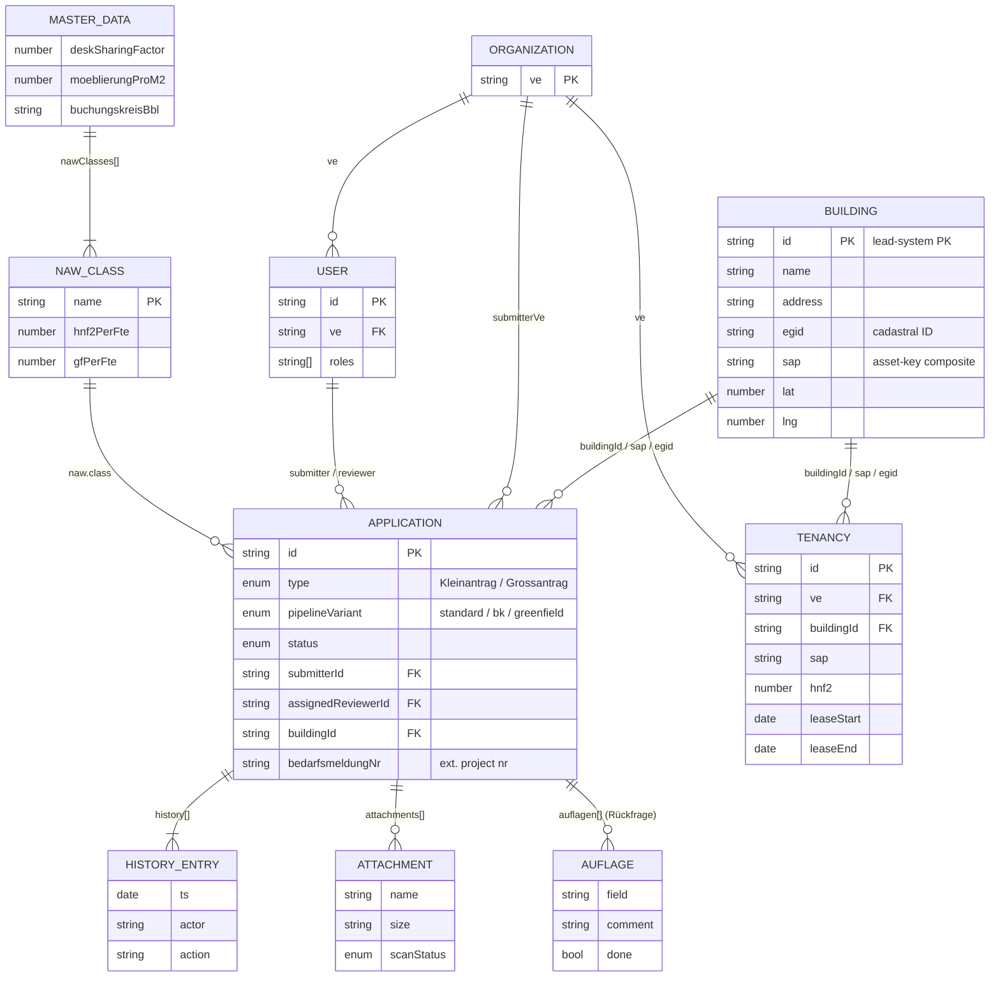
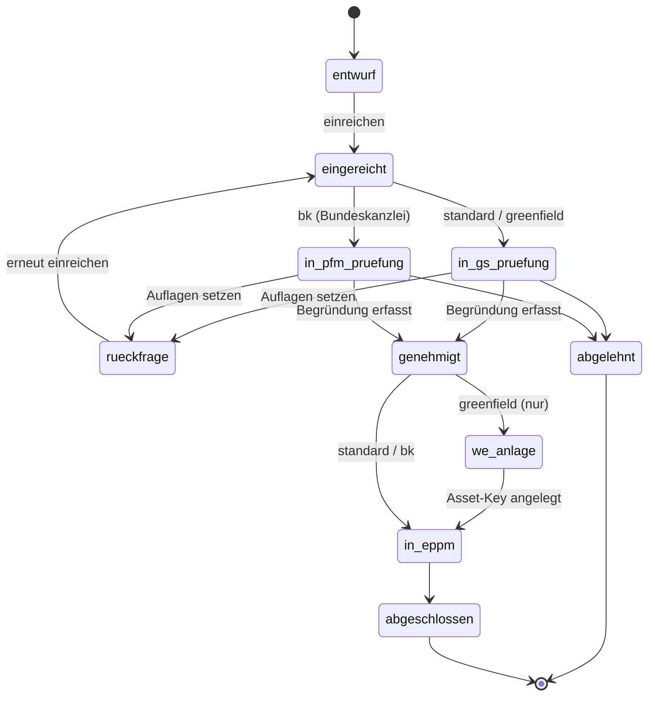

# DATAMODEL.md — BBL Mieterportal Data Model

Data model for the **BBL Mieterportal** prototype — the federal tenants'
self-service portal for filing demand applications (`Bedarfsmeldung`),
following their status through review by the Generalsekretariat (GS) and the
BBL Portfolio-Management (PFM), and managing the existing tenancies
(`Mietverhältnis`) of a Verwaltungseinheit (VE).

This document describes the data structures the portal uses **as a
consuming UX layer**, deliberately solution-neutral. Canonical
real-estate, lease, and identity records are resolved by the
**lead system(s)** — see § 1.1. The portal aligns its entities with
established international standards so that integrations remain portable.

---

## 1. Overview

### 1.1 Lead system vs. portal scope

The Mieterportal is **not a master (lead) system** for property,
tenancy, or organisational data. It is a workflow + presentation layer.
Each domain has a separate authoritative source:

| Domain                | Lead system role                                 | Portal role |
| --------------------- | ------------------------------------------------ | ----------- |
| Real-estate inventory | Authoritative asset registry (Building, Parcel) | **Reader.** Resolves a building by identifier, caches a minimum subset for display + map. |
| Lease / Tenancy       | Authoritative lease ledger                       | **Reader + originator of demand.** Displays current tenancies; the portal originates *requests* for new tenancies but the resulting lease is recorded in the lead system. |
| Identity & roles      | Authoritative IdP / directory                    | **Reader.** Receives identity + group memberships; maps groups to portal roles. |
| Cadastral identifiers | National cadastral registry                      | **Reader.** Echoes EGID/EGRID-style identifiers from the lead system. |
| Demand workflow       | —                                                | **Owner.** The Application entity (status pipeline, reviews, auflagen, history) is the portal's own concern. |

A Swiss federal deployment of this portal would resolve the lead-system
roles to (illustrative, not contractual) SAP RE-FX, eIAM/AGOV, SAP ePPM,
and the federal building and property registers — but the data model
below is written without those names.

### 1.2 Standards alignment

The portal's entities map to widely-used industry standards. Where a
standard prescribes a vocabulary or measurement basis, the portal adopts
it rather than inventing a parallel one.

| Standard                                                                                              | Where it applies                                                                |
| ----------------------------------------------------------------------------------------------------- | ------------------------------------------------------------------------------- |
| **ISO 16739** — Industry Foundation Classes (IFC, *buildingSMART*)                                    | Building reference (`IfcBuilding`); audit-log shape echoes `IfcOwnerHistory`.   |
| **IBPDI** — International Building Performance & Data Initiative                                      | Tenancy ≈ IBPDI *Lease* + *Unit*; Organization ≈ IBPDI *Occupier*; financial fields (`yearlyCost`) follow IBPDI's currency/period conventions. |
| **RICS IPMS** — International Property Measurement Standards (RICS, OSCRE)                            | Area fields cross-reference IPMS 1 / IPMS 2 / IPMS 3 in § 6.2.                  |
| **SIA 416** — Areas and volumes in building construction (Swiss)                                      | Canonical area vocabulary used in the wizard (`HNF`, `HNF2`, `GF`, `NGF`).      |
| **GEFMA 198** — Flächendefinitionen im Facility Management (German FM)                                | Cross-walk to SIA 416 (see § 6.2); helps when integrating non-Swiss data.       |
| **GEFMA 100 / 920** — FM service catalogue + service-request taxonomy                                 | Reference for future Service / Ticket entities (§ 10).                         |
| **ISO 15489 / eCH-0002** — Records Management                                                         | Governs Attachment lifecycle, retention, classification (see § 2.4 and § 10 *DocumentVersion*). eCH-0002 is the Swiss federal records-management standard; ISO 15489 is the international peer. |
| **eCH-0107 / eCH-0058** — Federated identity & access management (Swiss federal)                      | User identity, role/group memberships, federation tokens. Combined with **SAP MDG** when an SAP-MDG-backed deployment manages user/organisation master data. |
| **eCH-0046** — Swiss federal data standard for organisations and addresses                            | Address + organisation field shapes.                                            |
| **ISO 8601**                                                                                          | All timestamps and dates.                                                       |
| **ISO 3166** — Country codes                                                                          | If a multi-country deployment ships.                                            |
| **WCAG 2.2 AA / eCH-0059**                                                                            | Not a data standard, but constrains content (alt text, label patterns).         |
| **BPMN 2.0** (OMG / ISO 19510)                                                                        | Optional notation for externalising the demand-application workflow (§ 2.2). Today the pipeline is hard-coded; a future iteration could load it from a BPMN file. |
| **VwVG** (CH) — Verwaltungsverfahrensgesetz                                                           | Drives the audit-log shape (`history[]`) and the reviewer-justification field (`reviewerBegruendung`) — every decision requires a written reason. |

The portal does **not** depend on a single vendor's data model. The
identifier and field choices in § 2 – § 8 below are intentionally generic.

### 1.3 Design principles

| Principle              | Implementation                                                       |
| ---------------------- | -------------------------------------------------------------------- |
| **Solution-neutral**   | No vendor-specific identifiers or field names appear in entity definitions; lead-system mappings live in § 9. |
| **EN-only schema**     | All field names, enum values, and entity names are English. DE terms appear in entity tables as supplementary documentation (right-most column), never in the JSON. See § 1.4. |
| **Workflow-first**     | Every record with a lifecycle carries a `status` and an append-only `history[]` of state transitions. |
| **Role-routed**        | A user holds 1..n roles; the active role determines which views and actions are available. Submitter ≠ Reviewer ≠ Portfolio-Manager. |
| **Standards-anchored** | Area, lease, identity, and records fields map to ISO 16739 / IBPDI / IPMS / SIA 416 / eCH-* vocabulary so external integrations are unambiguous. |
| **Federal vocabulary on UI only** | The *display* uses BBL domain terms (Bedarfsmeldung, NAW, HNF2, GF, LBO). The *schema* stays English. |
| **Mock data only**     | All JSON files under `data/` are illustrative — no production data is shipped. |

### 1.4 Naming convention (EN canonical, DE supplementary)

The schema vocabulary in § 2 – § 8 is **the target**: English field names,
English enum values, English entity names. Where a German term carries
meaning the English alternative would lose (typically Swiss federal
acronyms or BBL-specific business terms), the DE term is listed as a
**display synonym**, not as a JSON field.

| Domain          | EN canonical (schema)         | DE supplementary (UI / documentation only) |
| --------------- | ----------------------------- | ------------------------------------------ |
| Entity          | `Application`                 | Bedarfsmeldung                             |
| Entity          | `Tenancy`                     | Mietverhältnis                             |
| Entity          | `Building`                    | Gebäude / Liegenschaft                     |
| Entity          | `Organization`                | Verwaltungseinheit (VE)                    |
| Entity          | `NewsArticle`                 | Aktualität                                 |
| Field           | `submitter` / `reviewer`      | Antragsteller / Prüfer-in                  |
| Field           | `condition` (on Application)  | Auflage                                    |
| Field           | `reviewerJustification`       | Reviewer-Begründung                        |
| Field           | `workstations`                | Arbeitsplätze                              |
| Field           | `furnitureBudget`             | Möblierung                                 |
| Field           | `operatingCosts`              | Unterhaltskosten (UK-Kosten)               |
| Field           | `companyCode`                 | Buchungskreis (BK)                         |
| Field           | `assetKey`                    | Wirtschaftseinheit (WE) / SAP-Schlüssel    |
| Status enum     | `draft / submitted / inReview / approved / rejected / inProject / closed` | Entwurf / Eingereicht / in Prüfung / Genehmigt / Abgelehnt / in ePPM / Abgeschlossen |
| Pipeline enum   | `standard / bypass / greenfield` | Standard / BK-Bypass / Greenfield       |

**Prototype reality.** Today's `data/*.json` files still contain DE field
names from the original German-first draft (`bedarfsmeldungNr`,
`auflagen`, `arbeitsplaetze`, `moeblierung`, `ukKosten`, `buchungskreisBbl`,
status values like `eingereicht`, `in_gs_pruefung`, `rueckfrage` etc.).
The principle above is the **target schema**; the live JSON should be
renamed in a follow-up refactor pass. New fields added from now on must
use the EN canonical form.

### 1.5 Entity overview

| Entity            | Description                                                                                                                          | DE term                  | File                                                  |
| ----------------- | ------------------------------------------------------------------------------------------------------------------------------------ | ------------------------ | ----------------------------------------------------- |
| **Application**   | A demand request raised by a Verwaltungseinheit for floor space, a new lease, an SEM reception centre, or another federal real-estate need. Carries the full review pipeline + audit trail (status, history, attachments, conditions). | Bedarfsmeldung           | [`data/applications.json`](../data/applications.json) |
| **Tenancy**       | An *existing* lease relationship between a Verwaltungseinheit and a Building. Aggregates lease terms (start/end/cost), the rented unit (HNF2/GF/floor) and the occupier (VE/department) into a read-optimised record. | Mietverhältnis           | [`data/tenancies.json`](../data/tenancies.json)       |
| **Building**      | Read-only reference to a physical property — name, address, asset key, cadastral identifier, coordinates. The canonical record lives in the lead asset registry (§ 1.1); this is the portal's local cache. | Gebäude / Liegenschaft   | [`data/buildings.json`](../data/buildings.json)       |
| **User**          | Authenticated person who can submit applications, review them, or access portfolio data. Carries 1..n roles supplied by the federated identity provider. | Benutzer                 | [`data/users.json`](../data/users.json)               |
| **Organization**  | Federal admin unit (Departement, Bundesamt, Stabsstelle). Today a denormalised string field (`ve`) on User/Application/Tenancy; a full Organization entity is sketched as a future refactor (IBPDI Occupier / eCH-0046). | Verwaltungseinheit (VE)  | (embedded in user/app)                                |
| **MasterData**    | A single document of slowly-changing reference data the portal needs to make calculations and validate input. Holds the NAW classification table, federal coefficients (desk-sharing factor, furniture budget per m², operating-cost thresholds, SEM lump-sum per bed), the closed list of PFM portfolio categories, and the BBL company code. Read-only at runtime; managed by the BBL portfolio team out-of-band. | Stammdaten               | [`data/master-data.json`](../data/master-data.json)   |
| **NewsArticle**   | Operational communication shown on the home page and `#/news` route (maintenance notices, training sessions, federal-level announcements). Hand-curated; no CMS in the prototype. | Aktualität / News        | [`data/news.json`](../data/news.json)                 |
| **Attachment**    | File attached to an Application during submission (e.g. WiBe.pdf, Rechtsgrundlage.pdf). Includes a virus-scan status flag. Production deployments would link out to a proper records-management system rather than embedding the file (see § 2.4 records-management note). | Anhang                   | embedded in Application                               |
| **Condition** *(Auflage)* | A reviewer-set compliance instruction during the Rückfrage state — e.g. "FTE assumption needs to match HR records" or "submit climate certificate as additional attachment". The submitter ticks each off before resubmitting. | Auflage                  | embedded in Application                               |
| **HistoryEntry**  | Single immutable record of a state transition on an Application: timestamp, actor (or `System`), and a free-text action description. The audit trail required by VwVG Art. 35. | Historieneintrag         | embedded in Application                               |

### 1.6 Domain relationships



---

## 2. Application (Bedarfsmeldung)

**File:** [`data/applications.json`](../data/applications.json)

The flagship entity. A request from a Verwaltungseinheit (VE) for floor
space, a new lease, an SEM reception centre, or another federal real-estate
need. Lives through a pipeline of status transitions until it is either
handed off to the project-management system or rejected. **The Application
is the only domain in the model that the portal owns end-to-end** — it has
no IFC / IBPDI counterpart because the demand workflow is portal-specific.

**Standards landscape.** There is no single international standard that
governs federal tenant demand workflows. The closest references are:

- **VwVG / VRP** for the procedural side (right to be heard, written
  justification, audit trail).
- **BPMN 2.0** (OMG, ISO 19510) as a *notation* if the workflow ever
  needs to be externalised, made configurable, or shared with non-portal
  systems. The status pipeline in § 2.2 is BPMN-shaped already; it can
  be rendered as a BPMN diagram without changing the model.
- **GEFMA 920-3** for the equivalent in FM service requests — relevant
  for the future Ticket entity (§ 10), not for Application.

### 2.1 Fields

| Field                  | Type     | Required | Description                                                                                |
| ---------------------- | -------- | -------- | ------------------------------------------------------------------------------------------ |
| `id`                   | string   | ✓        | Display ID, e.g. `BE-2026-014` — `{VE}-{year}-{seq}` |
| `type`                 | enum     | ✓        | `Kleinantrag` or `Grossantrag`. Drives the wizard scope. |
| `pipelineVariant`      | enum     | ✓        | `standard` / `bk` / `greenfield`. Determines status pipeline. |
| `status`               | enum     | ✓        | See **§ 2.2 Status pipeline** for valid values per variant. |
| `submitterId`          | string   | ✓        | FK → User (the LBO who filed the application). |
| `submitterVe`          | string   | ✓        | VE abbreviation, denormalised from submitter for fast filter (e.g. `UVEK`, `BK`, `SEM`). |
| `submitterDep`         | string   |          | Department within the VE (e.g. `BAFU` inside UVEK). |
| `buildingId`           | string   |          | FK → Building. Absent on `greenfield` until WE-Anlage. |
| `address`              | string   | ✓        | Free-text address shown to user; canonical address resolves via Building. |
| `sap`                  | object   |          | `{ bk, we, obj }` — asset-key composite resolved by the lead system. Absent for `greenfield`. |
| `egid`                 | string   |          | Cadastral building identifier echo. |
| `submittedAt`          | ISO 8601 | ✓        | Timestamp of `Eingereicht` transition. |
| `assignedReviewerId`   | string   |          | FK → User. Set once a GS-Prüfer/in or BBL-PFM takes the case. |
| `bedarfsmeldungNr`     | string   |          | External project number returned after approval. Populated when status reaches `in_eppm`. |
| `naw`                  | object   |          | NAW classification result; absent for Grossantrag (SEM/EDA use different rubrics). See **§ 2.3**. |
| `fte`                  | number   |          | FTE count claimed by submitter. |
| `arbeitsplaetze`       | number   |          | Workstations derived from `fte × deskSharingFactor` (rounded up). |
| `hnf2`                 | number   |          | Hauptnutzfläche-2 in m² (SIA 416), computed from NAW class × FTE × desk-sharing. |
| `gf`                   | number   |          | Geschossfläche in m² (SIA 416), computed analogously. |
| `ukKosten`             | number   |          | Estimated annual operating costs (Unterhaltskosten) in CHF. |
| `moeblierung`          | number   |          | Estimated furniture budget in CHF (`hnf2 × moeblierungProM2`). |
| `berths`               | number   |          | (SEM only) total bed places. With `berthsFamily`, `berthsSingle`, `berthsShared` subtotals. |
| `betreuungsFte`        | number   |          | (SEM only) supervision staff FTE. |
| `sicherheitsFte`       | number   |          | (SEM only) security staff FTE. |
| `verfahrensraeume`     | number   |          | (SEM only) number of asylum-process interview rooms. |
| `investitionspauschale`| number   |          | (SEM only) lump-sum investment per berth × berths. |
| `attachments`          | Attachment[] |       | See **§ 2.4**. |
| `auflagen`             | Auflage[]    |       | Present after a `rueckfrage` cycle. See **§ 2.5**. |
| `reviewerBegruendung`  | string   |          | Reviewer's free-text justification (required for `genehmigt`/`abgelehnt`; VwVG Art. 35). |
| `history`              | HistoryEntry[] | ✓    | Append-only audit log of state transitions. See **§ 2.6**. |

### 2.2 Status pipeline

Three pipeline variants are modelled; the pipeline is rendered visually as a
status chevron sequence on each application detail view.

| Variant       | Trigger                                          | Steps |
| ------------- | ------------------------------------------------ | ----- |
| `standard`    | Default — most applications                       | `entwurf → eingereicht → in_gs_pruefung → genehmigt → in_eppm → abgeschlossen` |
| `bk`          | Submitter VE is the Bundeskanzlei                 | `entwurf → eingereicht → in_pfm_pruefung → genehmigt → in_eppm → abgeschlossen` (skips GS) |
| `greenfield`  | No asset key exists for the target address        | `entwurf → eingereicht → in_gs_pruefung → genehmigt → we_anlage → in_eppm → abgeschlossen` |

Plus two off-pipeline terminal states reachable from `in_gs_pruefung` or
`in_pfm_pruefung`:

- `rueckfrage` — Reviewer has set Auflagen; case bounces back to submitter.
- `abgelehnt`  — Reviewer rejected the application with `reviewerBegruendung`.

Resubmission after a `rueckfrage` returns the same application (same `id`)
to `eingereicht`; it does not create a new application (preserves history).



### 2.3 Embedded `naw` object

```jsonc
{
  "class": "Kollaborativ-Standard",   // FK → master-data.json:nawClasses[].name
  "confidence": 0.84,                  // 0..1 confidence of derived class
  "answers": {                         // Inputs from the NAW questionnaire
    "focus": "Kollaborativ" | "Konzentriert",
    "remoteShare": 0..100,             // % working remote
    "confidentiality": "niedrig" | "mittel" | "hoch",
    "publicContact": "keiner" | "gelegentlich" | "regelmaessig",
    "specials": ["Labor" | "Sicherheitsbereich" | ...]
  }
}
```

### 2.4 Embedded `Attachment`

| Field        | Type   | Description                                       |
| ------------ | ------ | ------------------------------------------------- |
| `name`       | string | File name (e.g. `WiBe.pdf`)                       |
| `size`       | string | Human-readable size (e.g. `1.2 MB`)               |
| `scanStatus` | enum   | `scanning` / `ok` / `infected`                    |

**Records-management note.** This embedded form is intentionally minimal —
a federal records-management deployment would attach each file to a
records management system aligned with **eCH-0002** (CH) and **ISO 15489**
(international), which covers classification, retention period, lifecycle
events, and disposition. The portal would then hold a *reference* (record
ID + classification metadata) rather than the file itself. The richer
shape is sketched as **DocumentVersion** in § 10.

### 2.5 Embedded `Condition` (Auflage)

| Field     | Type    | Description                                                            |
| --------- | ------- | ---------------------------------------------------------------------- |
| `field`   | string  | Name of the form field the Auflage refers to (e.g. `fte`, `attachments`) |
| `comment` | string  | Reviewer's instruction in prose                                        |
| `done`    | boolean | Submitter has marked this Auflage as fulfilled                         |

### 2.6 Embedded `HistoryEntry`

| Field    | Type    | Description                                                       |
| -------- | ------- | ----------------------------------------------------------------- |
| `ts`     | ISO 8601 | Transition timestamp                                              |
| `actor`  | string  | Display name of the user, or `System` for automated transitions   |
| `action` | string  | Free-text description (e.g. `Eingereicht`, `Auflage gesetzt: FTE-Annahme prüfen`) |

**Standards note.** The shape mirrors ISO 16739 `IfcOwnerHistory`, where
every IFC root entity carries who/when/what about its last change. We do
the same per Application rather than per attribute (coarser granularity is
adequate for the workflow).

---

## 3. Tenancy (Mietverhältnis)

**File:** [`data/tenancies.json`](../data/tenancies.json)

The lease relationship between a VE and a Building. One Building can carry
several Tenancies (different VEs, floors, lease terms); one VE typically
holds many Tenancies across the portfolio.

**Standards mapping:** A Tenancy aggregates IBPDI *Lease* (`leaseStart`,
`leaseEnd`, `leaseAuto`, `yearlyCost`), IBPDI *Unit* (the rented part of a
building: `hnf2`, `gf`, `floor`, `arbeitsplaetze`), and IBPDI *Occupier*
(the VE) into a single read-optimised record. Areas follow SIA 416 (see
§ 6.2 for IPMS / GEFMA 198 cross-walk).

### 3.1 Fields

| Field             | Type        | Required | Description                                                |
| ----------------- | ----------- | -------- | ---------------------------------------------------------- |
| `id`              | string      | ✓        | Prototype-only ID, e.g. `T-2010-AA-01`                     |
| `ve`              | string      | ✓        | Primary occupying VE (e.g. `UVEK`)                         |
| `dep`             | string      |          | Department within the VE (e.g. `BAFU` inside UVEK)         |
| `buildingId`      | string      | ✓        | FK → Building                                              |
| `sap`             | string      | ✓        | Lead-system asset key, e.g. `1086/2011/AA`                 |
| `egid`            | string      |          | Cadastral building identifier echo                          |
| `address`         | string      | ✓        | Free-text address                                          |
| `buildingName`    | string      | ✓        | Display name (echo of Building name)                       |
| `pfmKategorie`    | string      | ✓        | PFM portfolio category — see master-data `pfmKategorien`   |
| `floor`           | string      |          | German floor label (e.g. `3. OG`, `EG + 1. OG`, `Gesamtkomplex`) |
| `hnf2`            | number      | ✓        | Hauptnutzfläche-2 in m² (rented) — SIA 416 / ≈ IPMS 3       |
| `gf`              | number      |          | Geschossfläche in m² (rented) — SIA 416 / ≈ IPMS 1         |
| `arbeitsplaetze`  | number      |          | Number of workstations supported                            |
| `lat`             | number      |          | WGS84 latitude — used by the Karte view on `#/properties`  |
| `lng`             | number      |          | WGS84 longitude                                             |
| `leaseStart`      | ISO date    | ✓        | Lease start                                                 |
| `leaseEnd`        | ISO date    | ✓        | Lease end                                                   |
| `leaseAuto`       | boolean     |          | Auto-renewing (true) or fixed-term (false)                  |
| `yearlyCost`      | number      |          | Annual rent in CHF                                          |
| `contacts`        | object      |          | `{ bblPfm, bblIm, bblFlm }` — names of the three BBL roles |
| `openIssues`      | number      |          | Count of open Anliegen / open Auflagen / pending requests   |
| `image`           | string      |          | Photo URL for the gallery / hero                            |

### 3.2 PFM category enum (`pfmKategorie`)

Maintained in `master-data.json::pfmKategorien`. Current values:

- `Verwaltung Klasse I (Repräsentativ)` — Bundeshäuser, Departementssitze
- `Verwaltung Klasse II (Standard)` — Normale Bürogebäude
- `Verwaltung Klasse III (Funktional)` — Funktionale Bürogebäude
- `Empfangszentrum SEM` — Asylzentren (special objects)
- `Vertretung EDA` — Reserved for future use

---

## 4. User (Benutzer)

**File:** [`data/users.json`](../data/users.json)

**Standards mapping:** Identity, authentication, and federated session
state are governed by **eCH-0107** (best-practice recommendations for
Swiss federal IAM) and **eCH-0058** (federation service requirements).
The portal is a **relying party**: it receives an authenticated identity +
group memberships and maps the groups to its internal Role enum. When a
deployment uses **SAP Master Data Governance (MDG)** as the master-data
backbone for users and organisations, MDG remains authoritative; the
portal continues to read via the federation layer.

| Field    | Type     | Required | Description                                          | Standards anchor |
| -------- | -------- | -------- | ---------------------------------------------------- | ---------------- |
| `id`     | string   | ✓        | User ID (e.g. `U.123.456`); subject identifier from the IdP token | eCH-0107 / eCH-0058 federated subject |
| `name`   | string   | ✓        | Full display name                                    | eCH-0011 / eCH-0044 personal data |
| `email`  | string   | ✓        | `@*.admin.ch`                                         | RFC 5322          |
| `ve`     | string   | ✓        | Home VE                                              | eCH-0046 (organisation) |
| `dep`    | string   |          | Department within the VE                             | eCH-0046 (organisation) |
| `roles`  | Role[]   | ✓        | Permitted roles; user picks an active role at session start | eCH-0107 group → role mapping |

### 4.1 Role enum

| Role              | Scope                                                                             |
| ----------------- | --------------------------------------------------------------------------------- |
| `LBO`             | Logistikbeauftragte/r — files Applications for the VE                            |
| `GS-Prüfer/in`    | Generalsekretariat reviewer — approves/rejects/sends-back for the VE             |
| `BBL-PFM`         | BBL Portfolio-Management — reviews BK-bypass cases, oversees handover            |
| `BBL-Campus`      | BBL Campus team — read-only insight, future scope                                 |
| `Auditor`         | EFV (Finanzverwaltung) — read-only audit access                                   |

The active role is persisted per-user in `localStorage` under
`mp-active-role-{userId}`.

> The mock data uses `ILBO` (an older BBL spelling). The UI says `LBO`.
> Both refer to the same role; a future cleanup should consolidate.

---

## 5. Organization (Verwaltungseinheit, VE)

Not stored as a top-level record. Today, VE is a denormalised string field
on User, Application, and Tenancy. The closed set used in mock data is:

- **Departments / Stabsstellen:** `BK` (Bundeskanzlei), `UVEK`, `WBF`, `EDI`,
  `EJPD`, `VBS`, `EFD`, `EDA`
- **Bundesämter / Sekretariate:** `BAFU` (in UVEK), `SEM` (in EJPD)
- **Bundesverwaltung-level:** `BBL`, `EFV`

In a production model, this becomes a proper Organization entity with a
hierarchy (Departement → Generalsekretariat → Bundesamt → Sektion),
aligning with IBPDI *Occupier* and eCH-0046 *organisation*. For the
prototype, the flat string is sufficient.

---

## 6. MasterData (Stammdaten)

**File:** [`data/master-data.json`](../data/master-data.json)

Portfolio-wide constants and the NAW classification table.

| Field                             | Type            | Description                                       |
| --------------------------------- | --------------- | ------------------------------------------------- |
| `nawClasses`                      | NawClass[]      | See **§ 6.1**                                     |
| `deskSharingFactor`               | number          | Federal-mandated coefficient, currently `0.8`     |
| `moeblierungProM2`                | number          | Furniture budget per m² HNF2 in CHF (`650`)        |
| `ukKostenObergrenzeProM2Gf`       | number          | Soft-block threshold for operating costs (CHF/m² GF) |
| `ukKostenHardBlockMultiplier`     | number          | Multiplier above which the wizard hard-blocks submission |
| `semProBettenplatz`               | number          | SEM-specific lump-sum per bed place (CHF)          |
| `buchungskreisBbl`                | string          | BBL Buchungskreis = `1086`. Used for BK-detect logic. |
| `pfmKategorien`                   | string[]        | Closed list — see **§ 3.2**                        |

### 6.1 NawClass

| Field           | Type    | Description                                                   |
| --------------- | ------- | ------------------------------------------------------------- |
| `name`          | string  | DE label (PK in this table; referenced from `application.naw.class`) |
| `hnf2PerFte`    | number  | m² HNF2 per FTE for this NAW class                            |
| `gfPerFte`      | number  | m² GF per FTE                                                 |
| `description`   | string  | Short label for UI surfaces                                   |

Calculation: `hnf2 = round(hnf2PerFte × fte × deskSharingFactor)` and
analogously for `gf`. Drives both the wizard preview and the reviewer
checks.

### 6.2 Area definitions — standards cross-walk

The portal uses SIA 416 vocabulary in its UI. The table below maps SIA to
the equivalent international concepts so an external integration can
unambiguously consume the values:

| SIA 416 (Swiss) | GEFMA 198 (DE) | RICS IPMS                | IFC (ISO 16739)      | Description |
| --------------- | -------------- | ------------------------ | -------------------- | ----------- |
| **GF**          | BGF            | ≈ IPMS 1                 | GrossFloorArea       | Gross floor area (including external walls) |
| **NGF**         | NGF            | ≈ IPMS 2                 | NetFloorArea         | Net floor area (internal dominant face) |
| **NF**          | NF             | (subset of IPMS 3)       | UsableArea           | Usable area (NF = HNF + NNF) |
| **HNF / HNF2** | HNF            | ≈ IPMS 3                 | InternalDominantFace + occupier-specific | Primary usable area for the intended function |
| **NNF**         | NNF            | —                        | —                    | Secondary usable area (storage, archive, …) |
| **VF**          | VF             | —                        | CirculationArea      | Circulation area (corridors, stairs) |
| **FF**          | FF             | —                        | TechnicalArea        | Functional area (server rooms, plant rooms) |

(The `~` symbols denote *approximate* alignment; the standards differ in
how external walls and balconies are counted.)

---

## 7. NewsArticle

**File:** [`data/news.json`](../data/news.json)

Internal communications shown on the home page and `#/news` route.

| Field         | Type     | Description                                                  |
| ------------- | -------- | ------------------------------------------------------------ |
| `id`          | string   | Slug                                                         |
| `type`        | enum     | `Pflege` / `Ausfall` / `Termin` / `Information` / `Schulung` |
| `date`        | ISO date | Publication date                                              |
| `title`       | string   | Headline                                                      |
| `lead`        | string   | One-paragraph lead                                            |
| `source`      | string   | Issuing unit (e.g. `BBL PFM`, `BIT`, `EFD`)                  |
| `responsible` | string   | Responsible person                                            |
| `image`       | string   | Hero photo URL                                                |

---

## 8. Building (reference entity)

**File:** [`data/buildings.json`](../data/buildings.json)

A **read-only reference** to a physical property. The portal does **not**
own the canonical building record — see § 1.1. The fields here are the
minimum needed for the portal's views (map markers, breadcrumbs, search
results, property gallery).

**Standards mapping:** Corresponds to ISO 16739 `IfcBuilding` and IBPDI
*Building*. Coordinates use WGS84 (lat/lng) for the worldwide map view;
when a Swiss-only deployment needs higher local precision, an integration
can also resolve LV95 from the lead system.

**Full asset-management hierarchy (informational).** The canonical
ISO 16739 / IBPDI / real-estate-lead-system structure for built assets is
five levels deep:

| Level     | ISO 16739       | IBPDI               | German term      | Modelled here?   |
| --------- | --------------- | ------------------- | ---------------- | ---------------- |
| Site      | `IfcSite`       | Site                | Standort / Areal | No — resolved by lead system on demand |
| Parcel    | (no IFC class)  | (Land record)       | Parzelle / Grundstück | No — resolved by lead system on demand |
| **Building** | **`IfcBuilding`** | **Building**    | **Gebäude / Liegenschaft** | **Yes (this section)** |
| Storey    | `IfcBuildingStorey` | Floor / Level   | Geschoss         | No — out of portal scope |
| Space     | `IfcSpace`      | Unit / Room         | Raum             | No — out of portal scope |

The portal's use cases (demand applications, lease search, location map)
only require Building-level identity. If a future workflow needs storey-
or room-level data, those entities should be **read from the lead system
on demand**, not re-modelled here. (The model intentionally avoids
duplicating Site / Parcel / Storey / Space.)

### 8.1 Fields

| Field         | Type     | Required | Description                                       | Standards anchor |
| ------------- | -------- | -------- | ------------------------------------------------- | ---------------- |
| `name`        | string   | ✓        | Display name                                       | IFC `IfcBuilding.Name` |
| `address`     | string   | ✓        | Free-text address                                   | IBPDI Address    |
| `ve`          | string   |          | Primary VE associated with the building            | IBPDI Occupier   |
| `bk`          | string   |          | Asset-key part 1 — Buchungskreis (book-keeping unit) | (lead-system specific) |
| `we`          | string   |          | Asset-key part 2 — Wirtschaftseinheit (economic unit) | (lead-system specific) |
| `obj`         | string   |          | Asset-key part 3 — Object index                     | (lead-system specific) |
| `egid`        | string   |          | Cadastral building identifier (Swiss federal: EGID; analogue elsewhere) | National cadastre |
| `coords`      | [number, number] | ✓ | `[lng, lat]` in WGS84 (GeoJSON order)            | ISO 6709 / WGS84 |
| `pfmKategorie`| string   |          | Portfolio category — see § 3.2                      | (BBL-specific)   |
| `image`       | string   |          | Hero photo URL                                      | —                |

### 8.2 Source of truth

In a production deployment the canonical Building record is held by the
**lead asset registry** (§ 9.2). The portal caches a small subset locally
in [`data/buildings.json`](../data/buildings.json) for two reasons:

1. **Demo independence.** The prototype runs without any back-end.
2. **Cold-start performance.** The home + map views render before the
   first API round-trip would return.

If a portal-side cache and the lead system disagree, **the lead system
wins** — the portal must re-sync.

---

## 9. External system integrations

The portal communicates with external systems at well-defined seams. The
table below describes each seam by **role** (what kind of system) rather
than by product, so that a non-Swiss-federal deployment can substitute its
own implementation.

| Seam                          | What flows                                                                  | Direction        |
| ----------------------------- | --------------------------------------------------------------------------- | ---------------- |
| **Identity provider**         | User identity + group memberships → portal Roles                            | read (federation) |
| **Lead asset registry**       | Building / asset-key / cadastral identifier resolution                       | read (cached locally) |
| **Lead lease ledger**         | Current Tenancies                                                            | read; new tenancies are *requested* from the portal but recorded in the lead system after approval |
| **Project-management system** | Approved Application → external project record (returns `bedarfsmeldungNr`) | write            |
| **Cadastral registry**        | EGID / EGRID lookups                                                         | read             |
| **Document scanner**          | Attachment scan result → `scanStatus`                                        | read (push)      |
| **Ticketing system**          | Schaden / Reparatur / Umzug requests                                         | write            |
| **Communications channel**    | Notifications to submitters and reviewers (e-mail today, in-app inbox later) | write            |

(A Swiss federal deployment of this portal would map these seams to —
illustrative only — eIAM / AGOV for identity, SAP RE-FX for assets +
leases, SAP ePPM for project management, GWR + cadastre.ch for cadastral
lookups, and BIT-operated mail/ticketing infrastructure. None of these are
hard dependencies of the model.)

---

## 10. Extension potential

Not modelled today but plausible follow-ups, in priority order:

| Entity                   | Why it's missing today                                                                                            | Trigger to add                          | Standards anchor                                  |
| ------------------------ | ----------------------------------------------------------------------------------------------------------------- | --------------------------------------- | ------------------------------------------------- |
| **Anliegen / Ticket**    | Each Tenancy carries `openIssues` as a count only. Real tickets would link Building × Tenancy × Submitter with their own status pipeline. | First real ticketing-system integration | GEFMA 920-3 service-request taxonomy              |
| **Service** (Dienstleistung) | The home page lists services as static strings. A proper Service entity (id, scope, eligibility, SLA) would let the catalogue grow without code changes. | Catalogue grows past 6 services         | GEFMA 100 FM service catalogue                    |
| **Notification**         | Today the UI fakes "E-Mail an GS gesendet" via a history entry. A separate Notification entity would track delivery + read state. | When in-portal inbox replaces e-mail     | —                                                 |
| **Decision** (Entscheid) | Reviewer decisions currently live as `reviewerBegruendung` on the Application. A separate Decision entity would allow multi-step approvals. | Multi-stage approval requirement         | VwVG Art. 35 (Begründungspflicht)                 |
| **DocumentVersion**      | Attachments are flat strings. A real document store would track versions, signers, retention.                     | Signature-service integration            | ISO 14641 (electronic records); CH ZertES / eIDAS |
| **Lease detail**         | The Tenancy bundles lease metadata inline. A separate Lease entity would handle amendments, indexation, options, exit dates. | When contract editing leaves the lead lease ledger | IBPDI Lease / Lease Event                  |
| **AreaMeasurement**      | Areas are scalar numbers. A separate entity would carry measurement basis, accuracy, valid-from/until.            | Multi-standard reporting (IPMS + SIA)    | ISO 16739, RICS IPMS                              |

---

## 11. File summary

| File                                                | Records (mock) | Entities held                                                  |
| --------------------------------------------------- | -------------- | -------------------------------------------------------------- |
| [`data/applications.json`](../data/applications.json) | 5  | Application (with embedded Attachment / Auflage / HistoryEntry) |
| [`data/tenancies.json`](../data/tenancies.json)       | 3  | Tenancy                                                         |
| [`data/users.json`](../data/users.json)               | 5  | User                                                            |
| [`data/master-data.json`](../data/master-data.json)   | 1  | MasterData (single object)                                      |
| [`data/news.json`](../data/news.json)                 | 10 | NewsArticle                                                     |
| [`data/buildings.json`](../data/buildings.json)       | 4  | Building (read-only local reference; see § 8.2)                 |

---

## 12. References

### Standards — real estate

- **ISO 16739** — Industry Foundation Classes (IFC, *buildingSMART*) — <https://www.iso.org/standard/70303.html>
- **IBPDI** — International Building Performance & Data Initiative — <https://www.ibpdi.org/>
- **RICS IPMS** — International Property Measurement Standards — <https://ipmsc.org/>
- **SIA 416** — Areas and volumes in building construction — <https://www.sia.ch>
- **SIA 380/1** — Energy performance of buildings — <https://www.sia.ch>
- **GEFMA 198** — Flächendefinitionen im Facility Management — <https://www.gefma.de>
- **GEFMA 100** — FM service catalogue — <https://www.gefma.de>
- **GEFMA 920** — Service-request process — <https://www.gefma.de>

### Standards — records, identity, workflow

- **ISO 15489** — Records Management — <https://www.iso.org/standard/62542.html>
- **eCH-0002** — Schriftgut / Records Management (CH) — <https://www.ech.ch/de/ech/ech-0002/1.0>
- **eCH-0107** — Best-practice recommendations for IAM (CH) — <https://www.ech.ch>
- **eCH-0058** — Federation service requirements (CH) — <https://www.ech.ch>
- **eCH-0046** — Federal data standard for addresses and organisations (CH) — <https://www.ech.ch>
- **eCH-0011 / eCH-0044** — Personal data interchange (CH) — <https://www.ech.ch>
- **SAP Master Data Governance (MDG)** — vendor master-data framework often deployed alongside the above eCH standards in Swiss federal contexts
- **BPMN 2.0** (OMG, ISO 19510) — process modelling notation — <https://www.omg.org/spec/BPMN/>
- **ISO 14641** — Electronic records (long-term preservation) — <https://www.iso.org/standard/61504.html>
- **eCH-0014** — SuisseID / federal e-ID — <https://www.ech.ch>

### General

- **ISO 8601** — Date and time format — <https://www.iso.org/iso-8601-date-and-time-format.html>
- **ISO 3166** — Country codes — <https://www.iso.org/iso-3166-country-codes.html>
- **RFC 5322** — Internet message format (e-mail) — <https://www.rfc-editor.org/rfc/rfc5322>

### Swiss federal legal context

- **VwVG** (SR 172.021) — Verwaltungsverfahrensgesetz; drives the audit log and Begründungspflicht
- **VILB** (SR 172.010.21) — Verordnung über das Immobilienmanagement und die Logistik des Bundes — top-level legal context
- **WCAG 2.2 AA / eCH-0059** — accessibility constraints relevant to the UI surface

### Portal docs

- [REQUIREMENTS.md](REQUIREMENTS.md) — functional + non-functional requirements
- [DESIGNGUIDE.md](DESIGNGUIDE.md) — UI / CD-Bund alignment
