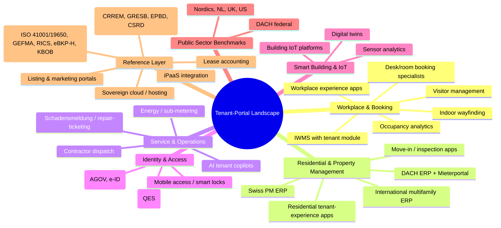
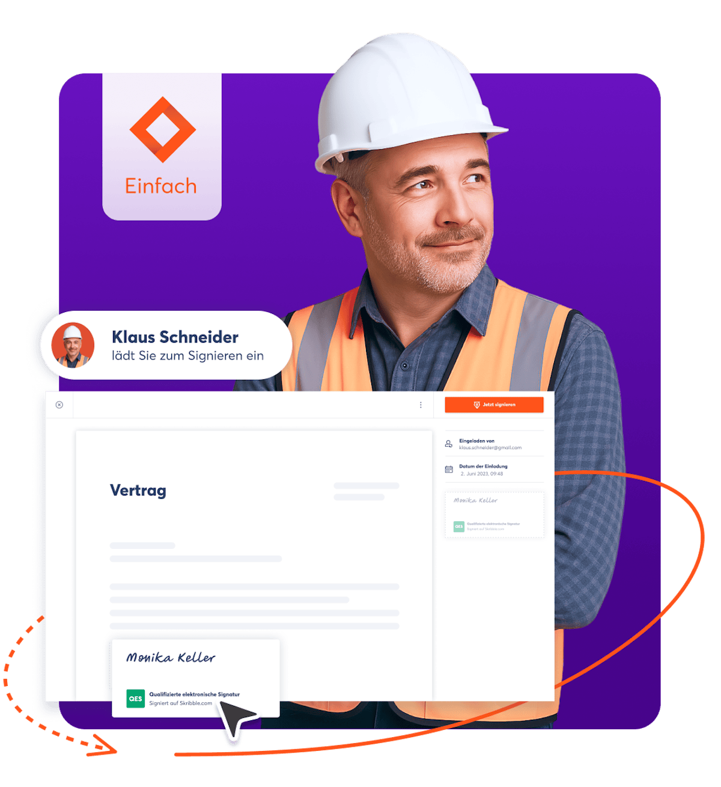
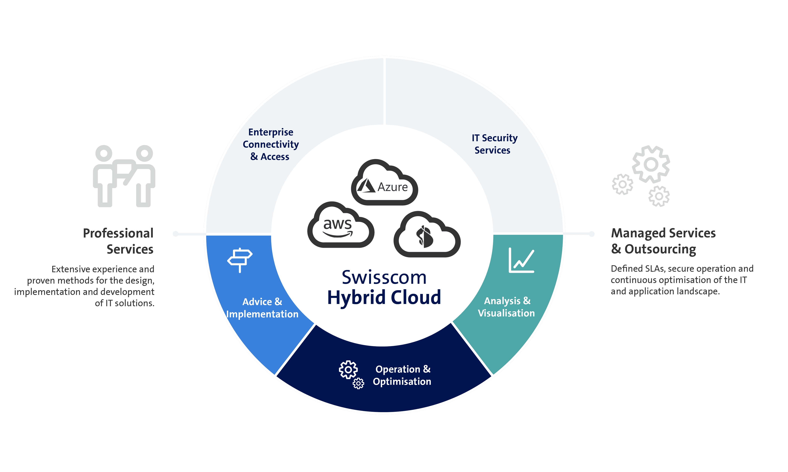
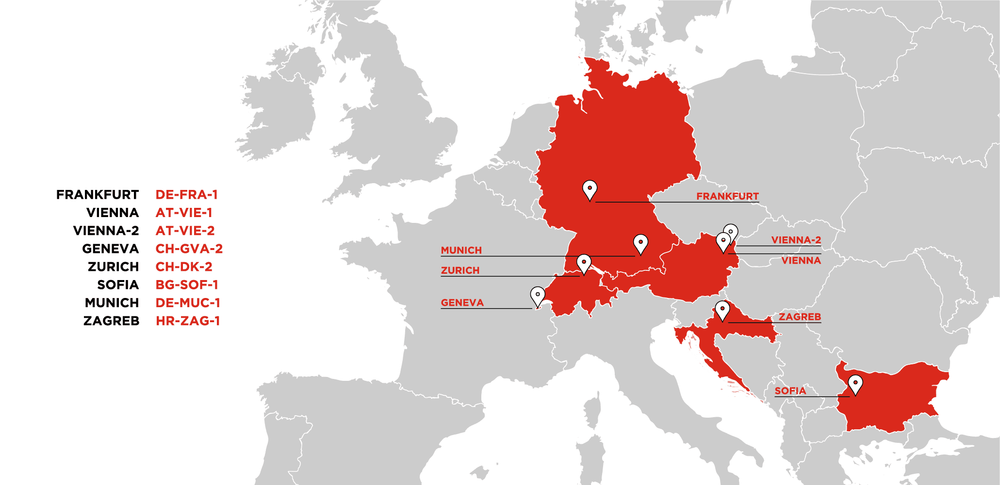
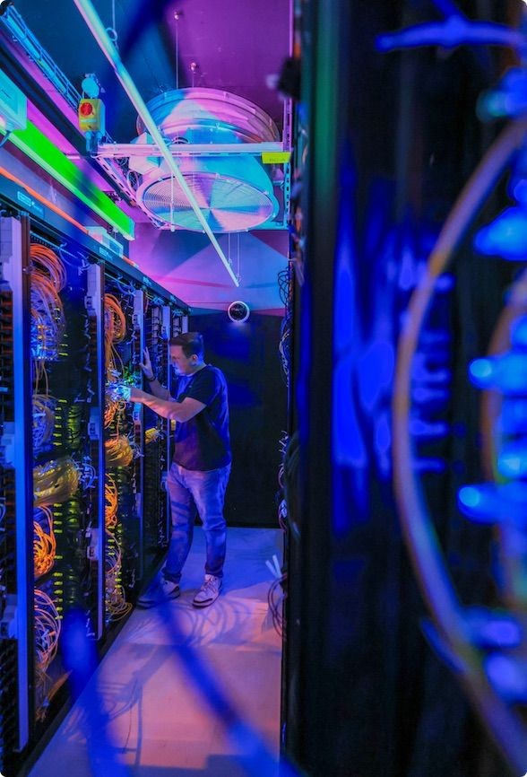

# Tenant-Portal / Mieterportal Market Screening — Descriptive Landscape Scan (BBL / DRES context)

## 1. Goal

A **descriptive market screening** of "tenant portal" / "Mieterportal" software for the Swiss Federal Office of Buildings and Logistics (BBL, Bereich Bauten / DRES), which operates SAP S/4HANA with RE-FX after the SUPERB cut-over of September 2023. The document maps the market, identifies segments, lists vendors per segment, and provides reference appendices anchored in Swiss federal regulation (EMBAG, DigiV, ISG, VILB, BöB), Swiss identity infrastructure (AGOV, planned federal e-ID launch 1 December 2026), and Swiss data-residency preferences. **It is not a procurement recommendation, does not propose a buy-vs-build or phasing approach, and endorses no vendor.**

## 2. Market Map

## 3. Segments at a Glance

| # | Segment | One-line description |
|---|---|---|
| A | IWMS with tenant module | Integrated workplace suites (Planon, Eptura, IBM TRIRIGA, MRI, Spacewell, Nuvolo, Tango, FM:Systems, Accruent, Manhattan, ServiceNow WSD). |
| B | Workplace experience apps (WEX) | Tenant-facing apps for landlords and corporate occupiers (HqO, Equiem, Spaceflow, Chainels, Robin, OfficeSpace, Appspace, Modo Labs, Zoom Workplace, CXAI). |
| C | Desk/room booking specialists | Pure-play scheduling (Robin, Skedda, OfficeRnD, deskbird, Tactic, Joan, Matrix Booking, Tribeloo, YArooms, Sharvy). |
| D | Visitor management & mobile access | Envoy, Eptura Visitor (ex-Proxyclick), SwipedOn, Kisi, Verkada Guest, HID Origo, Salto KS, Brivo, dormakaba exivo. |
| E | PM ERP with embedded tenant portal | Aareon Wodis Yuneo/RELion/Blue Eagle/Mareon, immoware24, Haufe axera, DOMUS, CREM iX-Haus, GARAIO REM+aroov, W&W ImmoTop2/Rimo R5, Abacus AbaImmo, Fairwalter, Immomig, Yardi Voyager+RentCafe, MRI, AppFolio, Buildium, RealPage, Entrata, Arthur Online, Momentum. |
| F | Residential tenant-experience platforms | casavi, facilioo, Allthings, wohnungshelden, Immomio, iDWELL, Spiri.Bo, etg24, EverReal, RentCafe Resident, Livly, Bilt Rewards. |
| G | Schadensmeldung / repair-ticketing | Fixflo, Plentific, Yarowa, Mareon, facilioo, PlanRadar, MaintainX, UpKeep, imofix.io. |
| H | Move-in / move-out / inspection | W&W Abnahme-App, GARAIO REM DAP, Properly, Inspectify, Allthings inspection, HouseView. |
| I | eSignature & federal identity | Skribble, SwissSign/SwissID, AGOV, planned e-ID, DocuSign, Adobe Sign, Yousign, Scrive. |
| J | Document vault / e-Akte | BImA Adakta, Acta Nova (Swiss federal GEVER), SharePoint, Aareon DMS, OpenText, ELO ECM. |
| K | AI tenant copilots | Aareon CRM-Portal KI, casavi smartflows, Allthings AI, Knock, RentDynamics, Famulor, ServiceNow Now Assist. |
| L | Smart-building IoT / digital twin | Spacewell Cobundu, Siemens Building X, Johnson Controls OpenBlue, Honeywell Forge, Cisco Spaces, Cohesion, View Smart, Disruptive Technologies, ThoughtWire, Comfy/Siemens. |
| M | Lease management & accounting | Visual Lease, LeaseAccelerator, CoStar REM, Nakisa, MRI ProLease, LucernEx. |
| N | Energy & sub-metering tenant transparency | Techem, ista, Brunata-Metrona, Minol, Aareon EnergieHub, Spacewell Energy (Dexma). |
| O | Listing & onboarding portals | homegate.ch, ImmoScout24.ch, flatfox.ch, ImmoScout24.de, Immowelt, Wunderflats. |
| P | Public-sector tenant systems | "Mein BImA", GSA OASIS, GPA UK, Senaatti Senate App, Rijksvastgoedbedrijf, BIG Austria, Statsbygg, armasuisse Immo-Portal VBS. |
| Q | SAP RE-FX integration patterns | Planon RE for SAP S/4HANA, Goldinmotion, Promos.GT, Aareon SAP Blue Eagle, casavi Aareon Connect, custom Fiori on BTP. |
| R | Sovereign / Swiss hosting | Swisscom Sovereign Cloud, Exoscale, Infomaniak, AWS eu-central-2 Zurich, Azure CH N/W, Google Cloud Zurich. |
| S | iPaaS / integration | SAP Integration Suite/BTP, MuleSoft, Workato, Boomi, Frends, Aareon Locoia. |
| T | Fintech adjacencies | Bilt Rewards, Rentmoola, Flatfair, GoCardless real-estate. |
| U | Indoor wayfinding | Steerpath, MapsIndoors, Pointr, MazeMap, IndoorAtlas, MappedIn. |
| V | Occupancy analytics | Locatee (Tango), VergeSense, Density, XY Sense, Butlr, Disruptive Technologies. |
| W | Construction PM & BIM CDE handoff | Pre-occupancy design/build/handover with BIM2FM exchange (Autodesk ACC, Bentley iTwin, Revizto, Solibri, BIMcollab, Procore, Trimble Connect, dRofus, PlanRadar, Buildots, Capmo). |
| X | Lease abstraction / AI document extraction | SAP RE-FX migration & lease ingestion (Leverton, Prophia, contract.fit, Hyperscience, Rossum, LeaseHawk, docunite). |
| Y | CAFM (DACH-specific, distinct from IWMS) | German-language facility management with GEFMA 444 heritage (pit-FM, waveware, ConjectFM, FAMOS, KEYLOGIC, Speedikon FM, GEORG). |
| Z | ESG portfolio-data platforms | Portfolio-level VILB / EPBD / CSRD / GRESB reporting beyond submetering (Deepki, Measurabl, Optera, Carbonsight, ENGIE Impact, Spacewell Energy, Sustain.life, Schneider Resource Advisor, Sweep). |
| AA | OSS / civic-tech alternatives | EMBAG-Art.-9-aligned open-source options (Odoo, ERPNext, Tryton, Keycloak, Zammad, Mattermost, GeoNode, BIMserver, Hugging Face document-AI, civic-tech.ch). |

## 4. Summary

- **Heavy consolidation, bifurcated market.** The workplace-side (Eptura, Spacewell, Planon, Nuvolo, MRI, Tango, ServiceNow WSD) converges on AI-enabled "WEX + IWMS" suites: Gartner published its first-ever Magic Quadrant for Workplace Experience Applications on 6 April 2026 (analysts Sohail Majumdar and Christopher Trueman), evaluating Accruent, Appspace, CXAI, Envoy, Eptura, Microsoft, Modo Labs, OfficeSpace Software, Robin Powered, ServiceNow, Tango and Zoom; Eptura, Robin and Appspace publicly claimed Leader positions. Verdantix's January 2025 Green Quadrant for Connected Portfolio Intelligence Platforms (CPIP) / IWMS named Planon (highest performer), IBM, Eptura, MRI, Tango, Johnson Controls, Spacewell and Nuvolo as the 8 Leaders. The residential/housing side (Aareon, Haufe, DOMUS, casavi, facilioo, immoware24, Allthings, W&W, GARAIO REM, Abacus) remains a deeply DACH-vertical market.
- **Three buyer personas drive segmentation:** (1) corporate-occupier/workplace persona (federal tenant agencies VBS, EFD, EJPD, EDA, fedpol, NDB); (2) landlord-as-asset-manager persona (BBL-class portfolios); (3) residential tenant persona (caretaker housing, embassies, social/military housing). Few vendors serve all three convincingly — cross-persona suites are typically IWMS leaders (Planon, MRI, Eptura) or vertical ERP+portal combinations (Aareon, GARAIO REM).
- **White spaces relevant to BBL** include: a productised tenant-portal pattern over SAP RE-FX that is AGOV-federated and ISG-classifiable; Swiss-domiciled vendors with built-in QES (Skribble) and Swiss sovereign hosting; ESG/sustainability (CRREM, GRESB, EPBD 2024/1275, EU Taxonomy, VILB Art. 9) exposed at the tenant level — currently strong on the workplace side (Spacewell Dexma, Planon, Measurabl) but uneven for federal residential occupants.
- **Regulatory and standards context is decisive in Switzerland:** EMBAG (in force 1 Jan 2024, "Public Money — Public Code" by default per Art. 9 unless third-party rights or security preclude); DigiV (SR 172.019.1); Strategie Digitale Bundesverwaltung; ISG (information security classification INTERN, VERTRAULICH, GEHEIM); VILB Art. 9 Abs. 1bis; revised BöB/VöB (1 Jan 2021); AGOV as the federal login standard; the federal e-ID expected to launch on 1 December 2026. These collectively force a preference for Swiss data residency, OSS-publishable customisations, and AGOV federation over proprietary identity stacks.
- **Recent M&A has compressed the vendor map:** Eptura (Oct 2022 merger of Condeco + iOFFICE/SpaceIQ); Aareon TPG/CDPQ-owned at €3.9 bn EV since June 2024; HqO + Office App (Oct 2021); VTS + Lane (Oct 2021); Tango + Locatee (Mar 2024); MRI Software's 53-acquisition trajectory (Tracxn, Feb 2026, with an average acquisition amount of $68.4 m and a peak of nine acquisitions in 2020); the SAP–Planon strategic partnership (16 May 2023).

## 5. Recent Consolidations & Shifts (chronological)

| Date | Event | Implication |
|---|---|---|
| Aug 2021 | iOFFICE + SpaceIQ merge under Thoma Bravo / JMI Equity / Waud Capital. | Pre-Eptura step. |
| Oct 2021 | HqO acquires Office App (NL). Per HqO press release (GlobeNewswire, 19 Oct 2021): "The new combined entity is valued at over half a billion dollars, making it one of the most significant proptech companies in the world." | European expansion of US tenant-experience leader. |
| Oct 2021 | VTS acquires Lane. | VTS gains workplace footprint. |
| Jan 2022 | Condeco acquires Proxyclick. | Visitor management folded into Condeco. |
| Jan 2022 | Aareon acquires 100% of Arthur Online (UK). | Entry into UK SMB property-management. |
| Jun 2022 | Aareon (via Mary BidCo AB) acquires approximately 93% (later 100%) of Momentum Software Group (Sweden). Per Aareon/Goldcup press release (Cision, 20 Jun 2022): "approximately 93 per cent of the shares and votes in Momentum, at a price of SEK 108 per share, valuing Momentum… at approximately SEK 1,797 million." | Nordic property-management consolidation. |
| Oct 2022 | Condeco + iOFFICE + SpaceIQ merge to form **Eptura** (Atlanta HQ; CEO Brandon Holden; Paul Statham joins the board). Investors: Thoma Bravo, JMI Equity. | Portfolio: Archibus, Condeco, Hippo CMMS, iOffice, ManagerPlus, Proxyclick, Serraview, SpaceIQ, Teem. |
| Nov 2022 | AWS opens `eu-central-2` (Zurich) with 3 AZs. Per AWS press release (BusinessWire, 8 Nov 2022): "AWS is planning to invest an estimated $5.9 billion (approx. 5.9 billion Swiss francs) in Switzerland during the next 15 years." | Swiss data-residency option for portals. |
| Apr 2023 | Aareon acquires Embrace — The Human Cloud (NL omnichannel contact-centre). | AI / contact-centre capabilities. |
| 16 May 2023 | **SAP and Planon strategic partnership** announced at SAP Sapphire. "Planon Real Estate Management for SAP S/4HANA" becomes an SAP Endorsed App; SAP retains RE-FX. | SAP positions Planon as preferred RE/FM partner co-engineered on BTP and S/4HANA. |
| Q2 2023 | Aareon acquires Karthago (UTS). | DACH WEG/Miet-software consolidation. |
| Sep 2023 | BBL SUPERB cut-over to SAP S/4HANA / RE-FX. | BBL on current SAP core. |
| 2 Oct 2023 | "Planon Real Estate Management for SAP S/4HANA" achieves SAP Endorsed App status. | Premium-certified via SAP Store. |
| Mar 2024 | Tango Analytics acquires **Locatee** (Zurich); Zurich becomes Tango's European HQ. | Sensor-free occupancy analytics joins IWMS suite. |
| 13 Mar 2024 | BImA migrates Wohnungsfürsorge access into **"meine BImA"** portal. | Federal German tenant-portal modernisation reference. |
| 1 May 2024 | armasuisse re-launches Immo-Portal VBS; role-based structure (Nutzer / Mieter / Eigentümervertreter / Betreiber / IKT / Departementsebene). | Swiss federal peer benchmark codified. |
| 24 Jun 2024 | Aareal Bank + Advent International sign agreement to sell **Aareon to TPG (majority) and CDPQ (minority co-investor)** at EV ~€3.9 bn; closing H2 2024; Advent retains minority. | Aareon becomes independent. |
| Jan 2025 | Verdantix Green Quadrant CPIP/IWMS 2025: 8 Leaders — Planon (highest performer), IBM, Eptura, MRI, Tango, Johnson Controls, Spacewell, Nuvolo. | Reference benchmark. |
| Feb 2025 | IDC MarketScape: Worldwide SaaS and Cloud-Enabled Facility Management Applications 2024–2025 (Doc # US52038324, Brian O'Rourke). Publicly disclosed Leaders include Planon, ServiceNow, Eptura. | Public-domain confirmation of leadership. |
| 26 Mar 2025 | FCR Immobilien acquires Immoware24 (Halle, DE). | DACH residential PM, independent of Aareon, changes hands. |
| Jun 2025 | MRI Software acquires **Anacle** (Singapore). | APAC expansion. |
| Sep 2025 | Reuters reports MRI's PE owners (TA Associates, GI Partners, Harvest Partners) exploring sale/IPO at up to USD 10 bn valuation. | Speculative; not yet executed. |
| Oct 2025 | MRI Software acquires **Proptech Labs** (Melbourne). | ANZ consolidation. |
| Nov 2025 | Aareon acquires **Apsiyon** (Turkey). | Eastern Europe / Turkey expansion. |
| 14 Jan 2026 | AWS European Sovereign Cloud (`aws-eusc`, first region `eusc-de-east-1` Brandenburg, DE) GA. €7.8 bn investment; EU-resident personnel and operations. | Sovereign-cloud reference for EU public sector; not in Switzerland. |
| 6 Apr 2026 | **Inaugural Gartner Magic Quadrant for Workplace Experience Applications** (analysts Sohail Majumdar, Christopher Trueman). 12 vendors. Eptura, Robin and Appspace publicly positioned as Leaders. | First Gartner MQ defining "WEX". |
| 1 Dec 2026 (planned) | Swiss federal e-ID launches; usable as login factor in AGOV. | Will shape Swiss tenant-portal identity from 2027. |

## 6. Details by Segment

### A. IWMS with tenant module

**Definition.** Suites combining real-estate portfolio, lease admin, space/floor planning, maintenance, projects and increasingly workplace experience into one platform with a tenant/occupant layer. Differentiator vs. ERP: workplace + CAD/BIM + IoT lifecycle.

**Persona.** Corporate real-estate / facility-management functions of large enterprises and government landlords.

| Product | HQ / country | Hosting | Pricing | Key integrations | Notable feature |
|---|---|---|---|---|---|
| [Planon Universe + RE Mgmt for SAP S/4HANA](https://planonsoftware.com/) | Nijmegen, NL (Schneider Electric majority) | Cloud / private | Per module + named user; quote-based | SAP S/4HANA Endorsed App; BTP; IFC/BIM | Only SAP-endorsed RE/FM partner since May 2023 |
| [Eptura Workplace / Archibus / Serraview](https://eptura.com/) | Atlanta, USA | Cloud | Quote-based | Microsoft 365, Google, Slack, SAP | Leader in Gartner WEX MQ 2026 and Verdantix Green Quadrant 2025 |
| [IBM TRIRIGA](https://www.ibm.com/products/tririga) | Armonk, USA | Cloud / on-prem | Per authorized/concurrent user | Maximo, Watson, Envizi (ESG) | Verdantix Leader 2025 |
| [MRI Software](https://www.mrisoftware.com/) | Solon (Ohio), USA | Cloud | Per door / per unit | SAP, AppFolio Connect, GoCardless | 53 acquisitions; ANZ via Proptech Labs |
| [Nuvolo Connected Workplace](https://www.nuvolo.com/) | Paramus (NJ), USA | ServiceNow Now Platform | Named user + per asset | ServiceNow, SAP | Native ServiceNow; life-sciences strength |
| [Spacewell Workplace](https://spacewell.com/) (Dexma, MCS) | Antwerp, BE (Nemetschek) | Cloud | Concurrent user + IoT sensor count | BIM, IFC, Nemetschek | BIM-native IWMS; WiredScore accredited; Verdantix Leader 2025 |
| [Tango](https://tangoanalytics.com/) (incl. Locatee) | Dallas, USA | Cloud | Quote-based | SAP, Yardi, Workday | Acquired Locatee Mar 2024 |
| [FM:Systems](https://fmsystems.com/) (Johnson Controls) | Raleigh (NC), USA | Cloud | Per building / per m² | OpenBlue, BIM | Johnson Controls integration for OT/IT |
| [Accruent (Lucernex, Famis)](https://www.accruent.com/) | Austin, USA | Cloud / hybrid | Per user + per asset | SAP, Oracle | Strong on lease admin |
| [Trimble Manhattan ONE](https://manhattanone.trimble.com/) | Westminster (CO), USA | Cloud / on-prem | Per concurrent user | Trimble AEC | Long-standing IWMS |
| [ServiceNow WSD](https://www.servicenow.com/products/workplace-service-delivery.html) | Santa Clara, USA | ServiceNow cloud | Pro / Enterprise tiers | Now Platform, Microsoft 365, MappedIn, BMS | Visitor, case, reservation, indoor mapping, AI via Now Assist |

**Maturity.** Mature and consolidating.
**Swiss-context note.** Planon is the only SAP Endorsed App in this category — structurally important for SAP-RE-FX estates like BBL's. Spacewell (Antwerp, Nemetschek-owned) is the closest DACH-anchored IWMS leader. Swiss data residency must be configured explicitly.
**Taxonomy note.** Several vendors here (Eptura, ServiceNow, Tango) also appear in Segment B as the IWMS / Workplace-Experience boundary blurs in 2025–2026 analyst frameworks. Treat A and B as a single converging market when scoring incumbents.

### B. Workplace experience applications (WEX)

**Definition.** Per Gartner's 6 April 2026 MQ definition (Majumdar/Trueman): "workplace experience applications enhance employee interaction with the office", coordinating services, space, visitors, communications and sensor data into a unified employee app.

**Persona.** Corporate occupier; in BBL's context, federal agencies that are tenants of BBL buildings.

| Product | HQ / country | Hosting | Pricing | Integrations | Notable feature |
|---|---|---|---|---|---|
| [Eptura Engage (ex-Condeco) / Workplace](https://eptura.com/) | Atlanta, USA | SaaS | Per user / per resource | Microsoft 365, Teams, BMS | Gartner WEX Leader 2026 |
| [Robin](https://robinpowered.com/) | Boston, USA | SaaS | Per user; transparent tiers | Microsoft 365, Google, Slack, SCIM | Inaugural Gartner WEX Leader 2026 |
| [Appspace](https://www.appspace.com/) | Tampa, USA | SaaS | Per user / per device | Microsoft 365, ServiceNow | Signage + comms + workplace; Gartner WEX Leader 2026 |
| [HqO](https://www.hqo.com/) (Office App) | Boston, USA / Amsterdam | SaaS | Per building / per sq ft | BMS | Acquired Office App Oct 2021 |
| [Equiem](https://www.getequiem.com/) | Melbourne, AU | SaaS | Per building | Office365, payment APIs | Landlord-side WEX |
| [Spaceflow](https://spaceflow.io/) | Prague, CZ | SaaS | Per building | Microsoft 365, BMS | European tenant-experience focus |
| [Chainels](https://www.chainels.com/) | Rotterdam, NL | SaaS | Per building | Microsoft 365, payments | Community-led |
| [OfficeSpace Software](https://www.officespacesoftware.com/) | Atlanta, USA | SaaS | Per user | Microsoft 365, Google | Gartner WEX 2026 |
| [Modo Labs](https://www.modolabs.com/) | Cambridge (MA), USA | SaaS | Per user | Microsoft 365 | MIT-spinout campus app |
| [CXApp / CXAI](https://www.cxapp.com/) | San Francisco, USA | SaaS | Per user | Cisco Spaces, BMS | Gartner WEX 2026 |
| [Microsoft Places](https://www.microsoft.com/microsoft-365/places) | Redmond, USA | M365 cloud | Bundled in M365 / EMS | Teams, Outlook, Viva | Tight M365 binding |
| [Zoom Workplace](https://www.zoom.com/en/products/workspace-reservation/) | San Jose, USA | Zoom cloud | Per host / per room | Zoom Rooms, Microsoft 365 | Booking + UC |
| [Cohesion](https://cohesionib.com/) | Chicago, USA | SaaS | Per square foot | BMS, BACnet, IoT | Smart-building-native |

**Maturity.** Transitional → consolidating; first Gartner MQ in 2026.
**Swiss-context note.** Most US/UK/AU vendors host outside Switzerland; only Microsoft, AWS, Google and Azure have CH regions. AGOV/SAML federation feasibility is product-specific; ServiceNow WSD has documented SAML/OIDC IdP federation.
**Taxonomy note.** Several vendors here (Eptura, Robin, OfficeSpace, Tango, ServiceNow) overlap with Segment A. Gartner's April 2026 WEX MQ and the Verdantix CPIP/IWMS Quadrant frame this as one converging market — A and B should be read together.

### C. Desk / room booking specialists

| Product | HQ / country | Hosting | Pricing | Integrations | Notable feature |
|---|---|---|---|---|---|
| [Robin](https://robinpowered.com/) | Boston, USA | SaaS | Public tiers | Microsoft 365, Google, Slack | Workplace + booking |
| [Skedda](https://www.skedda.com/) | Sydney, AU | SaaS | Per space; transparent | Microsoft 365, Google, SSO | Sports / coworking heritage |
| [OfficeRnD Hybrid](https://www.officernd.com/) | Sofia, BG | SaaS | Per user | Microsoft 365 | Coworking + hybrid |
| [deskbird](https://www.deskbird.com/) | St. Gallen, CH | SaaS | Per user | Microsoft 365, Slack | DACH/CH-domiciled |
| [Tactic](https://gettactic.com/) | New York, USA | SaaS | Per user | Microsoft 365 | Lightweight booking |
| [Joan (Visionect)](https://getjoan.com/) | Ljubljana, SI | SaaS + ePaper | Per device / user | Microsoft 365, Google | ePaper meeting-room displays |
| [Matrix Booking](https://matrixbooking.com/) | Reading, UK | SaaS | Per user | Microsoft 365 | UK public-sector heritage |
| [Tribeloo](https://www.tribeloo.com/) | Brussels, BE | SaaS | Per user | Microsoft 365 | EU-anchored |
| [YArooms](https://www.yarooms.com/) | Bucharest, RO | SaaS | Per user | Microsoft 365, Google | EU pricing transparency |
| [Sharvy](https://www.sharvy.com/) | Montpellier, FR | SaaS | Per user | Microsoft 365 | Parking management strength |
| [Eptura Engage (Condeco)](https://eptura.com/) | Atlanta, USA | SaaS | Per user | Microsoft 365 | Long-running enterprise scheduler |

**Maturity.** Mature. deskbird is the Swiss-domiciled vendor of note.

### D. Visitor management & mobile access

| Product | HQ | Pricing | Notable feature |
|---|---|---|---|
| [Envoy](https://envoy.com/) | San Francisco, USA | Per location | Visitor + desks + deliveries |
| [Proxyclick / Eptura Visitor](https://eptura.com/) | Brussels, BE / Atlanta | Per location | GDPR-native; folded into Eptura |
| [SwipedOn](https://www.swipedon.com/) | Tauranga, NZ | Per location | Tablet check-in |
| [Robin Visitors](https://robinpowered.com/) | Boston, USA | Per location | Integrated with Robin |
| [Kisi](https://www.getkisi.com/) | Brooklyn (NY), USA / Stockholm | Per door | Mobile access |
| [Verkada Guest](https://www.verkada.com/) | San Mateo, USA | Per location | Camera + access |
| [HID Origo](https://www.hidglobal.com/origo) | Austin, USA | Per credential | Mobile credentials |
| [Salto KS](https://saltoks.com/) | Oiartzun, ES | Per door | DACH installer network |
| [Brivo](https://www.brivo.com/) | Bethesda, USA | Per door | Cloud access control |
| [dormakaba exivo](https://www.dormakaba.com/) | Rümlang, CH | Per door | Swiss-HQ; Aareon Connect partner |

**Swiss-context note.** dormakaba is Swiss-HQ and aligns with KBOB/SIA hardware standards.
**Taxonomy note.** This segment combines two distinct buyer personas: **visitor management** software (HR/admin decision-makers — Envoy, Proxyclick / Eptura Visitor, SwipedOn, Robin Visitors) and **mobile access / credentials** (facilities/security — Kisi, HID Origo, Salto KS, Verkada Guest, Brivo, dormakaba exivo). Procurement is typically separate and listing them together is editorial convenience.

### E. Property-management ERP with embedded tenant portal

| Product | HQ | Hosting | Pricing | SAP / AGOV | Notable feature |
|---|---|---|---|---|---|
| [Aareon Wodis Yuneo](https://www.aareon.de/Wodis-Yuneo.970622.html) | Mainz, DE | Cloud SaaS | Per administered unit | Aareon Connect; Blue Eagle for SAP customers | DE housing market leader |
| [Aareon RELion](https://www.aareon.de/) | Mainz, DE | Cloud / hybrid | Per unit | Aareon Connect | Commercial/mixed portfolios |
| [Aareon Smart World / Mareon](https://www.aareon.de/) | Mainz, DE | Cloud | Per unit | Aareon Connect | Embedded CRM-Mieterportal |
| [Aareon Blue Eagle (SAP IS-RE add-on)](https://www.aareon.de/) | Mainz, DE | SAP-hosted / hybrid | Quote | Native SAP IS-RE / RE-FX add-on | Direct SAP-side integration |
| [Karthago (UTS)](https://www.aareon.de/KARTHAGO.970673.html) | DE | Hybrid | Per unit | Aareon Connect | WEG + Miet |
| [immoware24](https://www.immoware24.de/) | Halle, DE | Cloud SaaS | Per unit | API | Cloud-native German PM; FCR Immobilien shareholder since 26 Mar 2025 |
| [Haufe axera](https://www.haufe.com/) | Freiburg, DE | Cloud SaaS | Per unit | GoBD-certified | German cloud PM |
| [DOMUS Software](https://www.domus-software.de/) | Aschheim, DE | Hybrid | Per unit | Open API | Long-standing DACH PM |
| [CREM SOLUTIONS iX-Haus](https://www.crem-solutions.de/) | Ratingen, DE | On-prem / hybrid | Per user | SAP, BMS | Commercial RE strength |
| [Yardi Voyager + RentCafe](https://www.yardi.com/) | Santa Barbara, USA | Cloud / private | Per unit | Open APIs | US multifamily with strong EMEA |
| [MRI Software](https://www.mrisoftware.com/) | Solon (OH), USA | Cloud | Per unit | SAP, Workday | Capita One UK; Anacle APAC; Proptech Labs ANZ |
| [AppFolio](https://www.appfolio.com/) | Santa Barbara, USA | Cloud | Per unit + base | API | US SMB multifamily |
| [Buildium (RealPage)](https://www.buildium.com/) | Boston, USA | Cloud | Tiered + per unit | RealPage suite | SMB multifamily |
| [RealPage](https://www.realpage.com/) | Richardson (TX), USA | Cloud | Per unit | Open API | Multifamily |
| [Entrata](https://www.entrata.com/) | Lehi (UT), USA | Cloud | Per unit | Open API | US multifamily |
| [GARAIO REM + aroov](https://www.garaio-rem.ch/) | Bern, CH | Cloud (CH) | Per unit | Abacus, Navision, Odoo, SAP, SAP S/4HANA | Per Digital Real Estate Summit 2025 (digitalrealestate.ch): "Heute werden mit den Lösungen des PropTech Unternehmens mehr als 1.6 Millionen Mietobjekte verwaltet"; aroov is a JV with Swiss Mobiliar |
| [W&W ImmoTop2 / Rimo R5](https://www.wwimmo.ch/) | Affoltern am Albis, CH | Cloud / on-prem | Per user | Open interfaces | CH leader for property managers (>4,000 customers); Rimo R5 supports DE/FR/IT |
| [Abacus AbaImmo](https://www.abacus.ch/) | Wittenbach, CH | Hybrid | Per module | Abacus FIBU/CRM | Swiss ERP suite; CHF 1.5 m minority stake in Tayo (since 2021) for tenant portal |
| [Fairwalter](https://www.fairwalter.com/) | Zurich, CH (W&W subsidiary) | Azure CH | Per unit; transparent | Banking APIs | Hosted on Microsoft Azure in Switzerland |
| [Immomig](https://www.immomig.ch/) | Sursee/Fribourg, CH (founded 2004 by Patrick Maillard) | Cloud (CH) | Per agent | DigiRENT, dreamo.ch | AI all-in-one real-estate CRM; >6,000 users |
| [Tayo](https://www.tayo.ch/) | Lausanne, CH | Cloud (CH) | Per unit | Open API; banking | **Swiss-domiciled** tenant-portal SaaS; Abacus CHF 1.5 m minority stake since 2021 (also referenced under Abacus row) |
| [Arthur Online](https://www.arthuronline.co.uk/) | London, UK (Aareon) | SaaS | Per unit | Aareon ecosystem | UK SMB property |
| [Momentum (Aareon)](https://www.momentum.se/) | Stockholm, SE (Aareon) | SaaS | Per unit | Nordic banking | Aareon Nordic platform |

**Preview — selected vendors** (product screenshots, diagrams or illustrations from vendors' own pages; image-type tag in italics; links go to source pages):

<table>
<tr>
<td align="center" width="33%" valign="top">
 
<b>Aareon Wodis Yuneo</b> <i>[Logo]</i> · No public Wodis Yuneo screenshot — product pages gated <a href="https://www.aareon.de/">aareon.de</a>
</td>
<td align="center" width="33%" valign="top">
 
<b>GARAIO REM + aroov</b> <i>[Diagram]</i> · Functional plan (Funktionen page) <a href="https://www.garaio-rem.ch/">garaio-rem.ch</a>
</td>
<td align="center" width="33%" valign="top">
 
<b>W&amp;W Rimo R5 / ImmoTop2</b> <i>[Dashboard]</i> · Rimo R5 main view <a href="https://www.wwimmo.ch/produkte/rimor5/">wwimmo.ch/rimor5</a>
</td>
</tr>
<tr>
<td align="center" width="33%" valign="top">
 
<b>Abacus AbaImmo</b> <i>[Illustration]</i> · AbaImmo product explainer <a href="https://www.abacus.ch/">abacus.ch</a>
</td>
<td align="center" width="33%" valign="top">
 
<b>Yardi Voyager + RentCafe</b> <i>[Dashboard]</i> · MaintenanceIQ hero (Voyager suite) <a href="https://www.yardi.com/">yardi.com</a>
</td>
<td align="center" width="33%" valign="top">
 
<b>MRI Software</b> <i>[Logo]</i> · Public product screenshots gated behind demo <a href="https://www.mrisoftware.com/">mrisoftware.com</a>
</td>
</tr>
</table>

**Maturity.** Mature; consolidating under Aareon in DACH and MRI/Yardi globally.
**Swiss-context note.** GARAIO REM, W&W Immo-Informatik (and Fairwalter), Abacus AbaImmo and Immomig are Swiss-domiciled. For BBL, SAP RE-FX integration is typically achieved within S/4HANA RE-FX itself with a Fiori or partner portal layer.

### F. Residential tenant-experience platforms

| Product | HQ | Hosting | Pricing | Notable feature |
|---|---|---|---|---|
| [casavi](https://casavi.com/) | Munich, DE | Cloud SaaS (GDPR) | Per unit; modular | >1,600 customers in DACH; Aareon Connect (Sigma, Yuneo), DOMUS, ImPower |
| [facilioo](https://www.facilioo.de/) | Berlin, DE | Cloud SaaS | Per unit | Aareon Connect; ista partnership |
| [Allthings](https://allthings.me/) | Basel, CH (ETH Zurich spin-off 2013) | Cloud | Per unit; modular | "App store for buildings"; >200 European RE clients; open API/SDK; ERPs incl. Wodis/Yuneo, SAP |
| [wohnungshelden](https://www.wohnungshelden.de/) | Munich, DE (Aareon) | Cloud | Per unit | Rental application + matching |
| [Immomio](https://immomio.com/) | Hamburg, DE | Cloud | Per unit | Aareon Connect (Sigma/Yuneo/Immotion); digital rental |
| [iDWELL](https://www.idwell.com/) | Vienna, AT | Cloud | Per unit | Aareon Connect; AT tenant app |
| [Spiri.Bo](https://www.spiribo.com/) | DE | Cloud | Per unit | Aareon Connect partner |
| [etg24](https://www.etg24.de/) | Hamburg, DE | Cloud | Per unit | Aareon Connect; WEG focus |
| [EverReal](https://everreal.co/) | Munich, DE | Cloud | Per unit | Aareon Connect; lettings + tenant lifecycle |
| [Yardi RentCafe Resident](https://www.yardi.com/) | Santa Barbara, USA | Cloud | Per unit | Voyager-integrated |
| [Bilt Rewards](https://www.biltrewards.com/) | New York, USA | Cloud | Free to tenants; landlord fees | Rent-as-loyalty; US-only |
| [Livly](https://www.livly.io/) | Chicago, USA | Cloud | Per unit | RealPage / Yardi |

**Swiss-context note.** Allthings is Swiss-HQ (Basel, ETH Zurich spin-off 2013). casavi and facilioo are widely deployed in Switzerland through the Aareon channel.

### G. Schadensmeldung / repair-ticketing / contractor dispatch

| Product | HQ | Pricing | Notable feature |
|---|---|---|---|
| [Fixflo](https://www.fixflo.com/) | London, UK (Aareon) | Per unit | UK repairs reporting standard |
| [Plentific](https://www.plentific.com/) | London, UK | Per unit + per work-order | UK social housing dispatch; Aareon Connect partner |
| [Yarowa](https://www.yarowa.com/) | Zug, CH (Metallstrasse 9, 6300 Zug — not Lucerne) | Per transaction | Founded May 2017 (Akeret, Kagi); CHF 12.4 m Series A Jul 2022 led by Eos Venture; subsidiaries Munich, London, Milan |
| [Aareon Mareon](https://www.aareon.de/) | Mainz, DE | Per unit | Embedded in Aareon |
| [PlanRadar](https://www.planradar.com/) | Vienna, AT | Per user | Defect / snagging / inspections; widely used in CH |
| [MaintainX](https://www.getmaintainx.com/) | Raleigh (NC), USA | Per user | Mobile-first CMMS |
| [UpKeep](https://www.upkeep.com/) | Los Angeles, USA | Per user | Mobile CMMS |
| [imofix.io](https://imofix.io/) | CH/DE | Per unit | GARAIO REM partner |

### H. Move-in / move-out / inspection

| Product | HQ | Notable feature |
|---|---|---|
| [W&W Abnahme-App](https://www.wwimmo.ch/) | Affoltern am Albis, CH | Integrated to Rimo R5 / ImmoTop2 |
| [GARAIO REM Digitales Abnahmeprotokoll (DAP)](https://www.garaio-rem.ch/) | Bern, CH | Mobile handovers; integrated to REM |
| [Properly](https://getproperly.com/) | Vancouver, CA | Inspection workflows |
| [Inspectify](https://www.inspectify.com/) | Charlotte (NC), USA | Move-in inspections |
| [Allthings inspection module](https://allthings.me/) | Basel, CH | Native to Allthings tenant app |
| [HouseView](https://www.houseview.io/) | Various | 3D capture for inspections |

### I. eSignature & federal identity

| Product | HQ | Notable feature |
|---|---|---|
| [Skribble](https://www.skribble.com/) | Zurich, CH (Förrlibuckstrasse 190); office in Karlsruhe, DE | QES compliant with Swiss ZertES and EU eIDAS; partner of Swisscom Trust Services and ELCA trustID; per Skribble press release (skribble.com, 1 Sep 2022): the €10 m Series A was "led by Acton Capital Partners GmbH from Munich… VI Partners AG, from Altendorf, Switzerland, is on board as co-lead"; ISO 27001 |
| [SwissSign / SwissID](https://www.swisssign.com/) | Glattbrugg, CH | Swiss Post-owned identity and trust service |
| [AGOV](https://www.agov.admin.ch/) | Bundeskanzlei DTI, Bern | Federal login (CH-LOGIN successor) for federal, cantonal, communal authorities; passwordless via AGOV access App or hardware security key; **1.6 m residents with AGOV accounts and 8 m logins in 2025**; SAML/OIDC IdP; operated by FOITT |
| [Swiss e-ID](https://www.eid.admin.ch/) | EJPD / Bundeskanzlei | State-issued, SSI-based; planned launch **1 December 2026**; usable as login factor in AGOV |
| [eIAM / sign.eIAM](https://www.eiam.admin.ch/) | FOITT, CH | Federal IAM for **internal/staff access** to federal-administration systems. **AGOV replaces CH-LOGIN for public users**; eIAM remains in service for federal staff — the two are co-existent, not predecessor/successor |
| [DocuSign](https://www.docusign.com/) | San Francisco, USA | Largest international e-signature provider |
| [Adobe Sign / Acrobat Sign](https://www.adobe.com/sign.html) | San José, USA | Tightly integrated to Adobe ID |
| [Yousign](https://yousign.com/) | Caen, FR | eIDAS-compliant EU vendor |
| [Scrive](https://www.scrive.com/) | Stockholm, SE | Aareon Connect partner for digital signatures |

**Preview — selected vendors** (product screenshots, workflow diagrams or illustrations from vendors' own pages; image-type tag in italics; links go to source pages):

<table>
<tr>
<td align="center" width="33%" valign="top">
 
<b>Skribble</b> <i>[Interface]</i> · QES signing screen (DE landing) <a href="https://www.skribble.com/">skribble.com</a>
</td>
<td align="center" width="33%" valign="top">
 
<b>SwissSign / SwissID</b> <i>[Logo]</i> · No public product screenshot found <a href="https://www.swisssign.com/">swisssign.com</a>
</td>
<td align="center" width="33%" valign="top">
 
<b>AGOV</b> <i>[Illustration]</i> · AGOV access App screen <a href="https://www.agov.admin.ch/">agov.admin.ch</a>
</td>
</tr>
<tr>
<td align="center" width="33%" valign="top">
 
<b>DocuSign</b> <i>[Workflow]</i> · IDV identity-verification workflow <a href="https://www.docusign.com/">docusign.com</a>
</td>
<td align="center" width="33%" valign="top">
 
<b>Adobe Sign</b> <i>[Favicon]</i> · Adobe blocks bot fetches; no public screenshot retrievable <a href="https://www.adobe.com/sign.html">adobe.com/sign</a>
</td>
<td align="center" width="33%" valign="top">
 
<b>Yousign</b> <i>[Hero]</i> · Homepage product illustration <a href="https://yousign.com/">yousign.com</a>
</td>
</tr>
</table>

### J. Document vault / e-Akte

Examples: BImA Adakta (DE); Acta Nova (Swiss federal GEVER); SharePoint Online; Aareon DMS (Archiv kompakt); OpenText; ELO ECM; OnBase. Infrastructure layers, not tenant-portal products, but often co-deployed when tenant portals serve federal occupants subject to records-retention obligations.

### K. AI tenant copilots / conversational service

Examples: Aareon CRM-Portal KI-Chatbot; casavi smartflows; Allthings AI; Knock; RentDynamics; Lobby; Famulor (EU-hosted AI voice agent integrating with AppFolio, Yardi, Buildium, Casavi, Domus, Aareon, Wodis). ServiceNow Now Assist embedded in WSD. Emerging category; data-protection posture varies considerably.

**Taxonomy note.** "AI tenant copilots" is a horizontal *layer*, not a standalone vendor category — virtually every Segment B, F, G product is bolting on the same primitives (RAG over tenant docs, LLM-routed ticket triage, voice agents on top of CRMs). Reading this segment in isolation will overstate its standalone vendor depth.

### L. Smart-building IoT / digital twin

| Product | HQ | Notable feature |
|---|---|---|
| [Spacewell Cobundu](https://spacewell.com/) | Antwerp, BE | Smart-building IoT in Nemetschek group |
| [Siemens Building X](https://www.siemens.com/buildingx) | Munich, DE | Buildings + grid + sustainability |
| [Johnson Controls OpenBlue](https://www.johnsoncontrols.com/openblue) | Cork, IE | Enterprise OT + AI |
| [Honeywell Forge](https://www.honeywell.com/) | Charlotte (NC), USA | Industrial / buildings |
| [Cisco Spaces](https://spaces.cisco.com/) | San Jose, USA | Wi-Fi-based location intelligence |
| [Cohesion](https://cohesionib.com/) | Chicago, USA | Smart-building + WEX |
| [View Smart](https://view.com/) | Milpitas (CA), USA | Smart glass + analytics |
| [Disruptive Technologies](https://www.disruptive-technologies.com/) | Oslo, NO | Cellular IoT sensors |
| [ThoughtWire](https://www.thoughtwire.com/) | Toronto, CA | Hospital + smart-building twin |
| [Comfy (Siemens)](https://www.comfyapp.com/) | Oakland (CA), USA | Siemens Smart Infrastructure |
| [Schindler Ahead](https://www.schindler.com/com/internet/en/mobility-solutions/products/schindler-ahead.html) | Ebikon, CH | **Swiss-domiciled** elevator/escalator IoT (ActionBoard, RemoteMonitoring); widespread in federal buildings |
| [KONE 24/7 Connected Services](https://www.kone.ch/) | Espoo, FI (KONE; CH subsidiary Brüttisellen) | Elevator/escalator predictive-maintenance IoT; deep CH installer presence |
| [Bosch IoT Suite](https://www.bosch-iotsuite.com/) | Stuttgart, DE | DE-anchored building/asset IoT; FIWARE-compatible |

### M. Lease management & lease accounting

Examples: [Visual Lease](https://visuallease.com/); [LeaseAccelerator](https://leaseaccelerator.com/); [CoStar Real Estate Manager](https://www.costargroup.com/realestatemanager); [Nakisa](https://www.nakisa.com/); [MRI ProLease](https://www.mrisoftware.com/products/prolease/); [LucernEx (Accruent)](https://www.accruent.com/products/lucernex). Generally finance-facing, distinct from tenant-facing portals; relevant in IFRS 16 contexts. SAP RE-FX (S/4HANA) plus Planon delivers lease accounting plus operational tenant management.

### N. Energy & sub-metering tenant transparency

| Product | HQ | Notable feature |
|---|---|---|
| [Techem](https://www.techem.com/) | Eschborn, DE | Submetering + tenant heating bills |
| [ista](https://www.ista.com/) | Essen, DE | Submetering + Mieter API |
| [Brunata-Metrona](https://www.brunata-metrona.de/) | Hürth, DE | Submetering DACH |
| [Minol](https://www.minol.com/) | Leinfelden-Echterdingen, DE | Tenant consumption portal |
| [Aareon EnergieHub](https://www.aareon.com/) | Mainz, DE | Energy data hub for housing operators |
| [Spacewell Energy (Dexma)](https://spacewell.com/) | Barcelona, ES | AI energy management |
| [NeoVac](https://www.neovac.ch/) | Oberriet, CH | **Swiss-domiciled** submetering, heat-cost allocation and tenant cost-reporting; deep CH installer network |
| [Equa Solutions](https://www.equa-solutions.ch/) | Lausanne, CH | **Swiss-domiciled** HVAC controls + sub-metering optimisation |

**Swiss-context note.** Directly relevant to VILB Art. 9 reporting and EPBD 2024/1275 disclosures. The DE-only submetering majors (Techem, ista, Brunata, Minol) are widely deployed in CH but NeoVac is the closest CH-domiciled alternative — relevant where data-residency is a procurement filter.

### O. Listing & onboarding portals

[homegate.ch](https://www.homegate.ch/), [ImmoScout24.ch](https://www.immoscout24.ch/), [flatfox.ch](https://flatfox.ch/), [ImmoScout24.de](https://www.immoscout24.de/), [Immowelt](https://www.immowelt.de/), [Wunderflats](https://wunderflats.com/). Typically feed PM ERPs via standardised feeds.

### P. Public-sector / federal tenant systems (benchmarks)

| System | Operator / country | Description |
|---|---|---|
| ["Mein BImA"](https://meine-bima.bundesimmobilien.de/) | BImA, Bonn, DE | Migrated 13 Mar 2024 from legacy username/password into single "meine BImA" account; Wohnungsfürsorge access, Reparaturservice (365×24×7), Immobilienportal, GESA |
| [GSA PBS Customer Dashboard / OASIS](https://www.gsa.gov/) | US GSA, Washington DC | Federal tenant dashboard |
| [GPA Workplace Services Toolkit](https://www.gov.uk/government/organisations/government-property-agency) | London, UK | Government Hubs |
| [Senaatti "Senate App"](https://steerpath.com/case-study-senaatti) | Senaatti-kiinteistöt, Helsinki, FI | Built by Steerpath; indoor maps + booking; Virtu ID / email login via asiointi.senaatti.fi |
| [Rijksvastgoedbedrijf](https://www.rijksvastgoedbedrijf.nl/) | Dutch Central Government RE Agency, The Hague | Tenant relations in development |
| [BIG Wohn- und Mieterservice](https://www.big.at/) | Bundesimmobiliengesellschaft, Vienna | Austrian federal property |
| [Statsbygg](https://www.statsbygg.no/) | Oslo, NO | Norwegian state property |
| [armasuisse Immo-Portal VBS](https://www.ar.admin.ch/de/immo-portal) | armasuisse Immobilien, Bern, CH | Re-launched 1 May 2024; role-based (Nutzer/Mieter/Eigentümervertreter/Betreiber/IKT/Departementsebene); ZUVA Weisungen; DE/FR (IT planned); BBL liaison for Bern Verwaltungsbauten codified |
| [Bouwinvest](https://www.bouwinvest.com/) | Amsterdam, NL | Dutch state-pension-backed RE investor; **operator benchmark** for tenant portals on a proprietary stack (not a vendor sale) |
| [CBRE Investment Management](https://www.cbreim.com/) | Los Angeles, USA | Global RE investor; **operator benchmark** for corporate-occupier tenant portals on a proprietary stack |
| [Defence Infrastructure Organisation (DIO)](https://www.gov.uk/government/organisations/defence-infrastructure-organisation) | Sutton Coldfield, UK | UK MoD estate operator; military-housing benchmark adjacent to CH armasuisse perimeter |

**Swiss-context note.** armasuisse Immo-Portal is BBL's closest peer benchmark inside Switzerland.

### Q. SAP RE-FX integration patterns and add-ons

| Pattern / product | Vendor | Notes |
|---|---|---|
| [Planon RE Management for SAP S/4HANA](https://planonsoftware.com/) | Planon (NL) — SAP-endorsed | Co-engineered on SAP One Domain Model and BTP; Finance/Contract/Lease accounting on S/4HANA; RE management + Space + Workplace + Asset/Maintenance + Energy on Planon |
| [Goldinmotion Simple Property Management](https://www.goldinmotion.com/) | Goldinmotion (DE) | Lightweight SAP-side add-on |
| [Promos.GT](https://www.promos-consult.de/) | Promos (DE) | SAP IS-RE specialist for housing |
| [Aareon SAP Blue Eagle](https://www.aareon.de/) | Aareon (DE) | Long-standing SAP-side add-on |
| [Aareon Connect via Locoia](https://connect-docs-de.locoia.com/) | Aareon Locoia (DE) | Low-code/iPaaS connecting Wodis Yuneo, Sigma, SAP Blue Eagle, Karthago, Immomio, casavi, Plentific, EverReal, Spiri.Bo, dormakaba, KIWI |
| [Custom Fiori on SAP BTP](https://www.sap.com/products/business-technology-platform.html) | SAP BTP | Build-own; respects SAP "clean core" |

**Swiss-context note.** Planon for SAP S/4HANA is the SAP-blessed pattern; custom Fiori on BTP is most aligned with EMBAG Art. 9's OSS expectations.

### R. Sovereign / Swiss-domiciled cloud hosting

| Region / vendor | Location | Notes |
|---|---|---|
| [Swisscom Sovereign Cloud / Enterprise Cloud](https://www.swisscom.ch/) | CH Tier-4 DCs | SAP-on-demand; Cloud Access to Azure/AWS/Google/Oracle |
| [Exoscale](https://www.exoscale.com/) | Zurich, Geneva, Vienna, Frankfurt, Munich, Sofia | CH-domiciled |
| [Infomaniak](https://www.infomaniak.com/) | Geneva, CH | CH-domiciled |
| AWS Europe (Zurich) — `eu-central-2` | Zurich, CH | Opened Nov 2022; 3 AZs. Per AWS press release (BusinessWire, 8 Nov 2022): "AWS is planning to invest an estimated $5.9 billion (approx. 5.9 billion Swiss francs) in Switzerland during the next 15 years." |
| Azure Switzerland North / Switzerland West | Zürich / Geneva | Launched 2019 |
| Google Cloud `europe-west6` (Zurich) | Zurich | Launched 2019 |
| AWS European Sovereign Cloud — `aws-eusc` (`eusc-de-east-1`, Brandenburg, DE) | Brandenburg, DE | GA 14 Jan 2026; €7.8 bn investment; EU-resident personnel/operations; NOT in Switzerland |

**Preview — selected providers** (region maps, architecture diagrams or datacenter imagery from vendors' own pages; image-type tag in italics; links go to source pages):

<table>
<tr>
<td align="center" width="33%" valign="top">
 
<b>Swisscom Sovereign Cloud</b> <i>[Diagram]</i> · Cloud + datacenter service stack <a href="https://www.swisscom.ch/">swisscom.ch</a>
</td>
<td align="center" width="33%" valign="top">
 
<b>Exoscale</b> <i>[Region map]</i> · Datacenters 2025 (CH/AT/DE/BG + partners) <a href="https://www.exoscale.com/">exoscale.com</a>
</td>
<td align="center" width="33%" valign="top">
 
<b>Infomaniak</b> <i>[Photo]</i> · Geneva datacenter (About page) <a href="https://www.infomaniak.com/">infomaniak.com</a>
</td>
</tr>
<tr>
<td align="center" width="33%" valign="top">
 
<b>AWS Zurich (eu-central-2)</b> <i>[Hero]</i> · AWS in Switzerland landing <a href="https://aws.amazon.com/local/switzerland/">aws.amazon.com</a>
</td>
<td align="center" width="33%" valign="top">
 
<b>Azure Switzerland N/W</b> <i>[Infrastructure]</i> · Europe datacenter infrastructure <a href="https://datacenters.microsoft.com/">datacenters.microsoft.com</a>
</td>
<td align="center" width="33%" valign="top">
 
<b>Google Cloud Zurich</b> <i>[Region map]</i> · Global regions (europe-west6 highlighted) <a href="https://cloud.google.com/">cloud.google.com</a>
</td>
</tr>
</table>

**Swiss-context note.** Federal tenant portals must consider both technical region (Switzerland-North / `eu-central-2`) and operational sovereignty layer; AGOV operation itself will move to a mixed federal + private Swiss DC arrangement from 2027.

### S. iPaaS / integration layer

SAP Integration Suite on BTP; MuleSoft; Workato; Boomi; Frends (FI); Aareon Locoia (DE) — glue between tenant portals, ERPs and SAP S/4HANA RE-FX.

### T. Fintech adjacencies

Bilt Rewards (US); Rentmoola; Flatfair (UK deposit alternatives); GoCardless real-estate (UK; Dec 2025 MRI partnership). Limited DACH relevance for federal-tenant use cases.

### U. Indoor wayfinding & smart navigation

Steerpath (FI; powers Senaatti's Senate App); MapsIndoors (DK); Pointr (UK); MazeMap (NO); IndoorAtlas (FI); MappedIn (CA; partners with ServiceNow WSD).

### V. Occupancy analytics

Locatee (Zurich; **acquired by Tango Analytics Mar 2024** — sensor-free Wi-Fi-based; Zurich is Tango's European HQ); VergeSense (US); Density (US); XY Sense (AU); Butlr (US — thermal); Disruptive Technologies (NO).

### W. Construction project management & BIM CDE handoff

**Definition.** Software supporting the design–build–handover lifecycle of buildings, with structured BIM data exchange into FM/IWMS. Distinct from operational segments (A, E): these tools serve the **pre-occupancy** phases — design coordination, clash detection, defect/snagging during construction, and the BIM2FM handover of as-built data to the tenant-portal / FM stack.

**Persona.** BBL Project Management and Bauherrenvertretung; federal construction PMs handing newly built or renovated stock into operational tenancy. CDE-Bund mandate (Appendix A) applies.

| Product | HQ | Hosting | Pricing | Integrations | Notable feature |
|---|---|---|---|---|---|
| [Autodesk Construction Cloud (BIM 360 / ACC)](https://construction.autodesk.com/) | San Francisco, USA | Cloud | Per user | Revit, Civil 3D, Navisworks, IFC | De-facto CDE standard; Revit-native |
| [Bentley iTwin / ProjectWise](https://www.bentley.com/software/itwin/) | Exton (PA), USA | Cloud / hybrid | Per asset / per user | OpenBuildings, IFC, MicroStation | Asset-twin handover into operations |
| [Revizto](https://revizto.com/) | Lausanne, CH | Cloud | Per user | Revit, Navisworks, IFC | **Swiss-domiciled** issue tracking & clash review |
| [Solibri](https://www.solibri.com/) | Helsinki, FI (Nemetschek) | Hybrid | Per user | IFC, Revit, ArchiCAD | Model checking / clash detection |
| [BIMcollab](https://www.bimcollab.com/) | Eindhoven, NL | Cloud | Per user | BCF, Revit, Navisworks | OpenBCF issue management |
| [Procore](https://www.procore.com/) | Carpinteria (CA), USA | Cloud | Per user | Revit, Sage, Quickbooks | General-contractor PM |
| [Trimble Connect](https://www.connect.trimble.com/) | Westminster (CO), USA | Cloud | Per user | Tekla, SketchUp, IFC | CDE + viewer; KBOB-aligned workflows |
| [dRofus](https://www.drofus.com/) | Oslo, NO (Nemetschek) | Cloud | Per user | Revit, IFC, ArchiCAD | Room/equipment data management; track record in CH federal projects |
| [PlanRadar](https://www.planradar.com/) | Vienna, AT | Cloud | Per user | BIM, IFC | Snagging/defect handover; also listed in Segment G |
| [Buildots](https://www.buildots.com/) | London, UK | Cloud | Per user | BIM, computer vision | AI construction-progress vs. BIM model |
| [Capmo](https://www.capmo.com/) | Munich, DE | Cloud | Per user | BIM, defect/snagging | DACH construction-PM SaaS |

**Maturity.** Mature (Autodesk, Bentley, Procore) → emerging in AI/CV (Buildots). Heavy DACH adoption of Solibri, dRofus, Revizto, BIMcollab.
**Swiss-context note.** CDE-Bund mandate (Appendix A) and KBOB BIM standards push toward openBIM workflows (IFC, BCF). Revizto and dRofus have specific Swiss federal-project track records. BIM2FM handover into Planon, Spacewell or Aareon is the bridge from this segment to A and E — and is the most-overlooked tenant-portal pre-occupancy step at federal scale.

### X. Lease abstraction & AI document extraction

**Definition.** Software that converts unstructured lease contracts (PDFs, scans, faxes) into structured data ready for SAP RE-FX contract objects, IWMS lease modules, or lease-accounting tools. Distinct from M (lease accounting): X is the **migration / ingestion** layer.

**Persona.** SAP RE-FX migration teams, finance teams catching up on IFRS 16 obligations, landlords inheriting legacy paper portfolios.

| Product | HQ | Notable feature |
|---|---|---|
| [Leverton (MRI Software)](https://www.mrisoftware.com/) | Berlin, DE (MRI) | Acquired by MRI 2020; AI lease abstraction for IFRS 16 / FASB / RE-FX |
| [Prophia](https://www.prophia.com/) | San Francisco, USA | Lease intelligence for commercial RE |
| [contract.fit](https://contract.fit/) | Brussels, BE | AI document extraction; contract abstraction |
| [Hyperscience](https://www.hyperscience.com/) | New York, USA | General-purpose AI document processing |
| [Rossum](https://rossum.ai/) | Prague, CZ | AI document understanding; broader than leases |
| [LeaseHawk](https://www.leasehawk.com/) | Scottsdale (AZ), USA | AI leasing assistant (multifamily) |
| [docunite](https://docunite.com/) | Berlin, DE | DACH AI document processing for real estate |

**Swiss-context note.** Directly relevant to post-SUPERB SAP RE-FX cleanup: BBL inherited legacy lease records that must be normalised into S/4HANA contract objects. EMBAG Art. 9 OSS preference makes open OCR + LLM pipelines (Segment AA) an honest alternative to commercial extraction SaaS.

### Y. CAFM (DACH-specific) — distinct from IWMS

**Definition.** Operational facility-management software with German-language workflow heritage, distinct from US/EU IWMS suites (Segment A). DACH procurement frequently treats CAFM and IWMS as separate markets due to GEFMA 444 certification and German-language module standards (GEFMA 100/420/430/444/470).

**Persona.** DACH facility-management departments; smaller-than-IWMS deployments; tenants/landlords standardising on GEFMA processes.

| Product | HQ | Notable feature |
|---|---|---|
| [pit-FM (pit – cup)](https://www.pit.de/) | Heidelberg, DE | GEFMA-certified; long-standing DACH leader |
| [waveware (Loy & Hutz)](https://www.loy-hutz.de/) | Burgdorf, DE | GEFMA-certified; broad CAFM suite |
| [ConjectFM (RIB Software)](https://www.rib-software.com/) | Stuttgart, DE (RIB Group) | CAFM + BIM2FM bridge |
| [FAMOS (Keßler Solutions)](https://www.kesslersolutions.de/) | Chemnitz, DE | DACH CAFM; popular in the mid-tier |
| [KEYLOGIC](https://www.keylogic.ch/) | Bern, CH | **Swiss-domiciled** CAFM; KBOB-aligned; cantonal RE deployments |
| [Speedikon FM](https://www.speedikon.com/) | Bensheim, DE | CAFM + ERP integration |
| [GEORG (VIT)](https://www.vit-group.de/) | Hannover, DE | GIS-led CAFM for industrial / federal estates |

**Swiss-context note.** KEYLOGIC is the canonical Swiss-domiciled CAFM; selected by several cantonal real-estate offices. GEFMA 444 is a DACH-specific procurement filter that excludes most US/UK IWMS vendors at first sift — a frequent source of mismatch between BBL benchmarks and global vendor lists.

### Z. ESG portfolio-data platforms (beyond submetering)

**Definition.** Portfolio-level environmental/social/governance data collection, calculation and reporting — distinct from tenant-level submetering (Segment N). These feed GRESB, CRREM, CSRD/ESRS, EU Taxonomy and EPBD 2024/1275 disclosures.

**Persona.** ESG / sustainability officers; investor-relations teams for real-estate portfolios; compliance teams driven by VILB Art. 9 Abs. 1bis reporting.

| Product | HQ | Notable feature |
|---|---|---|
| [Deepki](https://www.deepki.com/) | Paris, FR | Portfolio ESG SaaS; native CRREM / GRESB integration |
| [Measurabl](https://www.measurabl.com/) | San Diego, USA | GRESB-aligned; market share leader in public real estate |
| [Optera](https://www.opteraclimate.com/) | Boulder (CO), USA | Scope 1/2/3 + supplier engagement |
| [Carbonsight](https://www.carbonsight.de/) | Berlin, DE | DACH ESG SaaS for real estate |
| [ENGIE Impact](https://www.engieimpact.com/) | New York, USA | ENGIE-group sustainability consulting + data |
| [Spacewell Energy (Dexma)](https://spacewell.com/) | Barcelona, ES (Nemetschek) | AI energy management; also listed in N |
| [Sustain.life](https://www.sustain.life/) | New York, USA | Mid-market sustainability platform |
| [Schneider Resource Advisor](https://www.se.com/) | Rueil-Malmaison, FR | Energy + sustainability for enterprise portfolios |
| [Sweep](https://www.sweep.net/) | Paris, FR | Climate-data platform with RE module |

**Swiss-context note.** VILB Art. 9 Abs. 1bis (federal real-estate sustainability reporting) and EPBD 2024/1275 (zero-emission-buildings disclosures) push BBL toward portfolio-level ESG aggregation in addition to per-meter consumption data. Deepki and Measurabl are the most-cited investor-facing tools; Carbonsight is the DACH-aligned alternative. Submetering (Segment N) is upstream; this segment is downstream reporting.

### AA. Open-source / civic-tech tenant-portal alternatives

**Definition.** Open-source software relevant to landlord/tenant operations or directly tenant-portal-shaped, listed here to honour **EMBAG Art. 9 ("Public Money — Public Code" by default, in force 1 Jan 2024)**. None of these is a turnkey replacement for the proprietary suites above, but each is a credible starting point for a build-on-open-foundation pattern under EMBAG.

**Persona.** Federal IT planning teams operating under EMBAG; civic-tech contributors; municipalities pursuing OSS-by-default policies.

| Project | License | Origin | Relevance |
|---|---|---|---|
| [Odoo (Property modules)](https://www.odoo.com/) | LGPLv3 + commercial | Belgium | ERP with community + enterprise property-management modules |
| [ERPNext (Real Estate module)](https://erpnext.com/) | GPL v3 | India (Frappe Technologies) | Community-maintained real-estate module within Frappe ERP |
| [Tryton (rental modules)](https://www.tryton.org/) | GPL v3 | Belgium | Modular ERP with rental/property extensions |
| [Keycloak](https://www.keycloak.org/) | Apache 2.0 | Red Hat (community) | OSS IdP; AGOV-federation broker alternative; SAML/OIDC native |
| [Zammad](https://zammad.org/) | AGPL v3 | Germany | OSS service desk; honest OSS analogue to Segment G repair-ticketing front-ends |
| [Mattermost](https://mattermost.com/) | MIT | USA (community) | OSS team collaboration; civic-tech projects use it for tenant-staff comms |
| [GeoNode](https://geonode.org/) | GPL v3 | USA (OSGeo) | OSS geospatial publishing; complements BBL GIS IMMO (Appendix A) |
| [BIMserver](https://bimserver.org/) | AGPL v3 | TU Eindhoven | OSS BIM model server; complements CDE-Bund stack (Segment W) |
| [civic-tech.ch / opendata.swiss tooling](https://civictech.ch/) | various | Switzerland | Swiss civic-tech community; federal-relevant tools surface periodically |
| [Hugging Face open document-AI](https://huggingface.co/models) | various | France/USA | OSS OCR + LLM models; honest alternative to Segment X commercial lease abstraction |

**Maturity.** Mostly emerging; production-grade for niche use cases (Keycloak, Odoo, Zammad) but no canonical OSS "tenant portal" exists for federal-scale residential operations.
**Swiss-context note.** EMBAG Art. 9 expects federal software customisations to be publishable as OSS unless third-party rights or security forbid. The proprietary tenant-portal market pre-dates EMBAG; the gap between EMBAG's expectation and what vendors actually license under is the single largest procurement-policy tension in this segment. **Custom Fiori on SAP BTP (Segment Q) is currently the most practical EMBAG-conformant pattern** — pure OSS alternatives are realistic only for non-RE-FX-bound tenant touchpoints (community boards, repair tickets, document download) and as ingestion/extraction tooling for SAP RE-FX (Segment X).

## 7. Recommendations

This document is a **descriptive market scan, not a procurement document.** It deliberately does not recommend vendors, phasing, or buy-vs-build. The "recommendations" below are recommendations on **how to read and use this scan**, not on what BBL should procure:

- **Treat the scan as a starting map, not a shortlist.** Re-run vendor capability assessments at the moment of any actual sourcing decision; vendor status (ownership, product brand, regulatory posture) is changing every quarter.
- **Benchmark only the cells you need.** A federal landlord with residential occupants reads Segments E, F, G and P; an agency rolling out tenant-of-tenant workplace tools reads Segments A, B, C, D, V and P; both share Segments I, Q, R, S and Appendices A–D.
- **Use the SAP-endorsement test as a procurement-readiness signal but not as a sole basis for selection.** Planon's endorsement is real and unique in the IWMS category; alternatives (Goldinmotion, Promos, Aareon Blue Eagle, custom Fiori on BTP) are legitimate patterns documented above and must be benchmarked on their own merits against EMBAG / ISG / AGOV criteria.
- **Update the document at the following triggers (benchmarks/thresholds):** (a) the next Gartner WEX MQ refresh (expected ~April 2027); (b) the next Verdantix Green Quadrant CPIP/IWMS (expected ~Jan 2026 successor); (c) any change in Aareon ownership beyond TPG/CDPQ; (d) any MRI sale or IPO event (Sept 2025 reports indicate a possible 2026 transaction at up to USD 10 bn); (e) Swiss e-ID launch (1 December 2026) and full AGOV deployment to private CH data centres (2027); (f) any new Federal Council decision under EMBAG / DigiV affecting tenant-facing services.

## 8. Caveats & Critical Assumptions

- **This is a descriptive scan, not a procurement document.** No buy-vs-build, phasing, or vendor endorsement is intended.
- **Marketing claims vs. analyst validation.** Vendor self-descriptions come from vendor sites/press releases. Where independent analyst views exist (Gartner MQ for WEX 6 Apr 2026; Verdantix CPIP/IWMS Jan 2025; IDC MarketScape SaaS FM 2024–2025 Doc # US52038324), they are cited as objective reference. Verdantix and IDC reports are paywalled; only Leaders publicly disclosed by vendor PRs are named here. Gartner does not endorse vendors; positioning is point-in-time.
- **Coverage gaps.** Not exhaustive on (a) the UK social-housing market beyond MRI's Capita One acquisition, (b) AT/CZ/PL residential proptech long tail, (c) energy-only or sub-metering platforms beyond the most-cited names, (d) APAC tenant-portal vendors not present in DACH.
- **Transitional vendor states.** Aareon under TPG/CDPQ (since H2 2024); MRI exploring sale/IPO (Sept 2025 reports — speculative); Locatee operating as Tango Analytics (since Mar 2024); Eptura products still re-branding (Engage = ex-Condeco, Visitor = ex-Proxyclick, Workplace = ex-iOffice). Names will likely shift again.
- **Unverified Swiss-specific configurations.** AGOV federation, ISG classification mapping, eCH norm conformance, GWR/EGID linkage, and direct SAP RE-FX object-level integration are vendor-specific topics that should be confirmed in writing with each vendor before any conclusion is drawn; defaults are non-Swiss.
- **Forward-looking statements.** Several items are dated to the future (e-ID 1 Dec 2026; AGOV on private CH DCs "from 2027"; MRI potential 2026 sale at up to USD 10 bn; AWS European Sovereign Cloud GA 14 Jan 2026). Sources and timing language are preserved with their original verbs ("planned", "expected", "estimated", "up to").
- **Yarowa HQ correction.** The task brief listed Yarowa as Lucerne-based; per Yarowa's own About page and the Swiss commercial register (CHE-470.230.582), Yarowa AG is at Metallstrasse 9, 6300 Zug.
- **"1.6 million" coincidence flag.** Two unrelated figures in the document round to "1.6 m": GARAIO REM's claim of "more than 1.6 million Mietobjekte managed" (vendor self-claim, Digital Real Estate Summit 2025) and AGOV's "1.6 m residents with accounts in 2025" (Bundeskanzlei). These are coincidence — the GARAIO figure is an unaudited vendor claim, the AGOV figure is federally published. Listed together they read as a pattern; they are not.
- **eIAM / AGOV scope.** AGOV replaces **CH-LOGIN** (the federal login for *public users* of cantonal/communal/federal services). **eIAM remains in service** for federal staff/internal access. Earlier versions of this document phrased their relationship as "successor"; that wording was incorrect and has been revised in Section 6.I and Appendix A.
- **Skribble Series A currency.** The Skribble 1 Sept 2022 press release cites "€10 m" in English coverage and "CHF 10 m" in the German release; the figures are roughly at par and refer to the same round. The English-press-release quotation is reproduced verbatim in Section 6.I.
- **No Forrester Wave for IWMS or Workplace Management Systems** exists for 2024–2026; adjacent Waves (Intranet Platforms Q2 2024; Collaborative Work Management Tools Q2 2025) do not cover the IWMS category.

## Appendices

### Appendix A — Swiss federal reference data and identity layers

| Layer | Description |
|---|---|
| [AGOV](https://www.agov.admin.ch/) | Federal login service for Bund/Kantone/Gemeinden; replaces CH-LOGIN; passwordless via AGOV access App or hardware security key; SAML/OIDC IdP; 1.6 m residents and 8 m logins in 2025; operated by FOITT, managed by Bundeskanzlei DTI |
| [Swiss e-ID](https://www.eid.admin.ch/) | State-issued, SSI-based; planned launch 1 Dec 2026; usable as login factor in AGOV |
| [eIAM / sign.eIAM](https://www.eiam.admin.ch/) | Federal IAM for **staff/internal access** to federal-administration systems, operated by FOITT (BIT). **AGOV replaces CH-LOGIN for public users**; eIAM remains for federal-staff access. The two co-exist — they are *not* in a predecessor/successor relationship |
| GWR / EGID | Federal Building & Dwelling Register; EGID is the building identifier used across federal real-estate data |
| SAP RE-FX | S/4HANA Real-Estate Flexible module; BBL's RE core post-SUPERB |
| CDE-Bund | Federal Common Data Environment (BIM/CDE) |
| BBL GIS IMMO | Federal real-estate GIS |
| [I14Y](https://www.i14y.admin.ch/) | Federal interoperability platform |
| DCAT-AP CH | Swiss DCAT profile (opendata.swiss) |
| [eCH norms](https://www.ech.ch/) | Swiss e-government standards (e.g., eCH-0058 message frame, eCH-0046 contact, eCH-0098 product/service catalog) |

### Appendix B — International standards & frameworks (tenant / workplace / property)

| Framework | Scope |
|---|---|
| ISO 41001 | Facility management — management systems |
| ISO 19650 | BIM information management across asset lifecycle |
| GEFMA | DACH FM standard set (e.g., GEFMA 100/420/430/444/470) |
| IFMA | International FM body of knowledge (FMP, SFP, CFM) |
| ProLeMo | ProLeistungsmodell (FM service catalogue) |
| BIM2FM | Handover patterns from BIM authoring to FM/IWMS |
| RICS | Royal Institution of Chartered Surveyors |
| WiredScore / SmartScore | Building digital connectivity / smart-building certifications |
| NABERS | Australia building energy rating |
| BREEAM In-Use | In-use sustainability rating |
| GRESB | Investor-facing real-estate ESG benchmark |
| CRREM | Carbon Risk Real Estate Monitor; stranded-asset risk |
| KBOB / SIA / eBKP-H | Swiss construction cost classification |
| SNBS | Standard Nachhaltiges Bauen Schweiz |

### Appendix C — ESG / sustainability frameworks at tenant level

| Framework | Relevance |
|---|---|
| CRREM | Pathway-based stranded-asset risk |
| GRESB | Investor real-estate ESG benchmark |
| GRI Standards | Global Reporting Initiative |
| EU EPBD (Directive 2024/1275) | Life-cycle GWP disclosure thresholds; zero-emission buildings 2030+ |
| EU Taxonomy | Substantial contribution / DNSH criteria for buildings |
| CSRD / ESRS | Tenant-side Scope-3 reporting feeds in |
| SECO sustainability reporting | Swiss federal economic affairs sustainability |
| VILB Art. 9 Abs. 1bis | Federal real-estate sustainability reporting obligation |

### Appendix D — Public-sector tenant / real-estate benchmarks

| Operator | System / portal | Notes |
|---|---|---|
| BImA (DE) | "meine BImA" + Reparaturservice + Immobilienportal | Consolidated access since 13 Mar 2024 |
| GSA PBS (US) | Customer Dashboard / OASIS | Federal tenant relationship management |
| GPA (UK) | Workplace Services Toolkit; Government Hubs | Civil-service hubs |
| Senaatti / Senate Properties (FI) | "Senate App" by Steerpath + asiointi.senaatti.fi (Virtu ID) | Defence Properties Finland as subsidiary |
| Rijksvastgoedbedrijf (NL) | Government real estate | Dutch federal landlord |
| BIG / ARE (AT) | Wohn- und Mieterservice | Austrian federal property |
| Statsbygg (NO) | State property | Norwegian state |
| armasuisse Immobilien / VBS (CH) | [Immo-Portal VBS](https://www.ar.admin.ch/de/immo-portal) | Re-launched 1 May 2024; role-based; ZUVA Weisungen |

### Appendix E — Glossary of Swiss federal abbreviations

| Term | Meaning |
|---|---|
| **BBL** | Bundesamt für Bauten und Logistik — Swiss Federal Office of Buildings and Logistics |
| **DRES** | Direction des ressources et services — French-language naming of BBL's "Bauten" / real-estate division |
| **EMBAG** | Bundesgesetz über den Einsatz elektronischer Mittel zur Erfüllung von Behördenaufgaben — Federal Act on the use of electronic means in government tasks (in force 1 Jan 2024); Art. 9 mandates OSS-by-default |
| **DigiV** | Verordnung über die digitale Verwaltung — Digital Administration Ordinance (SR 172.019.1) |
| **ISG** | Informationssicherheitsgesetz — Federal Information Security Act; classification levels INTERN / VERTRAULICH / GEHEIM |
| **VILB** | Verordnung über das Immobilienmanagement und die Logistik des Bundes — Federal Real-Estate & Logistics Ordinance; Art. 9 Abs. 1bis is the sustainability-reporting obligation |
| **BöB / VöB** | Bundesgesetz / Verordnung über das öffentliche Beschaffungswesen — Federal Public Procurement Act / Ordinance (revised 1 Jan 2021) |
| **AGOV** | Federal login service for **public users** of cantonal / federal / communal authorities (replaces CH-LOGIN); operated by FOITT, programme-managed by Bundeskanzlei DTI |
| **CH-LOGIN** | Predecessor to AGOV; the federal login for public users; now retired |
| **eIAM** | Federal IAM for **federal-staff / internal access** to administration systems (operated by FOITT). Co-exists with AGOV — **not** replaced by AGOV |
| **FOITT (BIT)** | Bundesamt für Informatik und Telekommunikation — federal IT operator |
| **Bundeskanzlei DTI** | Bereich Digitale Transformation und IKT-Lenkung at the Federal Chancellery; AGOV programme owner |
| **e-ID** | Swiss state-issued electronic identity (SSI-based); planned launch 1 December 2026; usable as login factor in AGOV |
| **SAP RE-FX** | SAP Real Estate Flexible (the module replacing SAP IS-RE); BBL's RE core in S/4HANA post-SUPERB |
| **SUPERB** | BBL's SAP S/4HANA cut-over programme (completed September 2023) |
| **GEVER** | Geschäftsverwaltung — Swiss federal records / case-management system family |
| **Acta Nova** | The dominant Swiss federal GEVER product (Trivadis/Accenture lineage) |
| **eCH** | Swiss e-government standards body (eCH-0046 contact, eCH-0058 message frame, eCH-0098 product catalogue, …) |
| **eBKP-H** | Element-based cost classification for Hochbau (building construction) |
| **KBOB** | Koordinationskonferenz der Bau- und Liegenschaftsorgane der öffentlichen Bauherren — federal building-procurement coordination office |
| **SIA** | Schweizerischer Ingenieur- und Architektenverein — Swiss engineers' & architects' professional body and norm-setter |
| **EGID / GWR** | Federal Building & Dwelling Register; EGID is the building identifier used across federal real-estate data |
| **CDE-Bund** | Federal Common Data Environment (BIM / CDE) — see Segment W |
| **I14Y** | Federal interoperability platform (data sharing across federal agencies) |
| **DCAT-AP CH** | Swiss DCAT profile for open data (opendata.swiss) |
| **WEX** | Workplace Experience (analyst term used in Segment B) |
| **CAFM** | Computer-Aided Facility Management — see Segment Y |
| **IWMS** | Integrated Workplace Management System — see Segment A |
| **CDE** | Common Data Environment (BIM) — see Segment W |
| **GEFMA 444** | German FM certification standard frequently used as a CAFM procurement filter |

---

*Document prepared 18 May 2026. Information drawn from vendor sources, regulatory pages of the Swiss Confederation, Aareal Bank and TPG transaction disclosures, Gartner WEX MQ (6 April 2026), Verdantix Green Quadrant CPIP/IWMS (Jan 2025), IDC MarketScape (Doc # US52038324), and public M&A announcements. Forward-looking dates are marked with "planned"/"expected"/"estimated" where appropriate. Revised 18 May 2026 (this revision): added Segments W–AA, added Tayo / Schindler Ahead / KONE 24/7 / NeoVac / Equa / Bouwinvest / CBRE / DIO; corrected eIAM-vs-AGOV scope; flagged "1.6 m" coincidence and Skribble Series A currency in caveats.*