# Tenant-Portal / Mieterportal Market Screening — Descriptive Landscape Scan (BBL / DRES context)

## 1. Goal

A **descriptive market screening** of "tenant portal" / "Mieterportal" software for the Swiss Federal Office of Buildings and Logistics (BBL, Bereich Bauten / DRES), which operates SAP S/4HANA with RE-FX after the SUPERB cut-over of September 2023. The document maps the market, identifies segments, lists vendors per segment, and provides reference appendices anchored in Swiss federal regulation (EMBAG, DigiV, ISG, VILB, BöB), Swiss identity infrastructure (AGOV, planned federal e-ID launch 1 December 2026), and Swiss data-residency preferences. **It is not a procurement recommendation, does not propose a buy-vs-build or phasing approach, and endorses no vendor.**

## 2. Market Map

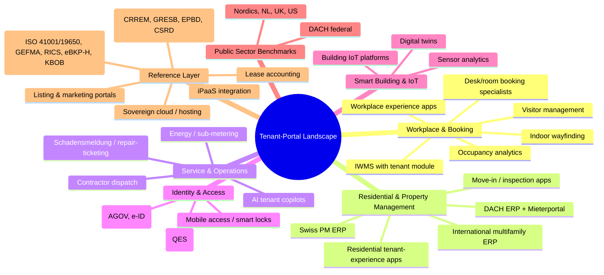
```mermaid
mindmap
  root((Tenant-Portal Landscape))
    Workplace & Booking
      IWMS with tenant module
      Workplace experience apps
      Desk/room booking specialists
      Visitor management
      Indoor wayfinding
      Occupancy analytics
    Residential & Property Management
      DACH ERP + Mieterportal
      Swiss PM ERP
      International multifamily ERP
      Residential tenant-experience apps
      Move-in / inspection apps
    Service & Operations
      Schadensmeldung / repair-ticketing
      Contractor dispatch
      AI tenant copilots
      Energy / sub-metering
    Identity & Access
      Federal identity (AGOV, e-ID)
      eSignature (QES)
      Mobile access / smart locks
    Smart Building & IoT
      Building IoT platforms
      Digital twins
      Sensor analytics
    Public Sector Benchmarks
      DACH federal
      Nordics, NL, UK, US
    Reference Layer
      Lease accounting
      Listing & marketing portals
      iPaaS integration
      Sovereign cloud / hosting
      ESG frameworks (CRREM, GRESB, EPBD, CSRD)
      Standards (ISO 41001/19650, GEFMA, RICS, eBKP-H, KBOB)
```

## 3. Segments at a Glance

| # | Segment | One-line description |
|---|---|---|
| A | IWMS with tenant module | Integrated workplace suites (Planon, Eptura, IBM TRIRIGA, MRI, Spacewell, Nuvolo, Tango, FM:Systems, Accruent, Manhattan, ServiceNow WSD). |
| B | Workplace experience apps (WEX) | Tenant-facing apps for landlords and corporate occupiers (HqO, Equiem, Spaceflow, Chainels, Robin, OfficeSpace, Appspace, Modo Labs, Zoom Workplace, CXAI). |
| C | Desk/room booking specialists | Pure-play scheduling (Robin, Skedda, OfficeRnD, deskbird, Tactic, Joan, Matrix Booking, Tribeloo, YArooms, Sharvy). |
| D | Visitor management & mobile access | Envoy, Eptura Visitor (ex-Proxyclick), SwipedOn, Kisi, Verkada Guest, HID Origo, Salto KS, Brivo, dormakaba exivo. |
| E | PM ERP with embedded tenant portal | Aareon Wodis Yuneo/RELion/Blue Eagle/Mareon, immoware24, Haufe axera, DOMUS, CREM iX-Haus, GARAIO REM+aroov, W&W ImmoTop2/Rimo R5, Abacus AbaImmo, Fairwalter, Immomig, Yardi Voyager+RentCafe, MRI, AppFolio, Buildium, RealPage, Entrata, Arthur Online, Momentum. |
| F | Residential tenant-experience platforms | casavi, facilioo, Allthings, wohnungshelden, Immomio, iDWELL, Spiri.Bo, etg24, EverReal, RentCafe Resident, Livly, Bilt Rewards. |
| G | Schadensmeldung / repair-ticketing | Fixflo, Plentific, Yarowa, Mareon, facilioo, PlanRadar, MaintainX, UpKeep, imofix.io. |
| H | Move-in / move-out / inspection | W&W Abnahme-App, GARAIO REM DAP, Properly, Inspectify, Allthings inspection, HouseView. |
| I | eSignature & federal identity | Skribble, SwissSign/SwissID, AGOV, planned e-ID, DocuSign, Adobe Sign, Yousign, Scrive. |
| J | Document vault / e-Akte | BImA Adakta, Acta Nova (Swiss federal GEVER), SharePoint, Aareon DMS, OpenText, ELO ECM. |
| K | AI tenant copilots | Aareon CRM-Portal KI, casavi smartflows, Allthings AI, Knock, RentDynamics, Famulor, ServiceNow Now Assist. |
| L | Smart-building IoT / digital twin | Spacewell Cobundu, Siemens Building X, Johnson Controls OpenBlue, Honeywell Forge, Cisco Spaces, Cohesion, View Smart, Disruptive Technologies, ThoughtWire, Comfy/Siemens, Schindler Ahead, KONE 24/7, Bosch IoT Suite, BuildingMinds. |
| M | Lease management & accounting | Visual Lease, LeaseAccelerator, CoStar REM, Nakisa, MRI ProLease, LucernEx. |
| N | Energy & sub-metering tenant transparency | Techem, ista, Brunata-Metrona, Minol, Aareon EnergieHub, Spacewell Energy (Dexma). |
| O | Listing & onboarding portals | homegate.ch, ImmoScout24.ch, flatfox.ch, ImmoScout24.de, Immowelt, Wunderflats. |
| P | Public-sector tenant systems | "Mein BImA", GSA OASIS, GPA UK, Senaatti Senate App, Rijksvastgoedbedrijf, BIG Austria, Statsbygg, armasuisse Immo-Portal VBS. |
| Q | SAP RE-FX integration patterns | Planon RE for SAP S/4HANA, Goldinmotion, Promos.GT, Aareon SAP Blue Eagle, casavi Aareon Connect, custom Fiori on BTP. |
| R | Sovereign / Swiss hosting | Swisscom Sovereign Cloud, Exoscale, Infomaniak, AWS eu-central-2 Zurich, Azure CH N/W, Google Cloud Zurich. |
| S | iPaaS / integration | SAP Integration Suite/BTP, MuleSoft, Workato, Boomi, Frends, Aareon Locoia. |
| T | Fintech adjacencies | Bilt Rewards, Rentmoola, Flatfair, GoCardless real-estate. |
| U | Indoor wayfinding | Steerpath, MapsIndoors, Pointr, MazeMap, IndoorAtlas, MappedIn, Archilogic (CH). |
| V | Occupancy analytics | Locatee (Tango), VergeSense, Density, XY Sense, Butlr, Disruptive Technologies. |
| W | Construction PM & BIM CDE handoff | Pre-occupancy design/build/handover with BIM2FM exchange (Autodesk ACC, Bentley iTwin, Revizto, Solibri, BIMcollab, Procore, Trimble Connect, dRofus, PlanRadar, Buildots, Capmo). |
| X | Lease abstraction / AI document extraction | SAP RE-FX migration & lease ingestion (Leverton, Prophia, contract.fit, Hyperscience, Rossum, LeaseHawk, docunite). |
| Y | CAFM (DACH-specific, distinct from IWMS) | German-language facility management with GEFMA 444 heritage (pit-FM, waveware, ConjectFM, FAMOS, KEYLOGIC, Speedikon FM, GEORG). |
| Z | ESG portfolio-data platforms | Portfolio-level VILB / EPBD / CSRD / GRESB reporting beyond submetering (Deepki, Measurabl, Optera, Carbonsight, ENGIE Impact, Spacewell Energy, Sustain.life, Schneider Resource Advisor, Sweep, BuildingMinds). |
| AA | OSS / civic-tech alternatives | EMBAG-Art.-9-aligned open-source options (Odoo, ERPNext, Tryton, Keycloak, Zammad, Mattermost, GeoNode, BIMserver, Hugging Face document-AI, civic-tech.ch). |
| BB | Workflow automation & low-code business logic | Generic process-orchestration / form-driven business logic — **build-with-already-licensed-primitives alternative** to vertical tenant-portal SaaS (Power Automate, Power Apps, SAP Build Process Automation, SAP Build Apps, n8n, Camunda, Activepieces, Make, Zapier, Bonita, ProcessMaker, Pega, Appian, OutSystems, Mendix, ServiceNow Flow Designer). |
| AC | Tenant onboarding, KYC, credit-screening & Bonität | Swiss bureaus (CRIF, Intrum, CreditTrust JV, moneyhouse, Bisnode), DE/AT bureaus (SCHUFA, KSV1870, Creditreform), IDV (PXL Vision, KYC Spider, IDnow, WebID, Onfido/Entrust, Veriff, Sumsub, Klippa), tenant screening (Goodlord, HomeLet, Canopy, Experian RentBureau, RentSpree, TransUnion SmartMove, Naborly). |
| AD | Deposit, rental-guarantee & tenant insurance tech | CH duopoly+ (SwissCaution, Firstcaution, goCaution, SmartCaution; insurer arms Helvetia/AXA/Zurich); DE (Eurokaution, Deutsche Kautionskasse, plusForta/Aareal, Cosmos Direkt); UK (Flatfair, Reposit, Zero Deposit, Insurami); app-native tenant insurtech (Getsafe, Friday/Allianz Direct, Adam Riese, Canopy). |
| AE | Tenant communication, resident voting & WEG-Versammlung tech | BSI-certified voting (POLYAS); WEG/STWEG Versammlung (vote.io, OASIS Voting, Vote@Home, casavi WEG-Modul, etg24, iDWELL); resident comms (Civey, ImmoSocial, Wohnglück, Quartier Schweiz); US HOA/voting (Building Engines, HOA Express, AppFolio voting, RentCafe Resident). |
| AF | Mobility & EV-charging tenant services | CH CPO/EMSP networks (Energie 360°/Swisscharge/GOFAST/Move group, Shell Recharge/evpass, Juice Technology, Park-it); DACH CPO OS (chargecloud, reev, has·to·be/ChargePoint, GP JOULE Connect, &Charge); pan-EU & US (ChargePoint, eMabler, ENGIE Vianeo, Allego, Mer, EVgo, Wallbox, Pod Point, Driivz, GreenFlux); parking (Parquery, ParkingPay). |
| AG | Building automation / GA-Leitsystem (OT layer beneath L) | DACH BMS supervisors (Sauter, Saia-Burgess Controls/Honeywell, Siemens Desigo CC, Honeywell EBI / Niagara Tridium, Schneider EcoStruxure Building, Beckhoff TwinCAT, Wago, Kieback&Peter, Caverion); global (Johnson Controls Metasys, Trane Tracer SC+, ABB Cylon, Distech, Iconics); Belimo Cloud. |

## 4. Summary

- **Heavy consolidation, bifurcated market.** The workplace-side (Eptura, Spacewell, Planon, Nuvolo, MRI, Tango, ServiceNow WSD) converges on AI-enabled "WEX + IWMS" suites: Gartner published its first-ever Magic Quadrant for Workplace Experience Applications on 6 April 2026 (analysts Sohail Majumdar and Christopher Trueman), evaluating Accruent, Appspace, CXAI, Envoy, Eptura, Microsoft, Modo Labs, OfficeSpace Software, Robin Powered, ServiceNow, Tango and Zoom; Eptura, Robin and Appspace publicly claimed Leader positions. Verdantix's January 2025 Green Quadrant for Connected Portfolio Intelligence Platforms (CPIP) / IWMS named Planon (highest performer), IBM, Eptura, MRI, Tango, Johnson Controls, Spacewell and Nuvolo as the 8 Leaders. The residential/housing side (Aareon, Haufe, DOMUS, casavi, facilioo, immoware24, Allthings, W&W, GARAIO REM, Abacus) remains a deeply DACH-vertical market.
- **Three buyer personas drive segmentation:** (1) corporate-occupier/workplace persona (federal tenant agencies VBS, EFD, EJPD, EDA, fedpol, NDB); (2) landlord-as-asset-manager persona (BBL-class portfolios); (3) residential tenant persona (caretaker housing, embassies, social/military housing). Few vendors serve all three convincingly — cross-persona suites are typically IWMS leaders (Planon, MRI, Eptura) or vertical ERP+portal combinations (Aareon, GARAIO REM).
- **White spaces relevant to BBL** include: a productised tenant-portal pattern over SAP RE-FX that is AGOV-federated and ISG-classifiable; Swiss-domiciled vendors with built-in QES (Skribble) and Swiss sovereign hosting; ESG/sustainability (CRREM, GRESB, EPBD 2024/1275, EU Taxonomy, VILB Art. 9) exposed at the tenant level — currently strong on the workplace side (Spacewell Dexma, Planon, Measurabl) but uneven for federal residential occupants.
- **Regulatory and standards context is decisive in Switzerland:** EMBAG (in force 1 Jan 2024, "Public Money — Public Code" by default per Art. 9 unless third-party rights or security preclude); DigiV (SR 172.019.1); Strategie Digitale Bundesverwaltung; ISG (information security classification INTERN, VERTRAULICH, GEHEIM); VILB Art. 9 Abs. 1bis; revised BöB/VöB (1 Jan 2021); AGOV as the federal login standard; the federal e-ID expected to launch on 1 December 2026. These collectively force a preference for Swiss data residency, OSS-publishable customisations, and AGOV federation over proprietary identity stacks.
- **Recent M&A has compressed the vendor map:** Eptura (Oct 2022 merger of Condeco + iOFFICE/SpaceIQ); Aareon TPG/CDPQ-owned at €3.9 bn EV since June 2024; HqO + Office App (Oct 2021); VTS + Lane (Oct 2021); Tango + Locatee (Mar 2024); MRI Software's 53-acquisition trajectory (Tracxn, Feb 2026, with an average acquisition amount of $68.4 m and a peak of nine acquisitions in 2020); the SAP–Planon strategic partnership (16 May 2023).

## 5. Recent Consolidations & Shifts (chronological)

| Date | Event | Implication |
|---|---|---|
| Jan 2013 | **Honeywell acquires Saia-Burgess Controls** (Murten, CH) from Johnson Electric for $130 m. | Consolidates a Swiss-domiciled GA-Leitsystem leader (Segment AG) under a US BMS major; SBC widely deployed in CH infrastructure (SBB, VBZ). |
| 2018 | **CRIF + Intrum launch CreditTrust JV** (Zurich, CH); blockchain-anchored Bonitätszertifikat. | Establishes the dominant digital alternative to the paper Betreibungsregister-Auszug in Swiss residential applications; embedded into homegate.ch / ImmoScout24.ch flows (Segment AC). |
| Feb 2019 | **Aareal Bank Group acquires plusForta GmbH** (kautionsfrei.de / heysafe.de / kautionsfuchs.de). | Direct corporate-family link between the DE deposit-substitution market and PM-software giant Aareon (Segment AD). |
| 2021 | **ChargePoint acquires has·to·be** (Klagenfurt, AT) for ~$295 m. | Consolidates DACH flagship CPO software (be.ENERGISED) into ChargePoint Platform (Segment AF). |
| Aug 2021 | iOFFICE + SpaceIQ merge under Thoma Bravo / JMI Equity / Waud Capital. | Pre-Eptura step. |
| Oct 2021 | HqO acquires Office App (NL). Per HqO press release (GlobeNewswire, 19 Oct 2021): "The new combined entity is valued at over half a billion dollars, making it one of the most significant proptech companies in the world." | European expansion of US tenant-experience leader. |
| Oct 2021 | VTS acquires Lane. | VTS gains workplace footprint. |
| Jan 2022 | Condeco acquires Proxyclick. | Visitor management folded into Condeco. |
| Jan 2022 | Aareon acquires 100% of Arthur Online (UK). | Entry into UK SMB property-management. |
| 2022 | **Aareon acquires casavi** (Munich, DE). | Brings WEG/STWEG voting module, smartflows and tenant portal under Aareon (Segments AE, F, K). |
| Jun 2022 | Aareon (via Mary BidCo AB) acquires approximately 93% (later 100%) of Momentum Software Group (Sweden). Per Aareon/Goldcup press release (Cision, 20 Jun 2022): "approximately 93 per cent of the shares and votes in Momentum, at a price of SEK 108 per share, valuing Momentum… at approximately SEK 1,797 million." | Nordic property-management consolidation. |
| Oct 2022 | Condeco + iOFFICE + SpaceIQ merge to form **Eptura** (Atlanta HQ; CEO Brandon Holden; Paul Statham joins the board). Investors: Thoma Bravo, JMI Equity. | Portfolio: Archibus, Condeco, Hippo CMMS, iOffice, ManagerPlus, Proxyclick, Serraview, SpaceIQ, Teem. |
| Nov 2022 | AWS opens `eu-central-2` (Zurich) with 3 AZs. Per AWS press release (BusinessWire, 8 Nov 2022): "AWS is planning to invest an estimated $5.9 billion (approx. 5.9 billion Swiss francs) in Switzerland during the next 15 years." | Swiss data-residency option for portals. |
| Apr 2023 | Aareon acquires Embrace — The Human Cloud (NL omnichannel contact-centre). | AI / contact-centre capabilities. |
| 16 May 2023 | **SAP and Planon strategic partnership** announced at SAP Sapphire. "Planon Real Estate Management for SAP S/4HANA" becomes an SAP Endorsed App; SAP retains RE-FX. | SAP positions Planon as preferred RE/FM partner co-engineered on BTP and S/4HANA. |
| Q2 2023 | Aareon acquires Karthago (UTS). | DACH WEG/Miet-software consolidation. |
| Sep 2023 | BBL SUPERB cut-over to SAP S/4HANA / RE-FX. | BBL on current SAP core. |
| 2 Oct 2023 | "Planon Real Estate Management for SAP S/4HANA" achieves SAP Endorsed App status. | Premium-certified via SAP Store. |
| Mar 2024 | Tango Analytics acquires **Locatee** (Zurich); Zurich becomes Tango's European HQ. | Sensor-free occupancy analytics joins IWMS suite. |
| 13 Mar 2024 | BImA migrates Wohnungsfürsorge access into **"meine BImA"** portal. | Federal German tenant-portal modernisation reference. |
| Apr 2024 | **Entrust acquires Onfido** (London). | Most material 2024–2026 structural event in the IDV/KYC market; reshapes Segment AC consolidation. |
| 1 May 2024 | armasuisse re-launches Immo-Portal VBS; role-based structure (Nutzer / Mieter / Eigentümervertreter / Betreiber / IKT / Departementsebene). | Swiss federal peer benchmark codified. |
| 24 Jun 2024 | Aareal Bank + Advent International sign agreement to sell **Aareon to TPG (majority) and CDPQ (minority co-investor)** at EV ~€3.9 bn; closing H2 2024; Advent retains minority. | Aareon becomes independent. |
| Oct 2024 | **Allianz Direct acquires Friday's portfolio from Baloise** (Handelsblatt, Oct 2024); Friday brand wound down. | Consolidates DACH digital-Hausrat tenant-insurance market (Segment AD). |
| Jan 2025 | Verdantix Green Quadrant CPIP/IWMS 2025: 8 Leaders — Planon (highest performer), IBM, Eptura, MRI, Tango, Johnson Controls, Spacewell, Nuvolo. | Reference benchmark. |
| Feb 2025 | IDC MarketScape: Worldwide SaaS and Cloud-Enabled Facility Management Applications 2024–2025 (Doc # US52038324, Brian O'Rourke). Publicly disclosed Leaders include Planon, ServiceNow, Eptura. | Public-domain confirmation of leadership. |
| 26 Mar 2025 | FCR Immobilien acquires Immoware24 (Halle, DE). | DACH residential PM, independent of Aareon, changes hands. |
| Jun 2025 | MRI Software acquires **Anacle** (Singapore). | APAC expansion. |
| Jul 2025 | **Energie 360° acquires Move** (CH); group combines Swisscharge + GOFAST + Move into the largest CH charging network (24,000+ points, 250,000 users; zero roaming from 1 Nov 2025; CHF 200 m investment programme to 2030). | Consolidates CH CPO market to 3–4 dominant groups (Segment AF). |
| 2 Sep 2025 | **Apertus released** by Swiss AI Initiative (EPFL + ETH Zurich + CSCS Lugano): 8 B and 70 B parameter open-source LLM, 15 T tokens across 1,000+ languages incl. Swiss German and Romansh, ~40 % non-English data. | Switzerland's first large-scale open multilingual LLM — structurally enables sovereign AI tenant copilots (Segment K). |
| Sep 2025 | Reuters reports MRI's PE owners (TA Associates, GI Partners, Harvest Partners) exploring sale/IPO at up to USD 10 bn valuation. | Speculative; not yet executed. |
| Oct 2025 | MRI Software acquires **Proptech Labs** (Melbourne). | ANZ consolidation. |
| 13 Nov 2025 | ChargePoint launches AI optimisation engine across its Platform. | Cross-vendor charging-network AI primitive (Segment AF). |
| Nov 2025 | Aareon acquires **Apsiyon** (Turkey). | Eastern Europe / Turkey expansion. |
| end 2025 | **NICE acquires Cognigy** (Düsseldorf, DE) per Startup-in-Europe (Jan 2026). | European enterprise voice-agent consolidation (Segment K). |
| 14 Jan 2026 | AWS European Sovereign Cloud (`aws-eusc`, first region `eusc-de-east-1` Brandenburg, DE) GA. €7.8 bn investment; EU-resident personnel and operations. | Sovereign-cloud reference for EU public sector; not in Switzerland. |
| Jan 2026 | **Parloa €310 m Series D** at $3 b valuation (Berlin, DE); plan to grow from 380 to 600 staff by end of 2026. | Largest European enterprise-voice-AI raise to date; structural consolidation event for Segment K. |
| 11 Feb 2026 | ChargePoint announces ~1.275 M total ports accessible (~900,000 roaming + ~375,000 directly managed). | Scale benchmark for global CPO platforms (Segment AF). |
| 6 Apr 2026 | **Inaugural Gartner Magic Quadrant for Workplace Experience Applications** (analysts Sohail Majumdar, Christopher Trueman). 12 vendors. Eptura, Robin and Appspace publicly positioned as Leaders. | First Gartner MQ defining "WEX". |
| 1 Dec 2026 (planned) | Swiss federal e-ID launches; usable as login factor in AGOV. | Will shape Swiss tenant-portal identity from 2027. |

## 6. Details by Segment

> **BBL fit legend** *(scored against [REQUIREMENTS.md](REQUIREMENTS.md))* — 🟢 **High** = directly fits the pilot (Landing Page + Bedarf Unterbringung) or strong Swiss-federal precedent (SAP RE-FX-compatible, Swiss-domiciled, federal references) · 🟡 **Medium** = fits the roadmap (Case A/B/C) or is adjacent / relevant later · 🔴 **Low** = out of pilot scope, weak federal fit; included for context · ⚪ **N/A** = outside the federal property-management context (e.g. US multifamily, consumer fintech).
> The pilot was decided as **Create on RHOS** (in-house on Red Hat OpenShift, operated by BIT), so commercial IWMS / portal suites are by definition not the pilot path — they are scored for a possible later "Buy" iteration.

### A. IWMS with tenant module

**Definition.** Suites combining real-estate portfolio, lease admin, space/floor planning, maintenance, projects and increasingly workplace experience into one platform with a tenant/occupant layer. Differentiator vs. ERP: workplace + CAD/BIM + IoT lifecycle.

**Persona.** Corporate real-estate / facility-management functions of large enterprises and government landlords.

| Product | HQ / country | Hosting | Pricing | Key integrations | Notable feature | BBL fit |
|---|---|---|---|---|---|---|
| [Planon Universe + RE Mgmt for SAP S/4HANA](https://planonsoftware.com/) | Nijmegen, NL (Schneider Electric majority) | Cloud / private | Per module + named user; quote-based | SAP S/4HANA Endorsed App; BTP; IFC/BIM | Only SAP-endorsed RE/FM partner since May 2023 | 🟢 Only SAP RE-FX-endorsed option; natural Buy candidate |
| [Eptura Workplace / Archibus / Serraview](https://eptura.com/) | Atlanta, USA | Cloud | Quote-based | Microsoft 365, Google, Slack, SAP | Leader in Gartner WEX MQ 2026 and Verdantix Green Quadrant 2025 | 🟡 Workplace leader, no SAP RE-FX, US-hosted |
| [IBM TRIRIGA](https://www.ibm.com/products/tririga) | Armonk, USA | Cloud / on-prem | Per authorized/concurrent user | Maximo, Watson, Envizi (ESG) | Verdantix Leader 2025 | 🟡 Enterprise IWMS; no SAP RE-FX path |
| [MRI Software](https://www.mrisoftware.com/) | Solon (Ohio), USA | Cloud | Per door / per unit | SAP, AppFolio Connect, GoCardless | 53 acquisitions; ANZ via Proptech Labs | 🟡 Multifamily-heavy; weak federal-CH fit |
| [Nuvolo Connected Workplace](https://www.nuvolo.com/) | Paramus (NJ), USA | ServiceNow Now Platform | Named user + per asset | ServiceNow, SAP | Native ServiceNow; life-sciences strength | 🔴 ServiceNow-bound; outside BBL/BIT stack |
| [Spacewell Workplace](https://spacewell.com/) (Dexma, MCS) | Antwerp, BE (Nemetschek) | Cloud | Concurrent user + IoT sensor count | BIM, IFC, Nemetschek | BIM-native IWMS; WiredScore accredited; Verdantix Leader 2025 | 🟡 EU/DACH-anchored; BIM-native; no SAP RE-FX endorsement |
| [Tango](https://tangoanalytics.com/) (incl. Locatee) | Dallas, USA | Cloud | Quote-based | SAP, Yardi, Workday | Acquired Locatee Mar 2024 | 🔴 US-anchored despite Locatee/Zurich |
| [FM:Systems](https://fmsystems.com/) (Johnson Controls) | Raleigh (NC), USA | Cloud | Per building / per m² | OpenBlue, BIM | Johnson Controls integration for OT/IT | 🔴 US, OT-heavy; tangential to pilot |
| [Accruent (Lucernex, Famis)](https://www.accruent.com/) | Austin, USA | Cloud / hybrid | Per user + per asset | SAP, Oracle | Strong on lease admin | 🔴 Lease-admin focus; not tenant-portal-shaped |
| [Trimble Manhattan ONE](https://manhattanone.trimble.com/) | Westminster (CO), USA | Cloud / on-prem | Per concurrent user | Trimble AEC | Long-standing IWMS | 🔴 US generic IWMS; no federal-CH track |
| [ServiceNow WSD](https://www.servicenow.com/products/workplace-service-delivery.html) | Santa Clara, USA | ServiceNow cloud | Pro / Enterprise tiers | Now Platform, Microsoft 365, MappedIn, BMS | Visitor, case, reservation, indoor mapping, AI via Now Assist | 🟡 Strong workflow/case engine; ServiceNow-bound |

**Maturity.** Mature and consolidating.
**Swiss-context note.** Planon is the only SAP Endorsed App in this category — structurally important for SAP-RE-FX estates like BBL's. Spacewell (Antwerp, Nemetschek-owned) is the closest DACH-anchored IWMS leader. Swiss data residency must be configured explicitly.
**Preview — selected vendors** (product screenshots, dashboards or explainer images from vendors' own pages; image-type tag in italics; links go to source pages):

<table>
<tr>
<td align="center" width="50%" valign="top">
<a href="https://planonsoftware.com/us/software/iwms/asset-maintenance-management/">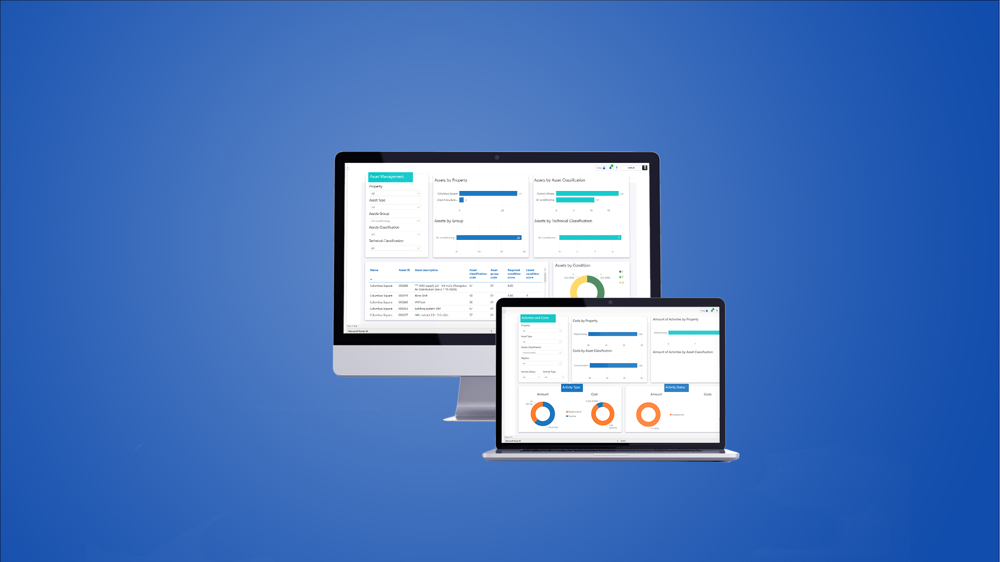</a> 
<b>Planon</b> <i>[Dashboard]</i> · Connect for Analytics — Asset Management twin-monitor view <a href="https://planonsoftware.com/">planonsoftware.com</a>
</td>
<td align="center" width="50%" valign="top">
<a href="https://eptura.com/our-platform/eptura-engage/intelligent-workplace/">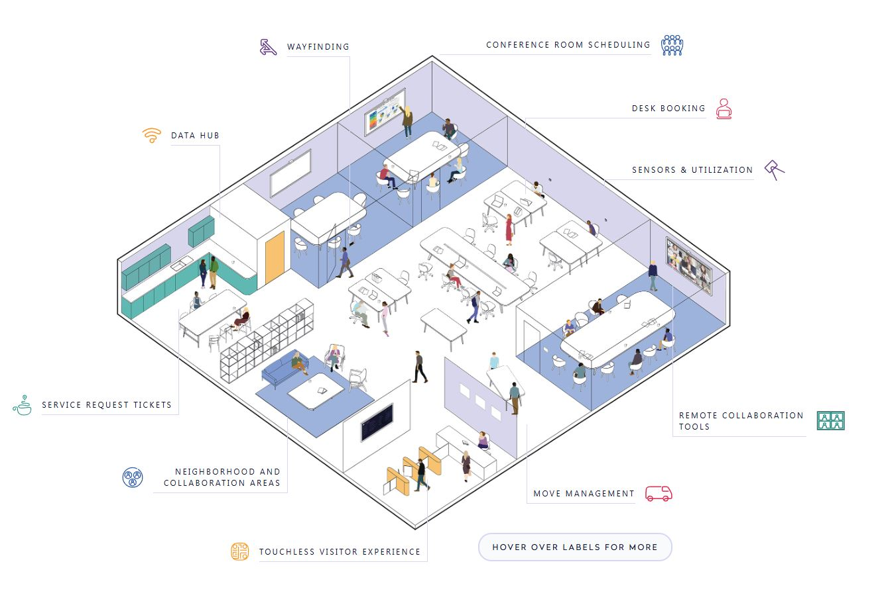</a> 
<b>Eptura</b> <i>[Diagram]</i> · Engage Utilization heatmap on floor plan <a href="https://eptura.com/">eptura.com</a>
</td>
</tr>
<tr>
<td align="center" width="50%" valign="top">
<a href="https://www.ibm.com/products/tririga">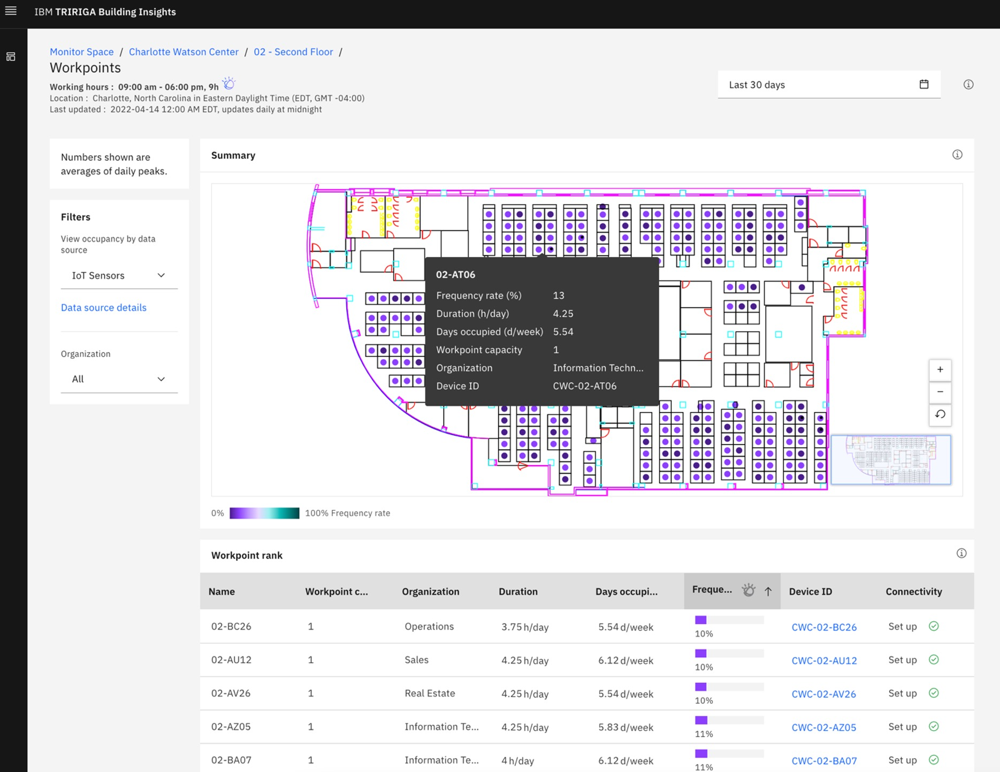</a> 
<b>IBM TRIRIGA</b> <i>[Dashboard]</i> · Space Management Home (now under Maximo RE&amp;F) <a href="https://www.ibm.com/products/tririga">ibm.com/tririga</a>
</td>
<td align="center" width="50%" valign="top">
<a href="https://spacewell.com/workplace-management-software/">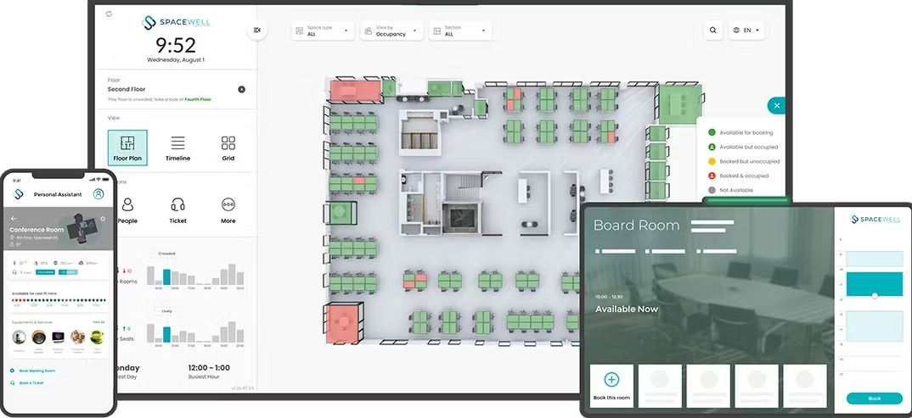</a> 
<b>Spacewell</b> <i>[Screenshot]</i> · Workplace booking UI (laptop + mobile) <a href="https://spacewell.com/">spacewell.com</a>
</td>
</tr>
</table>

**Taxonomy note.** Several vendors here (Eptura, ServiceNow, Tango) also appear in Segment B as the IWMS / Workplace-Experience boundary blurs in 2025–2026 analyst frameworks. Treat A and B as a single converging market when scoring incumbents.

### B. Workplace experience applications (WEX)

**Definition.** Per Gartner's 6 April 2026 MQ definition (Majumdar/Trueman): "workplace experience applications enhance employee interaction with the office", coordinating services, space, visitors, communications and sensor data into a unified employee app.

**Persona.** Corporate occupier; in BBL's context, federal agencies that are tenants of BBL buildings.

| Product | HQ / country | Hosting | Pricing | Integrations | Notable feature |
|---|---|---|---|---|---|
| [Eptura Engage (ex-Condeco) / Workplace](https://eptura.com/) | Atlanta, USA | SaaS | Per user / per resource | Microsoft 365, Teams, BMS | Gartner WEX Leader 2026 |
| [Robin](https://robinpowered.com/) | Boston, USA | SaaS | Per user; transparent tiers | Microsoft 365, Google, Slack, SCIM | Inaugural Gartner WEX Leader 2026 |
| [Appspace](https://www.appspace.com/) | Tampa, USA | SaaS | Per user / per device | Microsoft 365, ServiceNow | Signage + comms + workplace; Gartner WEX Leader 2026 |
| [HqO](https://www.hqo.com/) (Office App) | Boston, USA / Amsterdam | SaaS | Per building / per sq ft | BMS | Acquired Office App Oct 2021 |
| [Equiem](https://www.getequiem.com/) | Melbourne, AU | SaaS | Per building | Office365, payment APIs | Landlord-side WEX |
| [Spaceflow](https://spaceflow.io/) | Prague, CZ | SaaS | Per building | Microsoft 365, BMS | European tenant-experience focus |
| [Chainels](https://www.chainels.com/) | Rotterdam, NL | SaaS | Per building | Microsoft 365, payments | Community-led |
| [OfficeSpace Software](https://www.officespacesoftware.com/) | Atlanta, USA | SaaS | Per user | Microsoft 365, Google | Gartner WEX 2026 |
| [Modo Labs](https://www.modolabs.com/) | Cambridge (MA), USA | SaaS | Per user | Microsoft 365 | MIT-spinout campus app |
| [CXApp / CXAI](https://www.cxapp.com/) | San Francisco, USA | SaaS | Per user | Cisco Spaces, BMS | Gartner WEX 2026 |
| [Microsoft Places](https://www.microsoft.com/microsoft-365/places) | Redmond, USA | M365 cloud | Bundled in M365 / EMS | Teams, Outlook, Viva | Tight M365 binding |
| [Zoom Workplace](https://www.zoom.com/en/products/workspace-reservation/) | San Jose, USA | Zoom cloud | Per host / per room | Zoom Rooms, Microsoft 365 | Booking + UC |
| [Cohesion](https://cohesionib.com/) | Chicago, USA | SaaS | Per square foot | BMS, BACnet, IoT | Smart-building-native |

**Maturity.** Transitional → consolidating; first Gartner MQ in 2026.
**Swiss-context note.** Most US/UK/AU vendors host outside Switzerland; only Microsoft, AWS, Google and Azure have CH regions. AGOV/SAML federation feasibility is product-specific; ServiceNow WSD has documented SAML/OIDC IdP federation.
**Preview — selected vendors** (product screenshots from vendors' own pages; image-type tag in italics; links go to source pages):

<table>
<tr>
<td align="center" width="50%" valign="top">
<a href="https://robinpowered.com/platform">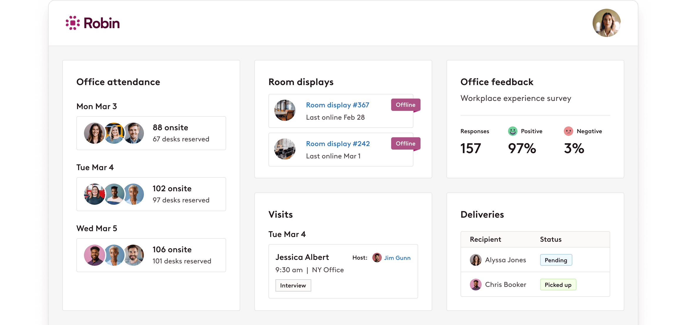</a> 
<b>Robin</b> <i>[Dashboard]</i> · Workplace Dashboard (Gartner WEX Leader 2026) <a href="https://robinpowered.com/">robinpowered.com</a>
</td>
<td align="center" width="50%" valign="top">
 
<b>Appspace</b> <i>[Multi-device]</i> · Platform on screens, kiosks, mobile (Gartner WEX Leader 2026) <a href="https://www.appspace.com/">appspace.com</a>
</td>
</tr>
<tr>
<td align="center" width="50%" valign="top">
<a href="https://www.hqo.com/">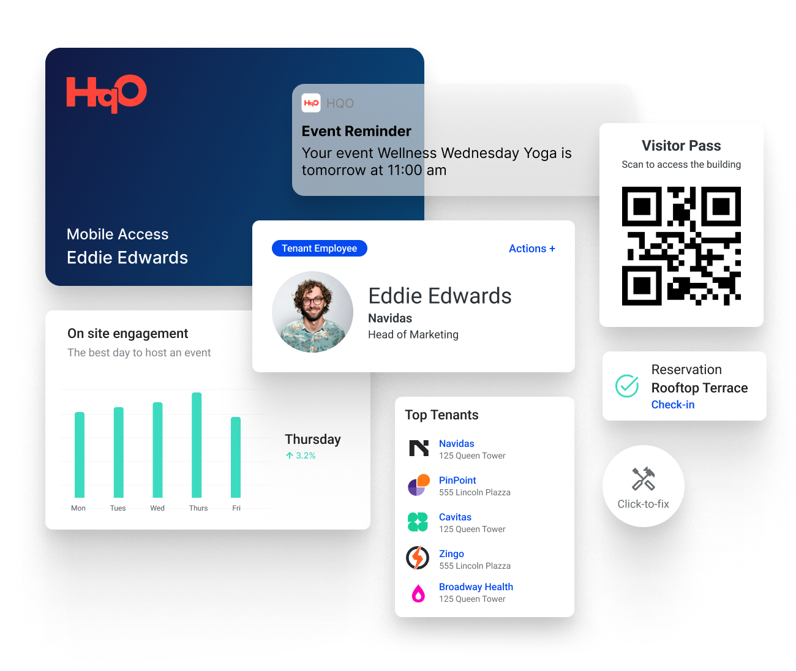</a> 
<b>HqO</b> <i>[Screenshot]</i> · Tenant-facing app UI <a href="https://www.hqo.com/">hqo.com</a>
</td>
<td align="center" width="50%" valign="top">
<a href="https://adoption.microsoft.com/en-us/microsoft-places/">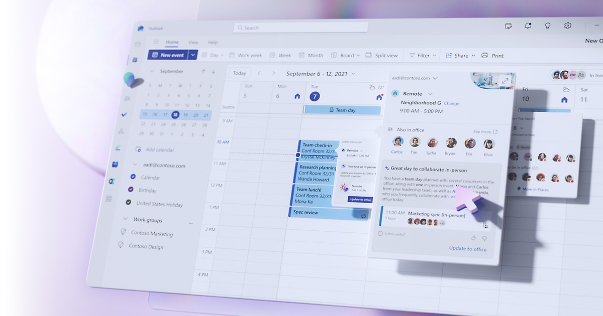</a> 
<b>Microsoft Places</b> <i>[Hero]</i> · Places header (M365-native, federal fit) <a href="https://www.microsoft.com/microsoft-365/places">microsoft.com/places</a>
</td>
</tr>
</table>

**Taxonomy note.** Several vendors here (Eptura, Robin, OfficeSpace, Tango, ServiceNow) overlap with Segment A. Gartner's April 2026 WEX MQ and the Verdantix CPIP/IWMS Quadrant frame this as one converging market — A and B should be read together.

### C. Desk / room booking specialists

**Definition.** Pure-play desk, room, parking and resource scheduling tools — narrower in scope than IWMS (Segment A) and Workplace Experience (Segment B), but often integrated into them. Differentiator: ease of M365 / Google calendar integration, mobile-first UX, transparent self-serve pricing.

**Persona.** Workplace / IT teams of organisations adopting hybrid work; tenant departments inside federal buildings who need desk reservations without a full IWMS commitment.

| Product | HQ / country | Hosting | Pricing | Integrations | Notable feature |
|---|---|---|---|---|---|
| [Robin](https://robinpowered.com/) | Boston, USA | SaaS | Public tiers | Microsoft 365, Google, Slack | Workplace + booking |
| [Skedda](https://www.skedda.com/) | Sydney, AU | SaaS | Per space; transparent | Microsoft 365, Google, SSO | Sports / coworking heritage |
| [OfficeRnD Hybrid](https://www.officernd.com/) | Sofia, BG | SaaS | Per user | Microsoft 365 | Coworking + hybrid |
| [deskbird](https://www.deskbird.com/) | St. Gallen, CH | SaaS | Per user | Microsoft 365, Slack | DACH/CH-domiciled |
| [Tactic](https://gettactic.com/) | New York, USA | SaaS | Per user | Microsoft 365 | Lightweight booking |
| [Joan (Visionect)](https://getjoan.com/) | Ljubljana, SI | SaaS + ePaper | Per device / user | Microsoft 365, Google | ePaper meeting-room displays |
| [Matrix Booking](https://matrixbooking.com/) | Reading, UK | SaaS | Per user | Microsoft 365 | UK public-sector heritage |
| [Tribeloo](https://www.tribeloo.com/) | Brussels, BE | SaaS | Per user | Microsoft 365 | EU-anchored |
| [YArooms](https://www.yarooms.com/) | Bucharest, RO | SaaS | Per user | Microsoft 365, Google | EU pricing transparency |
| [Sharvy](https://www.sharvy.com/) | Montpellier, FR | SaaS | Per user | Microsoft 365 | Parking management strength |
| [Eptura Engage (Condeco)](https://eptura.com/) | Atlanta, USA | SaaS | Per user | Microsoft 365 | Long-running enterprise scheduler |

**Preview — selected vendors** (product screenshots from vendors' own pages; links to source pages):

<table>
<tr>
<td align="center" width="50%" valign="top">
<a href="https://www.deskbird.com/">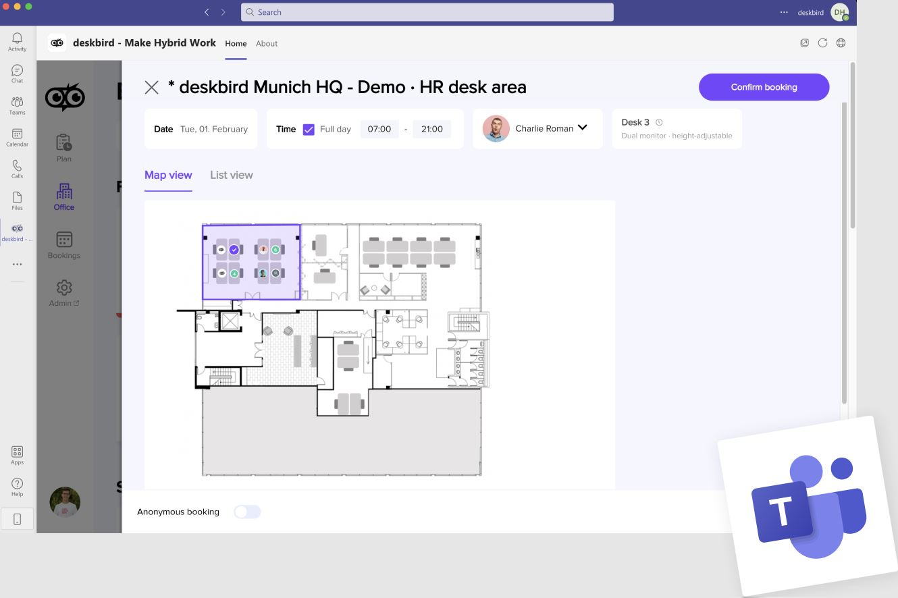</a> 
<b>deskbird</b> <i>[Mobile UI]</i> · Booking confirmation screen — <b>Swiss-domiciled (St. Gallen)</b> <a href="https://www.deskbird.com/">deskbird.com</a>
</td>
<td align="center" width="50%" valign="top">
<a href="https://www.skedda.com/">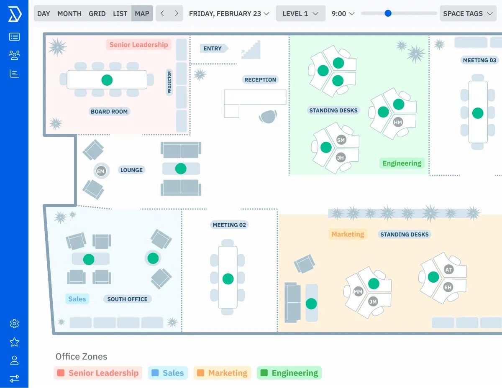</a> 
<b>Skedda</b> <i>[Screenshot]</i> · Interactive floor-plan booking UI <a href="https://www.skedda.com/">skedda.com</a>
</td>
</tr>
</table>

**Maturity.** Mature. deskbird is the Swiss-domiciled vendor of note.

### D. Visitor management & mobile access

**Definition.** Front-desk visitor pre-registration and physical access-control software, often deployed in workplace settings. Combines two distinct buyer personas (visitor management vs. mobile credentials / smart locks) — separated by procurement reality, listed together by deployment proximity.

**Persona.** HR / admin (visitor side) plus facilities / security (access control); for BBL, tenant agencies running their own visitor flows on top of a federal building's access infrastructure.

| Product | HQ | Pricing | Notable feature |
|---|---|---|---|
| [Envoy](https://envoy.com/) | San Francisco, USA | Per location | Visitor + desks + deliveries |
| [Proxyclick / Eptura Visitor](https://eptura.com/) | Brussels, BE / Atlanta | Per location | GDPR-native; folded into Eptura |
| [SwipedOn](https://www.swipedon.com/) | Tauranga, NZ | Per location | Tablet check-in |
| [Robin Visitors](https://robinpowered.com/) | Boston, USA | Per location | Integrated with Robin |
| [Kisi](https://www.getkisi.com/) | Brooklyn (NY), USA / Stockholm | Per door | Mobile access |
| [Verkada Guest](https://www.verkada.com/) | San Mateo, USA | Per location | Camera + access |
| [HID Origo](https://www.hidglobal.com/origo) | Austin, USA | Per credential | Mobile credentials |
| [Salto KS](https://saltoks.com/) | Oiartzun, ES | Per door | DACH installer network |
| [Brivo](https://www.brivo.com/) | Bethesda, USA | Per door | Cloud access control |
| [dormakaba exivo](https://www.dormakaba.com/) | Rümlang, CH | Per door | Swiss-HQ; Aareon Connect partner |

**Swiss-context note.** dormakaba is Swiss-HQ and aligns with KBOB/SIA hardware standards.
**Preview — selected vendors** (product screenshots / conceptual product photos from vendors' own pages; links go to source pages):

<table>
<tr>
<td align="center" width="33%" valign="top">
<a href="https://envoy.com/visitors/">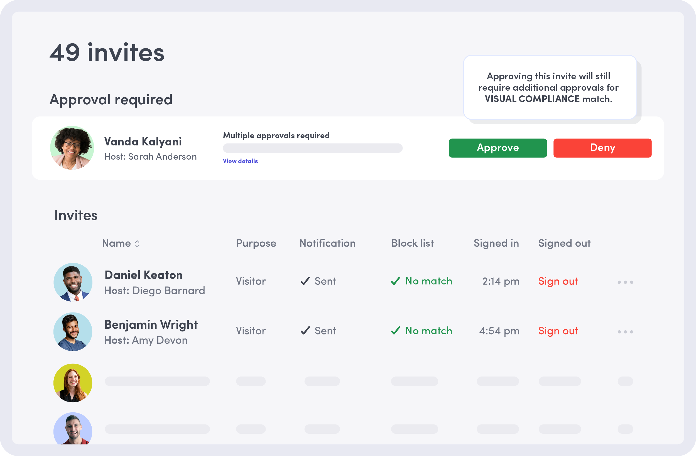</a> 
<b>Envoy</b> <i>[Dashboard]</i> · Visitor invites / approval queue <a href="https://envoy.com/">envoy.com</a>
</td>
<td align="center" width="33%" valign="top">
<a href="https://www.dormakaba.com/ch-en">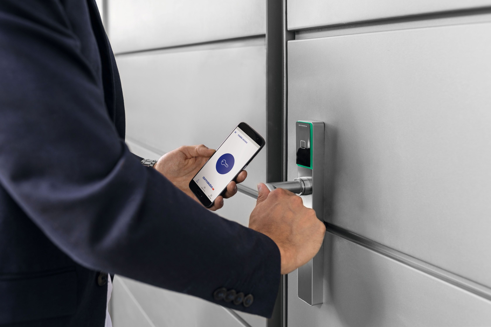</a> 
<b>dormakaba</b> <i>[Concept]</i> · Mobile Access unlocking — <b>Swiss-HQ</b> <a href="https://www.dormakaba.com/">dormakaba.com</a>
</td>
<td align="center" width="33%" valign="top">
<a href="https://www.getkisi.com/features">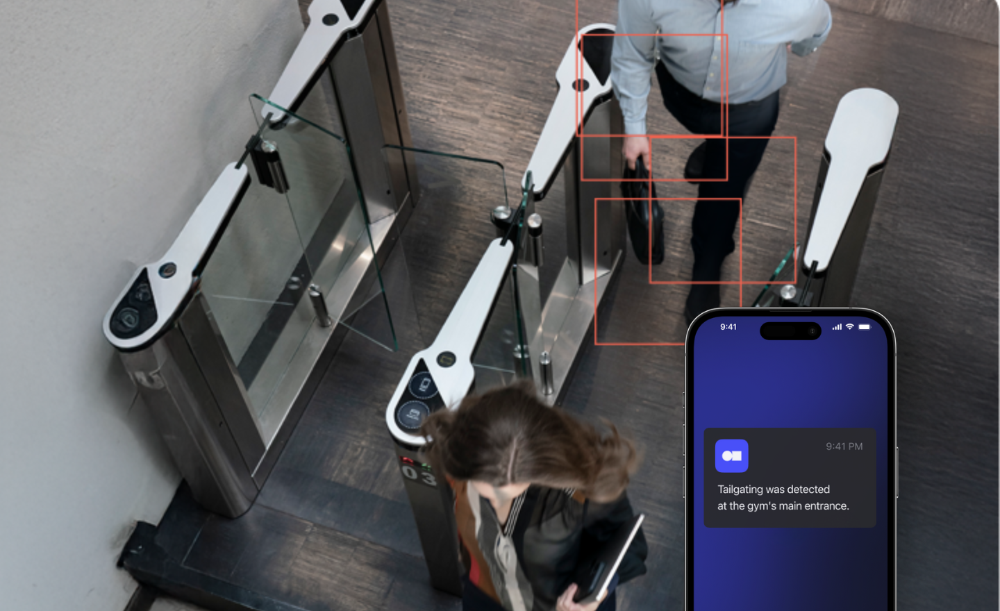</a> 
<b>Kisi</b> <i>[Concept]</i> · Tailgate-detection + phone alert <a href="https://www.getkisi.com/">getkisi.com</a>
</td>
</tr>
</table>

**Taxonomy note.** This segment combines two distinct buyer personas: **visitor management** software (HR/admin decision-makers — Envoy, Proxyclick / Eptura Visitor, SwipedOn, Robin Visitors) and **mobile access / credentials** (facilities/security — Kisi, HID Origo, Salto KS, Verkada Guest, Brivo, dormakaba exivo). Procurement is typically separate and listing them together is editorial convenience.

### E. Property-management ERP with embedded tenant portal

**Definition.** Vertical ERP suites for residential and mixed-use property management (rent ledgers, lease lifecycle, service-charge billing, contractor dispatch) with a tenant self-service portal as a first-class module — distinct from horizontal CAFM (Y) and global IWMS (A) by their DACH-housing-statute (Mietrecht, WEG, BetrKV) accounting and DE/CH banking integration.

**Persona.** Hausverwaltungen, institutional landlords (federal / cantonal / communal / cooperative), residential property-management firms. For BBL, the tenant portal embedded in an ERP is the alternative to building a custom Fiori frontend on SAP RE-FX (Segment Q).

| Product | HQ | Hosting | Pricing | SAP / AGOV | Notable feature | BBL fit |
|---|---|---|---|---|---|---|
| [Aareon Wodis Yuneo](https://www.aareon.de/Wodis-Yuneo.970622.html) | Mainz, DE | Cloud SaaS | Per administered unit | Aareon Connect; Blue Eagle for SAP customers | DE housing market leader | 🟢 DACH leader; Blue Eagle SAP RE-FX bridge |
| [Aareon RELion](https://www.aareon.de/) | Mainz, DE | Cloud / hybrid | Per unit | Aareon Connect | Commercial/mixed portfolios | 🟢 Commercial RE leader; relevant for federal portfolio |
| [Aareon Smart World / Mareon](https://www.aareon.de/) | Mainz, DE | Cloud | Per unit | Aareon Connect | Embedded CRM-Mieterportal | 🟢 Embedded Mieterportal pattern; Aareon ecosystem |
| [Aareon Blue Eagle (SAP IS-RE add-on)](https://www.aareon.de/) | Mainz, DE | SAP-hosted / hybrid | Quote | Native SAP IS-RE / RE-FX add-on | Direct SAP-side integration | 🟢 Direct SAP RE-FX add-on; closest fit to BBL's SAP core |
| [Karthago (UTS)](https://www.aareon.de/KARTHAGO.970673.html) | DE | Hybrid | Per unit | Aareon Connect | WEG + Miet | 🟡 DACH residential; WEG-focused |
| [immoware24](https://www.immoware24.de/) | Halle, DE | Cloud SaaS | Per unit | API | Cloud-native German PM; FCR Immobilien shareholder since 26 Mar 2025 | 🟡 German cloud PM; no federal-CH track |
| [Haufe axera](https://www.haufe.com/) | Freiburg, DE | Cloud SaaS | Per unit | GoBD-certified | German cloud PM | 🟡 German cloud PM; no federal-CH track |
| [DOMUS Software](https://www.domus-software.de/) | Aschheim, DE | Hybrid | Per unit | Open API | Long-standing DACH PM | 🟡 DACH PM; some CH reach |
| [CREM SOLUTIONS iX-Haus](https://www.crem-solutions.de/) | Ratingen, DE | On-prem / hybrid | Per user | SAP, BMS | Commercial RE strength | 🟡 Commercial RE; SAP integration |
| [Yardi Voyager + RentCafe](https://www.yardi.com/) | Santa Barbara, USA | Cloud / private | Per unit | Open APIs | US multifamily with strong EMEA | 🟡 Multifamily; some CH presence |
| [MRI Software](https://www.mrisoftware.com/) | Solon (OH), USA | Cloud | Per unit | SAP, Workday | Capita One UK; Anacle APAC; Proptech Labs ANZ | 🟡 Multifamily; weak federal-CH fit |
| [AppFolio](https://www.appfolio.com/) | Santa Barbara, USA | Cloud | Per unit + base | API | US SMB multifamily | 🔴 US SMB multifamily |
| [Buildium (RealPage)](https://www.buildium.com/) | Boston, USA | Cloud | Tiered + per unit | RealPage suite | SMB multifamily | 🔴 US SMB multifamily |
| [RealPage](https://www.realpage.com/) | Richardson (TX), USA | Cloud | Per unit | Open API | Multifamily | 🔴 US multifamily |
| [Entrata](https://www.entrata.com/) | Lehi (UT), USA | Cloud | Per unit | Open API | US multifamily | 🔴 US multifamily |
| [GARAIO REM + aroov](https://www.garaio-rem.ch/) | Bern, CH | Cloud (CH) | Per unit | Abacus, Navision, Odoo, SAP, SAP S/4HANA | Per Digital Real Estate Summit 2025 (digitalrealestate.ch): "Heute werden mit den Lösungen des PropTech Unternehmens mehr als 1.6 Millionen Mietobjekte verwaltet"; aroov is a JV with Swiss Mobiliar | 🟢 Swiss-domiciled; SAP S/4HANA; CH market leader |
| [W&W ImmoTop2 / Rimo R5](https://www.wwimmo.ch/) | Affoltern am Albis, CH | Cloud / on-prem | Per user | Open interfaces | CH leader for property managers (>4,000 customers); Rimo R5 supports DE/FR/IT | 🟢 Swiss-domiciled CH leader; DE/FR/IT support |
| [Abacus AbaImmo](https://www.abacus.ch/) | Wittenbach, CH | Hybrid | Per module | Abacus FIBU/CRM | Swiss ERP suite; CHF 1.5 m minority stake in Tayo (since 2021) for tenant portal | 🟢 Swiss ERP; wide federal/cantonal presence |
| [Fairwalter](https://www.fairwalter.com/) | Zurich, CH (W&W subsidiary) | Azure CH | Per unit; transparent | Banking APIs | Hosted on Microsoft Azure in Switzerland | 🟢 Swiss-domiciled; Azure CH residency |
| [Immomig](https://www.immomig.ch/) | Sursee/Fribourg, CH (founded 2004 by Patrick Maillard) | Cloud (CH) | Per agent | DigiRENT, dreamo.ch | AI all-in-one real-estate CRM; >6,000 users | 🟡 Swiss CRM-leaning; not tenant-portal-shaped |
| [Tayo](https://www.tayo.ch/) | Lausanne, CH | Cloud (CH) | Per unit | Open API; banking | **Swiss-domiciled** tenant-portal SaaS; Abacus CHF 1.5 m minority stake since 2021 (also referenced under Abacus row) | 🟢 Swiss-domiciled native tenant-portal SaaS |
| [Arthur Online](https://www.arthuronline.co.uk/) | London, UK (Aareon) | SaaS | Per unit | Aareon ecosystem | UK SMB property | 🔴 UK SMB |
| [Momentum (Aareon)](https://www.momentum.se/) | Stockholm, SE (Aareon) | SaaS | Per unit | Nordic banking | Aareon Nordic platform | 🔴 Nordic; weak federal-CH fit |
| [iX-Haus plus](https://www.crem-solutions.de) | Ratingen, DE (CREM Solutions) | Cloud (browser front-end) | Per user | iX-Haus core | Browser front-end above iX-Haus; AI-OCR | 🟡 Commercial RE; browser front-end |
| [Haufe Real Estate Cloud](https://www.haufe.com) | Freiburg, DE (Haufe Group) | Cloud | Per unit | Open API | SaaS evolution of Haufe-Lexware Real Estate | 🟡 SaaS PM; German |
| [Real4M](https://www.real4m.com) | DACH | Cloud | Per unit | Open API | PM SaaS for institutional residential | 🟡 DACH institutional |
| [Solyp](https://www.solyp.com) | DACH | Cloud | Per unit | Open API | ERP for portfolio property managers | 🟡 DACH portfolio managers |
| [connectedcare](https://www.connectedcare.de) | DE | Cloud | Per unit | Open API | Specialist for healthcare / senior-housing | 🔴 Niche (healthcare/senior housing) |

**Preview — selected vendors** (product screenshots, diagrams or illustrations from vendors' own pages; image-type tag in italics; links go to source pages):

<table>
<tr>
<td align="center" width="33%" valign="top">
 
<b>Aareon Wodis Yuneo</b> <i>[Logo]</i> · No public Wodis Yuneo screenshot — product pages gated <a href="https://www.aareon.de/">aareon.de</a>
</td>
<td align="center" width="33%" valign="top">
 
<b>GARAIO REM + aroov</b> <i>[Diagram]</i> · Functional plan (Funktionen page) <a href="https://www.garaio-rem.ch/">garaio-rem.ch</a>
</td>
<td align="center" width="33%" valign="top">
 
<b>W&amp;W Rimo R5 / ImmoTop2</b> <i>[Dashboard]</i> · Rimo R5 main view <a href="https://www.wwimmo.ch/produkte/rimor5/">wwimmo.ch/rimor5</a>
</td>
</tr>
<tr>
<td align="center" width="33%" valign="top">
<a href="https://www.abacus.ch/branchen/immobilienbranche/immobilienbewirtschaftung/uebersicht">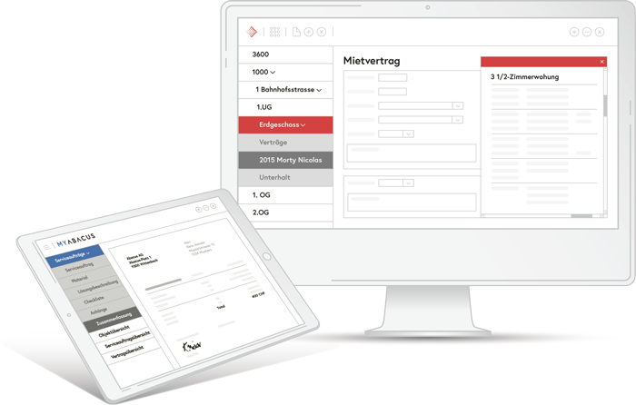</a> 
<b>Abacus AbaImmo</b> <i>[Illustration]</i> · AbaImmo product explainer <a href="https://www.abacus.ch/">abacus.ch</a>
</td>
<td align="center" width="33%" valign="top">
<a href="https://www.yardi.com/suite/voyager-suite/">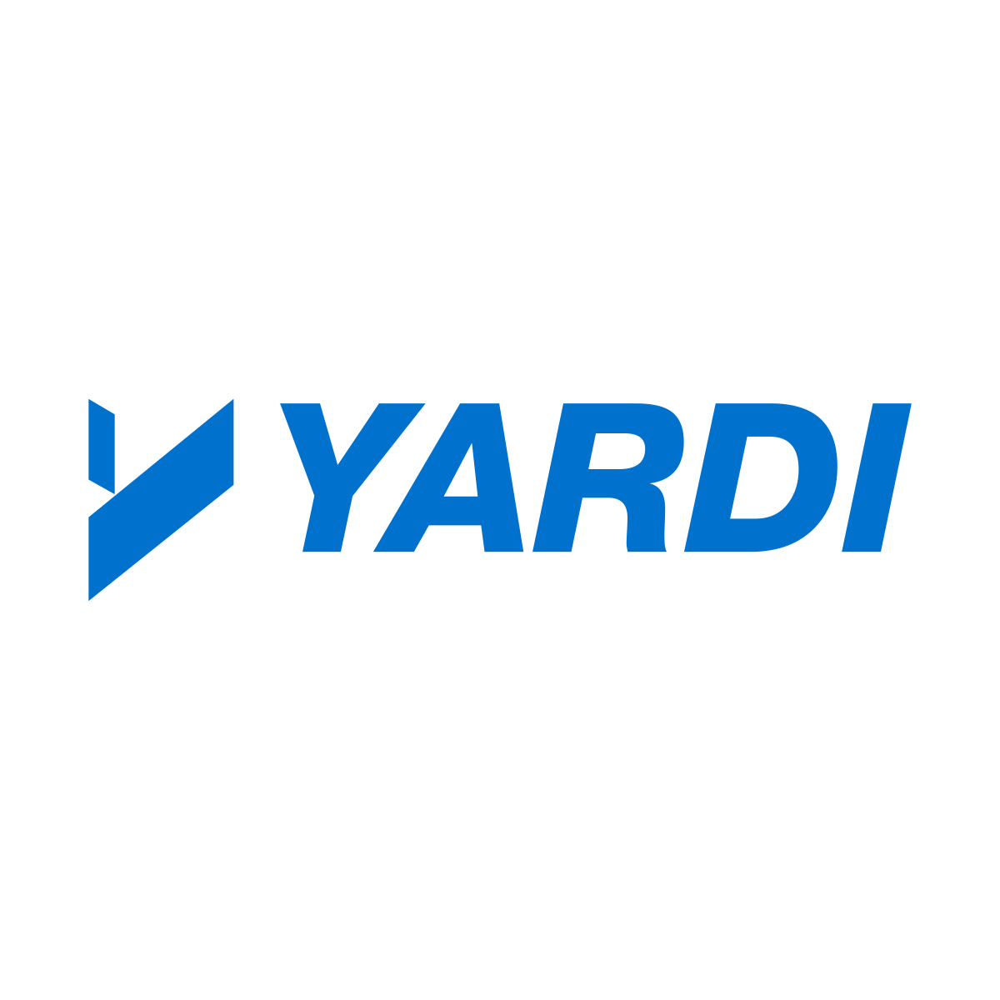</a> 
<b>Yardi Voyager + RentCafe</b> <i>[Dashboard]</i> · MaintenanceIQ hero (Voyager suite) <a href="https://www.yardi.com/">yardi.com</a>
</td>
<td align="center" width="33%" valign="top">
<a href="https://www.mrisoftware.com/">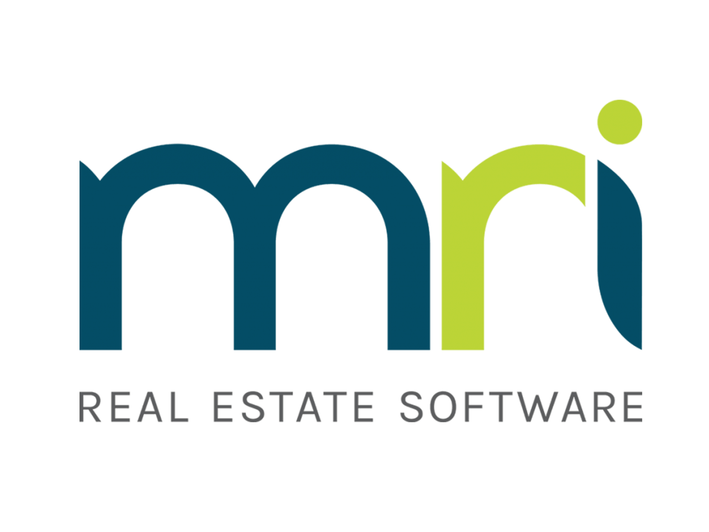</a> 
<b>MRI Software</b> <i>[Logo]</i> · Public product screenshots gated behind demo <a href="https://www.mrisoftware.com/">mrisoftware.com</a>
</td>
</tr>
</table>

**Maturity.** Mature; consolidating under Aareon in DACH and MRI/Yardi globally.
**Swiss-context note.** GARAIO REM, W&W Immo-Informatik (and Fairwalter), Abacus AbaImmo and Immomig are Swiss-domiciled. For BBL, SAP RE-FX integration is typically achieved within S/4HANA RE-FX itself with a Fiori or partner portal layer.

### F. Residential tenant-experience platforms

**Definition.** Tenant-facing apps and portals deployed *on top of* a PM ERP (Segment E) — usually with their own communication, ticketing and document-vault modules but no rent-accounting core. Distinct from Segment B (WEX) by residential focus and from Segment E by absence of an ERP-grade accounting engine.

**Persona.** Hausverwaltungen and large landlords wanting a tenant-facing modern UX without changing their underlying ERP; tenants needing a single app for damage reports, document downloads and communication.

| Product | HQ | Hosting | Pricing | Notable feature |
|---|---|---|---|---|
| [casavi](https://casavi.com/) | Munich, DE | Cloud SaaS (GDPR) | Per unit; modular | >1,600 customers in DACH; Aareon Connect (Sigma, Yuneo), DOMUS, ImPower |
| [facilioo](https://www.facilioo.de/) | Berlin, DE | Cloud SaaS | Per unit | Aareon Connect; ista partnership |
| [Allthings](https://allthings.me/) | Basel, CH (ETH Zurich spin-off 2013) | Cloud | Per unit; modular | "App store for buildings"; >200 European RE clients; open API/SDK; ERPs incl. Wodis/Yuneo, SAP |
| [wohnungshelden](https://www.wohnungshelden.de/) | Munich, DE (Aareon) | Cloud | Per unit | Rental application + matching |
| [Immomio](https://immomio.com/) | Hamburg, DE | Cloud | Per unit | Aareon Connect (Sigma/Yuneo/Immotion); digital rental |
| [iDWELL](https://www.idwell.com/) | Vienna, AT | Cloud | Per unit | Aareon Connect; AT tenant app |
| [Spiri.Bo](https://www.spiribo.com/) | DE | Cloud | Per unit | Aareon Connect partner |
| [etg24](https://www.etg24.de/) | Hamburg, DE | Cloud | Per unit | Aareon Connect; WEG focus |
| [EverReal](https://everreal.co/) | Munich, DE | Cloud | Per unit | Aareon Connect; lettings + tenant lifecycle |
| [Yardi RentCafe Resident](https://www.yardi.com/) | Santa Barbara, USA | Cloud | Per unit | Voyager-integrated |
| [Bilt Rewards](https://www.biltrewards.com/) | New York, USA | Cloud | Free to tenants; landlord fees | Rent-as-loyalty; US-only |
| [Livly](https://www.livly.io/) | Chicago, USA | Cloud | Per unit | RealPage / Yardi |
| [emonitor](https://www.emonitor.ch) | Zurich, CH | Cloud (CH) | Per unit | **Swiss-domiciled** residential leasing process platform; popular with CH institutional landlords |
| [HoldOn](https://www.holdon.ch) | CH | Cloud (CH) | Per unit | Tenant document handover and onboarding |
| [Liobit](https://www.liobit.de) | DE | Cloud (DE) | Per unit | Tenant-side mobile app |
| [KIWI.KI](https://kiwi.ki) | Berlin, DE | Cloud + hardware | Per unit + hardware | Keyless access for residential building common doors; widely deployed in DE multifamily |
| [propster](https://www.propster.com) | Vienna, AT | Cloud | Per unit | Buyer self-customisation portal during construction; bridges to Segment W (BIM/CDE) |
| [swarm.it](https://swarm.it) | AT | Cloud | Per unit | Resident community + service-marketplace |

**Preview — selected vendors** (product screenshots / mobile-app UIs from vendors' own pages; links go to source pages):

<table>
<tr>
<td align="center" width="50%" valign="top">
<a href="https://www.allthings.me/products/portal---das-umfassende-mieterportal">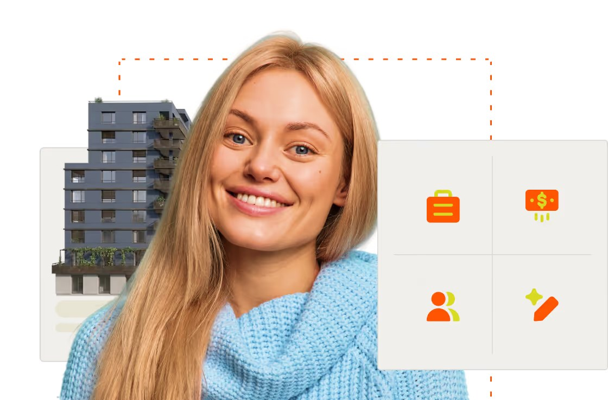</a> 
<b>Allthings</b> <i>[Product visual]</i> · Mieterportal "Portale" — <b>Swiss-HQ, ETH spin-off</b> <a href="https://allthings.me/">allthings.me</a>
</td>
<td align="center" width="50%" valign="top">
<a href="https://casavi.com/de/">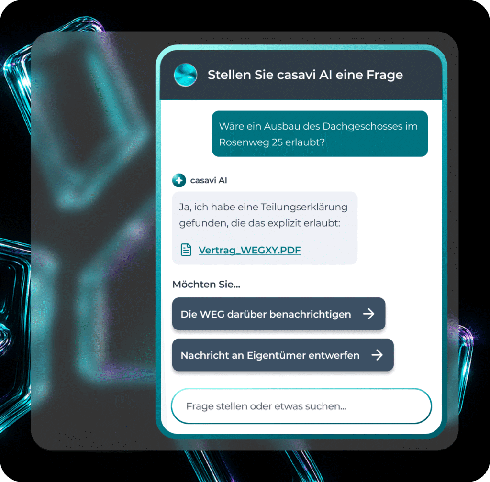</a> 
<b>casavi</b> <i>[Screenshot]</i> · casavi AI chat panel <a href="https://casavi.com/">casavi.com</a>
</td>
</tr>
<tr>
<td align="center" width="50%" valign="top">
<a href="https://facilioo.de/">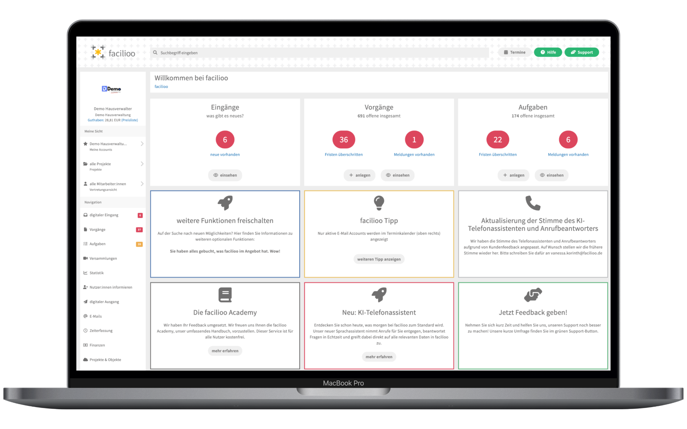</a> 
<b>facilioo</b> <i>[Dashboard]</i> · CRM kanban tiles + AI telephone-assistant <a href="https://www.facilioo.de/">facilioo.de</a>
</td>
<td align="center" width="50%" valign="top">
<a href="https://www.idwell.com/loesungen/mieterapp/">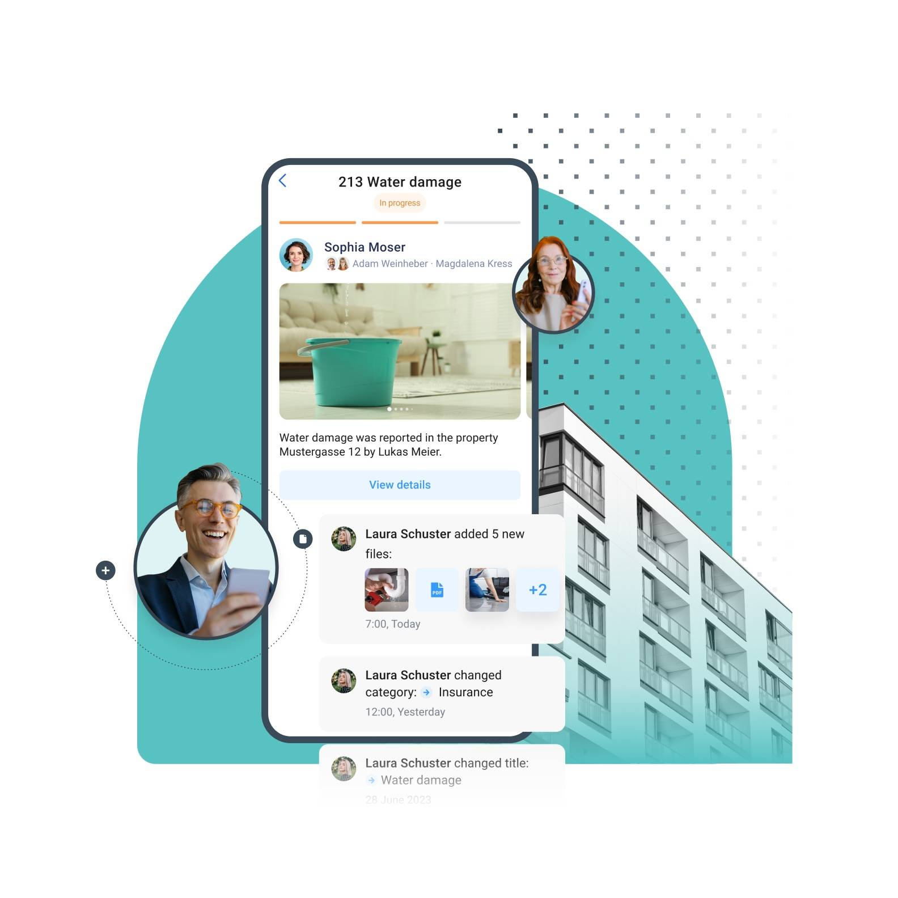</a> 
<b>iDWELL</b> <i>[Mobile UI]</i> · Mieterapp ticket detail with chat thread <a href="https://www.idwell.com/">idwell.com</a>
</td>
</tr>
</table>

**Swiss-context note.** Allthings is Swiss-HQ (Basel, ETH Zurich spin-off 2013). casavi and facilioo are widely deployed in Switzerland through the Aareon channel.

### G. Schadensmeldung / repair-ticketing / contractor dispatch

**Definition.** Damage-reporting / repair-ticketing / contractor-dispatch software — distinct from FM CMMS (Y) by tenant-facing intake and from PM ERPs (E) by specialised tradesperson marketplaces. Boundary with Segment K (AI tenant copilots) is increasingly blurry as triage moves to LLM-driven routing.

**Persona.** Hausverwaltungen handling tenant-reported damage; contractor coordinators in large portfolios; tenants reporting issues via app or web.

| Product | HQ | Pricing | Notable feature |
|---|---|---|---|
| [Fixflo](https://www.fixflo.com/) | London, UK (Aareon) | Per unit | UK repairs reporting standard |
| [Plentific](https://www.plentific.com/) | London, UK | Per unit + per work-order | UK social housing dispatch; Aareon Connect partner |
| [Yarowa](https://www.yarowa.com/) | Zug, CH (Metallstrasse 9, 6300 Zug — not Lucerne) | Per transaction | Founded May 2017 (Akeret, Kagi); CHF 12.4 m Series A Jul 2022 led by Eos Venture; subsidiaries Munich, London, Milan |
| [Aareon Mareon](https://www.aareon.de/) | Mainz, DE | Per unit | Embedded in Aareon |
| [PlanRadar](https://www.planradar.com/) | Vienna, AT | Per user | Defect / snagging / inspections; widely used in CH |
| [MaintainX](https://www.getmaintainx.com/) | Raleigh (NC), USA | Per user | Mobile-first CMMS |
| [UpKeep](https://www.upkeep.com/) | Los Angeles, USA | Per user | Mobile CMMS |
| [imofix.io](https://imofix.io/) | CH/DE | Per unit | GARAIO REM partner |
| [Aareon Service Cloud / casavi Mareon-Connect](https://www.aareon.com) | Mainz / Munich, DE | Per unit | Damage workflow inside Aareon ecosystem |
| [Repairnet](https://www.repairnet.de) | DE | Per unit | DE damage marketplace |
| [comgest](https://www.comgest.de) | DE | Per unit | Specialist Schadensmanagement |
| [Kayoom](https://www.kayoom.com) | DE | Per unit | Damage-ticket orchestration |

**Preview — selected vendors** (product screenshots from vendors' own pages; links go to source pages):

<table>
<tr>
<td align="center" width="33%" valign="top">
<a href="https://www.yarowa.com/">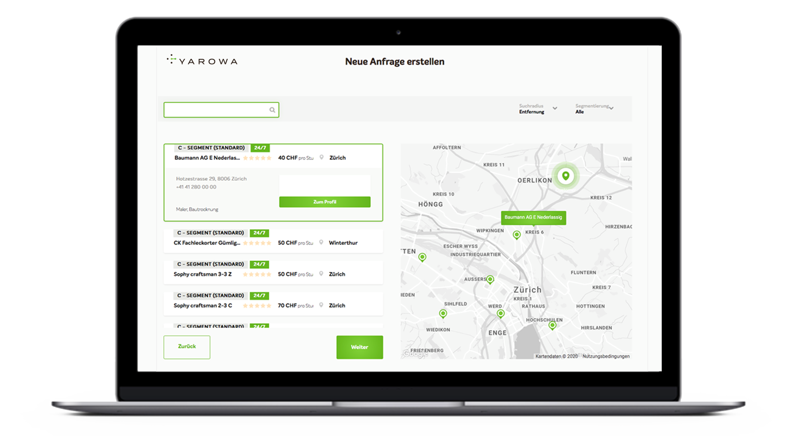</a> 
<b>Yarowa</b> <i>[Screenshot]</i> · Claims/repairs marketplace UI — <b>Swiss-domiciled (Zug)</b> <a href="https://www.yarowa.com/">yarowa.com</a>
</td>
<td align="center" width="33%" valign="top">
 
<b>Fixflo</b> <i>[Screenshot]</i> · Repairs-reporting product UI <a href="https://www.fixflo.com/">fixflo.com</a>
</td>
<td align="center" width="33%" valign="top">
<a href="https://www.planradar.com/de/produkt/bauen/maengelmanagement/">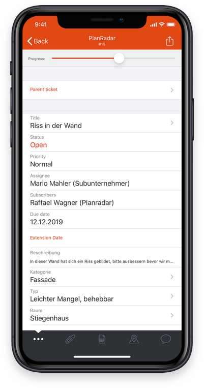</a> 
<b>PlanRadar</b> <i>[Mobile UI]</i> · Mängelmanagement on iPhone <a href="https://www.planradar.com/">planradar.com</a>
</td>
</tr>
</table>

### H. Move-in / move-out / inspection

**Definition.** Mobile / tablet apps that capture lease-handover state — photo/video evidence, meter readings, defect lists, signatures — distinct from ongoing facility maintenance (Y) and damage reporting (G).

**Persona.** Property managers conducting Abnahme / Übergabe protocols; tenants signing handover; insurance claims teams relying on prior-state evidence.

| Product | HQ | Notable feature |
|---|---|---|
| [W&W Abnahme-App](https://www.wwimmo.ch/) | Affoltern am Albis, CH | Integrated to Rimo R5 / ImmoTop2 |
| [GARAIO REM Digitales Abnahmeprotokoll (DAP)](https://www.garaio-rem.ch/) | Bern, CH | Mobile handovers; integrated to REM |
| [Properly](https://getproperly.com/) | Vancouver, CA | Inspection workflows |
| [Inspectify](https://www.inspectify.com/) | Charlotte (NC), USA | Move-in inspections |
| [Allthings inspection module](https://allthings.me/) | Basel, CH | Native to Allthings tenant app |
| [HouseView](https://www.houseview.io/) | Various | 3D capture for inspections |
| [handover.de](https://www.handover.de) | DE | Mobile-first apartment-handover protocols |
| [Inspizio](https://www.inspizio.ch) | CH | **Swiss-domiciled** handover protocols with photographic evidence |

**Preview — selected vendor** (product screenshot; link goes to source page):

<table>
<tr>
<td align="center" width="100%" valign="top">
 
<b>Properly</b> <i>[Screenshot]</i> · Inspection workflow ("Our solution for owners") <a href="https://getproperly.com/">getproperly.com</a>
</td>
</tr>
</table>

### I. eSignature & federal identity

**Definition.** QES / AES-compliant electronic-signature platforms and federal identity providers covering ZertES (CH), eIDAS (EU), and AGOV / SwissID / e-ID for the public sector. Distinct from generic e-signature (DocuSign, Adobe Sign) by Swiss federal trust-list eligibility.

**Persona.** Legal / IT teams signing leases, contracts and NDAs at federal / cantonal level; tenant-side users accepting QES-signed contracts; federal / cantonal authorities federating login via AGOV.

| Product | HQ | Notable feature |
|---|---|---|
| [Skribble](https://www.skribble.com/) | Zurich, CH (Förrlibuckstrasse 190); office in Karlsruhe, DE | QES compliant with Swiss ZertES and EU eIDAS; partner of Swisscom Trust Services and ELCA trustID; per Skribble press release (skribble.com, 1 Sep 2022): the €10 m Series A was "led by Acton Capital Partners GmbH from Munich… VI Partners AG, from Altendorf, Switzerland, is on board as co-lead"; ISO 27001 |
| [SwissSign / SwissID](https://www.swisssign.com/) | Glattbrugg, CH | Swiss Post-owned identity and trust service |
| [AGOV](https://www.agov.admin.ch/) | Bundeskanzlei DTI, Bern | Federal login (CH-LOGIN successor) for federal, cantonal, communal authorities; passwordless via AGOV access App or hardware security key; **1.6 m residents with AGOV accounts and 8 m logins in 2025**; SAML/OIDC IdP; operated by FOITT |
| [Swiss e-ID](https://www.eid.admin.ch/) | EJPD / Bundeskanzlei | State-issued, SSI-based; planned launch **1 December 2026**; usable as login factor in AGOV |
| [eIAM / sign.eIAM](https://www.eiam.admin.ch/) | FOITT, CH | Federal IAM for **internal/staff access** to federal-administration systems. **AGOV replaces CH-LOGIN for public users**; eIAM remains in service for federal staff — the two are co-existent, not predecessor/successor |
| [DocuSign](https://www.docusign.com/) | San Francisco, USA | Largest international e-signature provider |
| [Adobe Sign / Acrobat Sign](https://www.adobe.com/sign.html) | San José, USA | Tightly integrated to Adobe ID |
| [Yousign](https://yousign.com/) | Caen, FR | eIDAS-compliant EU vendor |
| [Scrive](https://www.scrive.com/) | Stockholm, SE | Aareon Connect partner for digital signatures |

**Preview — selected vendors** (product screenshots, workflow diagrams or illustrations from vendors' own pages; image-type tag in italics; links go to source pages):

<table>
<tr>
<td align="center" width="33%" valign="top">
<a href="https://www.skribble.com/">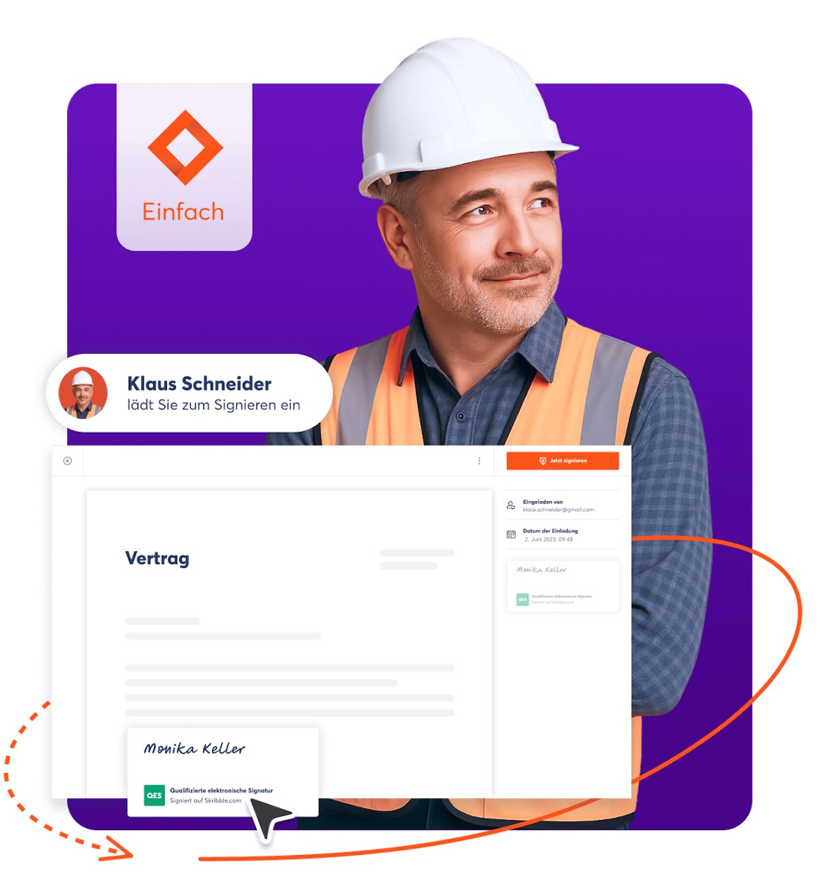</a> 
<b>Skribble</b> <i>[Interface]</i> · QES signing screen (DE landing) <a href="https://www.skribble.com/">skribble.com</a>
</td>
<td align="center" width="33%" valign="top">
<a href="https://www.swisssign.com/">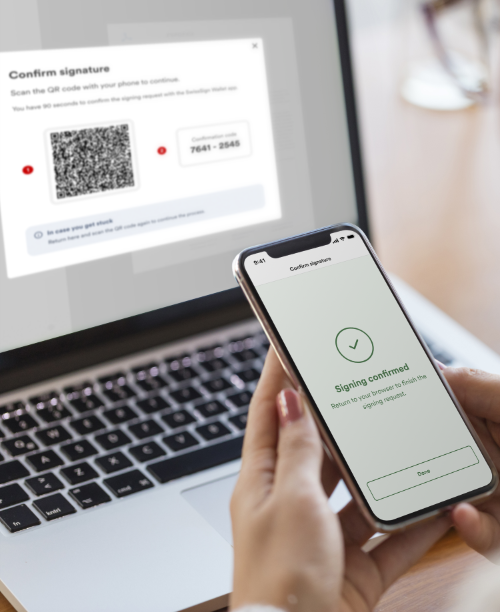</a> 
<b>SwissSign / SwissID</b> <i>[User-supplied]</i> · SwissID product visual <a href="https://www.swisssign.com/">swisssign.com</a>
</td>
<td align="center" width="33%" valign="top">
<a href="https://www.agov.admin.ch/">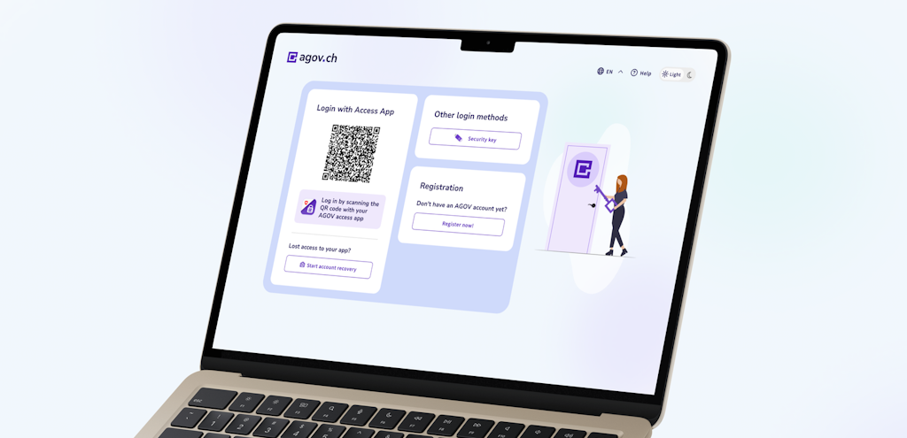</a> 
<b>AGOV</b> <i>[Illustration]</i> · AGOV access App screen <a href="https://www.agov.admin.ch/">agov.admin.ch</a>
</td>
</tr>
<tr>
<td align="center" width="33%" valign="top">
 
<b>DocuSign</b> <i>[Workflow]</i> · IDV identity-verification workflow <a href="https://www.docusign.com/">docusign.com</a>
</td>
<td align="center" width="33%" valign="top">
<a href="https://www.adobe.com/sign.html">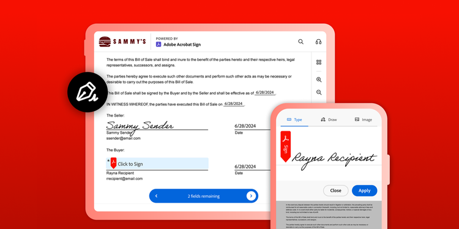</a> 
<b>Adobe Sign</b> <i>[User-supplied]</i> · Adobe Acrobat Sign product visual <a href="https://www.adobe.com/sign.html">adobe.com/sign</a>
</td>
<td align="center" width="33%" valign="top">
<a href="https://yousign.com/">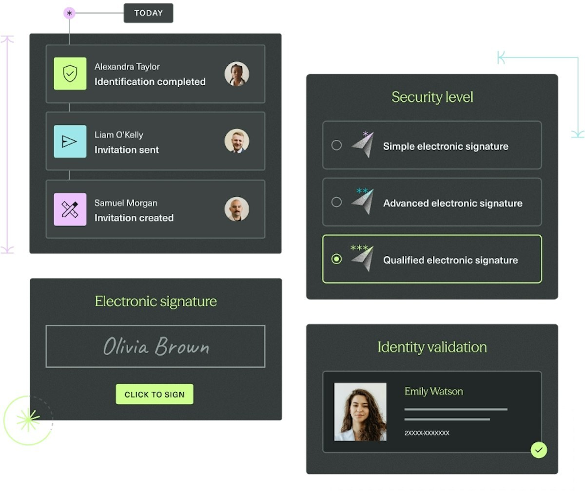</a> 
<b>Yousign</b> <i>[Hero]</i> · Homepage product illustration <a href="https://yousign.com/">yousign.com</a>
</td>
</tr>
</table>

### J. Document Vault / e-Akte / GEVER

**Definition.** Electronic records and process management — Geschäftsverwaltung (GEVER) in CH, E-Akte in DE, ELAK in AT — sitting at the intersection of DMS, ECM, BPMN workflow and dossier/records management. The Swiss federal market is highly concentrated, driven by the WTO-tendered GENOVA programme.

**Persona.** Federal/cantonal/communal administrative units; in the BBL context, the dossier and contract repository for Bundesimmobilien, including lease contracts, building dossiers, and procurement files.

| Product | HQ | Hosting | Pricing | Notable feature |
|---|---|---|---|---|
| [Acta Nova (RUBICON IT)](https://www.rubicon.eu/en/products/acta-nova/) | Vienna, AT (CH-Vertrieb via RUBICON CH) | On-prem + Swiss federal data centre (ISCeco operated) | Per-seat licence + ops | **Dominant CH federal GEVER**: 26,000+ federal employees since August 2021; integrator Atos Switzerland; GENOVA programme investment CHF 142 m per SFAO audit. Also at SBB, VBZ, 900+ Swiss municipalities |
| [Fabasoft eGov-Suite](https://www.fabasoft.com/en/on-egov/egov-suite) | Linz, AT | Fabasoft PROCECO Cloud (CH/DE/AT regions) | Per-seat | DE "E-Akte Bund" rollout in 200+ federal authorities since 2017 contract; AT ELAK since 2004; CH variant supports GEVER; ISO 27001, BSI C5, first-global EU Cloud Code of Conduct Level 3 (2021) |
| [OneGov GEVER (Fabasoft 4teamwork)](https://www.fabasoft.com/en/on-proceco/onegov-gever) | Bern, CH (4teamwork — part of Fabasoft Group since 2022) | Fabasoft PROCECO Cloud (Swiss data location) | Per-seat | "swiss made software"; deployed in Cantons Aargau, St. Gallen, Zug + many municipalities; cloud-native rebuild on PROCECO ecosystem launched 2024 |
| [CMI Konsul](https://www.cmiag.ch) | Zug, CH (CMI AG) | On-prem + CH cloud | Per-seat | Swiss-cantonal GEVER + Schul-CMI; predecessor to Acta Nova in some federal offices |
| [Axioma (Glaux Soft)](https://www.glauxsoft.com) | Bern, CH | On-prem / CH cloud | Per-seat | Swiss-domiciled records & workflow product line |
| [iLM (KS-Software / Kanzleisoft)](https://www.ks-software.ch) | CH | On-prem / cloud | Per-seat | Swiss municipal/Kanton dossier mgmt |
| [d.velop documents (d.3ecm)](https://www.d-velop.com) | Gescher, DE | On-prem + d.velop cloud | Per-user | DE ECM mid-market leader |
| [DocuWare](https://www.docuware.com) | Germering, DE (acq. by Ricoh 2019) | Cloud + on-prem | Per-user / per-document | DACH-strong DMS in SME/Hausverwaltung |
| [ELO ECM](https://www.elo.com) | Stuttgart, DE | On-prem + ELO Business Cloud | Per-user | DACH ECM; KGSt and IVV references |
| [OpenText Content Suite / Extended ECM](https://www.opentext.com) | Waterloo, CA | On-prem + OpenText Cloud | Per-user | Enterprise ECM; SAP-integrated archive |
| [M-Files](https://www.m-files.com) | Tampere, FI | Cloud + on-prem | Per-user | Metadata-driven DMS |
| [nscale (Ceyoniq → Kyocera)](https://www.kyocera.com/de) | Bielefeld, DE | On-prem | Per-user | German public-sector ECM |
| [Aareon Archiv kompakt / DMS](https://www.aareon.com) | Mainz, DE | Cloud | Bundled with Aareon ERP | DMS bundled with Aareon RELion/Wodis |
| [SharePoint Online (Microsoft 365)](https://www.microsoft.com/microsoft-365) | Redmond, US (CH residency available via Swiss DCs) | Microsoft Cloud (CH/EU) | Per-user M365 | Federal alignment depends on tenant-residency configuration |

**Maturity.** Mature in CH at federal level (Acta Nova is the standard since August 2021, operated by ISCeco); consolidating in cantons (Fabasoft OneGov GEVER displacing legacy CMI and home-grown solutions); mature in DE at federal level (E-Akte Bund on Fabasoft eGov-Suite).

**Swiss-context note.** The CH federal GEVER market is effectively a single-product standard: **Acta Nova / RUBICON IT** operated by Atos Switzerland and the federal ISCeco operations centre. Any BBL-internal documentation should consistently cite RUBICON IT GmbH (Vienna) as the manufacturer, with Atos as integrator, and ISCeco as operator — and should correct any prior attribution to "Glaux Soft", which produces the unrelated Axioma line. Cantonal GEVER is more fragmented but dominated by Fabasoft OneGov GEVER (4teamwork) and CMI Konsul.

**Taxonomy note.** Overlaps with Segment R (sovereign hosting) — Acta Nova on ISCeco federal-internal infrastructure; Fabasoft PROCECO Cloud has Swiss-hosted instances. Overlaps with Segment BB (workflow automation) at the BPMN engine layer.

### K. AI Tenant Copilots / Conversational Service

**Definition.** AI-powered conversational interfaces (voice and chat agents, RAG-based knowledge assistants) deployed in tenant-service flows: Schadensmeldung triage, FAQ on lease terms, payment-question handling, appointment booking for technicians, and Versammlung-summary generation. Distinct from generic LLMs by their PM-vertical training data and PM-ERP/CAFM integration.

**Persona.** Tenant-service contact centres of large landlords; Hausverwaltungen automating Tier-1 inbound. For BBL, the relevant use is multilingual (DE/FR/IT/EN/RM) federal-quality tenant service over a sovereign LLM stack.

| Product | HQ | Hosting | Pricing | Notable feature |
|---|---|---|---|---|
| [Parloa](https://www.parloa.com) | Berlin, DE (offices Munich, NY, San Francisco) | Cloud (DE/EU) | Enterprise quote | "Agent Management Platform"; €310 m Series D January 2026 at $3 b valuation (EU-Startups); employing **more than 380 people at time of Series D close (January 2026)** per Silicon Republic, with publicly stated plan to grow headcount to 600 by end of 2026; ISO 27001 / SOC 2 / GDPR / HIPAA / DORA; customers incl. Swiss Life, Allianz, SAP, Booking.com, TeamViewer |
| [Cognigy](https://www.cognigy.com) | Düsseldorf, DE | Cloud (DE/EU) | Enterprise quote | **Acquired by NICE end of 2025** per Startup-in-Europe (Jan 2026); enterprise conversational AI; agentic-AI platform |
| [PolyAI](https://poly.ai) | London, UK | Cloud (UK/EU/US) | Per-minute | Voice-first enterprise; €73.2 m Series D 2025 |
| [moin AI](https://www.moin.ai) | Hamburg, DE | Cloud (DE) | Subscription | DE customer-service chatbot |
| [Synthflow](https://synthflow.ai) | Berlin, DE | Cloud | Per-minute | Voice agent platform |
| [Vapi](https://vapi.ai) | San Francisco, US (Y Combinator) | Cloud | Per-minute | Developer voice-agent infra |
| [Bland](https://www.bland.ai) | San Francisco, US | Cloud | Per-minute | Voice agent infra |
| [Aareon CRM-Portal AI / Allthings AI](https://www.aareon.com) | Mainz, DE | Cloud | Bundled with Aareon ERP | Tenant CRM with embedded chat; Aareon's TPG-CDPQ ownership since closing in H2 2024 (transaction enterprise value €3.9 b per TPG press release of 24 June 2024) |
| [casavi smartflows](https://casavi.com/en) | Munich, DE (Aareon subsidiary) | Cloud (DE) | Add-on subscription | Workflow automation with LLM triage; integrated with Hausverwalter-Software |
| [Knock](https://www.knockcrm.com) | Seattle, US | Cloud (US) | Per-unit | US multifamily lead-management AI |
| [RentDynamics](https://rentdynamics.com) | Lehi, US | Cloud (US) | Per-unit | US multifamily contact-centre AI |
| [Lobby](https://www.lobby.io) | UK | Cloud | Subscription | UK BTR resident assistant |
| [Famulor](https://famulor.io) | EU | Cloud | Per-minute | EU voice-agent for property/SME |
| [AskHive.ai](https://www.askhive.ai) | UK | Cloud | Subscription | UK property voice agents |
| [Renty](https://renty.ai) | DE | Cloud (DE) | Subscription | German Hausverwaltung AI |
| [Lassie](https://lassie.com) | Stockholm, SE | Cloud (EU) | Per-property | Nordic property assistant |
| [Microsoft Copilot for M365](https://www.microsoft.com/microsoft-365/copilot) | Redmond, US (Swiss region available) | Microsoft Cloud (CH/EU) | M365 add-on per-user | Federal-relevant if M365 tenant is in CH regions |
| [Anthropic Claude via Swisscom Sovereign Cloud](https://trustservices.swisscom.com) | San Francisco, US (Anthropic) hosted in Swisscom CH DCs | Swisscom Sovereign Swiss AI Platform (CH) | Per-token; Swisscom packaging | Swiss-hosted enterprise LLM access |
| [Apertus (Swiss AI Initiative)](https://www.swiss-ai.org/apertus) | EPFL Lausanne + ETH Zurich + CSCS Lugano | CSCS "Alps" supercomputer + Swisscom Sovereign Swiss AI Platform | Open-source (Apache 2.0); compute paid | **Switzerland's first large-scale, open, multilingual LLM, released 2 September 2025; 8 B and 70 B parameters; trained on 15 trillion tokens covering 1,000+ languages incl. Swiss German and Romansh; ~40 % non-English data (ETH Zurich press release)** |
| [BärnBot (Stadt Bern Chatbot)](https://www.bern.ch) | Bern, CH (city admin) | Cloud (CH) | City budget | Reference e-gov chatbot in CH |
| [Lina (Stadt Zürich Chatbot)](https://www.stadt-zuerich.ch) | Zurich, CH | Cloud (CH) | City budget | Zurich city chatbot reference |
| [Swisscom Conversational AI](https://www.swisscom.ch) | Bern, CH | Swisscom Cloud (CH) | Enterprise quote | Genesys-integrated voice AI |

**Maturity.** Emerging-to-consolidating. The Parloa Series D (€310 m, January 2026) and Cognigy/NICE acquisition (end 2025) are the structural consolidation events on the European enterprise voice-agent side. Apertus (Sept 2025) is structurally significant for federal/sovereign use: it is the first open-weight LLM trained on Swiss German and Romansh.

**Swiss-context note.** A federal tenant copilot in CH faces three stacked data-protection regimes: GDPR (revFADP-aligned), the revised Swiss FADP itself (in force 1 September 2023), and the federal ISG / IG-Klassifizierung up to VERTRAULICH. The deployable options that satisfy all three are: (a) Apertus on Swisscom Sovereign Swiss AI Platform, (b) Apertus self-hosted on CH-region IaaS (Aspectra, Green.ch), or (c) Claude/GPT-4 under Microsoft Azure Switzerland or Swisscom data-residency contracts with explicit DPA. Joshua Tan (Lead Maintainer, Public AI Inference Utility, September 2025) described Apertus as "currently the leading public AI model: a model built by public institutions, for the public interest."

**Taxonomy note.** Overlaps with Segment G (Schadensmeldung) at the inbound-triage step, with Segment F (tenant experience) at the embedded chat layer, and with Segment AA (OSS) at the Apertus model layer. "AI tenant copilots" is also a horizontal *layer*, not a standalone vendor category — virtually every Segment B, F, G product is bolting on the same primitives (RAG over tenant docs, LLM-routed ticket triage, voice agents on top of CRMs), so reading this segment in isolation will overstate its standalone vendor depth.

### L. Smart-building IoT / digital twin

**Definition.** Platform layer that aggregates building telemetry (OT data from Segment AG) into a single tenant-facing or owner-facing data product — often a digital twin. Distinct from Segment AG by API-driven REST/MQTT consumption above the BACnet/IP gateway; distinct from Segment N by HVAC / lighting / space focus rather than billing.

**Persona.** Asset-management directorates; tenant-experience teams in commercial portfolios; ESG / sustainability officers consuming twin data for reporting (cross-listed with Segment Z).

| Product | HQ | Notable feature |
|---|---|---|
| [Spacewell Cobundu](https://spacewell.com/) | Antwerp, BE | Smart-building IoT in Nemetschek group |
| [Siemens Building X](https://www.siemens.com/buildingx) | Munich, DE | Buildings + grid + sustainability |
| [Johnson Controls OpenBlue](https://www.johnsoncontrols.com/openblue) | Cork, IE | Enterprise OT + AI |
| [Honeywell Forge](https://www.honeywell.com/) | Charlotte (NC), USA | Industrial / buildings |
| [Cisco Spaces](https://spaces.cisco.com/) | San Jose, USA | Wi-Fi-based location intelligence |
| [Cohesion](https://cohesionib.com/) | Chicago, USA | Smart-building + WEX |
| [View Smart](https://view.com/) | Milpitas (CA), USA | Smart glass + analytics |
| [Disruptive Technologies](https://www.disruptive-technologies.com/) | Oslo, NO | Cellular IoT sensors |
| [ThoughtWire](https://www.thoughtwire.com/) | Toronto, CA | Hospital + smart-building twin |
| [Comfy (Siemens)](https://www.comfyapp.com/) | Oakland (CA), USA | Siemens Smart Infrastructure |
| [Schindler Ahead](https://www.schindler.com/com/internet/en/mobility-solutions/products/schindler-ahead.html) | Ebikon, CH | **Swiss-domiciled** elevator/escalator IoT (ActionBoard, RemoteMonitoring); widespread in federal buildings |
| [KONE 24/7 Connected Services](https://www.kone.ch/) | Espoo, FI (KONE; CH subsidiary Brüttisellen) | Elevator/escalator predictive-maintenance IoT; deep CH installer presence |
| [Bosch IoT Suite](https://www.bosch-iotsuite.com/) | Stuttgart, DE | DE-anchored building/asset IoT; FIWARE-compatible |
| [BuildingMinds](https://buildingminds.com/) | Berlin, DE (Schindler family-backed) | Real-estate data platform / digital twin spanning asset, ESG and tenant data; CRREM, EU Taxonomy and EPBD modules — **cross-listed in Segment Z** |
| [Akenza](https://akenza.io) | Zurich, CH | **Swiss IoT platform**; LoRaWAN-friendly low-code; sits between Segment AG (OT) and Segment L (twin) for non-HVAC smart-building telemetry |
| [Locatee → Tango](https://www.tangoanalytics.com) | Zurich, CH (acquired by Tango Analytics 2024) | Workplace-utilisation analytics; CH presence retained; cross-listed in Segment V |
| [Pricer](https://www.pricer.com) | Stockholm, SE | Electronic shelf labels in workplace contexts |
| [Smartvatten](https://www.smartvatten.com) | Helsinki, FI | Water-leak monitoring with API to BMS |

**Preview — selected vendors** (product screenshots / explainer images from vendors' own pages; links go to source pages):

<table>
<tr>
<td align="center" width="50%" valign="top">
 
<b>Siemens Building X</b> <i>[Hero]</i> · Panoramic smart-city explainer <a href="https://www.siemens.com/buildingx">siemens.com/buildingx</a>
</td>
<td align="center" width="50%" valign="top">
 
<b>Johnson Controls OpenBlue</b> <i>[Banner]</i> · OpenBlue platform explainer <a href="https://www.johnsoncontrols.com/openblue">johnsoncontrols.com/openblue</a>
</td>
</tr>
<tr>
<td align="center" width="50%" valign="top">
<a href="https://www.schindler.com/com/internet/en/mobility-solutions/products.html">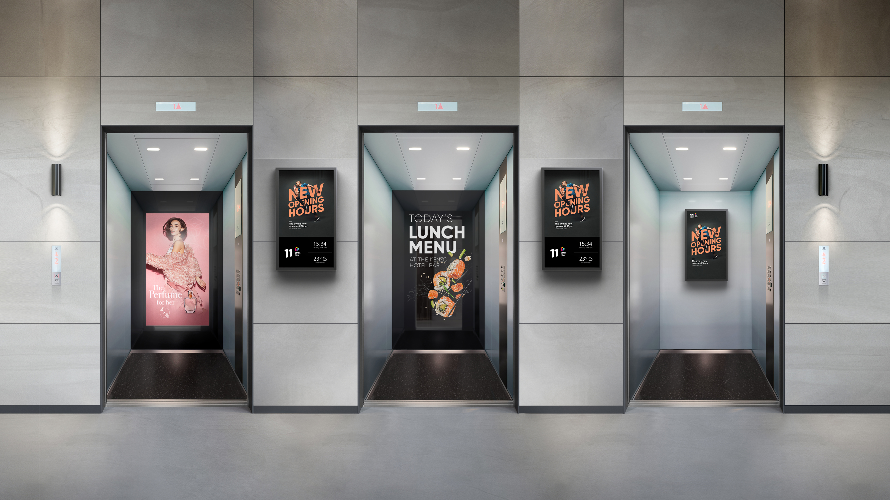</a> 
<b>Schindler Ahead</b> <i>[Lineup]</i> · Digital-services product line-up — <b>Swiss-HQ</b> <a href="https://www.schindler.com/">schindler.com</a>
</td>
<td align="center" width="50%" valign="top">
<a href="https://www.kone.com/en/services/connected-services/">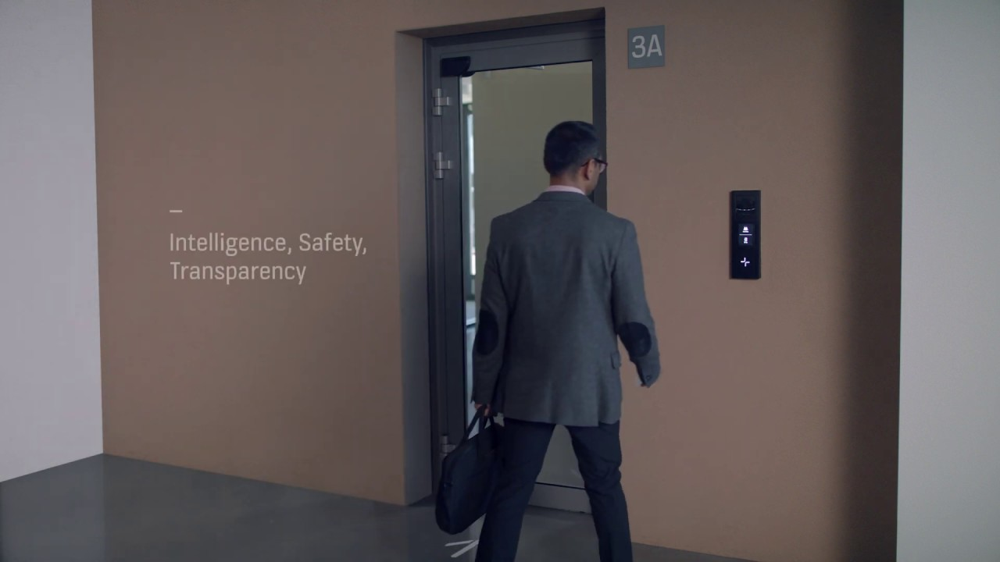</a> 
<b>KONE 24/7 Connected Services</b> <i>[Fallback — YouTube]</i> · Demo thumbnail (KONE site is JS-rendered, no static imagery) <a href="https://www.kone.ch/">kone.ch</a>
</td>
</tr>
</table>

### M. Lease management & lease accounting

**Definition.** Finance-facing lease management and accounting software focused on IFRS 16 / ASC 842 / GASB 87 contract objects, lease-liability and right-of-use-asset bookkeeping, and portfolio reporting. Distinct from operational tenant portals (Segments E, F) by its ledger-grade accounting core and from PM ERPs (E) by absence of operational rent-collection / contractor-dispatch modules.

**Persona.** Finance / treasury / FP&A teams under IFRS 16 obligations; corporate occupiers and large landlords reconciling lease obligations into ledger; auditors requesting structured lease abstractions (cross-listed with Segment X).

| Product | HQ | Hosting | Pricing | Notable feature |
|---|---|---|---|---|
| [Visual Lease](https://visuallease.com/) | Woodbridge (NJ), US | Cloud | Per lease | IFRS 16 / ASC 842 / GASB 87 lease accounting |
| [LeaseAccelerator](https://leaseaccelerator.com/) | Reston (VA), US | Cloud | Per lease | Enterprise lease accounting + workflow |
| [CoStar Real Estate Manager](https://www.costargroup.com/realestatemanager) | Washington, US | Cloud | Quote | CoStar-integrated portfolio + lease accounting |
| [Nakisa Lease Administration](https://www.nakisa.com/) | Montréal, CA | Cloud | Per lease | SAP-certified IFRS 16 / ASC 842 |
| [MRI ProLease](https://www.mrisoftware.com/products/prolease/) | Solon (OH), US (MRI) | Cloud | Per lease | Within MRI ecosystem; IFRS 16 / ASC 842 |
| [LucernEx (Accruent)](https://www.accruent.com/products/lucernex) | Austin, US (Accruent) | Cloud | Per lease | Lease admin + accounting; common in US retail / corporate |
| [UPK Online](https://www.upk-online.ch) | CH | Cloud (CH) | Subscription | Niche Swiss lease-accounting |
| [SwissProperty](https://www.swissproperty.ch) | CH | Cloud (CH) | Subscription | **Swiss-domiciled** lease / portfolio accounting |
| [RealFusio](https://www.realfusio.com) | CH / EU | Cloud | Subscription | Real-estate fund accounting |

**Maturity.** Mature; market shaped heavily by IFRS 16 / ASC 842 adoption from 2019 onward.

**Swiss-context note.** Generally finance-facing, distinct from tenant-facing portals; relevant in IFRS 16 / Swiss GAAP FER contexts. SAP RE-FX (S/4HANA) plus Planon delivers lease accounting alongside operational tenant management — for BBL this is the canonical SAP-aligned pattern. UPK Online, SwissProperty and RealFusio are the Swiss-domiciled alternatives.

**Taxonomy note.** Upstream of Segment X (lease abstraction / ingestion) which feeds clean contract data into M; downstream of Segment E for operational rent ledgers; overlaps with Segment Q where Planon RE for SAP S/4HANA bundles lease accounting on S/4HANA.

### N. Energy & sub-metering tenant transparency

**Definition.** Heat / water / electricity sub-metering and tenant cost-allocation, plus the data infrastructure for VILB Art. 9 Abs. 1bis disclosures and EPBD 2024/1275 zero-emission-buildings reporting. Distinct from Segment AF (EV-charging) by Nebenkosten-accounting focus and from Segment Z by per-meter tenant detail.

**Persona.** Property managers preparing Nebenkostenabrechnung; tenants viewing their own consumption; ESG / sustainability teams aggregating portfolio data; federal landlords reporting under VILB.

| Product | HQ | Notable feature |
|---|---|---|
| [Techem](https://www.techem.com/) | Eschborn, DE | Submetering + tenant heating bills |
| [ista](https://www.ista.com/) | Essen, DE | Submetering + Mieter API |
| [Brunata-Metrona](https://www.brunata-metrona.de/) | Hürth, DE | Submetering DACH |
| [Minol](https://www.minol.com/) | Leinfelden-Echterdingen, DE | Tenant consumption portal |
| [Aareon EnergieHub](https://www.aareon.com/) | Mainz, DE | Energy data hub for housing operators |
| [Spacewell Energy (Dexma)](https://spacewell.com/) | Barcelona, ES | AI energy management |
| [NeoVac](https://www.neovac.ch/) | Oberriet, CH | **Swiss-domiciled** submetering, heat-cost allocation and tenant cost-reporting; deep CH installer network |
| [Equa Solutions](https://www.equa-solutions.ch/) | Lausanne, CH | **Swiss-domiciled** HVAC controls + sub-metering optimisation |
| [CSEM Smart Energy](https://www.csem.ch) | Neuchâtel, CH | Research-driven CH smart-grid solutions |
| [BKW Power Grid](https://www.bkw.ch) | Bern, CH | Utility-grade grid + smart-meter offering relevant to large-portfolio landlords |

**Preview — selected vendors** (product screenshots from vendors' own pages; links go to source pages):

<table>
<tr>
<td align="center" width="50%" valign="top">
<a href="https://www.neovac.ch/">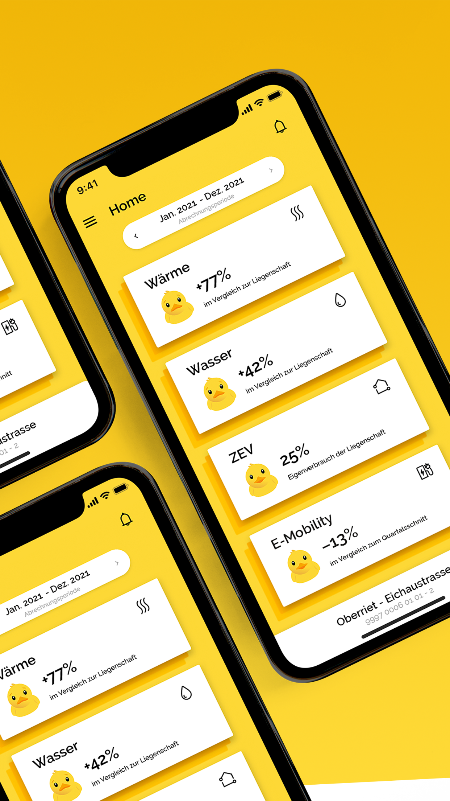</a> 
<b>NeoVac</b> <i>[Screenshot]</i> · Submetering / tenant cost reporting — <b>Swiss-domiciled (Oberriet)</b> <a href="https://www.neovac.ch/">neovac.ch</a>
</td>
<td align="center" width="50%" valign="top">
 
<b>Techem</b> <i>[Screenshot]</i> · Tenant heating-cost reporting <a href="https://www.techem.com/">techem.com</a>
</td>
</tr>
</table>

**Swiss-context note.** Directly relevant to VILB Art. 9 reporting and EPBD 2024/1275 disclosures. The DE-only submetering majors (Techem, ista, Brunata, Minol) are widely deployed in CH but NeoVac is the closest CH-domiciled alternative — relevant where data-residency is a procurement filter.

### O. Listing & Onboarding Portals

**Definition.** Public-facing real-estate listing marketplaces (Mietangebote, Verkaufsobjekte, gewerbliche Flächen) where lease/sale relationships originate, plus federal/cantonal public listing platforms. Distinct from Segment AC (KYC) which begins after the contact request, and from Segment F (resident portal) which serves the post-signature tenant.

**Persona.** Property managers and landlords listing inventory; tenants and buyers searching; federal authorities (BBL, BImA) listing surplus or fürsorge-allocated stock.

| Product | HQ | Hosting | Pricing | Notable feature |
|---|---|---|---|---|
| [ImmoScout24.ch](https://www.immoscout24.ch) | Zurich, CH (SMG Swiss Marketplace Group) | Cloud (CH) | Per-listing + premium options | CH market leader by traffic: 3.27 m monthly visits (SemRush, March 2026) |
| [Homegate.ch](https://www.homegate.ch) | Zurich, CH (SMG) | Cloud (CH) | Per-listing | 2.6 m monthly visits Mar 2026; controversy over MieterPlus subscription (CHF 39.95 with 3-month minimum, per OnlineMarketplaces Mar 2024) |
| [Flatfox.ch](https://www.flatfox.ch) | Zurich, CH (SMG) | Cloud (CH) | Free listing + paid add-ons | 1.65 m monthly visits; chat-first UX; popular for free landlord listing |
| [Comparis Immobilien](https://en.comparis.ch) | Zurich, CH | Cloud (CH) | Aggregator | 2.79 m monthly visits; aggregates other portals |
| [Newhome.ch](https://www.newhome.ch) | Zurich, CH (cantonal-bank consortium) | Cloud (CH) | Per-listing | 1.23 m monthly visits; cantonal-bank-owned |
| [RealAdvisor](https://realadvisor.ch) | Zurich/Geneva, CH | Cloud (CH) | Lead-gen for agents | AVM-driven valuation + agent matching |
| [ImmoStreet.ch / Acheter-Louer.ch / Anibis.ch / Pomona.ch](https://swissmarketplace.group/portfolio/real-estate/) | CH (SMG portfolio) | Cloud (CH) | Per-listing | SMG-portfolio long-tail CH portals |
| [ImmoScout24.de](https://www.immobilienscout24.de) | Berlin, DE (Scout24 SE) | Cloud (DE) | Per-listing + premium | DE market leader |
| [Immowelt](https://www.immowelt.de) | Nuremberg, DE (Axel Springer / Aviv) | Cloud (DE) | Per-listing | DE #2 |
| [Immonet](https://www.immonet.de) | Hamburg, DE (Axel Springer) | Cloud (DE) | Per-listing | DE #3, merged ops with Immowelt |
| [Wunderflats](https://wunderflats.com) | Berlin, DE | Cloud (DE) | Commission | Mid-term/corporate furnished housing |
| [Homelike](https://www.thehomelike.com) | Cologne, DE | Cloud (DE) | Commission | Corporate-housing platform |
| [Spotahome](https://www.spotahome.com) | Madrid, ES | Cloud (EU) | Commission | Mid-term rentals, video-verified |
| [willhaben Immobilien](https://www.willhaben.at) | Vienna, AT | Cloud (AT) | Per-listing | AT classifieds market leader |
| [ImmoScout24.at](https://www.immobilienscout24.at) | Vienna, AT | Cloud (AT) | Per-listing | AT real-estate leader |
| [Zillow](https://www.zillow.com) | Seattle, US | Cloud (US) | Premier Agent / lead | US market leader |
| [Rightmove](https://www.rightmove.co.uk) | London, UK | Cloud (UK) | Agent subscription | UK leader |
| [Zoopla](https://www.zoopla.co.uk) | London, UK | Cloud (UK) | Agent subscription | UK #2 |
| [Idealista](https://www.idealista.com) | Madrid, ES | Cloud (EU) | Per-listing | ES/PT/IT leader |
| [CBRE Deal Flow](https://www.cbre.com) | Dallas, US | Cloud | Bundled with CBRE services | Commercial transaction platform |
| [JLL OfficeFinder](https://www.us.jll.com) | Chicago, US | Cloud | Bundled | Commercial leasing |
| [LoopNet (CoStar)](https://www.loopnet.com) | Washington, US | Cloud (US) | Subscription | US commercial leader |
| [Crexi](https://www.crexi.com) | Los Angeles, US | Cloud (US) | Subscription | US commercial #2 |
| [Realla (CoStar UK)](https://www.realla.co.uk) | London, UK | Cloud | Subscription | UK commercial |
| [savills.com](https://www.savills.com) | London, UK | Cloud | Free property search | Global broker portal |
| [simap.ch](https://www.simap.ch) | Bern, CH (federal/cantonal) | Federal cloud (CH) | Free public access | **Swiss federal/cantonal procurement portal where BBL itself publishes tender notices** |
| [meine BImA](https://meine-bima.bundesimmobilien.de) | Bonn, DE (BImA) | Federal DE infrastructure | Free | **BImA Geschäftsbereich Wohnen tenant-facing self-service portal — relaunched 13 March 2024 with simplified login**; covers Wohnungsfürsorge des Bundes |
| [Immobilienportal der BImA](https://immobilienportal.bundesimmobilien.de) | Bonn, DE (BImA) | Federal DE | Free public | BImA's full portfolio: Wohn-, Gewerbe-, Land- & Forst-, Wohnungsfürsorge |

**Maturity.** Mature/consolidating: SMG Swiss Marketplace Group (Ringier + TX Group + La Mobilière + General Atlantic) operates ImmoScout24.ch + Homegate + Flatfox + ImmoStreet + Acheter-Louer + Anibis + Tutti + others, giving SMG approximately 75 % combined CH real-estate listings market share (per OnlineMarketplaces analysis); SMG IPO on SIX Swiss Exchange is publicly planned; SMG also acquired Swiss operations of immoverkauf24 in 2025. Scout24 SE dominates DE; Axel Springer's Aviv group consolidates Immowelt+Immonet+CASA in EU.

**Swiss-context note.** Federal-listing reality is split: BBL surplus disposals run via Bundesimmobilien-Auktionen and tender notices on simap.ch; civilian residential transactions of federal interest typically still go to homegate.ch / ImmoScout24.ch. The federal BImA portal in Germany — meine BImA — sets a useful reference for what a "federal tenant self-service portal" looks like in DACH practice. Switzerland has no direct equivalent; the closest is the Swiss Federal Housing Office (BWO) infrastructure and individual bundeseigene-Liegenschaften pages.

**Taxonomy note.** Upstream of Segment AC (KYC/Bonität triggers at first contact request) and of Segment F (tenant experience, where contract life starts). Overlaps with Segment AD at the Mietkaution-marketplace level (homegate.ch's integration of CreditTrust certificates and of SwissCaution Provisional Certificate).

### P. Public-sector / federal tenant systems (benchmarks)

**Definition.** Operating-tenant-portal benchmarks at federal / cantonal scale — public-sector reference implementations rather than commercial vendors. Useful for procurement teams wanting to compare BBL's intended scope against DACH peers (BImA, BIG, armasuisse) and international peers (GSA, GPA, Senaatti, Rijksvastgoed, Statsbygg).

**Persona.** Federal IT planning / portfolio strategists benchmarking BBL's tenant portal against peer states' implementations; procurement officers checking what "federal tenant portal" looks like in practice.

| System | Operator / country | Description |
|---|---|---|
| ["Mein BImA"](https://meine-bima.bundesimmobilien.de/) | BImA, Bonn, DE | Migrated 13 Mar 2024 from legacy username/password into single "meine BImA" account; Wohnungsfürsorge access, Reparaturservice (365×24×7), Immobilienportal, GESA |
| [GSA PBS Customer Dashboard / OASIS](https://www.gsa.gov/) | US GSA, Washington DC | Federal tenant dashboard |
| [GPA Workplace Services Toolkit](https://www.gov.uk/government/organisations/government-property-agency) | London, UK | Government Hubs |
| [Senaatti "Senate App"](https://steerpath.com/case-study-senaatti) | Senaatti-kiinteistöt, Helsinki, FI | Built by Steerpath; indoor maps + booking; Virtu ID / email login via asiointi.senaatti.fi |
| [Rijksvastgoedbedrijf](https://www.rijksvastgoedbedrijf.nl/) | Dutch Central Government RE Agency, The Hague | Tenant relations in development |
| [BIG Wohn- und Mieterservice](https://www.big.at/) | Bundesimmobiliengesellschaft, Vienna | Austrian federal property |
| [Statsbygg](https://www.statsbygg.no/) | Oslo, NO | Norwegian state property |
| [armasuisse Immo-Portal VBS](https://www.ar.admin.ch/de/immo-portal) | armasuisse Immobilien, Bern, CH | Re-launched 1 May 2024; role-based (Nutzer/Mieter/Eigentümervertreter/Betreiber/IKT/Departementsebene); ZUVA Weisungen; DE/FR (IT planned); BBL liaison for Bern Verwaltungsbauten codified |
| [Bouwinvest](https://www.bouwinvest.com/) | Amsterdam, NL | Dutch state-pension-backed RE investor; **operator benchmark** for tenant portals on a proprietary stack (not a vendor sale) |
| [CBRE Investment Management](https://www.cbreim.com/) | Los Angeles, USA | Global RE investor; **operator benchmark** for corporate-occupier tenant portals on a proprietary stack |
| [Defence Infrastructure Organisation (DIO)](https://www.gov.uk/government/organisations/defence-infrastructure-organisation) | Sutton Coldfield, UK | UK MoD estate operator; military-housing benchmark adjacent to CH armasuisse perimeter |

**Preview — selected federal-portal benchmarks** (login or landing screens from the portals themselves; links go to source pages):

<table>
<tr>
<td align="center" width="50%" valign="top">
 
<b>armasuisse Immo-Portal VBS</b> <i>[Portal image]</i> · CH federal benchmark; closest peer to BBL <a href="https://www.ar.admin.ch/de/immo-portal">ar.admin.ch/immo-portal</a>
</td>
<td align="center" width="50%" valign="top">
 
<b>"meine BImA"</b> <i>[Portal image]</i> · German federal tenant-portal benchmark <a href="https://meine-bima.bundesimmobilien.de/">meine-bima.bundesimmobilien.de</a>
</td>
</tr>
</table>

**Swiss-context note.** armasuisse Immo-Portal is BBL's closest peer benchmark inside Switzerland.

### Q. SAP RE-FX integration patterns and add-ons

**Definition.** SAP-side products, partners and architecture patterns sitting alongside or on top of S/4HANA RE-FX — covering both packaged add-ons (Aareon Blue Eagle, Promos.GT, Goldinmotion) and BTP-native build patterns (custom Fiori on SAP BTP). Distinct from generic iPaaS (Segment S) by SAP-blessed integration patterns and from generic ERP (Segment E) by RE-FX-specific data models.

**Persona.** SAP CoE inside BBL post-SUPERB; partner teams integrating Wodis / RELion / casavi / Immomio / Plentific into SAP RE-FX; architects deciding "buy ISV add-on vs. build on BTP".

| Pattern / product | Vendor | Notes |
|---|---|---|
| [Planon RE Management for SAP S/4HANA](https://planonsoftware.com/) | Planon (NL) — SAP-endorsed | Co-engineered on SAP One Domain Model and BTP; Finance/Contract/Lease accounting on S/4HANA; RE management + Space + Workplace + Asset/Maintenance + Energy on Planon |
| [Goldinmotion Simple Property Management](https://www.goldinmotion.com/) | Goldinmotion (DE) | Lightweight SAP-side add-on |
| [Promos.GT](https://www.promos-consult.de/) | Promos (DE) | SAP IS-RE specialist for housing |
| [Aareon SAP Blue Eagle](https://www.aareon.de/) | Aareon (DE) | Long-standing SAP-side add-on |
| [Aareon Connect via Locoia](https://connect-docs-de.locoia.com/) | Aareon Locoia (DE) | Low-code/iPaaS connecting Wodis Yuneo, Sigma, SAP Blue Eagle, Karthago, Immomio, casavi, Plentific, EverReal, Spiri.Bo, dormakaba, KIWI |
| [Custom Fiori on SAP BTP](https://www.sap.com/products/business-technology-platform.html) | SAP BTP | Build-own; respects SAP "clean core" |

**Preview — selected integration patterns** (product screenshot / placeholder; links go to source pages):

<table>
<tr>
<td align="center" width="50%" valign="top">
<a href="https://planonsoftware.com/uk/software/iwms/sap/">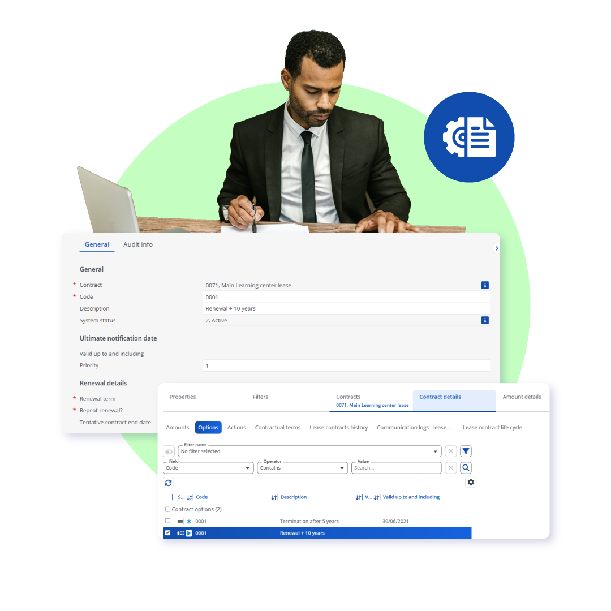</a> 
<b>Planon for SAP S/4HANA</b> <i>[Screenshot]</i> · SAP CMS RE-FX lease-management screen <a href="https://planonsoftware.com/uk/software/iwms/sap/">planonsoftware.com/sap</a>
</td>
<td align="center" width="50%" valign="top">
<a href="https://www.aareon.com/">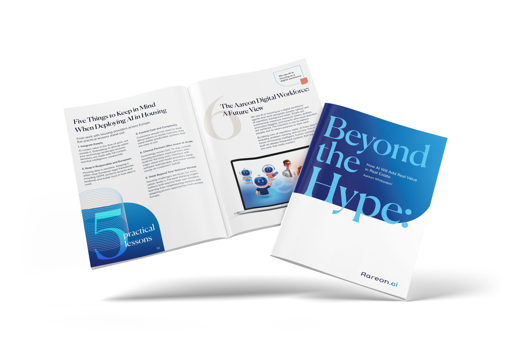</a> 
<b>Aareon "Blue Eagle"</b> <i>[Placeholder]</i> · Aareon AI whitepaper visual — <b>verify product status</b>: dedicated Blue Eagle pages return 404 across aareon.com and Wayback; product may have been retired or rebranded post-TPG/CDPQ transition <a href="https://www.aareon.com/">aareon.com</a>
</td>
</tr>
</table>

**Swiss-context note.** Planon for SAP S/4HANA is the SAP-blessed pattern; custom Fiori on BTP is most aligned with EMBAG Art. 9's OSS expectations.

### R. Sovereign / Swiss-domiciled cloud hosting

**Definition.** Cloud regions and hosting providers offering Swiss or EU data residency, FINMA-grade controls, BSI C5 attestations, or formal sovereign-cloud constructs. Distinct from hyperscaler default regions by their operational sovereignty layer (jurisdictional indemnity, personnel residency, key-management isolation).

**Persona.** Federal / cantonal procurement teams running sovereignty assessments; CISOs validating ISG-compatible hosting; tenant-portal architects placing PII and contract data under Schweizer Datenresidenz.

| Region / vendor | Location | Notes |
|---|---|---|
| [Swisscom Sovereign Cloud / Enterprise Cloud](https://www.swisscom.ch/) | CH Tier-4 DCs | SAP-on-demand; Cloud Access to Azure/AWS/Google/Oracle |
| [Exoscale](https://www.exoscale.com/) | Zurich, Geneva, Vienna, Frankfurt, Munich, Sofia | CH-domiciled |
| [Infomaniak](https://www.infomaniak.com/) | Geneva, CH | CH-domiciled |
| AWS Europe (Zurich) — `eu-central-2` | Zurich, CH | Opened Nov 2022; 3 AZs. Per AWS press release (BusinessWire, 8 Nov 2022): "AWS is planning to invest an estimated $5.9 billion (approx. 5.9 billion Swiss francs) in Switzerland during the next 15 years." |
| Azure Switzerland North / Switzerland West | Zürich / Geneva | Launched 2019 |
| Google Cloud `europe-west6` (Zurich) | Zurich | Launched 2019 |
| AWS European Sovereign Cloud — `aws-eusc` (`eusc-de-east-1`, Brandenburg, DE) | Brandenburg, DE | GA 14 Jan 2026; €7.8 bn investment; EU-resident personnel/operations; NOT in Switzerland |
| [Green.ch](https://www.green.ch) | Lupfig, CH | Largest Swiss data-centre operator; FINMA-grade |
| [Equinix Zurich (ZH4 / ZH5)](https://www.equinix.com) | Zurich, CH | Major Swiss colocation campuses |
| [Aspectra](https://www.aspectra.ch) | Zurich, CH | Swiss managed-hosting and managed-cloud specialist; FINMA-grade |
| [Hetzner](https://www.hetzner.com) | Gunzenhausen, DE (Falkenstein + Helsinki DCs) | Low-cost EU hyperscaler-alternative |
| [OVHcloud](https://www.ovhcloud.com) | Roubaix, FR (Strasbourg DC) | FR sovereign-cloud option |
| [Scaleway](https://www.scaleway.com) | Paris, FR (Iliad) | FR sovereign cloud |
| [T-Systems Open Telekom Cloud](https://www.t-systems.com) | Bonn, DE | DE sovereign cloud; BSI C5 |
| [STACKIT](https://www.stackit.de) | Heilbronn, DE (Schwarz Gruppe / Lidl) | DE sovereign-cloud emerging player |
| [IONOS Cloud](https://cloud.ionos.com) | Karlsruhe, DE | DE sovereign-cloud |
| [GleSYS](https://glesys.com) | Falkenberg, SE | Nordic sovereign-cloud |
| [Cleura](https://cleura.com) | Karlskrona, SE | Nordic sovereign-cloud |

**Swiss-context note.** Federal tenant portals must consider both technical region (Switzerland-North / `eu-central-2`) and operational sovereignty layer; AGOV operation itself will move to a mixed federal + private Swiss DC arrangement from 2027.

### S. iPaaS / integration layer

**Definition.** Integration-Platform-as-a-Service for machine-to-machine data movement between PM ERPs (E), tenant portals (F), SAP RE-FX (Q), identity (I), accounting (T) and CAFM (Y). Distinct from BPM / workflow (Segment BB) by emphasis on data sync rather than human-step orchestration; distinct from custom code by visual flow design and connector marketplaces.

**Persona.** SAP CoE / BTP architects; integration architects in tenant-portal projects; SI partners delivering Aareon, casavi, iX-Haus and SAP RE-FX wire-ups.

| Product | HQ | Hosting | Pricing | Notable feature |
|---|---|---|---|---|
| [SAP Integration Suite (BTP)](https://www.sap.com/products/business-technology-platform.html) | Walldorf, DE | SAP BTP (regional, incl. CH where licensed) | Per message | SAP-native; co-deployable with Custom Fiori on BTP (Segment Q) |
| [MuleSoft (Salesforce)](https://www.mulesoft.com) | San Francisco, US (Salesforce) | Cloud | Per connector + capacity | Anypoint platform; widely used in DACH enterprise |
| [Workato](https://www.workato.com) | Mountain View, US | Cloud | Per workspace | Enterprise iPaaS (cross-listed in Segment BB) |
| [Boomi](https://boomi.com) | Conshohocken (PA), US | Cloud | Per connector | iPaaS leader; large connector library |
| [Frends](https://frends.com) | Tampere, FI | Cloud + on-prem | Per environment | Nordic iPaaS; OSS-friendly options |
| [Aareon Locoia](https://connect-docs-de.locoia.com/) | Mainz, DE (Aareon) | Cloud (DE) | Per workflow | Glue between Aareon Connect ecosystem: Wodis Yuneo, Sigma, SAP Blue Eagle, Karthago, Immomio, casavi, Plentific, EverReal, Spiri.Bo, dormakaba, KIWI |

**Maturity.** Mature. Strategic role in any post-SUPERB BBL tenant-portal: the question is *whether the SAP-native Integration Suite is sufficient* (for SAP-blessed flows) or whether a third-party iPaaS is needed for non-SAP edges.

**Swiss-context note.** SAP Integration Suite on BTP is the SAP-blessed pattern; Aareon Locoia is the Aareon-blessed pattern within the Aareon Connect ecosystem (relevant if BBL ever federates with Aareon-powered landlords). EMBAG Art. 9 OSS expectations are met more naturally by Frends or by self-hosted n8n (Segment BB) than by commercial iPaaS.

**Taxonomy note.** Overlaps with Segment BB on tooling (workflow automation tools straddle iPaaS); overlaps with Segment Q on patterns (SAP Integration Suite is the SAP expression of S).

### T. Fintech Adjacencies

**Definition.** Rent collection, Mahnwesen, Open-Banking affordability, tenant payment-as-loyalty, and embedded-finance rails layered on top of (or between) PM ERPs and bank accounts. Distinct from Segment AD (deposit insurance) and Segment E (PM ERP-internal accounting).

**Persona.** Treasury/finance teams of large landlords; Hausverwaltungen running Mahnstufen; tenants seeking flexible-payment or loyalty mechanics.

| Product | HQ | Hosting | Pricing | Notable feature |
|---|---|---|---|---|
| [Bexio](https://www.bexio.com) | Rapperswil-Jona, CH (Swisscom subsidiary) | Cloud (CH) | CHF 45/mo Basic to CHF 129/mo Ultimate (Magic Heidi 2026) | **100,000 customers as of 19 February 2026** per bexio AG press release (CEO Markus Naef: "Today we celebrate 100,000 entrepreneurs who are advancing the digitalisation of Switzerland with us") |
| [Klara](https://www.klara.ch) | Bern, CH (Swisscom-backed) | Cloud (CH) | From CHF 49/mo Business Starter | 30,000+ SMEs; AI receipt scanning; KLARA Buchhaltung integrated |
| [Banana Buchhaltung](https://www.banana.ch) | Lugano, CH (Banana.ch SA, since 1988) | On-prem + iPad app | CHF 0 Free / CHF 69 Professional / CHF 149 Advanced annual | One-time purchase model; Excel-like UX; 120+ countries |
| [Abacus AbaNinja / Abacus](https://www.abacus.ch) | Wittenbach-St. Gallen, CH | On-prem + Abacus Cloud | Per-user | CH mid-market ERP+accounting standard |
| [Intrum AG (Inkasso-Schweiz)](https://www.intrum.ch) | Schwerzenbach, CH | Cloud | Success-fee + per-case | DACH Mahnwesen + Inkasso leader |
| [CRIF AG Mahnwesen](https://www.crif.ch) | Zurich, CH | Cloud | Per-case | Bonität + Inkasso bundle |
| [Creditreform Schweiz Inkasso](https://www.creditreform.ch) | St. Gallen, CH | Cloud | Success-fee | Membership-based Inkasso |
| [EOS Schweiz](https://ch.eos-solutions.com) | Volketswil, CH (Otto Group) | Cloud | Success-fee | DACH-wide Inkasso |
| [Inkasso Service AG](https://www.inkasso.ch) | Lucerne, CH | Cloud | Success-fee | Swiss Inkasso |
| [GoCardless](https://gocardless.com) | London, UK | Cloud (EU) | ~1 % + £/€ 0.20 per tx | Direct-debit (SEPA, BACS) for recurring rent |
| [Stripe Billing / Stripe Connect](https://stripe.com) | Dublin, IE / San Francisco, US | Cloud (EU residency) | ~2.9 % + €0.25 | Embedded payments for property managers |
| [TrueLayer](https://truelayer.com) | London, UK | Cloud (EU) | Per-API call | Open-Banking PIS for rent payments |
| [Yapily](https://www.yapily.com) | London, UK | Cloud (EU) | Per-API call | API-first Open Banking |
| [Bilt Rewards](https://www.biltrewards.com) | New York, US | Cloud (US) | Free to tenants; cobranded card revenue | US rent-as-loyalty card; partnered Wells Fargo; no DACH presence |
| [Rentmoola](https://rentmoola.com) | Vancouver, CA | Cloud (NA/UK) | Per-transaction | Rent-as-credit-card-tx |
| [Klarna for rent (pilots)](https://www.klarna.com) | Stockholm, SE | Cloud (EU) | Tx fee | BNPL adapted to rent in select pilots |
| [Tipalti](https://tipalti.com) | San Mateo, US | Cloud | Subscription + per-tx | AP automation; relevant for large landlords' supplier-pay |
| [GetMyInvoices](https://www.getmyinvoices.com) | Hannover, DE | Cloud (EU) | Per-user | Invoice retrieval + DATEV export |
| [Lexware](https://www.lexware.de) | Freiburg, DE (Haufe Group) | On-prem + cloud | Per-user | DE SME accounting |
| [Sage 50 / Sage Business Cloud](https://www.sage.com) | Newcastle, UK | Cloud + on-prem | Per-user | Cross-DACH accounting |
| [Infoniqa (formerly Sage CH)](https://www.infoniqa.com) | Stans, CH | On-prem + cloud | Per-user | Swiss payroll-and-accounting |

**Maturity.** Mature accounting (Bexio, Klara, Banana, Abacus); mature Inkasso (Intrum, CRIF, Creditreform, EOS); consolidating Open Banking (TrueLayer, GoCardless, Yapily competing with Stripe Connect). Tenant-loyalty (Bilt) and rent-BNPL (Klarna pilots) remain emerging in DACH; Bilt Rewards has no DACH presence as of May 2026.

**Swiss-context note.** Swiss rent-collection rails are dominated by ISO 20022 QR-Bill + Direct Debit (LSV/CH-DD), all integrated into Bexio, Klara, Banana, Abacus. The September 2026 deadline for structured QR-Bill addresses (per Magic Heidi reference) is the active near-term compliance item. For a federal landlord, AGOV + QR-Bill is the de facto invoicing rail.

**Taxonomy note.** Overlaps with Segment AC at the Bonität-check step (Intrum, CRIF) — same vendors, different use case. Distinct from Segment E (PM ERP) but typically integrated via APIs to Wodis, RELion, casavi, iX-Haus.

### U. Indoor wayfinding & smart navigation

**Definition.** Indoor mapping, navigation and floor-plan APIs for buildings — distinct from outdoor GIS (Esri ArcGIS, OpenStreetMap) and from CAD / BIM authoring (Segment W). Often embedded inside IWMS / WEX (Segments A, B) as the floor-plan layer.

**Persona.** Workplace-experience teams adding navigation to large campuses; FM teams; tenant-facing apps wanting interactive floor plans. For BBL, the relevance is multi-building federal campuses (Bern, Zurich, Geneva sites).

| Product | HQ | Hosting | Pricing | Notable feature |
|---|---|---|---|---|
| [Archilogic](https://www.archilogic.com/) | Zurich, CH | Cloud (CH / EU) | Per building | **Swiss-domiciled** 3D floor plans + Floor Plan Engine + indoor-mapping API; widely embedded as the floor-plan layer inside IWMS and WEX products (adjacent to Segments A, B) |
| [Steerpath](https://steerpath.com) | Helsinki, FI | Cloud | Per building | Powers Senaatti's Senate App (federal benchmark — Segment P) |
| [MapsIndoors](https://www.mapsindoors.com) | Copenhagen, DK | Cloud | Per building | Google Maps-style indoor mapping |
| [Pointr](https://www.pointr.tech) | London, UK | Cloud | Per building | Indoor positioning + wayfinding |
| [MazeMap](https://www.mazemap.com) | Trondheim, NO | Cloud | Per building | Nordic indoor mapping |
| [IndoorAtlas](https://www.indooratlas.com) | Oulu, FI | Cloud | Per building | Magnetic-field indoor positioning |
| [MappedIn](https://www.mappedin.com) | Waterloo, CA | Cloud | Per building | Partners with ServiceNow WSD |
| [Esri ArcGIS Indoors](https://www.esri.com) | Redlands, US | Cloud + on-prem | Per user | Enterprise indoor GIS |

**Maturity.** Mature core; consolidating with Esri's enterprise push and embedded use in WSD / Eptura / Spacewell.

**Swiss-context note.** Archilogic is the Swiss-domiciled reference, widely embedded inside IWMS / WEX products — relevant when BBL evaluates the floor-plan layer separately from the IWMS choice.

**Taxonomy note.** Adjacent to Segment A (IWMS) and Segment B (WEX) where wayfinding is bundled; standalone vendors typically sell to IWMS / WEX OEMs as well as direct enterprises.

### V. Occupancy analytics

**Definition.** Sensor-based or Wi-Fi-based occupancy measurement for workplace-utilisation analytics — distinct from physical access control (Segment D) and from environmental sensing (Segment AG). Often pre-purchased by IWMS suites (Segment A) as a data source.

**Persona.** Workplace / portfolio strategists optimising desk-to-employee ratios; tenant-of-tenant assessments inside federal buildings; ESG teams quantifying space efficiency.

| Product | HQ | Hosting | Pricing | Notable feature |
|---|---|---|---|---|
| [Locatee (Tango)](https://www.tangoanalytics.com) | Zurich, CH (Tango) | Cloud | Per building | **Swiss-domiciled engineering presence**; sensor-free Wi-Fi-based; acquired by Tango Analytics Mar 2024; Zurich is Tango's European HQ |
| [VergeSense](https://vergesense.com) | San Francisco, US | Cloud | Per sensor | Computer-vision occupancy sensors |
| [Density](https://www.density.io) | New York, US | Cloud | Per sensor | Depth-camera occupancy |
| [XY Sense](https://xysense.com) | Melbourne, AU | Cloud | Per sensor | AI-vision occupancy |
| [Butlr](https://butlr.com) | San Francisco, US | Cloud | Per sensor | Thermal-vision occupancy |
| [Disruptive Technologies](https://www.disruptive-technologies.com) | Oslo, NO | Cloud | Per sensor | Cellular IoT sensors (cross-listed in Segment L) |
| [Akenza](https://akenza.io) | Zurich, CH | Cloud | Per device | **Swiss-domiciled IoT platform**; cross-listed in Segment L for sensor-platform overlap |
| [enlighted (Siemens)](https://www.enlightedinc.com) | Sunnyvale, US (Siemens) | Cloud | Per fixture | Sensor-rich occupancy + lighting |
| [Steelcase Workplace Advisor](https://www.steelcase.com) | Grand Rapids, US | Cloud | Per workspace | Furniture-vendor analytics overlay |
| [Microshare](https://www.microshare.io) | Philadelphia, US | Cloud | Per sensor | LoRaWAN-based occupancy |
| [Spica Technologies](https://www.spicatech.co.uk) | UK | Cloud | Per building | Workplace-experience analytics |

**Maturity.** Mature; consolidation visible (Tango / Locatee 2024, Siemens / enlighted earlier).

**Swiss-context note.** Locatee → Tango retains its Zurich engineering presence as Tango's European HQ. Akenza is the Swiss-domiciled sensor-platform alternative.

**Taxonomy note.** Cross-listed with Segment L (Disruptive Technologies, Akenza) and Segment A (occupancy data consumed by IWMS).

### W. Construction project management & BIM CDE handoff

**Definition.** Software supporting the design–build–handover lifecycle of buildings, with structured BIM data exchange into FM/IWMS. Distinct from operational segments (A, E): these tools serve the **pre-occupancy** phases — design coordination, clash detection, defect/snagging during construction, and the BIM2FM handover of as-built data to the tenant-portal / FM stack.

**Persona.** BBL Project Management and Bauherrenvertretung; federal construction PMs handing newly built or renovated stock into operational tenancy. CDE-Bund mandate (Appendix A) applies.

| Product | HQ | Hosting | Pricing | Integrations | Notable feature |
|---|---|---|---|---|---|
| [Autodesk Construction Cloud (BIM 360 / ACC)](https://construction.autodesk.com/) | San Francisco, USA | Cloud | Per user | Revit, Civil 3D, Navisworks, IFC | De-facto CDE standard; Revit-native |
| [Bentley iTwin / ProjectWise](https://www.bentley.com/software/itwin/) | Exton (PA), USA | Cloud / hybrid | Per asset / per user | OpenBuildings, IFC, MicroStation | Asset-twin handover into operations |
| [Revizto](https://revizto.com/) | Lausanne, CH | Cloud | Per user | Revit, Navisworks, IFC | **Swiss-domiciled** issue tracking & clash review |
| [Solibri](https://www.solibri.com/) | Helsinki, FI (Nemetschek) | Hybrid | Per user | IFC, Revit, ArchiCAD | Model checking / clash detection |
| [BIMcollab](https://www.bimcollab.com/) | Eindhoven, NL | Cloud | Per user | BCF, Revit, Navisworks | OpenBCF issue management |
| [Procore](https://www.procore.com/) | Carpinteria (CA), USA | Cloud | Per user | Revit, Sage, Quickbooks | General-contractor PM |
| [Trimble Connect](https://www.connect.trimble.com/) | Westminster (CO), USA | Cloud | Per user | Tekla, SketchUp, IFC | CDE + viewer; KBOB-aligned workflows |
| [dRofus](https://www.drofus.com/) | Oslo, NO (Nemetschek) | Cloud | Per user | Revit, IFC, ArchiCAD | Room/equipment data management; track record in CH federal projects |
| [PlanRadar](https://www.planradar.com/) | Vienna, AT | Cloud | Per user | BIM, IFC | Snagging/defect handover; also listed in Segment G |
| [Buildots](https://www.buildots.com/) | London, UK | Cloud | Per user | BIM, computer vision | AI construction-progress vs. BIM model |
| [Capmo](https://www.capmo.com/) | Munich, DE | Cloud | Per user | BIM, defect/snagging | DACH construction-PM SaaS |
| [Allplan](https://www.allplan.com) | Munich, DE (Nemetschek) | Cloud + on-prem | Per user | IFC, Revit | German-engineered BIM authoring |
| [Graphisoft ArchiCAD](https://graphisoft.com) | Budapest, HU (Nemetschek) | Cloud + on-prem | Per user | IFC, BCF | BIM authoring |
| [Vectorworks](https://www.vectorworks.net) | Columbia, US (Nemetschek) | Cloud + on-prem | Per user | IFC, DWG | BIM/CAD |
| [Catenda Hub](https://catenda.com) | Oslo, NO | Cloud | Per user | IFC native, BCF | openBIM CDE; IFC-native |
| [Plannerly](https://plannerly.com) | US / UK | Cloud | Per user | IFC, Revit | BIM execution planning |
| [Speckle](https://speckle.systems) | London, UK | Cloud + self-host | Open-source | Multi-CAD | Open-source BIM interoperability / data hub |
| [BIMobject](https://www.bimobject.com) | Malmö, SE | Cloud | Free + subscription | IFC, Revit | Product library |
| [BIM&CO](https://www.bimandco.com) | Bordeaux, FR | Cloud | Subscription | IFC | Product library |
| [BIM Track / Newforma Konekt](https://newforma.com) | Quebec, CA / Manchester NH, US | Cloud | Per user | BCF | Issue management; merged into Newforma |
| [DesignBuilder](https://designbuilder.co.uk) | Stroud, UK | Desktop | Per user | IFC | IFC-driven simulation |

**Maturity.** Mature (Autodesk, Bentley, Procore) → emerging in AI/CV (Buildots). Heavy DACH adoption of Solibri, dRofus, Revizto, BIMcollab.
**Preview — selected vendors** (product screenshots from vendors' own pages; links go to source pages):

<table>
<tr>
<td align="center" width="33%" valign="top">
<a href="https://construction.autodesk.com/">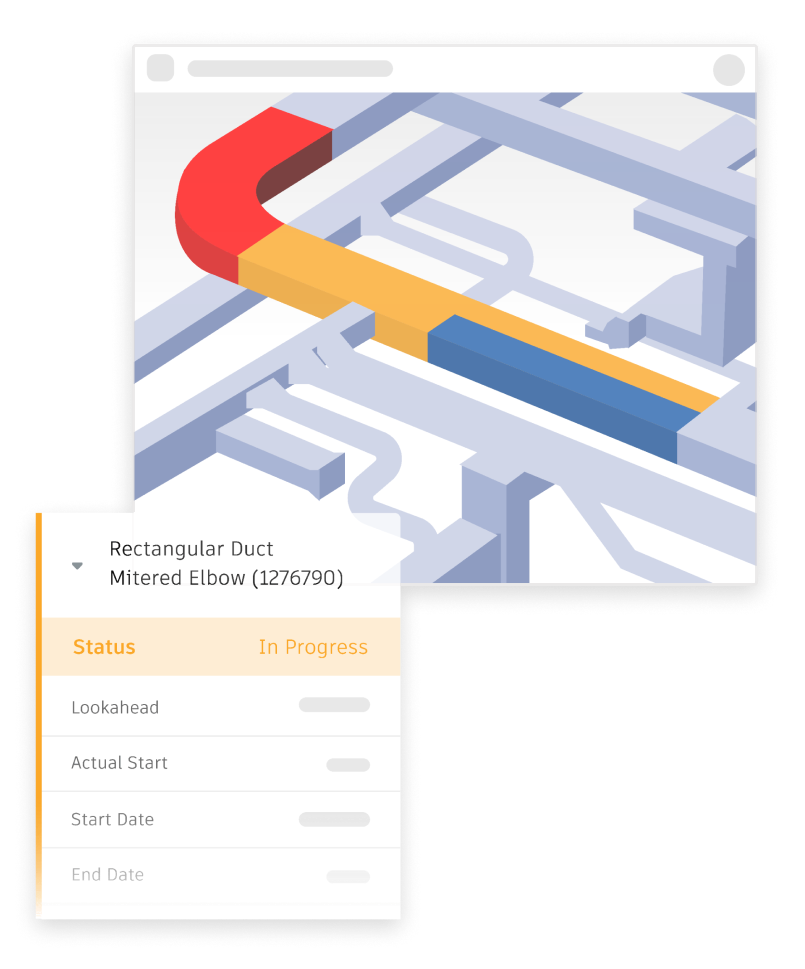</a> 
<b>Autodesk Construction Cloud</b> <i>[Workflow]</i> · Model-coordination view <a href="https://construction.autodesk.com/">construction.autodesk.com</a>
</td>
<td align="center" width="33%" valign="top">
<a href="https://www.bentley.com/software/itwin/">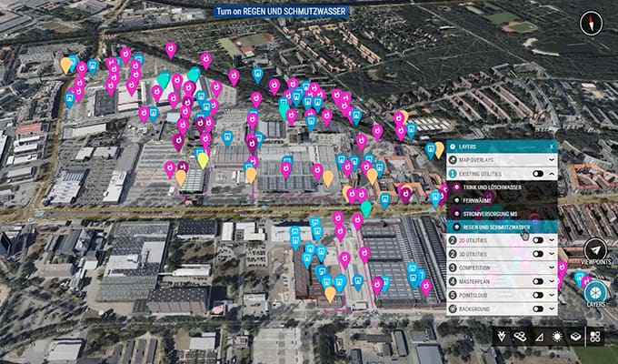</a> 
<b>Bentley iTwin</b> <i>[Screenshot]</i> · iTwin Experience digital-twin viewer <a href="https://www.bentley.com/software/itwin/">bentley.com/itwin</a>
</td>
<td align="center" width="33%" valign="top">
<a href="https://revizto.com/en/">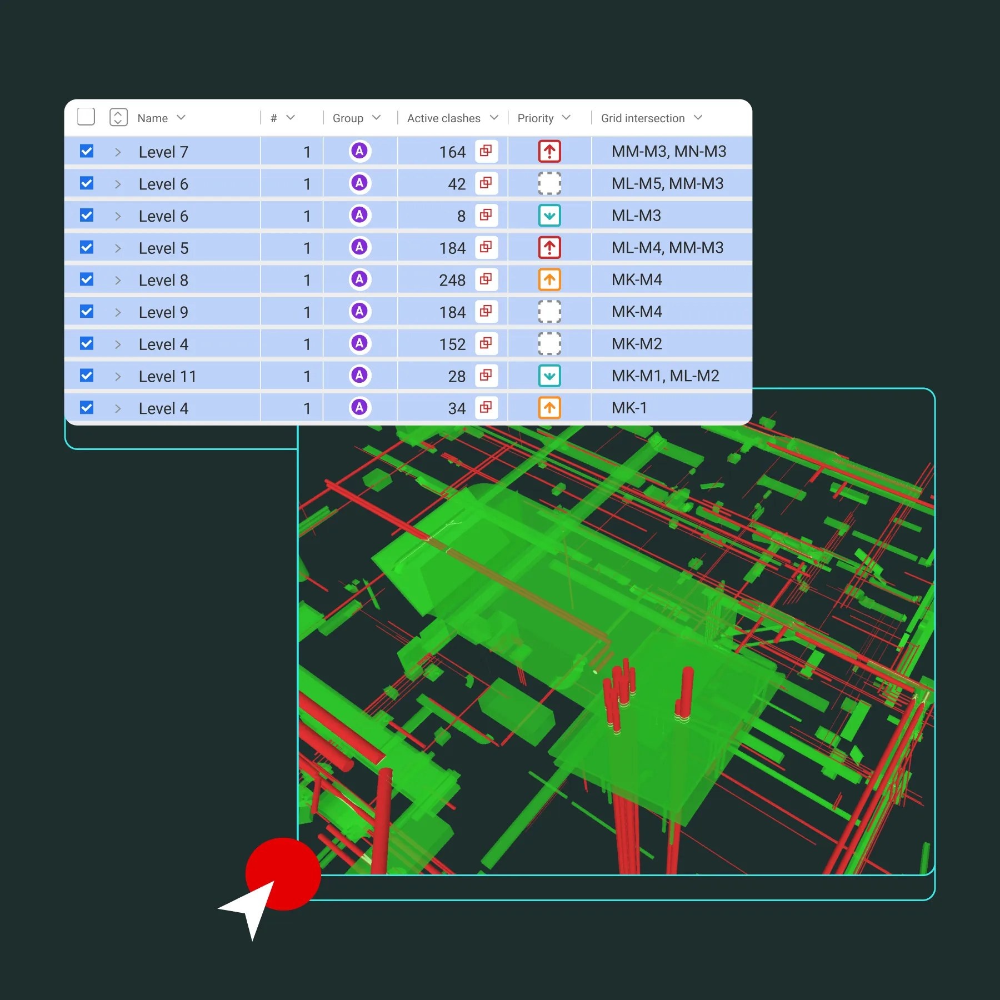</a> 
<b>Revizto</b> <i>[Screenshot]</i> · Collaborative clash + 3D issue tracker — <b>Swiss-HQ (Lausanne)</b> <a href="https://revizto.com/">revizto.com</a>
</td>
</tr>
</table>

**Swiss-context note.** CDE-Bund mandate (Appendix A) and KBOB BIM standards push toward openBIM workflows (IFC, BCF). Revizto and dRofus have specific Swiss federal-project track records. BIM2FM handover into Planon, Spacewell or Aareon is the bridge from this segment to A and E — and is the most-overlooked tenant-portal pre-occupancy step at federal scale.

### X. Lease abstraction & AI document extraction

**Definition.** Software that converts unstructured lease contracts (PDFs, scans, faxes) into structured data ready for SAP RE-FX contract objects, IWMS lease modules, or lease-accounting tools. Distinct from M (lease accounting): X is the **migration / ingestion** layer.

**Persona.** SAP RE-FX migration teams, finance teams catching up on IFRS 16 obligations, landlords inheriting legacy paper portfolios.

| Product | HQ | Notable feature |
|---|---|---|
| [Leverton (MRI Software)](https://www.mrisoftware.com/) | Berlin, DE (MRI) | Acquired by MRI 2020; AI lease abstraction for IFRS 16 / FASB / RE-FX |
| [Prophia](https://www.prophia.com/) | San Francisco, USA | Lease intelligence for commercial RE |
| [contract.fit](https://contract.fit/) | Brussels, BE | AI document extraction; contract abstraction |
| [Hyperscience](https://www.hyperscience.com/) | New York, USA | General-purpose AI document processing |
| [Rossum](https://rossum.ai/) | Prague, CZ | AI document understanding; broader than leases |
| [LeaseHawk](https://www.leasehawk.com/) | Scottsdale (AZ), USA | AI leasing assistant (multifamily) |
| [docunite](https://docunite.com/) | Berlin, DE | DACH AI document processing for real estate |

**Preview — selected vendors** (product screenshots from vendors' own pages; links go to source pages):

<table>
<tr>
<td align="center" width="50%" valign="top">
 
<b>MRI Contract Intelligence (ex-Leverton)</b> <i>[Hero]</i> · AI contract-intelligence UI <a href="https://www.mrisoftware.com/products/contract-intelligence/">mrisoftware.com/contract-intelligence</a>
</td>
<td align="center" width="50%" valign="top">
<a href="https://rossum.ai/">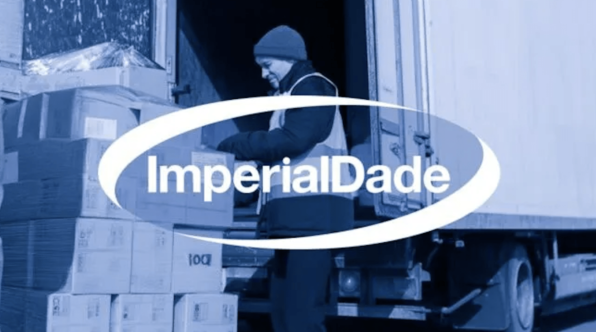</a> 
<b>Rossum</b> <i>[Screenshot]</i> · AI document-extraction interface <a href="https://rossum.ai/">rossum.ai</a>
</td>
</tr>
</table>

**Swiss-context note.** Directly relevant to post-SUPERB SAP RE-FX cleanup: BBL inherited legacy lease records that must be normalised into S/4HANA contract objects. EMBAG Art. 9 OSS preference makes open OCR + LLM pipelines (Segment AA) an honest alternative to commercial extraction SaaS.

### Y. CAFM (DACH-specific) — distinct from IWMS

**Definition.** Operational facility-management software with German-language workflow heritage, distinct from US/EU IWMS suites (Segment A). DACH procurement frequently treats CAFM and IWMS as separate markets due to GEFMA 444 certification and German-language module standards (GEFMA 100/420/430/444/470).

**Persona.** DACH facility-management departments; smaller-than-IWMS deployments; tenants/landlords standardising on GEFMA processes.

| Product | HQ | Notable feature |
|---|---|---|
| [pit-FM (pit – cup)](https://www.pit.de/) | Heidelberg, DE | GEFMA-certified; long-standing DACH leader |
| [waveware (Loy & Hutz)](https://www.loy-hutz.de/) | Burgdorf, DE | GEFMA-certified; broad CAFM suite |
| [ConjectFM (RIB Software)](https://www.rib-software.com/) | Stuttgart, DE (RIB Group) | CAFM + BIM2FM bridge |
| [FAMOS (Keßler Solutions)](https://www.kesslersolutions.de/) | Chemnitz, DE | DACH CAFM; popular in the mid-tier |
| [KEYLOGIC](https://www.keylogic.ch/) | Bern, CH | **Swiss-domiciled** CAFM; KBOB-aligned; cantonal RE deployments — ⚠️ `keylogic.ch` served a parked Hetzner page during the 18 May 2026 scan, verify vendor status |
| [Speedikon FM](https://www.speedikon.com/) | Bensheim, DE | CAFM + ERP integration |
| [GEORG (VIT)](https://www.vit-group.de/) | Hannover, DE | GIS-led CAFM for industrial / federal estates |
| [TOL (Total Office Solutions)](https://tol.ch) | Lausanne, CH | **Swiss-domiciled** FM / workplace |
| [Caverion CAFM](https://www.caverion.com) | Helsinki, FI | FM-integrator with bundled CAFM analytics; cross-listed in Segment AG |

**Preview — selected vendor** (product diagram from vendor's own page; link goes to source page):

<table>
<tr>
<td align="center" width="100%" valign="top">
<a href="https://pit.de/pitfm/">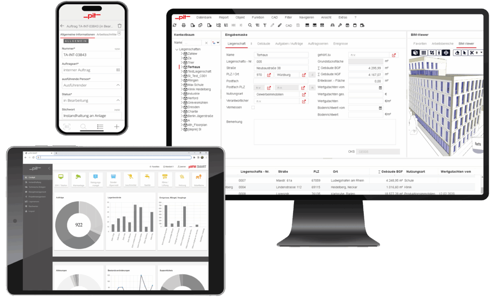</a> 
<b>pit-FM</b> <i>[Diagram]</i> · One-for-All module landscape (CAFM + BIM + Energy + TGA) <a href="https://pit.de/pitfm/">pit.de/pitfm</a>
</td>
</tr>
</table>

**Swiss-context note.** KEYLOGIC is the canonical Swiss-domiciled CAFM; selected by several cantonal real-estate offices. GEFMA 444 is a DACH-specific procurement filter that excludes most US/UK IWMS vendors at first sift — a frequent source of mismatch between BBL benchmarks and global vendor lists. *(KEYLOGIC preview omitted — vendor's website returned a parked Hetzner page during this scan; see ⚠️ note in table row.)*

### Z. ESG portfolio-data platforms (beyond submetering)

**Definition.** Portfolio-level environmental/social/governance data collection, calculation and reporting — distinct from tenant-level submetering (Segment N). These feed GRESB, CRREM, CSRD/ESRS, EU Taxonomy and EPBD 2024/1275 disclosures.

**Persona.** ESG / sustainability officers; investor-relations teams for real-estate portfolios; compliance teams driven by VILB Art. 9 Abs. 1bis reporting.

| Product | HQ | Notable feature |
|---|---|---|
| [Deepki](https://www.deepki.com/) | Paris, FR | Portfolio ESG SaaS; native CRREM / GRESB integration |
| [Measurabl](https://www.measurabl.com/) | San Diego, USA | GRESB-aligned; market share leader in public real estate |
| [Optera](https://www.opteraclimate.com/) | Boulder (CO), USA | Scope 1/2/3 + supplier engagement |
| [Carbonsight](https://www.carbonsight.de/) | Berlin, DE | DACH ESG SaaS for real estate |
| [ENGIE Impact](https://www.engieimpact.com/) | New York, USA | ENGIE-group sustainability consulting + data |
| [Spacewell Energy (Dexma)](https://spacewell.com/) | Barcelona, ES (Nemetschek) | AI energy management; also listed in N |
| [Sustain.life](https://www.sustain.life/) | New York, USA | Mid-market sustainability platform |
| [Schneider Resource Advisor](https://www.se.com/) | Rueil-Malmaison, FR | Energy + sustainability for enterprise portfolios |
| [Sweep](https://www.sweep.net/) | Paris, FR | Climate-data platform with RE module |
| [BuildingMinds](https://buildingminds.com/) | Berlin, DE (Schindler family-backed) | Real-estate data platform; CRREM, EU Taxonomy and EPBD modules; **cross-listed in Segment L** for digital-twin capabilities |
| [Sphera](https://sphera.com) | Chicago, US | EHS + ESG platform |
| [Spheria](https://spheria.com) | Paris, FR | ESG data-platform |
| [Persefoni](https://persefoni.com) | Tempe, US | Carbon accounting |
| [Watershed](https://watershed.com) | San Francisco, US | Enterprise carbon |
| [Climatiq](https://www.climatiq.io) | Berlin, DE | Carbon-data API |
| [Greenly](https://greenly.earth) | Paris, FR | SME-friendly carbon |
| [Plan A](https://plana.earth) | Berlin, DE | Enterprise carbon-accounting + decarbonisation |
| [GRESB](https://www.gresb.com) | Amsterdam, NL | Real-estate ESG benchmark |

**Preview — selected vendors** (product dashboards from vendors' own pages; links go to source pages):

<table>
<tr>
<td align="center" width="50%" valign="top">
<a href="https://www.deepki.com/solutions/capabilities/">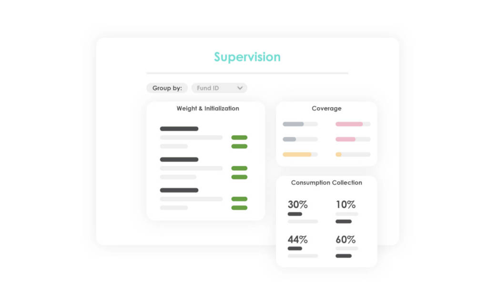</a> 
<b>Deepki</b> <i>[Dashboard]</i> · Deepki Ready ESG supervision (EN) <a href="https://www.deepki.com/">deepki.com</a>
</td>
<td align="center" width="50%" valign="top">
<a href="https://www.measurabl.com/platform/">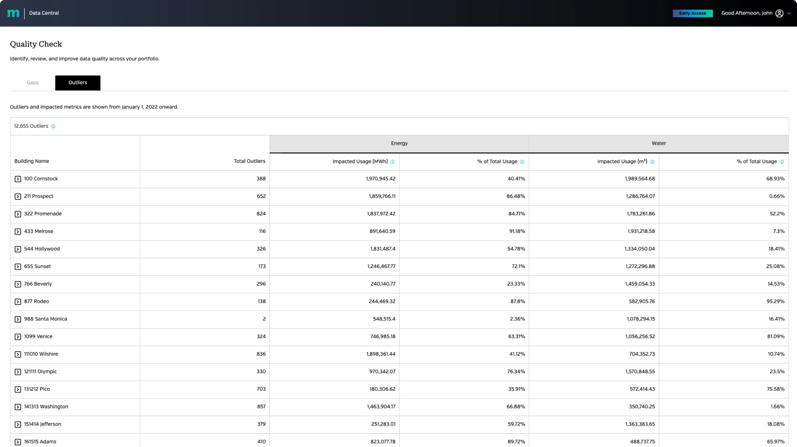</a> 
<b>Measurabl</b> <i>[Screenshot]</i> · Platform — Data Navigator UI <a href="https://www.measurabl.com/">measurabl.com</a>
</td>
</tr>
</table>

**Swiss-context note.** VILB Art. 9 Abs. 1bis (federal real-estate sustainability reporting) and EPBD 2024/1275 (zero-emission-buildings disclosures) push BBL toward portfolio-level ESG aggregation in addition to per-meter consumption data. Deepki and Measurabl are the most-cited investor-facing tools; Carbonsight is the DACH-aligned alternative. Submetering (Segment N) is upstream; this segment is downstream reporting.

### AA. Open-source / civic-tech tenant-portal alternatives

**Definition.** Open-source software relevant to landlord/tenant operations or directly tenant-portal-shaped, listed here to honour **EMBAG Art. 9 ("Public Money — Public Code" by default, in force 1 Jan 2024)**. None of these is a turnkey replacement for the proprietary suites above, but each is a credible starting point for a build-on-open-foundation pattern under EMBAG.

**Persona.** Federal IT planning teams operating under EMBAG; civic-tech contributors; municipalities pursuing OSS-by-default policies.

| Project | License | Origin | Relevance |
|---|---|---|---|
| [Odoo (Property modules)](https://www.odoo.com/) | LGPLv3 + commercial | Belgium | ERP with community + enterprise property-management modules |
| [ERPNext (Real Estate module)](https://erpnext.com/) | GPL v3 | India (Frappe Technologies) | Community-maintained real-estate module within Frappe ERP |
| [Tryton (rental modules)](https://www.tryton.org/) | GPL v3 | Belgium | Modular ERP with rental/property extensions |
| [Keycloak](https://www.keycloak.org/) | Apache 2.0 | Red Hat (community) | OSS IdP; AGOV-federation broker alternative; SAML/OIDC native |
| [Zammad](https://zammad.org/) | AGPL v3 | Germany | OSS service desk; honest OSS analogue to Segment G repair-ticketing front-ends |
| [Mattermost](https://mattermost.com/) | MIT | USA (community) | OSS team collaboration; civic-tech projects use it for tenant-staff comms |
| [GeoNode](https://geonode.org/) | GPL v3 | USA (OSGeo) | OSS geospatial publishing; complements BBL GIS IMMO (Appendix A) |
| [BIMserver](https://bimserver.org/) | AGPL v3 | TU Eindhoven | OSS BIM model server; complements CDE-Bund stack (Segment W) |
| [civic-tech.ch / opendata.swiss tooling](https://civictech.ch/) | various | Switzerland | Swiss civic-tech community; federal-relevant tools surface periodically |
| [Hugging Face open document-AI](https://huggingface.co/models) | various | France/USA | OSS OCR + LLM models; honest alternative to Segment X commercial lease abstraction |
| [Plone](https://plone.org) | BSD-like | global community | CMS in CH/AT/DE federal use; security-hardened |
| [Drupal](https://www.drupal.org) | GPL v2 | global community | Used in Swiss federal websites and many DACH cantons / cities |
| [TYPO3](https://typo3.org) | GPL v2 | Düsseldorf-based association | Dominant in DACH public-sector CMS |
| [Strapi](https://strapi.io) | MIT + Enterprise | Paris, FR | Open-source headless CMS |
| [Directus](https://directus.io) | BSL → MIT | Brooklyn, US | Headless CMS / data platform |

**Preview — selected OSS projects** (product screenshots from project pages; links go to source pages):

<table>
<tr>
<td align="center" width="50%" valign="top">
<a href="https://www.odoo.com/app/rental">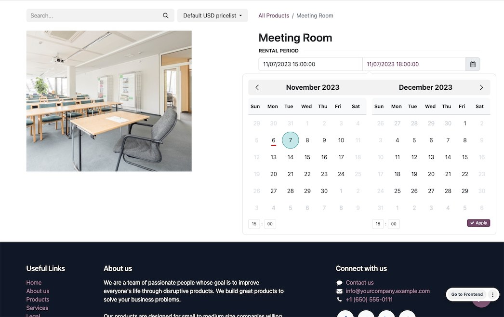</a> 
<b>Odoo (Rental / Property)</b> <i>[Screenshot]</i> · Rental product configuration UI <a href="https://www.odoo.com/app/rental">odoo.com/rental</a>
</td>
<td align="center" width="50%" valign="top">
<a href="https://www.keycloak.org/">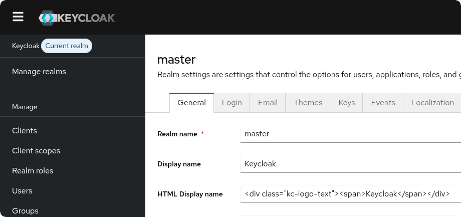</a> 
<b>Keycloak</b> <i>[Screenshot]</i> · Admin console — OSS IdP (Apache 2.0) <a href="https://www.keycloak.org/">keycloak.org</a>
</td>
</tr>
</table>

**Maturity.** Mostly emerging; production-grade for niche use cases (Keycloak, Odoo, Zammad) but no canonical OSS "tenant portal" exists for federal-scale residential operations.
**Swiss-context note.** EMBAG Art. 9 expects federal software customisations to be publishable as OSS unless third-party rights or security forbid. The proprietary tenant-portal market pre-dates EMBAG; the gap between EMBAG's expectation and what vendors actually license under is the single largest procurement-policy tension in this segment. **Custom Fiori on SAP BTP (Segment Q) is currently the most practical EMBAG-conformant pattern** — pure OSS alternatives are realistic only for non-RE-FX-bound tenant touchpoints (community boards, repair tickets, document download) and as ingestion/extraction tooling for SAP RE-FX (Segment X).

### BB. Workflow automation & low-code business logic

**Definition.** Generic process-orchestration, form-driven business-logic, and low-code application platforms — distinct from vertical tenant-portal SaaS (A–H, F) and from system-to-system integration (Segment S iPaaS). These tools let an organisation **assemble** tenant-portal-shaped workflows from primitives (forms, notifications, approvals, branches, signals, scheduled jobs) rather than buying a packaged product. Spans three sub-categories:
1. **Low-code / form builders** — Power Apps, OutSystems, Mendix.
2. **SaaS workflow automation** — Power Automate, Zapier, Make, n8n, Activepieces.
3. **BPMN / DMN engines (enterprise BPM)** — Camunda, Bonita, ProcessMaker, Pega, Appian, SAP Build Process Automation.

**Persona.** Federal IT planning teams aiming to assemble tenant-portal touchpoints on top of already-licensed primitives (M365, SAP BTP); civic-tech contributors building OSS portal patterns under EMBAG Art. 9; BPM analysts modelling federal back-office workflows that touch tenant lifecycle events.

| Product | HQ | License | Notable feature |
|---|---|---|---|
| [Microsoft Power Automate](https://www.microsoft.com/en-us/power-platform/products/power-automate) | Redmond, USA | Commercial (M365 / Power Platform) | M365-native; deep Outlook / Teams / SharePoint hooks; **Azure Switzerland regions** available |
| [Microsoft Power Apps](https://www.microsoft.com/en-us/power-platform/products/power-apps) | Redmond, USA | Commercial (M365 / Power Platform) | Low-code app builder; pairs with Power Automate for form + flow + UI |
| [SAP Build Process Automation](https://www.sap.com/products/technology-platform/process-automation.html) | Walldorf, DE | Commercial (BTP) | Successor to SAP Workflow Management; native to SAP BTP; aligned with the custom-Fiori-on-BTP pattern in Segment Q |
| [SAP Build Apps / SAP Build Work Zone](https://www.sap.com/products/technology-platform/build.html) | Walldorf, DE | Commercial (BTP) | Low-code app builder + work-zone (portal shell) on BTP |
| [n8n](https://n8n.io/) | Berlin, DE | Fair-code (sustainable-use license); self-hostable | OSS-friendly; deep integrations including SAP, M365, Slack, Telegram; **EMBAG-aligned automation alternative** when self-hosted in CH |
| [Camunda](https://camunda.com/) | Berlin, DE | Commercial + Community Edition (Apache 2.0) | BPMN 2.0 / DMN 1.3 standards; deep federal/government track record (DE BAMF, BKA, BImA; NL DUO, BZ) |
| [Activepieces](https://www.activepieces.com/) | Toronto, CA | MIT + commercial cloud | Fully open-source Zapier alternative; self-hostable |
| [Make (ex-Integromat)](https://www.make.com/) | Prague, CZ | Commercial | Visual workflow automation; EU-hosted; very strong free tier for prototyping |
| [Zapier](https://zapier.com/) | San Francisco, USA | Commercial | Largest SaaS automation marketplace (~7,000 integrations); US-hosted |
| [Bonita / Bonitasoft](https://www.bonitasoft.com/) | Grenoble, FR | Open-source Community + commercial | BPMN engine; FR public-sector deployments (CNAM, DGFiP); OSS-by-default friendly |
| [ProcessMaker](https://www.processmaker.com/) | Durham (NC), USA | Open-source Community + commercial | BPMN; intelligent document processing; multilingual |
| [Pega Platform](https://www.pega.com/) | Cambridge (MA), USA | Commercial | Enterprise BPM + AI-decisioning; deep insurance / public-sector heritage |
| [Appian](https://appian.com/) | McLean (VA), USA | Commercial | Enterprise low-code / BPM; FedRAMP-authorized in US federal |
| [OutSystems](https://www.outsystems.com/) | Linda-a-Velha, PT | Commercial | Enterprise low-code; long-running EU public-sector deployments |
| [Mendix (Siemens)](https://www.mendix.com/) | Boston, USA (Siemens) | Commercial | Siemens-owned low-code; natural pair to Siemens Building X / Cobundu adjacencies (Segment L) |
| [ServiceNow Flow Designer](https://www.servicenow.com/) | Santa Clara, USA | Commercial | Native to ServiceNow; bundled with WSD (Segment A/B) and Nuvolo CWP |
| [Microsoft Logic Apps](https://azure.microsoft.com/en-us/products/logic-apps) | Redmond, US | Commercial (Azure) | iPaaS within Azure |
| [Tray.io](https://tray.io) | San Francisco, US | Commercial | iPaaS |
| [Workato](https://www.workato.com) | Mountain View, US | Commercial | Enterprise iPaaS |
| [Pipefy](https://www.pipefy.com) | San Francisco, US | Commercial | BPM no-code |
| [Kissflow](https://kissflow.com) | Chennai, IN | Commercial | BPM no-code |
| [Flowable](https://www.flowable.com) | Zurich, CH (with NL roots) | Open-source + commercial | **Swiss-domiciled open-source BPMN engine** — direct relevance to federal CH workflows |
| [Trisotech](https://www.trisotech.com) | Quebec, CA | Commercial | BPMN / CMMN / DMN authoring |
| [Decisions](https://decisions.com) | Chesapeake, US | Commercial | Process automation |
| [Twigg](https://twigg.io) | UK | Commercial | Workflow automation |

**Maturity.** Mature across BPM (Camunda, Pega, Appian) and SaaS automation (Power Automate, Zapier, Make); rapidly growing in OSS (n8n, Activepieces). Power Automate has the **lowest adoption friction** in a federal CH context because M365 is already deployed and Azure Switzerland regions are available; SAP Build Process Automation has the lowest friction inside the SAP estate.

**Swiss-context note.** For BBL specifically: **Power Automate** (M365-licensed; Entra ID / AGOV federation feasible) and **SAP Build Process Automation** (BTP-native; co-engineered with the Q-segment pattern) are the two paths of least resistance. **n8n** is the most EMBAG-Art.-9-aligned (fair-code, self-hostable, custom code publishable as OSS) and is the practical open-source path for tenant-portal automation. **Camunda** is the canonical BPMN/DMN engine across DE federal government — worth benchmarking if BBL has process-modelling-driven workflows that need executable BPMN.

**Taxonomy note — important.** This segment overlaps deliberately with several others and that overlap is the **substantive procurement insight** of the document:
- **S (iPaaS)**: workflow automation tools also do system-to-system integration, but the focus is *process orchestration with human steps* vs. iPaaS *machine-to-machine data movement*. Aareon Locoia is iPaaS; n8n / Power Automate straddle both.
- **K (AI tenant copilots)**: modern workflow tools embed LLM nodes (routing, summarisation, drafting, RAG over docs). The "AI tenant copilot" boundary is becoming blurry — many "smart" features in vertical SaaS are LLM-call-from-a-workflow.
- **Q (SAP RE-FX integration)**: SAP Build Process Automation is the SAP-native expression of this segment and the EMBAG-conformant pattern for BBL-internal automation.
- **AA (OSS)**: n8n, Activepieces, Bonita Community, Camunda Community Edition are OSS-publishable under EMBAG Art. 9.

**Practical procurement test.** Before buying a vertical tenant-portal "smart ticketing" / "tenant copilot" / "automated approval" feature, ask: *can this be assembled with our existing Power Automate / BTP / n8n primitives plus a form, a notification, and a condition?* In many federal-CH cases the answer is yes, and EMBAG Art. 9 makes the build-on-licensed-primitives pattern the default rather than the exception.

### AC. Tenant Onboarding, KYC, Credit-Screening & Bonität

**Definition.** The "front of the funnel" before a lease exists — identity verification (IDV), creditworthiness/Bonität scoring, debt-register checks, and applicant background screening. Scope ends at lease signature: eSignature sits in Segment I, deposit substitution in Segment AD, and listing portals upstream in Segment O. Switzerland's three orthogonal data sources — (a) Betreibungsregister-Auszug from the cantonal/Gemeinde debt office, (b) private-bureau score from CRIF or Intrum, and (c) IDV / eID / SwissID assertion — distinguish the CH stack from the SCHUFA-dominant DE market and the KSV1870-dominant AT market.

**Persona.** Federal landlord onboarding teams (BBL Bereich Bauten, BImA Geschäftsbereich Wohnen), large institutional landlords (Livit, Wincasa, Vonovia), and PropTech tenant-experience apps that embed credit checks in the lease-application flow. For BBL specifically, the active question is which bureau or certificate format the federal Mieterportal accepts: paper Betreibungsauszug, digital CreditTrust certificate, or SwissID/AGOV-linked identity assertion.

| Product | HQ | Hosting | Pricing | Notable feature |
|---|---|---|---|---|
| [CRIF AG](https://www.crif.ch) | Zurich, CH (parent Bologna, IT) | Cloud (CH region) | B2B API per-query; free self-disclosure once a year | National creditworthiness DB; CRIF score 1–600; co-issuer of CreditTrust |
| [Intrum AG](https://www.intrum.ch) | Schwerzenbach, CH (parent Stockholm, SE) | Cloud (CH/EEA) | B2B API per-query; free self-disclosure once a year | National creditworthiness DB; co-issuer of CreditTrust |
| [CreditTrust](https://credittrust.ch) | Zurich, CH (JV of CRIF + Intrum, 2018) | Cloud (CH) + Ethereum-anchored hash | Free for accepting businesses; ~CHF 25 to applicant | Blockchain-anchored Bonitätszertifikat; aggregates both major Swiss bureaus; embedded into homegate.ch / ImmoScout24.ch flow per SMG Real Estate |
| [Creditreform Schweiz](https://www.creditreform.ch) | St. Gallen, CH | Cloud | B2B subscription / per-query | DACH-wide commercial credit; cantonal coverage |
| [moneyhouse.ch](https://www.moneyhouse.ch) | Zurich, CH (Ringier) | Cloud (CH) | Freemium; Premium ~CHF 7/month | Trade-register + Bonität aggregator; popular tenant background check |
| [SCHUFA Holding](https://www.schufa.de) | Wiesbaden, DE (founded 1927) | Cloud (DE) | B2B per-query; consumer Bonitätscheck ~€29.95 | Dominant DE consumer bureau; "SCHUFA-BonitätsAuskunft" is the de-facto German rental document |
| [KSV1870](https://www.ksv.at) | Vienna, AT | Cloud (AT) | B2B subscription | Dominant AT bureau |
| [Bisnode D&B Switzerland](https://www.bisnode.ch) | Urdorf, CH (Dun & Bradstreet) | Cloud | B2B subscription | Commercial Bonität; D&B D-U-N-S |
| [Acrevis CreditCheck / Onlineprüfung](https://www.acrevis.ch) | St. Gallen, CH | Cloud | Per-check | Bank-grade Bonitätscheck used by some Swiss agencies |
| [PXL Vision](https://www.pxl-vision.com) | Zurich, CH (Mühlebachstrasse 164, 8008; founded 2017 as Dacuda spin-off) | SaaS + on-prem | Quote-based; volume tiers | Swiss-made browser-based AutoID in <30 s; ISO 27001; ZertES + eIDAS-compliant via Swisscom Trust |
| [KYC Spider](https://www.kyc-spider.com) | Aarau, CH | Cloud (CH) | Per-check / subscription | Swiss-domiciled AML/KYC tooling |
| [IDnow](https://idnow.io) | Munich, DE (founded 2014) | Cloud (DE/EU) | Per-verification; quote | BaFin-anerkannt VideoIdent + AutoIdent; EUDI Wallet ready |
| [WebID Solutions](https://www.webid-solutions.de) | Berlin / Solingen, DE | Cloud (DE) | Per-verification | First BaFin-licensed VideoIdent (2014); QES-capable |
| [Onfido (Entrust Identity Verification)](https://onfido.com) | London, UK — acquired by Entrust April 2024 | Cloud (EU/UK residency available) | Quote-based; volume tiers; per-Finexer's industry data, median annual spend ~$60,475, range $6,156–$945,900 | "Atlas AI" liveness + ~2,500 documents; data-processor by default per April 2025 Product Privacy Notice |
| [Veriff](https://www.veriff.com) | Tallinn, EE | Cloud | Self-serve tiers + Enterprise quote | Supports 12,500+ identity documents across 230+ countries (Veriff marketing, Sept 2025) |
| [Sumsub](https://sumsub.com) | London, UK / Berlin DE office | Cloud | Per-successful-verification | All-in-one KYC/AML/KYB + fraud |
| [Klippa](https://www.klippa.com) | Groningen, NL | Cloud (EU) | Per-document / subscription | OCR + IDV for property and finance |
| [Goodlord](https://www.goodlord.co) | London, UK | Cloud | Per-tenancy fee | UK letting platform with embedded referencing |
| [HomeLet](https://homelet.co.uk) | Lincoln, UK (Barbon Insurance Group) | Cloud | Per-reference | Largest UK tenant-referencing volume |
| [Canopy](https://www.canopy.rent) | London, UK | Cloud | Free for tenants; lettings-agent subs | "RentPassport" — Open-Banking-based rent-affordability + Experian-fed score |
| [Experian RentBureau](https://www.experian.com/rentbureau) | Costa Mesa, US (Dublin EMEA HQ) | Cloud | Per-record | US rent payment reporting; feeds FICO 9/10 |
| [RentSpree](https://www.rentspree.com) | Los Angeles, US | Cloud (US) | Per-application $39.99 | US tenant screening incl. TransUnion data |
| [TransUnion SmartMove](https://www.mysmartmove.com) | Chicago, US | Cloud (US) | Per-screening $25–$40 | US tenant screening |
| [Naborly](https://naborly.com) | Toronto, CA | Cloud | Per-application | AI-based tenant scoring, CA/US focus |

**Maturity.** Mature on the bureau side (SCHUFA founded 1927, CRIF 1988, Intrum-Justitia heritage from 1923); consolidating on the IDV/KYC side — the Entrust acquisition of Onfido (April 2024) is the most material 2024–2026 structural event in the segment. Tenant-scoring specialists with no bureau access remain emerging.

**Swiss-context note.** CreditTrust (Intrum + CRIF JV, 2018) has become the dominant digital alternative to the paper Betreibungsregister-Auszug in Swiss residential applications, embedded directly in homegate.ch and ImmoScout24.ch flows; SMG Real Estate testimonial: "CreditTrust is the best choice here: ordered digitally within a few minutes." PXL Vision is the Swiss-domiciled IDV reference; its PXL Ident for QES is the first identity service provider integrated on the Swisscom Trust Services platform for ZertES/eIDAS QES. For a federal landlord, the AGOV/SwissID identity layer is the obvious upstream anchor for an authenticated tenant.

**Taxonomy note.** Overlaps with Segment I (eSignature) at the QES identity-proofing step (PXL Ident, IDnow AutoIdent, WebID), with Segment R (sovereign hosting) at the Schweizer Datenresidenz line, and with Segment T (fintech adjacencies) where Bonität checks shade into Open-Banking affordability checks (Canopy RentPassport, Yapily, TrueLayer).

### AD. Deposit, Rental-Guarantee & Tenant Insurance Tech

**Definition.** Products that substitute or insure the cash deposit (Kaution / Mietkaution / security deposit), plus the tenant-side contents/liability insurance commonly sold at lease start. Boundary: distinct from generic insurtech (general P&C) and from Segment T (rent-payment fintech). The German legal cap (§ 551 BGB: three monthly cold rents max, separate interest-bearing Mietkautionskonto) and the Swiss CO Art. 257e (three months max, blocked savings account) define the product shape.

**Persona.** Property managers seeking to reduce administrative friction of cash-deposit handling; tenants needing capital-efficient alternatives; institutional landlords (federal, cantonal, large-listed) evaluating bulk acceptance frameworks. BBL's relevant question is which guarantee providers a federal landlord can accept by policy.

| Product | HQ | Hosting | Pricing | Notable feature |
|---|---|---|---|---|
| [SwissCaution](https://www.swisscaution.ch) | Bussigny / Lausanne, CH (La Mobilière subsidiary) | Cloud | 5 % of guarantee p.a. + CHF 20 admin + 5 % stamp duty | "No. 1 most widely accepted" rental guarantee CH; Post-branch distribution since 2009; loyalty programme up to 30 % discount |
| [Firstcaution](https://www.firstcaution.ch) | Nyon, CH (Zurich + Bellinzona offices; family-owned, 65 staff) | Cloud | Monthly or annual premium; flexible deposit hybrid | FINMA-approved; only CH provider offering true monthly billing; >100,000 customers |
| [goCaution](https://www.gocaution.ch) | Zurich, CH (Generali subsidiary) | Cloud | Annual premium | Generali-backed |
| [SmartCaution](https://www.smartcaution.ch) | CH | Cloud | Annual premium | Niche CH provider |
| [Helvetia Kautionsversicherung](https://www.helvetia.com/ch) | St. Gallen, CH | Cloud | Annual premium | Traditional insurer arm |
| [AXA Mietkaution](https://www.axa.ch) | Winterthur, CH | Cloud | Annual premium | Direct insurer offering |
| [Zurich Kautionsversicherung](https://www.zurich.ch) | Zurich, CH | Cloud | Annual premium | Direct insurer offering |
| [Eurokaution (EuroKaution Service EKS)](https://www.eurokaution.de) | Baden-Baden, DE (founded 2008) | Cloud (DE) | 4.7 % of deposit p.a., min. €50/yr | "Deutschlands ältester Mietkautionsgesellschaft seit 2008"; bond issued by R+V Versicherung |
| [Deutsche Kautionskasse AG (Moneyfix®)](https://www.kautionskasse.de) | Starnberg, DE (founded 2008) | Cloud (DE) | ~4.7 % p.a. (Assekuradeur model) | Bürgschaftsurkunde issued by Allianz (private) / ERGO (gewerbe) |
| [plusForta GmbH](https://plusforta.de) — operating kautionsfrei.de, heysafe.de, kautionsfuchs.de | Düsseldorf, DE (Talstraße 24) | Cloud (DE) | ~4.99 % p.a. (private) | Multi-brand operator; **Aareal Bank Group-owned since Feb 2019** — direct corporate-family link to PM-software giant Aareon |
| [Cosmos Direkt Mietkaution](https://www.cosmosdirekt.de) | Saarbrücken, DE (Generali) | Cloud | ~5.2 % p.a. | Direct insurer |
| [Flatfair](https://www.flatfair.co.uk) | London, UK (founded 2016) | Cloud (UK) | Non-refundable check-in fee = 28 % of one month's rent + VAT, min £120 | "Deposit-free renting"; 850+ agents & BTR operators; Index Ventures-backed |
| [Reposit](https://reposit.co.uk) | London, UK (128 City Road; founded 2015) | Cloud | ~1 week's rent + VAT | 8 weeks' protection |
| [Zero Deposit](https://www.zerodeposit.com) | UK | Cloud | 1 week's rent + £59.99 set-up + £17.50/yr | **Underwritten by Aviva; FCA-regulated; TDS-adjudicated**; works with 79 % of top UK estate agents that have chosen a deposit-replacement option (per ZeroDeposit.com) |
| [Insurami](https://insurami.com) | London, UK | Cloud | Commission-based | Commercial-lease deposit substitution |
| [Getsafe](https://www.hellogetsafe.com/de-de) | Heidelberg, DE (founded 2015) | Cloud (DE) | Monthly micro-pricing in-app | App-native insurtech; Hausrat + Haftpflicht + Rechtsschutz; **over 500,000 customers in Germany, Austria and France**, supported by more than €120 m in venture capital from Earlybird, CommerzVentures, Swiss Re (Getsafe press release 2025) |
| [Friday → Allianz Direct](https://www.friday.de) | Berlin, DE (founded 2017) | Cloud | Monthly Kfz/Hausrat | **Allianz Direct announced acquisition of Friday's portfolio from Baloise in Oct 2024; Friday brand being wound down (Handelsblatt, Oct 2024)** |
| [Adam Riese](https://www.adam-riese.de) | Stuttgart, DE (Württembergische / W&W Group) | Cloud | Monthly Hausrat/Haftpflicht | Digital brand of W&W |
| [Canopy Rent Insurance](https://www.canopy.rent) | London, UK | Cloud | Per-tenancy | Rent guarantee + contents bundle |

**Maturity.** Mature in CH (SwissCaution founded 1991; FINMA-supervised duopoly+); consolidating in DE (plusForta–Aareal acquisition 2019 a major structural event linking the deposit-substitution market to the PM-software market; Allianz Direct's Oct 2024 acquisition of Friday from Baloise consolidating the digital-Hausrat market); emerging in UK on tenancy-fee-ban-driven deposit-replacement; emerging in DACH on app-native tenant contents (Getsafe, Adam Riese).

**Swiss-context note.** Swiss Kautionsversicherung is structurally a duopoly+ between SwissCaution (Mobilière) and Firstcaution, with goCaution (Generali) third — Firstcaution's own product copy is explicit: "Swisscaution and Gocaution are both subsidiaries of major insurance companies: La Mobilière and Generali. Firstcaution is a family business." All three are FINMA-supervised. Acceptance by federal/cantonal landlords typically requires the certificate to be issued by a FINMA-approved insurer; BBL would need its own list. CO Art. 257e three-months cap is binding on residential; commercial may exceed.

**Taxonomy note.** Overlaps with Segment T (fintech adjacencies) on premium-collection rails and with Segment AC (KYC) because issuers run their own Bonität check before issuing the guarantee. Distinct from Segment R because most issuers host with mainstream insurers' own datacentres rather than sovereign clouds.

### AE. Tenant Communication, Resident Voting & WEG-Versammlung Tech

**Definition.** Digital tools for Eigentümerversammlung, WEG-Beschluss, Stockwerkeigentümer-Versammlung (STWEG in CH), tenant consultation, and general resident-association voting. Distinct from generic survey tools by their legal-quality voting (BSI- or Common Criteria-certified ballots, ZertES-compliant minutes) and their integration with property-management ERPs (Aareon, casavi). The STWEG specifics in Swiss law (ZGB Art. 712a ff., quorum and Schriftform rules of each Reglement) differ from the German WEG-Reform-G 2020.

**Persona.** Hausverwaltungen running WEG/STWEG Versammlungen; large landlords running tenant consultations; cooperative housing societies (Genossenschaften — large in CH); federal/cantonal estate managers running collegial board votes. For BBL specifically, this segment is relevant only where federal property has a Stockwerkeigentum component or where tenant-council consultation processes need legal traceability.

| Product | HQ | Hosting | Pricing | Notable feature |
|---|---|---|---|---|
| [POLYAS](https://www.polyas.com) | Kassel / Berlin, DE (first online election 1996) | Cloud (DE) | Per-election; quote | BSI Common Criteria-certified core (POLYAS CORE 2.5.0, recertified June 2025); customers incl. CDU party convention, EBRD, Diocese of Freiburg |
| [vote.io](https://vote.io) | DE | Cloud (DE) | Per-event | WEG/Vereins-focused live voting |
| [OASIS Voting](https://www.oasis-voting.com) | DE/EU | Cloud (DE) | Per-event | Hybrid Versammlung |
| [Vote@Home](https://www.vote-at-home.de) | DE | Cloud (DE, GDPR) | Per-event | Open-source-based; integrated Jitsi for video; weighted/named/secret votes; proxy & Weisung management aimed at WEG-Verwalter |
| [casavi WEG-Versammlung module](https://casavi.com/en) | Munich, DE (Aareon-owned since 2022) | Cloud | Add-on to casavi suite | WEG hybrid/online meetings; integration with Win-CASA, iX-Haus, DOMUS |
| [etg24](https://www.etg24.de) | DE | Cloud (DE) | Subscription per unit | WEG portal incl. proxies, circular resolutions, hybrid Versammlung; on Aareon Marketplace |
| [iDWELL](https://www.idwell.com) | Vienna, AT | Cloud (EU) | Per-unit subscription | Mieter/Eigentümer-CRM + Versammlung; Win-CASA integration; idwell finance for invoice automation |
| [Civey](https://civey.com) | Berlin, DE | Cloud (DE) | Subscription | Opinion polling — not BSI-certified for legal Versammlungen, useful for non-binding tenant consultations |
| [ImmoSocial](https://www.immosocial.com) | DE | Cloud | Quote | Resident social platform |
| [Wohnglück](https://www.wohnglueck.de) | DE | Cloud | Subscription | Resident communication |
| [Quartier Schweiz](https://www.quartier-schweiz.ch) | CH | Cloud (CH) | Subscription | Swiss neighbourhood/Quartier platform |
| [Building Engines (JLL Technologies)](https://www.buildingengines.com) | Boston, US | Cloud | Quote | US commercial-property tenant experience incl. voting |
| [HOA Express](https://hoa-express.com) | US | Cloud | Per-HOA | US HOA / condo board management |
| [AppFolio voting](https://www.appfolio.com) | Goleta, US | Cloud | Bundled with PM Plus | US residential PM with community voting |
| [RentCafe Resident Services](https://www.rentcafe.com) | Yardi | Cloud | Bundled with Voyager | US Yardi tenant portal incl. event/vote modules |

**Maturity.** Consolidating: the WEG-Reform-G of December 2020 in Germany expressly enables hybrid and online Versammlungen, which triggered substantial product investment; casavi's acquisition by Aareon (2022) and the iDWELL/Win-CASA integration deepening through 2024–2026 are the visible consolidation signals. STWEG-specific Swiss product offering remains thin — most CH Verwalter still rely on paper or generic videoconference plus a vote.io / POLYAS bolt-on.

**Swiss-context note.** STWEG in CH does not have the same legal recognition of online Versammlungen as the post-2020 German WEG; binding votes generally still require physical attendance or written proxy in the strict form prescribed by the Reglement of each Stockwerkeigentümer-Gemeinschaft. Tools like POLYAS Live Voting are used at physical assemblies for speed-of-tabulation rather than as a remote-vote substitute. For a federal landlord without STWEG-Anteil, this segment functions mainly as a tenant-consultation overlay rather than a legal-quality voting platform.

**Taxonomy note.** Overlaps with Segment F (residential tenant experience) where the Versammlung module is bundled into a broader resident portal (casavi, iDWELL, etg24), and with Segment I (eSignature) where the resulting Protokoll/Beschluss is QES-signed.

### AF. Mobility & EV-Charging Tenant Services

**Definition.** EV-charging operator (CPO/EMSP) software exposed at tenant level — wallbox provisioning in residential parking, billing per kWh against rent or service charge, OCPP-back-end management, and roaming. Distinct from Segment N (energy/submetering) by its operational-mobility focus, and from Segment L (smart-building) by its dedicated billing/roaming stack. Parking-management (Parquery, ParkingPay) sits adjacent.

**Persona.** Large landlords integrating EV charging into rental parking — federal estate (BBL fleet + tenant parking), institutional residential portfolios (Mobimo, SPS, PSP, Vonovia), workplace operators. The integration question is OCPP 2.0.1 + ISO 15118-2 (Plug & Charge) into the existing FM stack, and the billing question is whether kWh costs are passed through as Nebenkosten or invoiced separately by a CPO partner.

| Product | HQ | Hosting | Pricing | Notable feature |
|---|---|---|---|---|
| [Swisscharge / Energie 360° / GOFAST / Move](https://swisscharge.ch) | Zurich, CH (Energie 360° group) | Cloud (CH/EU) | App-free pay-as-you-charge; CHF ~0.59/kWh fast-charge typical | **Largest CH network: over 24,000 charging points and 250,000 users post-Move acquisition (July 2025); zero roaming inside group from 1 Nov 2025; CHF 200 m investment programme to 2030** |
| [evpass (Shell Recharge Solutions)](https://www.evpass.ch) | CH (now Shell Recharge Solutions; former Groupe E) | Cloud | Up to ~CHF 0.79/kWh public fast-charging — ~CHF 46 for 50 kWh per TCS data cited by Carify, Mar 2026 | One of densest CH public networks; under Shell brand |
| [Juice Technology AG](https://juice-world.com) | Cham, CH | Cloud + hardware | Hardware + Juice World portal subscription | Swiss-made Juice Booster mobile charger; integrated Juice World OCPP portal |
| [Park-it](https://park-it.ch) | Zug, CH | Cloud (CH) | Per-space subscription | CH parking-management with EV-charging integration |
| [chargecloud GmbH](https://www.chargecloud.com/en) | Cologne, DE | Cloud (DE) | Subscription per charge point + transaction fee | Modular CPO OS; white-label frontends; AI energy-management partner marketplace |
| [reev](https://reev.com) | Munich, DE | Cloud (DE) | Subscription per wallbox | Specialises in commercial fleet + multi-tenant residential |
| [has·to·be → ChargePoint Europe](https://www.chargepoint.com) | Vienna / Klagenfurt, AT — **acquired by ChargePoint for ~$295 m in 2021** | Cloud | Subscription per CP | be.ENERGISED platform; AT/DE flagship CPO software; consolidated into ChargePoint Platform |
| [ChargePoint Platform](https://www.chargepoint.com) | Campbell, US (NYSE: CHPT) | Cloud (regional EU residency) | Subscription | Per ChargePoint press release of 11 Feb 2026: gives EV drivers access to **more than 900,000 roaming ports** in addition to **approximately 375,000 public and private ports that ChargePoint directly manages** (~1.275 M total); AI optimisation engine launched 13 Nov 2025 |
| [eMabler](https://www.emabler.com) | Helsinki, FI | Cloud (EU) | API-first per-CP | Headless CPO API |
| [GP JOULE Connect](https://www.gp-joule.com) | Reußenköge, DE | Cloud | Subscription + per kWh | German vertically-integrated CPO |
| [&Charge](https://www.andcharge.com) | Munich, DE (Mer Group) | Cloud | App; cashback model | Consumer-side rewards |
| [ENGIE Vianeo](https://www.vianeo.com) | Paris, FR | Cloud | Per-session / subscription | ENGIE's CPO arm |
| [Allego](https://www.allego.eu) | Arnhem, NL | Cloud | Per-session | Pan-EU CPO; listed |
| [Mer (Statkraft)](https://uk.mer.eco) | Oslo, NO | Cloud | Per-session | Statkraft-owned CPO |
| [EVgo](https://www.evgo.com) | Los Angeles, US | Cloud (US) | Per-session | US fast-charging |
| [Wallbox](https://wallbox.com) | Barcelona, ES (NYSE: WBX) | Cloud | Hardware + myWallbox app subscription | Pulsar/Quasar bi-directional |
| [Pod Point](https://pod-point.com) | London, UK (EDF) | Cloud (UK) | Subscription | UK home + workplace |
| [Driivz (Vontier)](https://driivz.com) | Kfar Saba, IL | Cloud | Subscription | Enterprise CPO OS |
| [GreenFlux (DKV Mobility)](https://www.greenflux.com) | Amsterdam, NL | Cloud (EU) | Per-CP / per-transaction | Roaming-heavy CPO |
| [Parquery](https://parquery.com) | Zurich, CH (ETH spin-off) | Cloud (CH) | Per-camera subscription | Computer-vision parking occupancy |
| [ParkingPay](https://www.parkingpay.ch) | Mendrisio, CH | Cloud (CH) | Per-transaction | Swiss municipal parking-payment app |

**Maturity.** Consolidating: ChargePoint/has·to·be (2021), Energie 360° acquisition of Move (July 2025), and Shell's earlier acquisition of evpass mark a clear consolidation toward 3–4 dominant CH-regional CPO groups. Software (CPO OS) is mature; tenant-portal billing integration with PM ERPs (Aareon, casavi) is emerging.

**Swiss-context note.** Switzerland's CPO market post-July 2025 is dominated by the Energie 360°/Gofast/Swisscharge/Move group plus Shell-Recharge (evpass) and AMAG. The FEDRO/ASTRA tender for ~40 motorway-service-area HPC hubs (won in part by Energie 360°) is the visible federal procurement vector. For BBL parking exposed to tenants, the procurement question is whether to remain hardware-agnostic (OCPP 2.0.1) and pick a CPO OS, or to subcontract to a CH CPO operator. Pricing visibility is poor: TCS data cited by Carify (March 2026) shows the gap between cheapest (GoFast Viamala CHF 23 for 50 kWh) and most expensive (evpass Kölliken CHF 46 for 50 kWh) at ~100 %.

**Taxonomy note.** Distinct from Segment N (energy/sub-metering: heat, water, electricity for accounting Nebenkosten) and from Segment L (smart-building IoT: BMS, occupancy). Overlaps with Segment T at the rent-as-payment / cashback rails (&Charge, Bilt-style models) and with Segment Y (CAFM) where charging-station maintenance is bundled into FM.

### AG. Building Automation / GA-Leitsystem (OT layer beneath L)

**Definition.** The operational-technology layer of building controls (Gebäudeautomation, GA-Leitsystem) — HVAC, lighting, shading, room automation, BMS/BACS supervisors — that sits *below* the digital-twin/smart-building portal layer (Segment L). Standards: BACnet/IP, BACnet MS/TP, KNX, Modbus RTU/TCP, LonWorks, M-Bus, EnOcean, DALI, increasingly LoRaWAN for retrofit metering and Matter for some commercial deployments. Swiss alignment: SIA 386.110, SIA 384/1, KBOB AS-Standard Lifecycle BIM/CAFM/GA integration.

**Persona.** Building owners' technical-FM directorates (BBL Fachbereich Gebäudetechnik), GA-Planer, system integrators, and the smart-building platform layer above (Segment L) that consumes BACnet/IP data via REST/MQTT brokers. For BBL, this is the OT substrate that produces the data ingested by the tenant-experience and energy-reporting layer.

| Product | HQ | Hosting | Pricing | Notable feature |
|---|---|---|---|---|
| [Sauter Building Control (Sauter moduWeb / Vision)](https://www.sauter-controls.com) | Basel, CH | On-prem + edge + cloud | Project-based licence | Swiss-domiciled BACnet/IP, KNX, Modbus; SIA-aligned; cantonal/federal GA-Leitsystem reference |
| [Saia-Burgess Controls (SBC) / Saia PCD](https://www.saia-pcd.com) | Murten, CH — **Honeywell subsidiary since January 2013, acquired for $130 m from Johnson Electric** | On-prem PLC + Saia PCD Supervisor cloud | Hardware + licence | Saia PCD3 to ~10,000 I/O distributed; BACnet, LON, MS/TP; widely deployed in CH infrastructure/transport (SBB, VBZ) |
| [Belimo Cloud](https://www.belimo.com) | Hinwil, CH | Hardware + cloud (BelimoCloud) | Hardware + connectivity sub | Valves & actuators with Energy-Valve + cloud telemetry |
| [Siemens Desigo CC](https://www.siemens.com) | Zug, CH (Smart Infrastructure HQ) / Munich, DE | On-prem + Building X (cloud) | Per-data-point licence | Dominant DACH BMS supervisor; OEM-agnostic via BACnet, OPC UA |
| [Honeywell EBI / Niagara Tridium](https://buildings.honeywell.com) | Atlanta, US (Tridium: Richmond, US) | On-prem + cloud | Per-supervisor | Niagara framework de-facto integration layer; SBC, Trend, Optimizer, CentraLine all Niagara-compatible |
| [Schneider Electric EcoStruxure Building](https://www.se.com) | Rueil-Malmaison, FR | On-prem + EcoStruxure Cloud | Per-controller | Building Operation supervisor + SmartX controllers |
| [Beckhoff TwinCAT BACnet](https://www.beckhoff.com) | Verl, DE | On-prem (TwinCAT runtime) | Per-runtime | PC-based control; software PLC |
| [Wago I/O System / Building Management](https://www.wago.com) | Minden, DE | On-prem | Per-controller | Modular I/O; BACnet, KNX, LoRaWAN |
| [Kieback&Peter](https://www.kieback-peter.com) | Berlin, DE | On-prem + Neutrino-EM cloud | Per-project | DACH-strong GA-Spezialist; family-owned |
| [Caverion Building Performance](https://www.caverion.com) | Helsinki, FI | On-prem + cloud | FM-contract bundled | Nordic+DACH FM-integrator with proprietary BMS analytics |
| [Johnson Controls Metasys](https://www.johnsoncontrols.com) | Cork, IE / Milwaukee, US | On-prem + OpenBlue cloud | Per-controller | Largest installed BMS base globally |
| [Trane Tracer SC+](https://www.trane.com) | Davidson, US | On-prem + Trane Connect | Per-controller | HVAC OEM supervisor |
| [ABB Cylon](https://global.abb/group/en) | Dublin, IE (now ABB) | On-prem | Per-controller | BACnet supervisor |
| [Distech Controls (Acuity Brands)](https://www.distech-controls.com) | Brossard, CA | On-prem + cloud | Per-controller | Niagara-based |
| [Iconics (Mitsubishi Electric)](https://www.iconics.com) | Foxborough, US | On-prem + Genesis cloud | Per-tag | OPC UA-native SCADA/BMS |

**Maturity.** Mature. Most DACH new-build commercial uses Siemens Desigo CC or Honeywell EBI as supervisor with mixed-vendor BACnet field-level, often integrating Sauter or SBC at the room/plant level. Acquisitions are slow but structural: Honeywell/Saia-Burgess (2013), Acuity/Distech (2015), Siemens' continuous expansion of Building X cloud (2022–2026).

**Swiss-context note.** Sauter, Saia-Burgess (Murten) and Siemens Schweiz Smart Infrastructure (Zug) form the dominant Swiss-domiciled GA stack; KBOB MS-Bund and SIA 386.110 are the relevant Bundes-aligned procurement frameworks. For BBL, the boundary with Segment L is best drawn at the BACnet/IP-to-MQTT/REST gateway: everything below is OT and runs on its own VLAN; everything above is the tenant-experience/twin layer and can sit in Swiss sovereign cloud. Sauter's BACnet-everywhere stance — "BACnet is used in all equipment systems and in SAUTER room automation – to allow continuous, standardised communication" (sauter-controls.com) — is the canonical interoperability posture.

**Taxonomy note.** Segment L (smart-building twin/app) consumes Segment AG output; the explicit boundary is at the API gateway (BACnet → REST/MQTT). Standards alignment: BACnet/IP (ISO 16484-5), KNX (ISO/IEC 14543-3), Modbus (IEC 61158), LoRaWAN (LoRa Alliance), Matter (CSA), and FIWARE Smart Data Models for the smart-city/portfolio-level data layer above L.

## 7. Recommendations

This document is a **descriptive market scan, not a procurement document.** It deliberately does not recommend vendors, phasing, or buy-vs-build. The "recommendations" below are recommendations on **how to read and use this scan**, not on what BBL should procure:

- **Treat the scan as a starting map, not a shortlist.** Re-run vendor capability assessments at the moment of any actual sourcing decision; vendor status (ownership, product brand, regulatory posture) is changing every quarter.
- **Benchmark only the cells you need.** A federal landlord with residential occupants reads Segments E, F, G and P; an agency rolling out tenant-of-tenant workplace tools reads Segments A, B, C, D, V and P; both share Segments I, Q, R, S and Appendices A–D.
- **Use the SAP-endorsement test as a procurement-readiness signal but not as a sole basis for selection.** Planon's endorsement is real and unique in the IWMS category; alternatives (Goldinmotion, Promos, Aareon Blue Eagle, custom Fiori on BTP) are legitimate patterns documented above and must be benchmarked on their own merits against EMBAG / ISG / AGOV criteria.
- **Update the document at the following triggers (benchmarks/thresholds):** (a) the next Gartner WEX MQ refresh (expected ~April 2027); (b) the next Verdantix Green Quadrant CPIP/IWMS (expected ~Jan 2026 successor); (c) any change in Aareon ownership beyond TPG/CDPQ; (d) any MRI sale or IPO event (Sept 2025 reports indicate a possible 2026 transaction at up to USD 10 bn); (e) Swiss e-ID launch (1 December 2026) and full AGOV deployment to private CH data centres (2027); (f) any new Federal Council decision under EMBAG / DigiV affecting tenant-facing services.

## 8. Caveats & Critical Assumptions

- **This is a descriptive scan, not a procurement document.** No buy-vs-build, phasing, or vendor endorsement is intended.
- **Marketing claims vs. analyst validation.** Vendor self-descriptions come from vendor sites/press releases. Where independent analyst views exist (Gartner MQ for WEX 6 Apr 2026; Verdantix CPIP/IWMS Jan 2025; IDC MarketScape SaaS FM 2024–2025 Doc # US52038324), they are cited as objective reference. Verdantix and IDC reports are paywalled; only Leaders publicly disclosed by vendor PRs are named here. Gartner does not endorse vendors; positioning is point-in-time.
- **Coverage gaps.** Not exhaustive on (a) the UK social-housing market beyond MRI's Capita One acquisition, (b) AT/CZ/PL residential proptech long tail, (c) energy-only or sub-metering platforms beyond the most-cited names, (d) APAC tenant-portal vendors not present in DACH.
- **Transitional vendor states.** Aareon under TPG/CDPQ (since H2 2024); MRI exploring sale/IPO (Sept 2025 reports — speculative); Locatee operating as Tango Analytics (since Mar 2024); Eptura products still re-branding (Engage = ex-Condeco, Visitor = ex-Proxyclick, Workplace = ex-iOffice). Names will likely shift again.
- **Unverified Swiss-specific configurations.** AGOV federation, ISG classification mapping, eCH norm conformance, GWR/EGID linkage, and direct SAP RE-FX object-level integration are vendor-specific topics that should be confirmed in writing with each vendor before any conclusion is drawn; defaults are non-Swiss.
- **Forward-looking statements.** Several items are dated to the future (e-ID 1 Dec 2026; AGOV on private CH DCs "from 2027"; MRI potential 2026 sale at up to USD 10 bn; AWS European Sovereign Cloud GA 14 Jan 2026). Sources and timing language are preserved with their original verbs ("planned", "expected", "estimated", "up to").
- **Yarowa HQ correction.** The task brief listed Yarowa as Lucerne-based; per Yarowa's own About page and the Swiss commercial register (CHE-470.230.582), Yarowa AG is at Metallstrasse 9, 6300 Zug.
- **"1.6 million" coincidence flag.** Two unrelated figures in the document round to "1.6 m": GARAIO REM's claim of "more than 1.6 million Mietobjekte managed" (vendor self-claim, Digital Real Estate Summit 2025) and AGOV's "1.6 m residents with accounts in 2025" (Bundeskanzlei). These are coincidence — the GARAIO figure is an unaudited vendor claim, the AGOV figure is federally published. Listed together they read as a pattern; they are not.
- **eIAM / AGOV scope.** AGOV replaces **CH-LOGIN** (the federal login for *public users* of cantonal/communal/federal services). **eIAM remains in service** for federal staff/internal access. Earlier versions of this document phrased their relationship as "successor"; that wording was incorrect and has been revised in Section 6.I and Appendix A.
- **Skribble Series A currency.** The Skribble 1 Sept 2022 press release cites "€10 m" in English coverage and "CHF 10 m" in the German release; the figures are roughly at par and refer to the same round. The English-press-release quotation is reproduced verbatim in Section 6.I.
- **No Forrester Wave for IWMS or Workplace Management Systems** exists for 2024–2026; adjacent Waves (Intranet Platforms Q2 2024; Collaborative Work Management Tools Q2 2025) do not cover the IWMS category.

## Appendices

### Appendix A — Swiss federal reference data and identity layers

| Layer | Description |
|---|---|
| [AGOV](https://www.agov.admin.ch/) | Federal login service for Bund/Kantone/Gemeinden; replaces CH-LOGIN; passwordless via AGOV access App or hardware security key; SAML/OIDC IdP; 1.6 m residents and 8 m logins in 2025; operated by FOITT, managed by Bundeskanzlei DTI |
| [Swiss e-ID](https://www.eid.admin.ch/) | State-issued, SSI-based; planned launch 1 Dec 2026; usable as login factor in AGOV |
| [eIAM / sign.eIAM](https://www.eiam.admin.ch/) | Federal IAM for **staff/internal access** to federal-administration systems, operated by FOITT (BIT). **AGOV replaces CH-LOGIN for public users**; eIAM remains for federal-staff access. The two co-exist — they are *not* in a predecessor/successor relationship |
| GWR / EGID | Federal Building & Dwelling Register; EGID is the building identifier used across federal real-estate data |
| SAP RE-FX | S/4HANA Real-Estate Flexible module; BBL's RE core post-SUPERB |
| CDE-Bund | Federal Common Data Environment (BIM/CDE) |
| BBL GIS IMMO | Federal real-estate GIS |
| [I14Y](https://www.i14y.admin.ch/) | Federal interoperability platform |
| DCAT-AP CH | Swiss DCAT profile (opendata.swiss) |
| [eCH norms](https://www.ech.ch/) | Swiss e-government standards (e.g., eCH-0058 message frame, eCH-0046 contact, eCH-0098 product/service catalog) |

### Appendix B — International standards & frameworks (tenant / workplace / property)

| Framework | Scope |
|---|---|
| ISO 41001 | Facility management — management systems |
| ISO 19650 | BIM information management across asset lifecycle |
| GEFMA | DACH FM standard set (e.g., GEFMA 100/420/430/444/470) |
| IFMA | International FM body of knowledge (FMP, SFP, CFM) |
| ProLeMo | ProLeistungsmodell (FM service catalogue) |
| BIM2FM | Handover patterns from BIM authoring to FM/IWMS |
| RICS | Royal Institution of Chartered Surveyors |
| WiredScore / SmartScore | Building digital connectivity / smart-building certifications |
| NABERS | Australia building energy rating |
| BREEAM In-Use | In-use sustainability rating |
| GRESB | Investor-facing real-estate ESG benchmark |
| CRREM | Carbon Risk Real Estate Monitor; stranded-asset risk |
| KBOB / SIA / eBKP-H | Swiss construction cost classification |
| SNBS | Standard Nachhaltiges Bauen Schweiz |

### Appendix C — ESG / sustainability frameworks at tenant level

| Framework | Relevance |
|---|---|
| CRREM | Pathway-based stranded-asset risk |
| GRESB | Investor real-estate ESG benchmark |
| GRI Standards | Global Reporting Initiative |
| EU EPBD (Directive 2024/1275) | Life-cycle GWP disclosure thresholds; zero-emission buildings 2030+ |
| EU Taxonomy | Substantial contribution / DNSH criteria for buildings |
| CSRD / ESRS | Tenant-side Scope-3 reporting feeds in |
| SECO sustainability reporting | Swiss federal economic affairs sustainability |
| VILB Art. 9 Abs. 1bis | Federal real-estate sustainability reporting obligation |

### Appendix D — Public-sector tenant / real-estate benchmarks

| Operator | System / portal | Notes |
|---|---|---|
| BImA (DE) | "meine BImA" + Reparaturservice + Immobilienportal | Consolidated access since 13 Mar 2024 |
| GSA PBS (US) | Customer Dashboard / OASIS | Federal tenant relationship management |
| GPA (UK) | Workplace Services Toolkit; Government Hubs | Civil-service hubs |
| Senaatti / Senate Properties (FI) | "Senate App" by Steerpath + asiointi.senaatti.fi (Virtu ID) | Defence Properties Finland as subsidiary |
| Rijksvastgoedbedrijf (NL) | Government real estate | Dutch federal landlord |
| BIG / ARE (AT) | Wohn- und Mieterservice | Austrian federal property |
| Statsbygg (NO) | State property | Norwegian state |
| armasuisse Immobilien / VBS (CH) | [Immo-Portal VBS](https://www.ar.admin.ch/de/immo-portal) | Re-launched 1 May 2024; role-based; ZUVA Weisungen |

### Appendix E — Glossary of Swiss federal abbreviations

| Term | Meaning |
|---|---|
| **BBL** | Bundesamt für Bauten und Logistik — Swiss Federal Office of Buildings and Logistics |
| **DRES** | Direction des ressources et services — French-language naming of BBL's "Bauten" / real-estate division |
| **EMBAG** | Bundesgesetz über den Einsatz elektronischer Mittel zur Erfüllung von Behördenaufgaben — Federal Act on the use of electronic means in government tasks (in force 1 Jan 2024); Art. 9 mandates OSS-by-default |
| **DigiV** | Verordnung über die digitale Verwaltung — Digital Administration Ordinance (SR 172.019.1) |
| **ISG** | Informationssicherheitsgesetz — Federal Information Security Act; classification levels INTERN / VERTRAULICH / GEHEIM |
| **VILB** | Verordnung über das Immobilienmanagement und die Logistik des Bundes — Federal Real-Estate & Logistics Ordinance; Art. 9 Abs. 1bis is the sustainability-reporting obligation |
| **BöB / VöB** | Bundesgesetz / Verordnung über das öffentliche Beschaffungswesen — Federal Public Procurement Act / Ordinance (revised 1 Jan 2021) |
| **AGOV** | Federal login service for **public users** of cantonal / federal / communal authorities (replaces CH-LOGIN); operated by FOITT, programme-managed by Bundeskanzlei DTI |
| **CH-LOGIN** | Predecessor to AGOV; the federal login for public users; now retired |
| **eIAM** | Federal IAM for **federal-staff / internal access** to administration systems (operated by FOITT). Co-exists with AGOV — **not** replaced by AGOV |
| **FOITT (BIT)** | Bundesamt für Informatik und Telekommunikation — federal IT operator |
| **Bundeskanzlei DTI** | Bereich Digitale Transformation und IKT-Lenkung at the Federal Chancellery; AGOV programme owner |
| **e-ID** | Swiss state-issued electronic identity (SSI-based); planned launch 1 December 2026; usable as login factor in AGOV |
| **SAP RE-FX** | SAP Real Estate Flexible (the module replacing SAP IS-RE); BBL's RE core in S/4HANA post-SUPERB |
| **SUPERB** | BBL's SAP S/4HANA cut-over programme (completed September 2023) |
| **GEVER** | Geschäftsverwaltung — Swiss federal records / case-management system family |
| **Acta Nova** | The dominant Swiss federal GEVER product (Trivadis/Accenture lineage) |
| **eCH** | Swiss e-government standards body (eCH-0046 contact, eCH-0058 message frame, eCH-0098 product catalogue, …) |
| **eBKP-H** | Element-based cost classification for Hochbau (building construction) |
| **KBOB** | Koordinationskonferenz der Bau- und Liegenschaftsorgane der öffentlichen Bauherren — federal building-procurement coordination office |
| **SIA** | Schweizerischer Ingenieur- und Architektenverein — Swiss engineers' & architects' professional body and norm-setter |
| **EGID / GWR** | Federal Building & Dwelling Register; EGID is the building identifier used across federal real-estate data |
| **CDE-Bund** | Federal Common Data Environment (BIM / CDE) — see Segment W |
| **I14Y** | Federal interoperability platform (data sharing across federal agencies) |
| **DCAT-AP CH** | Swiss DCAT profile for open data (opendata.swiss) |
| **WEX** | Workplace Experience (analyst term used in Segment B) |
| **CAFM** | Computer-Aided Facility Management — see Segment Y |
| **IWMS** | Integrated Workplace Management System — see Segment A |
| **CDE** | Common Data Environment (BIM) — see Segment W |
| **GEFMA 444** | German FM certification standard frequently used as a CAFM procurement filter |

---

*Document prepared 18 May 2026. Information drawn from vendor sources, regulatory pages of the Swiss Confederation, Aareal Bank and TPG transaction disclosures, Gartner WEX MQ (6 April 2026), Verdantix Green Quadrant CPIP/IWMS (Jan 2025), IDC MarketScape (Doc # US52038324), and public M&A announcements. Forward-looking dates are marked with "planned"/"expected"/"estimated" where appropriate. Revised 18 May 2026 (this revision): added Segments W–AA, added Tayo / Schindler Ahead / KONE 24/7 / NeoVac / Equa / Bouwinvest / CBRE / DIO; corrected eIAM-vs-AGOV scope; flagged "1.6 m" coincidence and Skribble Series A currency in caveats.*
